# Why Can Machines Learn?

## Training versus Testing

### Recap and Preview

学习问题可以划分成两个核心问题

1. 我们能否保证$E_{out}(g)$ 足够接近 $E_{in}(g)$
2. 我们能否让$E_{in}(g)$ 足够小 

（M（|H|）在这两个问题中扮演怎样的角色？）

关于M的权衡

1. 小的M：第一个问题可以保证（$P[BAD] \leq 2M \cdot e^{...}$），第二个问题不能保证（选择太少）
2. 大的M：第一个问题不能保证（$P[BAD] \leq 2M \cdot e^{...}$），第二个问题可以保证（选择很多）

已知：

$P[|E_{in}(g) - E_{out}(g)| > \epsilon] \leq 2 \cdot M \cdot e^{-2\epsilon^2N}$

接下来要做的：

1. 使用有限的量来替换M使得 $P[|E_{in}(g) - E_{out}(g)| > \epsilon] \leq 2 \cdot m_H \cdot e^{-2\epsilon^2N}$
2. 证明在有限M下学习的可行性 
3. 学习$m_H$ 以理解其在H上的正确的权衡

（以下内容均已PLA为例）

### Effective Number of Lines

M的由来：$P[B_1  \ or \ B_2 \ or ... \ B_M ] \leq P[B_1] + P[B_2] + ... + P[B_M]$

（当M为无穷大时 $P[B_1  \ or \ B_2 \ or ... \ B_M ]$ 上界的估计会出什么问题？）

问题是不同的B有太多重叠的部分（为了解决充电问题我们能否将类似的预测函数h分类？）

当H = {all lines in $R^2$}时

1. 有多少种条直线？（无穷多条）
2. 对输入的向量$x_1$ 而言有多少种直线？（2种）
3. 对输入的向量$x_1, x_2$ 而言有多少种直线？（4种）
4. 对输入的向量$x_1, x_2, x_3$ 而言有多少种直线？（6种）
5. 对输入的向量$x_1, x_2, x_3, x_4$ 而言有多少种直线（14种）

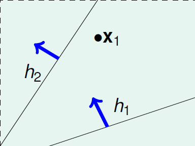

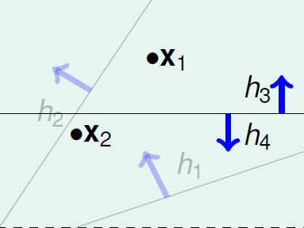

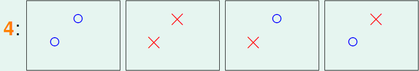

有效直线数：对于N个输入$x_1, x_2, ..., x_N$ 的最大直线种类数

1. 必须小于$2^N$
2. 对于H中无穷多的直线有有限的数量
3. 我们希望$P[|E_{in}(g) - E_{out}(g)| > \epsilon] \leq 2 \cdot effective(N) \cdot e^{-2\epsilon^2N}$ 成立

也就是说若effective(N)能够取代M并且远小于$2^N$ ，我们就可以通过有限条直线来学习

### Effective Number of Hypotheses

我们的假设空间（hypothesis）为

对分（dichotomy）：假设函数h对$x_1, x_2, ..., x_N$的二元分类预测结果

对分空间（dichotomies）：假设函数h对$x_1, x_2, ..., x_N$ 的所有二元分类结果，记为$H(x_, x_2, ..., x_N)$

假设空间和对分空间的区别

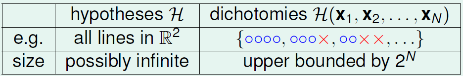

|H($x_1, x_2, ..., x_N$)|是取代M的一种选择

增长函数（Growth Function）:取消对数据的依赖后（在数据最糟糕的情况下），对分空间的大小（有限的，上界是$2^N$）

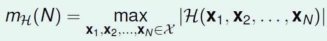

（如何计算增长函数）

正射线

1. X = R（一维）
2. H包含h，h(x) = sign(x - a)，a是一个阈值
3. 可以看成是1D感知器的一半

正射线的增长函数$m_H(N) = N + 1$

正区间

1. X = R（一维）
2. H包含h，h(x) = +1 iff $x \in [l, r)$, -1 otherwise

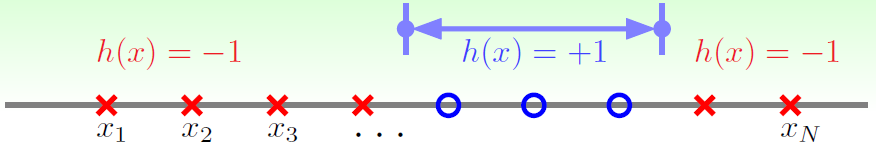

正区间的增长函数$m_H(N) = \frac{1}{2}N^2 + \frac{1}{2}N + 1$

凸集

1. X = $R^2$ （二维）
2. H包含h，h(x) = +1 iff x in a convex region, -1 otherwise
3. 一种可能的包含N个元素的输入集：$x_1, x_2, ..., x_N$ 在一个大圆弧上
4. 每个对分可以通过稍微扩展由圆弧上正例连成的凸区域来构造，因此$m_H = 2^N$
5. $m_h = 2^N$的情况被称为N个输入被H打散了（shattered）

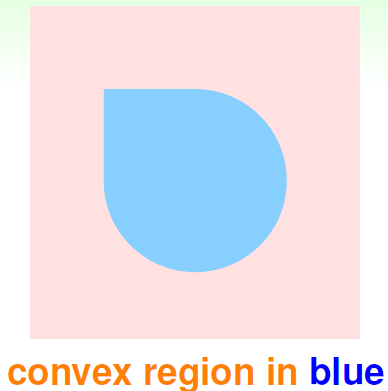

$m_H(N) = 2^N$ <=> 存在N个输入能被打散

### Break Point

四种增长函数

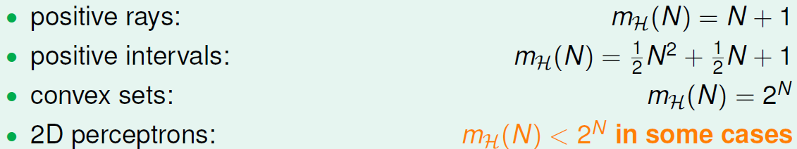

用$m_H(N)$来替代M会怎样？

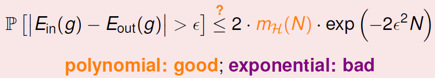

（对于2D的一般的感知器而言，$m_H(N)$有可能是多项式级别的吗？）

若k个输入不能够被假设空间H打散，那么k被称为H的断点（Break Point）

1. $m_H(k) <2^k$
2. k + 1, k + 2, k + 3, ...都是断点
3. 最小的断点是最有意义的

2D感知器的断点是4（3个输入“存在”打散，4个输入不存在打散）

四种断点

猜想（通过断点来求增长函数）：

1. 若不存在断点：$m_H(N) = 2^N$
2. 存在断点k：$m_H(N) = O(N^{k - 1})$

## Theory of Generalization

### Restriction of Break Point

增长函数回顾：最大的对分空间大小

（断点k除了能给出k + 1, ...都是断点外还能给出什么额外的信息？）

在H任意的情况下，当最小断点k = 2时（表示任意2个点都不能被H打散（产生出所有二分组合））

1. N = 1：$m_H(N) = 2$恒成立
2. N = 2：$m_H(N) < 4$恒成立
3. N = 3：最大的 $m_H(N) = 4 << 2^3$

对于N>k的情况断点k能够极大地限制$m_H(N)$

idea：$m_H(N) \leq maximum \  m_H(N) \ given \ k \leq poly(N)$

### Bounding Function Basic Cases

边界函数B(N, k)：当断点为k时，最大的增长函数值 $m_H(N)$

1. 组合性质：最多有多少种长度为N的带有正负类别属性的向量（表示对分），并且不存在被打散的长度为k的子向量
2. 如果可以描述B，就可以不用计较H中的细节（例如B(N, 3)既是k = 3的正区间的边界，也是k = 3的1D感知器的边界）

新目标：证明B(N, k) $\leq$ poly(N) （idea: 增长函数 $\leq$ 边界函数 $\leq$ poly(N)）

已知的情况：

1. B(2, 2) = 3（上一节）
2. B(3, 2) = 4（上一节的图解证明）
3. B(N, 1) = 1（当已经有一个对分时，再加入任何对分都会导致打散）
4. B(N, k) = $2^N$ , N < k（达不到断点，就可以不用担心打散）
5. B(N, k) = $2^N - 1$, N = k（去掉一种会导致打散的对分）

### Bounding Function Inductive Cases

动机：在预测B(4, 3)的时候察觉到B(4, 3)可能会与B(3, ?)有关

可以将所有的对分分成两类，一类是成对的，另一类是不成对的，分别用橘色和紫色来标记

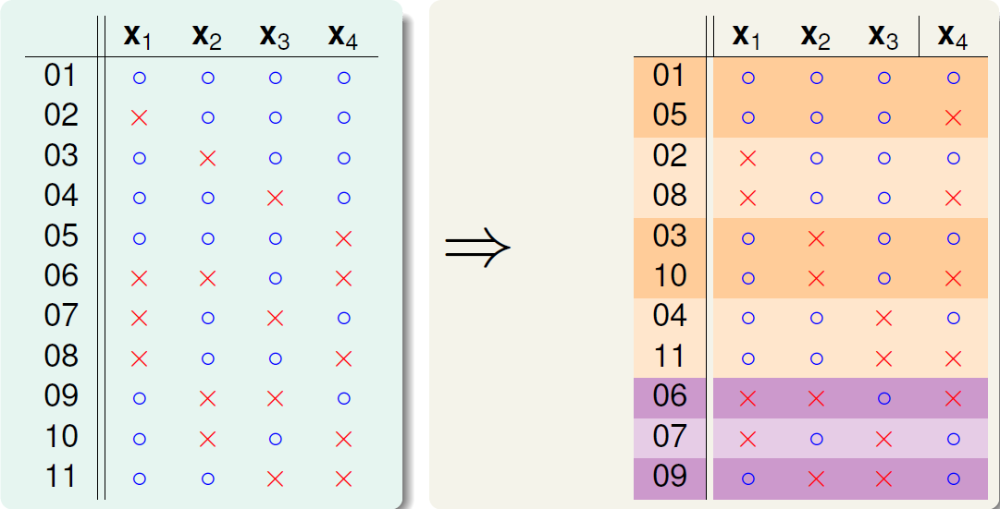

B(4, 3) = 11 = $2 \alpha + \beta$

$\alpha + \beta \leq B(3, 3)$

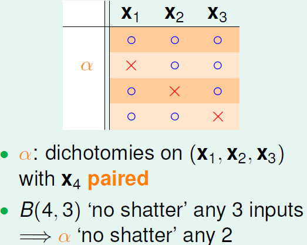

$\alpha \leq B(3, 2)$ （若存在两个点被打散的话，由于$\alpha$部分的$x_4$是“成双成对”的，所以算上x_4后就有3个点被打散） 

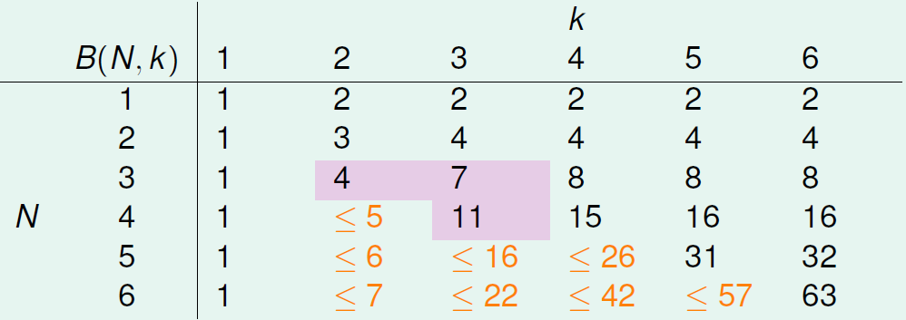

于是就得到了边界函数的上界

可以用数学归纳法证明（利用上面的递推式）：$B(N, k) \leq \sum\limits_{i = 0}^{k - 1}\binom{N}{i}$ （最高项是$N^{k - 1}$）

实际上上式的小于等于号中的等号总是可以成立的

简单H的例子

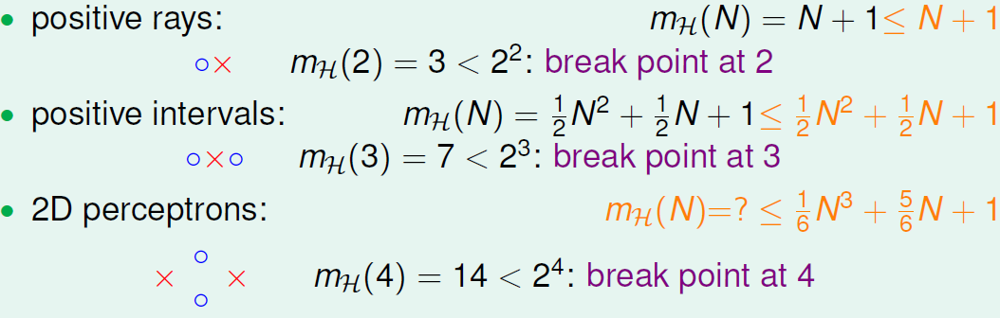

结论：只要存在断点，那么$m_H(N)$就是poly(N)。只要找到一个断点我们就能得到$m_H(N)$的上限

### A pictorial Proof

对于一般的H，求其坏上界

（如何证明？）

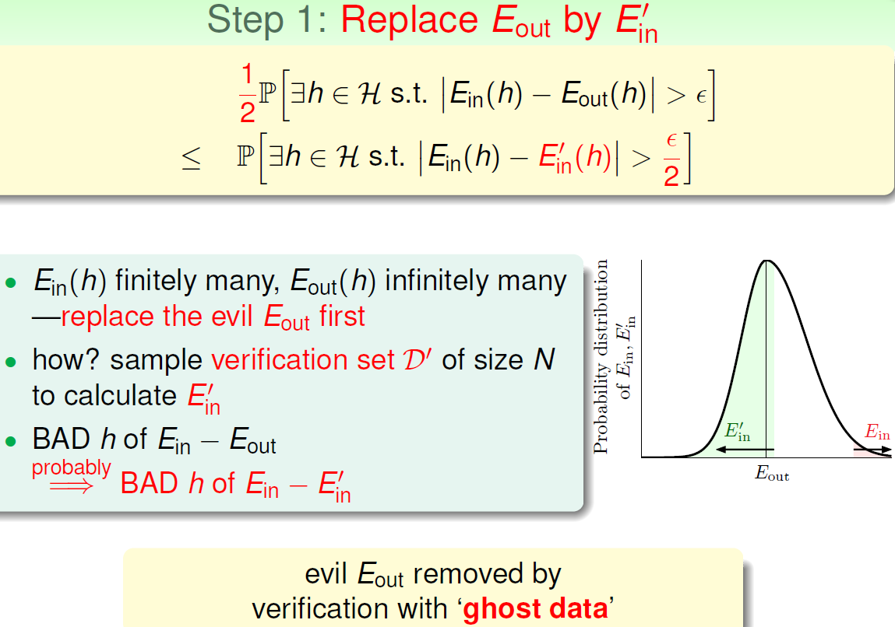

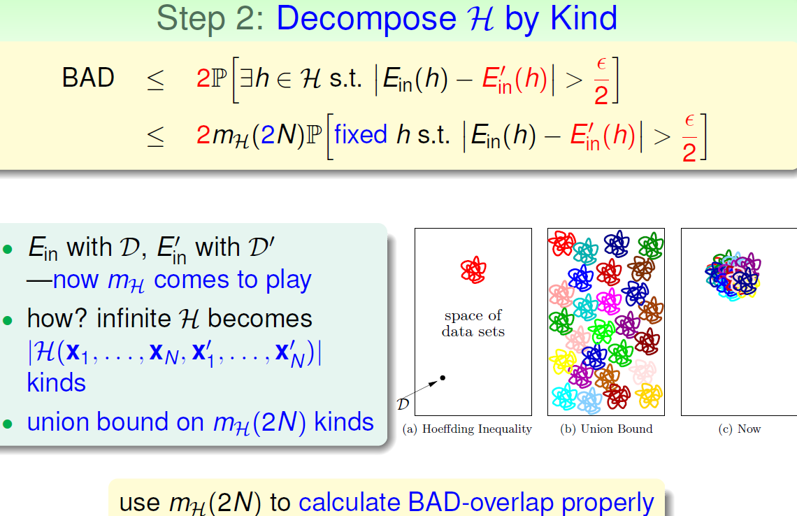

证明后得到了重要定理：

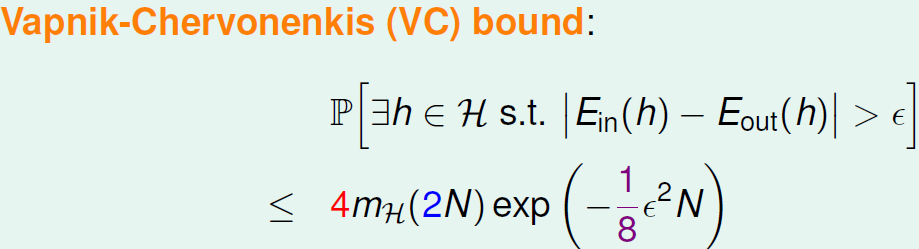

1. 用$E_{in}^{'}$来替代$E_{out}$
2. 根据类别来划分H
3. 使用非替换的霍夫丁不等式

现在，根据断点我们能得到$m_H(N)$的上界，也就能得到P[BAD]的上界，哪怕N是无限的

对于2D感知器而言

1. 断点是4
2. $m_H(N) = O(N^3)$
3. 因此学习是可行的

## The VC Dimension

### Definition of VC Dimension

增长函数总结：

VC Bound总结：

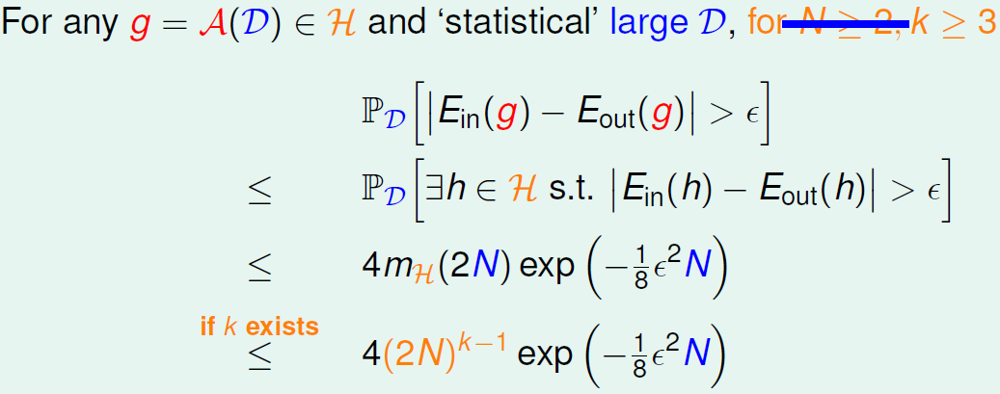

通过VC Bound可以了解到以下事实

1. 如果$m_H(N)$在k处break（好的H），并且N足够大（好的D），那么很可能能够实现泛化$E_{out} \approx E_{in}$
2. 如果能够实现泛化，并且能够找到$E_{in}$非常小的g（好的A），那么很可能能够实现学习

VC维$d_{vc}$的定义：最大的不是断点（$m_H(N) = 2^N$）的数据量N

VC维的性质：

若$N \leq d_{vc}$，则H能够打散一些数据点

若$k > d_{vc}$，则k是H的一个断点

若$N \leq 2, d_{vc} \geq 2$，则$m_H(N) \leq N^{d_{vc}}$

典型的四个VC维：

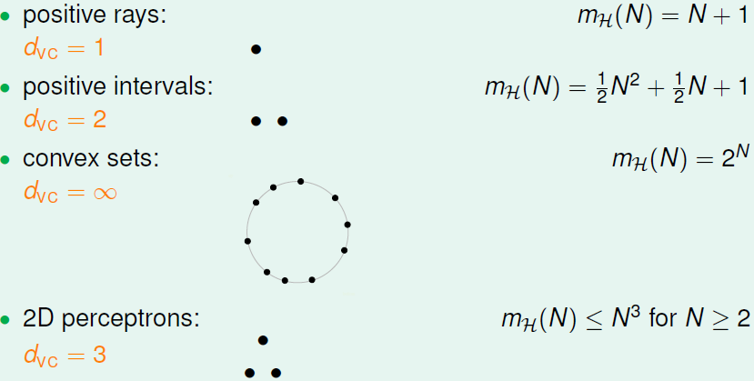

VC维同学习的关系：

1. VC维有限 => g能够实现泛化($E_{out}(g) \approx E_{in}(g)$)
2. 不论算法A，分布P和目标函数f如何，上述规则都成立

### VC Dimension of Perceptrons

2D PLA 复习：

经过观察发现，d维感知器的VC维为d + 1

证明 $d_{vc} \geq d + 1$

证明 $d_{vc} \leq d + 1$

### Physical Intuition of VC Dimension

VC维的意义：自由度

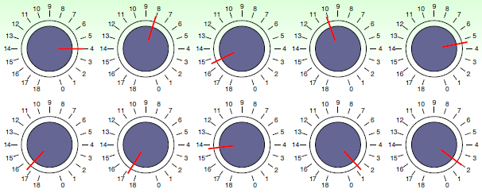

$d_{vc}(H)$的意义：H的性能

经验法则（不总是灵验）：$d_{vc} \approx$ # free parameters

使用正确的$d_{vc}$(H)是很重要的：

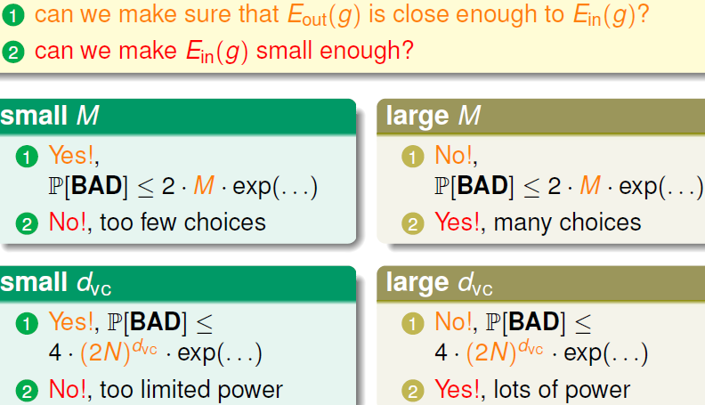

### Interpreting VC Dimension

定义 $\delta$ :

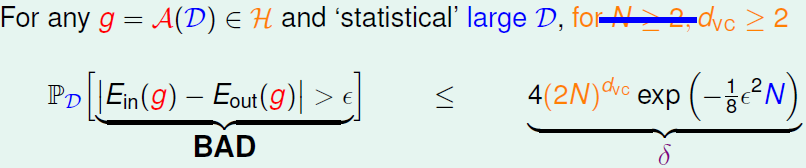

观察发生好事的情况。根据 $\delta$ 反推 $\epsilon$ ：

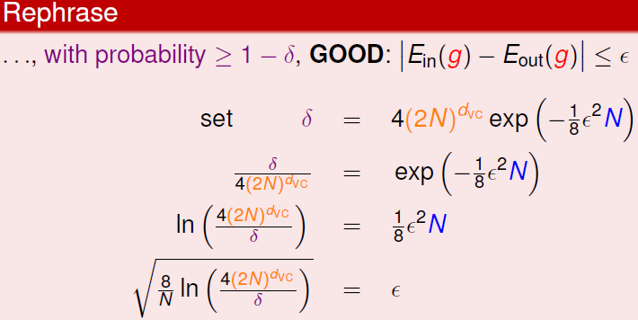

定义泛化误差和模型复杂度：

VC Bound携带的信息：

有很大的概率会出现

性能强的H不总是好的，需要找一个折中点：

给定$\epsilon = 0.1, d_{vc} = 3$ ，想要$\delta \leq 0.1$，问N需要多大？

抽样复杂度的定义：用$d_{vc}$表示的满足$\epsilon, \delta$条件的N

经验法则：$N \approx 10 d_{vc}$ 一般是足够的

VC Bound的松弛度：

有较高松弛度的原因：

松弛度很难改进，并且所有的模型都类似的松弛度

总结：VC Bound的哲学意义对于提升ML性能而言是十分重要的

## Noise and Error

### Noise and Probabilistic Target

如何在Learning Flow中加入噪音的影响？

噪音：错误记录的x，错误标记的y

由VC bound想到球袋模型，在球袋模型中，将确定的颜色改为随机的颜色可以将噪音纳入模型中

形象记忆：同一种球可能同时处在两种状态，每种状态有一种概率

理解：记录数据的时候有一定的概率将数据记录错

只要将f(x)改成P(y|x)，就就可以变成随机颜色

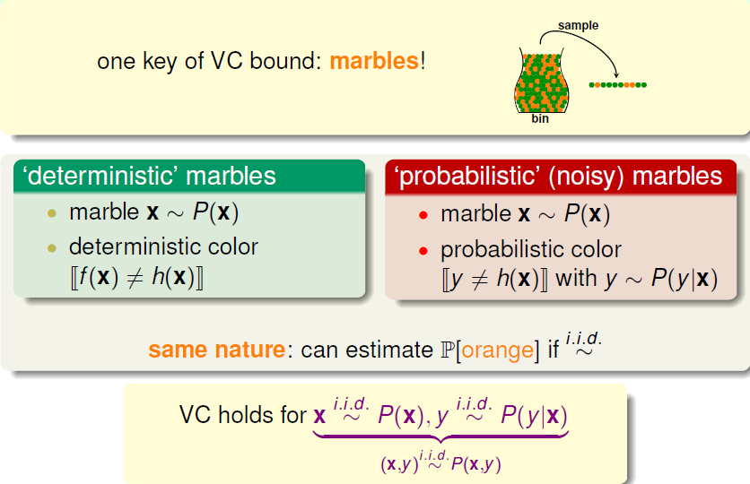

若x独立同分布与P(x)，y独立同分布于P(y|x)，或者说(x, y)独立同分布于P(y|x)，则VC理论还能成立（还能计算坏事发生的概率）

P(y|x)刻画了mini-target（指的是某个数据点x专用的目标函数）

P(y|x)可以看成是ideal mini-target + 噪音：

- P(1|x) = 0.7, P(0|x) = 0.3
- ideal mini-target f(x) = 1
- 噪音等级 = 0.3

学习目标的新表达：根据常见的输入（P(x)）来预测ideal mini-target（P(y|x)）

新的Learning Flow：

### Error Measure

学习目标：$g \approx f$

如何衡量有多好？先前考虑out-of-sample measure

$E_{out}(g) = \epsilon_{X \sim P}[g(x) \ne f(x)]$

现在考虑更一般的E(g, f)

可以先只考虑符合如下情况的误差衡量：

- out-of-sample：averaged over unknown x
- pointwise：对单一的点进行衡量
- classification：[prediction $\ne$ target]  (0/1 error)

可以这样表示：E(g, f) = averaged err(g(x), f(x))，其中err是对单点的误差衡量

两种重要的单点错误衡量：

err对学习过程有什么影响？

P(y|x)和err能够决定ideal mini-target f(x)

例子：

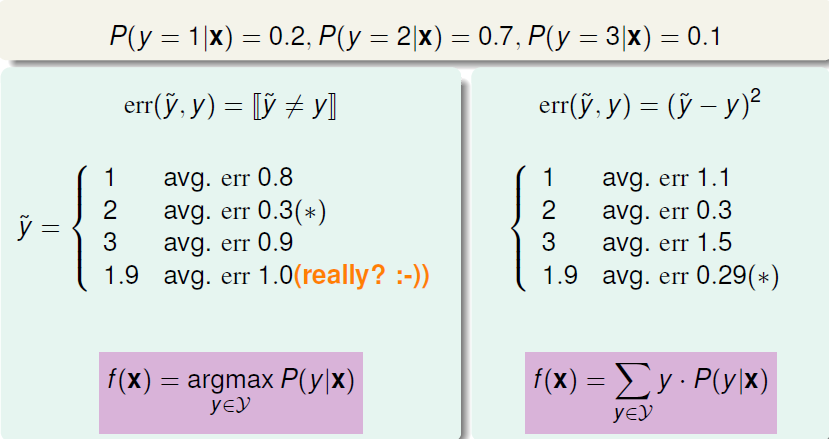

新的Learning Flow：

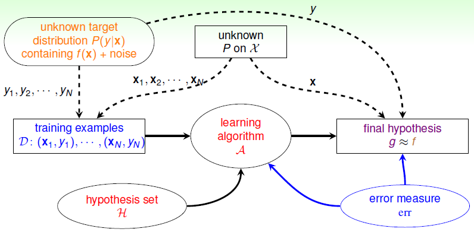

### Algorithmic Error Measure

false accept和false reject（0/1 error对两者的乘法是均等的）

超市使用的指纹识别会更在意false reject

CIA使用的指纹识别会更在意false accept

结论：err跟具体应用或具体用户有关

$\hat{err}$ ：在算法中应用的错误衡量方式，可能跟真实错误不是很匹配，但是一般会很好优化

- 具有封闭形式的解
- 是一个凸目标函数

常用的$\hat{err}$ ：

新的Learning Flow：

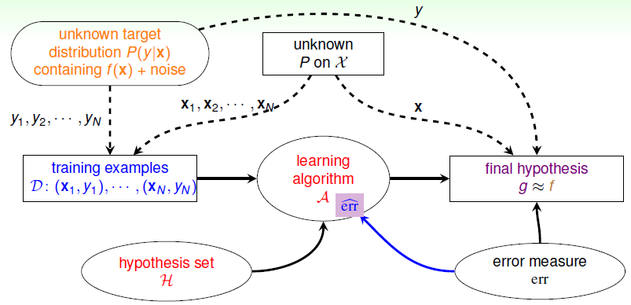

### Weighted Classification

Weighted Classification：通过给不同种类的样本以不同权重，来解决CIA的问题（下面的权值调整相当于将负例复制了1000份）

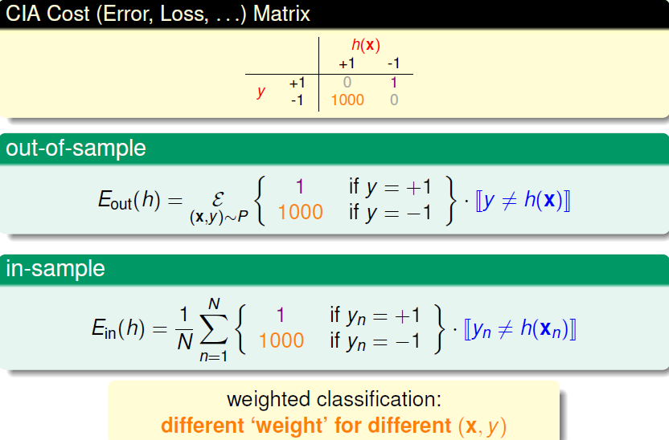

