# When Can Machines Learn?

## The Learning Problem

### Introduction

### What is Machine Learning

在人类学习中，通过观察可以学到技能。同样在机器学习中，通过数据可以学到技能

机器学习的定义：利用数据计算改进性能指标

机器学习的例子：利用股票数据预测投资回报

机器学习的使用场景：

1. 当人没办法编写出程序（火星导航）
2. 当人无法轻易的定义解（语音识别）
3. 当需要以超乎常人的速度做出决策（高频交易）
4. 当需要大规模面向用户的时候（面向消费者的营销）

决定是否使用机器学习：

1. 存在隐藏的模式
2. 不存在能够轻易发现的可编程的定义
3. 存在揭示模式的数据

### Applications of Machine Learning

经典应用场景：衣食住行，教育，娱乐

### Components of Machine Learning

机器学习的形式化定义：用数据去计算能够逼近目标函数f的假设函数g

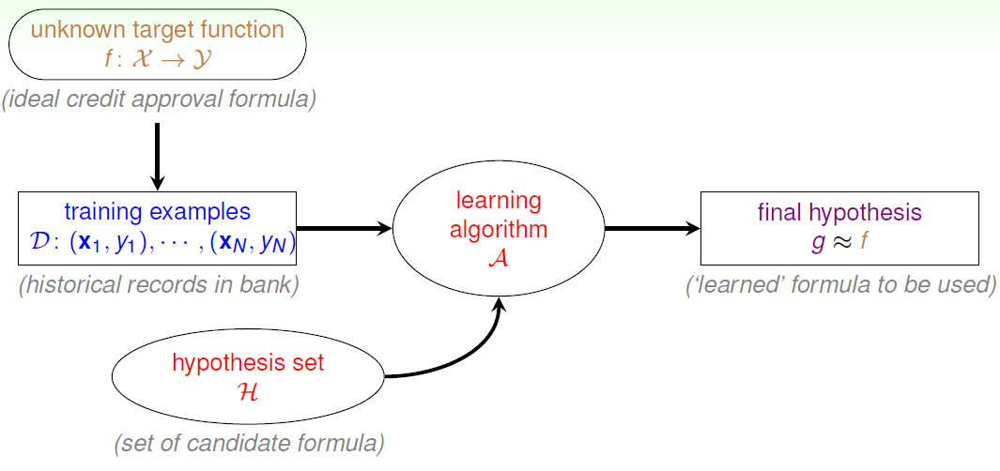

### Machine Learning and Other Fields

机器学习与数据挖掘（在数据中找到有趣的性质）的比较

1. 当“有趣的性质”指的是假设函数时，两者基本是一回事儿
2. 当“有趣的性质”指的是假设函数时，两者相辅相成
3. 传统数据挖掘还要注意大规模计算的效率

机器学习是人工智能（用智能的方式来计算）的一种实现途径

统计学是机器学习的重要工具

## Learning to Answer Yes No

### Perceptron Hypothesis Set

信贷审批问题：通过用户信息预测是否应该给其发放信用卡

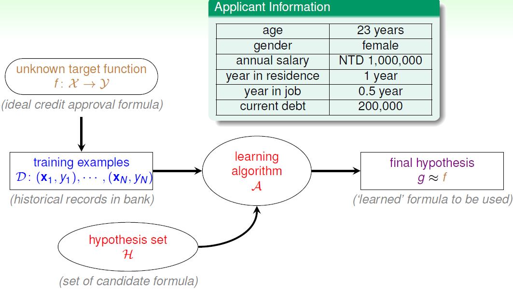

使用简单的假设函数集：感知器

对用户的特征$x = (x_1, x_2, ..., x_d)$ 计算一个加权分数：

若$\sum_{i = 1}^dw_ix_i > threshold$，则发放信用卡

若$\sum_{i = 1}^dw_ix_i < threshold$，则不发放信用卡

Y:{+1(good), -1(bad)}（忽略0），该预测函数集中的函数可以表示为

$h(x) = sign((\sum\limits_{i = 1}^dw_ix_i) - threshold)$

更简洁的定义：

$h(x) = sign(w^Tx)$

二维感知器

1. 顾客特征：二维平面上的点
2. 标签y：蓝圈表示+1标签，红叉表示-1标签
3. 预测函数h：直线$h(x) = sign(w_0 + w_1x_1 + w_2x_2)$
4. 不同直线能够做出不同的分类

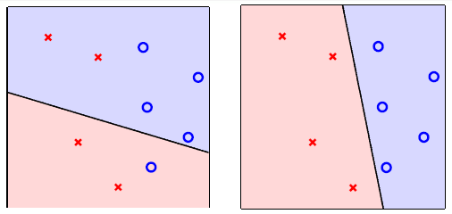

### Perceptron Learning Alforithm

从H中选择出g

1. 至少满足在D上 $g \approx f$
2. 理想情况下$g(x_n) = f(x_n) = y_n$
3. 难度：H有无限多的元素
4. idea：从$g_0$开始，不断修正误差

感知器学习算法：从$w_0$ 开始，不断在D上修正误差

修正的方法：让w向x的方向偏转

遍历所有的点（或随机访问所有点），以做修正

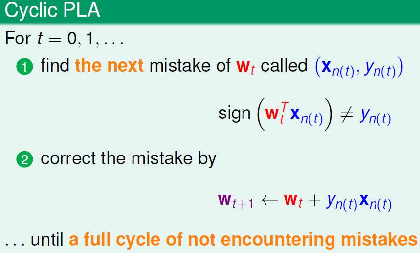

可视化的更新过程

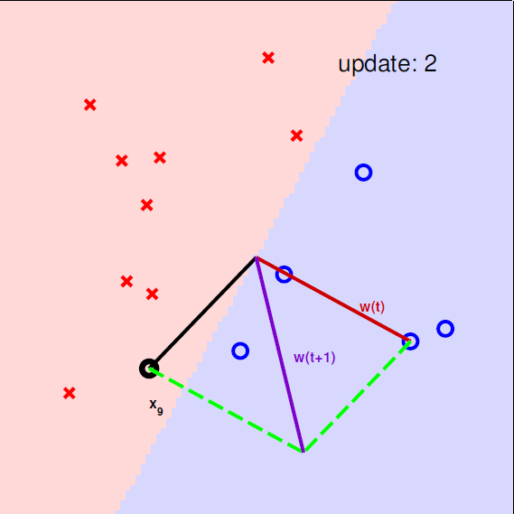

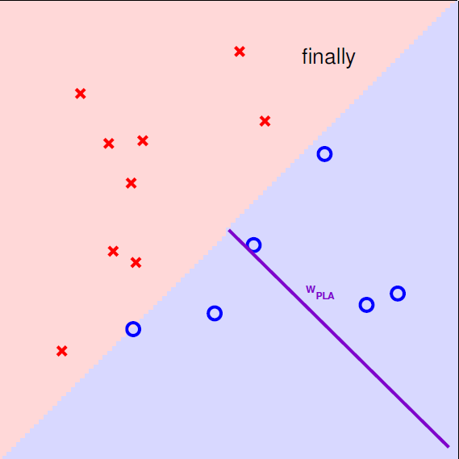

### Guarantee of PLA

若PLA停止时，则D能够让某些w没有误差，这样的D被称为线性可分的（PLA总是可以停止的吗？）

D线性可分 <=> 存在完美的$w_f$使得$y_n = sign(w_f^Tx_n)$

<=> $y_{n(t)}w_f^Tx_{n(t)} \geq \min\limits_n y_nw_f^Tx_n > 0$ （所有的点都被分类正确）

 $w_f^Tw_{t + 1} = w_f^T(w_t + y_{n(t)}x_{n(t)}) \geq w_f^Tw_t + \min\limits_ny_nw_f^Tx_n > w_f^Tw_t + 0$ （讨论$w_f$和$w_t$的关系，看它们接不接近）

 因此不论使用什么数据点来更新，$w_f^Tw_t$ 都会增大（所以$w_f$ 和$w_t$ 就会越来越接近吗？有没有可能是向量长度增大的影响？）

$w_t$仅当有误差的时候才发生变化 <=> $sign(w_t^Tx_{n(t)}) \neq y_{n(t)}$ <=> $y_{n(t)}w_t^Tx_{n(t)} \leq 0$

$||w_{t + 1}||^2 = ||w_t + y_{n(t)}x_{n(t)}||^2 = ||w_t||^2 + 2y_{n(t)}w_t^Tx_{n(t)} + ||y_{n(t)}x_{n(t)}||^2$

$ \leq ||w_t||^2 + 0 + ||y_{n(t)} x_{n(t)}||^2$ （根据上面的不等式）

$\leq ||w_t||^2 + \max\limits_n||y_nx_n||^2$ （即使是用长度最长的$x_n$ 来更新，$||w_t||^2$ 的增长也要受到误差的限制）

从$w_0$开始，经过T次误差修正，

$\frac{w_f^Tw_T}{||w_f|| \ ||w_T||} \geq \sqrt{T} \cdot constant$

迭代次数T的上界是$\frac{R^2}{\rho^2}$，其中$R^2 = \max\limits_n||x_n||^2, \rho = \min\limits_ny_n\frac{w_f^T}{||w_f||}x_n$

### Non-Separable Data

总结：只要数据线性可分，且按照误差来修正w

1. $w_f$和$w_t$的内积增长迅速，而$w_t$的长度增长缓慢
2. PLA直线会越来越贴近$w_f$，直到收敛

优点：PLA很容易实现，而且对于任意的维数d有效

缺点：

1. 假设D线性可分（而这通常是不知道的），算法才能停止
2. 不知道算法何时能停止（虽然在实际中总是很快）

（怎样在D有噪音的情况下令$g \approx f$ ？）

具有容错性的直线：

1. 假设噪音很少
2. 那么在D上 $g \approx f$ <=> 通常有$y_n = g(x_n)$
3. $w_g = \min\limits_w \sum\limits_{n = 1}^N [y_n \neq sign(w^Tx_n)]$
4. 这个优化问题是NP-hard问题

（能够修改PLA来得到近似最好的g？）

Pocket Algorithm：维护最佳直线（贪心）

Pocket比PLA要慢（要检查w的好坏）

## Types of Learning

### Learning with Different Output Space

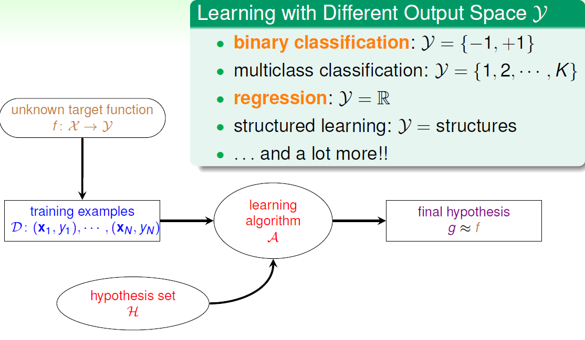

### Learning with Different Data Label

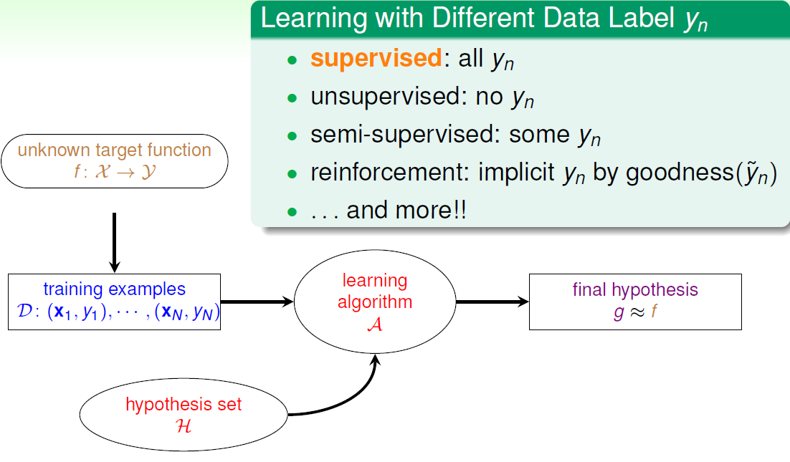

### Learning with Different Protocal

### Learning with Different Input Space

## Feasibility of Learning

### Learning is Impossible

天下没有免费的午餐：

1. 在D中 $g \approx f$ 是可能的
2. 不在D中 $g \approx f$ 看上去是不可能的（当f有未知部分的时候）

### Probability to the Rescue

（学习看似是不可能的，但在其它场景下我们能否推断出一些未知的信息？）

罐子模型：

1. 罐子中有许多橘球和绿球
2. 我们能否知道橘球的比例？

罐子中橘球的概率是$\mu$

抽出的样本中橘球的概率是$\nu$

（能否根据$\nu$推断出$\mu$？）

霍夫丁（Hoeffding's Inequality）不等式：

$P[|\nu - \mu| > \epsilon] \leq 2 e^{-2\epsilon^2N}$

1. $\nu = \mu$ 是PAC的（probably approximately correct）
2. 对于任意的N和$\epsilon$ 都是成立的
3. 不依赖于特定的 $\mu$
4. 很大的N或者很松的$\epsilon$ => 有很大的概率$\nu \approx \mu$

### Connection to Learning

罐子模型和学习的联系

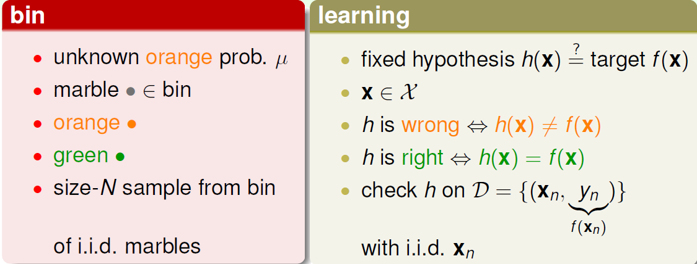

若N非常大，且$x_n$ 是独立同分布的，那么很可能能通过[$h(x_n) \neq y_n$]推断出[$h(x) \neq f(x)$]

将分布加入到机器学习的形式化定义中。意思是，如果我们想知道g在世界上所有数据中的表现（那些数据预测对，哪些数据预测错）的话，可以通过抽样（训练集）来估计。这里的分布指的是，g能预测对的数据在世界上所有数据中的分布。

对于任何固定的h，我们能够通过已知的抽样误差 $E_{in}(h) = \frac{1}{N} \sum\limits_{n = 1}^N[h(x_n \neq y_n)]$的来推断未知的实际误差 $E_{out}(h) = \epsilon_{x \sim P}[h(x) \neq f(x)]$

形式化保证

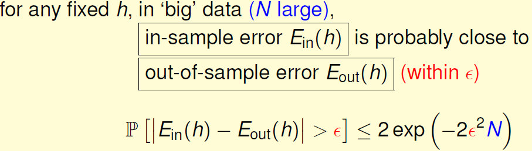

同罐子模型中的霍夫丁不等式类似

1. 对于所有N和$\epsilon$ 都适用
2. 不依赖于或无需知道$E_{out}(h)$
3. f和P都可以是未知的
4. $E_{in}(h) = E_{out}(h)$ 是PAC的

若$E_{in}(h) \approx E_{out}(h)$ 且 $E_{in}(h)$ 很小 => $E_{out}(h)$ 很小 => $h \approx f$  关于P成立

（对于给定的h，当数据集很大的时候$E_{in}(h) \approx E_{out}(h)$ ，能代表这是好的学习吗？不能，这只是在做验证，在真正的学习中A要在H中做选择）

### Connection to Real Learning

$E_{in}$和$E_{out}$ 在h的选择很多时相距甚远的例子：150个人，每人投5枚硬币，总有人会投出5个正面

对于一个h而言，不好的数据是让$E_{in}$和$E_{out}$ 相距甚远的数据集（比如前者大而后者小）

$P_D[BAD \ D] = \sum\limits_{all \ possible \ D} P(D) \cdot [BAD \ D]$

对于很多h而言，坏数据是指存在h使得上述坏数据存在的数据集（于是A就不能安全地做选择）

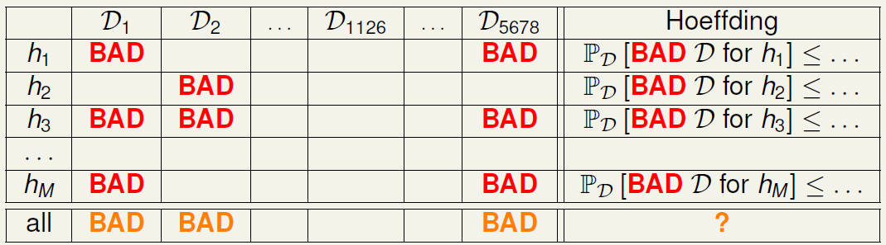

对很多h而言遇到坏数据的上界是

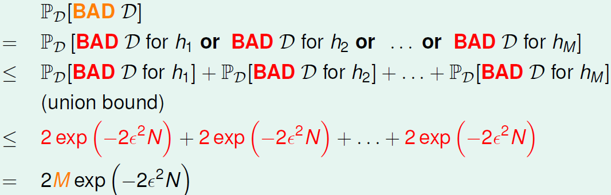

上式说明了

1. 对于有限M的版本的霍夫丁不等式，任意的M，N和$\epsilon$ 都有效
2.  不依赖于或无需知道$E_{out}(h_m)$
3. f和P都可以是未知的
4. 无论A是什么，$E_{in}(h) = E_{out}(h)$ 都是PAC的

结论：最合理的A会选择使得$E_{in}(h_m)$最小的$h_m$作为g

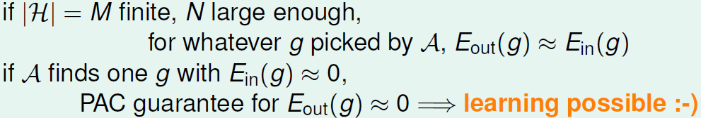

统计学习流程

# Why Can Machines Learn?

## Training versus Testing

### Recap and Preview

学习问题可以划分成两个核心问题

1. 我们能否保证$E_{out}(g)$ 足够接近 $E_{in}(g)$
2. 我们能否让$E_{in}(g)$ 足够小 

（M（|H|）在这两个问题中扮演怎样的角色？）

关于M的权衡

1. 小的M：第一个问题可以保证（$P[BAD] \leq 2M \cdot e^{...}$），第二个问题不能保证（选择太少）
2. 大的M：第一个问题不能保证（$P[BAD] \leq 2M \cdot e^{...}$），第二个问题可以保证（选择很多）

已知：

$P[|E_{in}(g) - E_{out}(g)| > \epsilon] \leq 2 \cdot M \cdot e^{-2\epsilon^2N}$

接下来要做的：

1. 使用有限的量来替换M使得 $P[|E_{in}(g) - E_{out}(g)| > \epsilon] \leq 2 \cdot m_H \cdot e^{-2\epsilon^2N}$
2. 证明在有限M下学习的可行性 
3. 学习$m_H​$ 以理解其在H上的正确的权衡

（以下内容均已PLA为例）

### Effective Number of Lines

M的由来：$P[B_1  \ or \ B_2 \ or ... \ B_M ] \leq P[B_1] + P[B_2] + ... + P[B_M]$

（当M为无穷大时 $P[B_1  \ or \ B_2 \ or ... \ B_M ]$ 上界的估计会出什么问题？）

问题是不同的B有太多重叠的部分（为了解决充电问题我们能否将类似的预测函数h分类？）

当H = {all lines in $R^2$}时

1. 有多少种条直线？（无穷多条）
2. 对输入的向量$x_1$ 而言有多少种直线？（2种）
3. 对输入的向量$x_1, x_2$ 而言有多少种直线？（4种）
4. 对输入的向量$x_1, x_2, x_3$ 而言有多少种直线？（6种）
5. 对输入的向量$x_1, x_2, x_3, x_4$ 而言有多少种直线（14种）

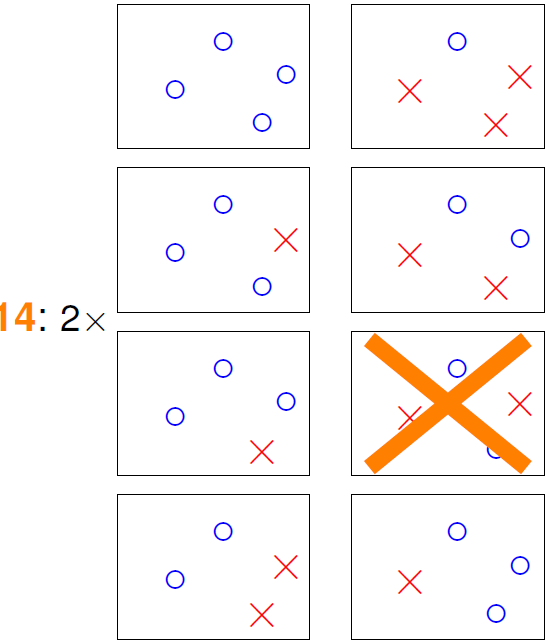

有效直线数：对于N个输入$x_1, x_2, ..., x_N$ 的最大直线种类数

1. 必须小于$2^N$
2. 对于H中无穷多的直线有有限的数量
3. 我们希望$P[|E_{in}(g) - E_{out}(g)| > \epsilon] \leq 2 \cdot effective(N) \cdot e^{-2\epsilon^2N}$ 成立

也就是说若effective(N)能够取代M并且远小于$2^N$ ，我们就可以通过有限条直线来学习

### Effective Number of Hypotheses

我们的假设空间（hypothesis）为

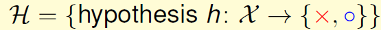

对分（dichotomy）：假设函数h对$x_1, x_2, ..., x_N$的二元分类预测结果

对分空间（dichotomies）：假设函数h对$x_1, x_2, ..., x_N$ 的所有二元分类结果，记为$H(x_, x_2, ..., x_N)$

假设空间和对分空间的区别

|H($x_1, x_2, ..., x_N$)|是取代M的一种选择

增长函数（Growth Function）:取消对数据的依赖后（在数据最糟糕的情况下），对分空间的大小（有限的，上界是$2^N$）

（如何计算增长函数）

正射线

1. X = R（一维）
2. H包含h，h(x) = sign(x - a)，a是一个阈值
3. 可以看成是1D感知器的一半

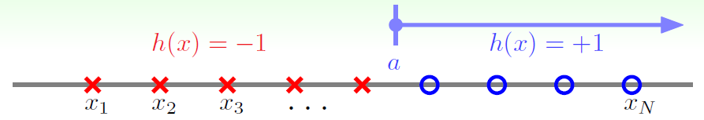

正射线的增长函数$m_H(N) = N + 1$

正区间

1. X = R（一维）
2. H包含h，h(x) = +1 iff $x \in [l, r)$, -1 otherwise

正区间的增长函数$m_H(N) = \frac{1}{2}N^2 + \frac{1}{2}N + 1$

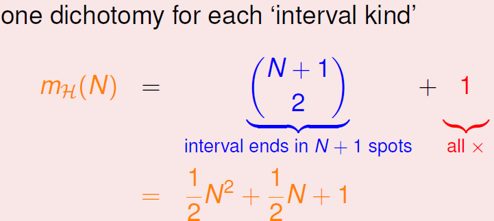

凸集

1. X = $R^2$ （二维）
2. H包含h，h(x) = +1 iff x in a convex region, -1 otherwise
3. 一种可能的包含N个元素的输入集：$x_1, x_2, ..., x_N$ 在一个大圆弧上
4. 每个对分可以通过稍微扩展由圆弧上正例连成的凸区域来构造，因此$m_H = 2^N$
5. $m_h = 2^N$的情况被称为N个输入被H打散了（shattered）

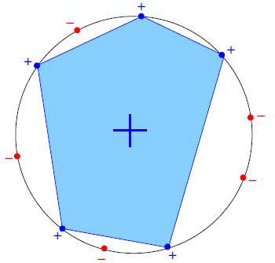

$m_H(N) = 2^N$ <=> 存在N个输入能被打散

### Break Point

四种增长函数

用$m_H(N)$来替代M会怎样？

（对于2D的一般的感知器而言，$m_H(N)$有可能是多项式级别的吗？）

若k个输入不能够被假设空间H打散，那么k被称为H的断点（Break Point）

1. $m_H(k) <2^k$
2. k + 1, k + 2, k + 3, ...都是断点
3. 最小的断点是最有意义的

2D感知器的断点是4（3个输入“存在”打散，4个输入不存在打散）

四种断点

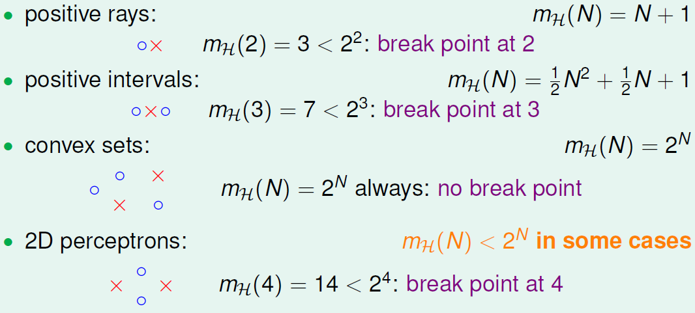

猜想（通过断点来求增长函数）：

1. 若不存在断点：$m_H(N) = 2^N$
2. 存在断点k：$m_H(N) = O(N^{k - 1})$

## Theory of Generalization

### Restriction of Break Point

增长函数回顾：最大的对分空间大小

（断点k除了能给出k + 1, ...都是断点外还能给出什么额外的信息？）

在H任意的情况下，当最小断点k = 2时（表示任意2个点都不能被H打散（产生出所有二分组合））

1. N = 1：$m_H(N) = 2$恒成立
2. N = 2：$m_H(N) < 4$恒成立
3. N = 3：最大的 $m_H(N) = 4 << 2^3$

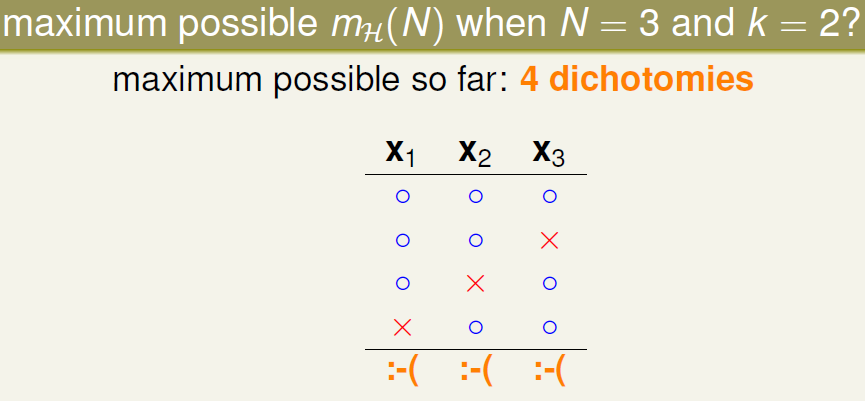

对于N>k的情况断点k能够极大地限制$m_H(N)$

idea：$m_H(N) \leq maximum \  m_H(N) \ given \ k \leq poly(N)$

### Bounding Function Basic Cases

边界函数B(N, k)：当断点为k时，最大的增长函数值 $m_H(N)$

1. 组合性质：最多有多少种长度为N的带有正负类别属性的向量（表示对分），并且不存在被打散的长度为k的子向量
2. 如果可以描述B，就可以不用计较H中的细节（例如B(N, 3)既是k = 3的正区间的边界，也是k = 3的1D感知器的边界）

新目标：证明B(N, k) $\leq$ poly(N) （idea: 增长函数 $\leq$ 边界函数 $\leq$ poly(N)）

已知的情况：

1. B(2, 2) = 3（上一节）
2. B(3, 2) = 4（上一节的图解证明）
3. B(N, 1) = 1（当已经有一个对分时，再加入任何对分都会导致打散）
4. B(N, k) = $2^N$ , N < k（达不到断点，就可以不用担心打散）
5. B(N, k) = $2^N - 1$, N = k（去掉一种会导致打散的对分）

### Bounding Function Inductive Cases

动机：在预测B(4, 3)的时候察觉到B(4, 3)可能会与B(3, ?)有关

可以将所有的对分分成两类，一类是成对的，另一类是不成对的，分别用橘色和紫色来标记

B(4, 3) = 11 = $2 \alpha + \beta$

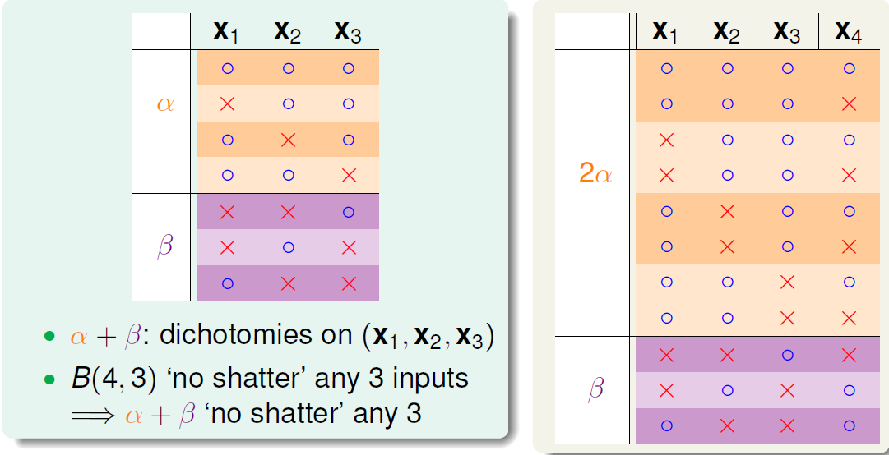

$\alpha + \beta \leq B(3, 3)$

$\alpha \leq B(3, 2)$ （若存在两个点被打散的话，由于$\alpha$部分的$x_4$是“成双成对”的，所以算上x_4后就有3个点被打散） 

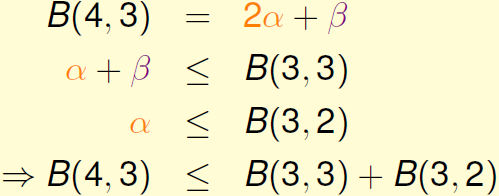

于是就得到了边界函数的上界

可以用数学归纳法证明（利用上面的递推式）：$B(N, k) \leq \sum\limits_{i = 0}^{k - 1}\binom{N}{i}$ （最高项是$N^{k - 1}$）

实际上上式的小于等于号中的等号总是可以成立的

简单H的例子

结论：只要存在断点，那么$m_H(N)$就是poly(N)。只要找到一个断点我们就能得到$m_H(N)$的上限

### A pictorial Proof

对于一般的H，求其坏上界

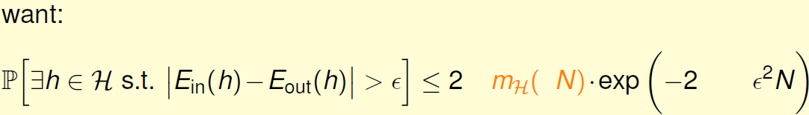

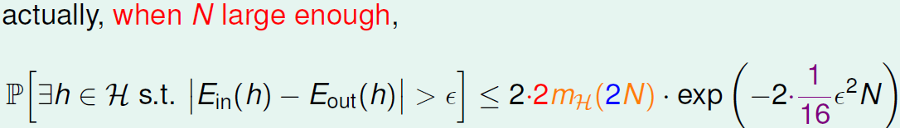

（如何证明？）

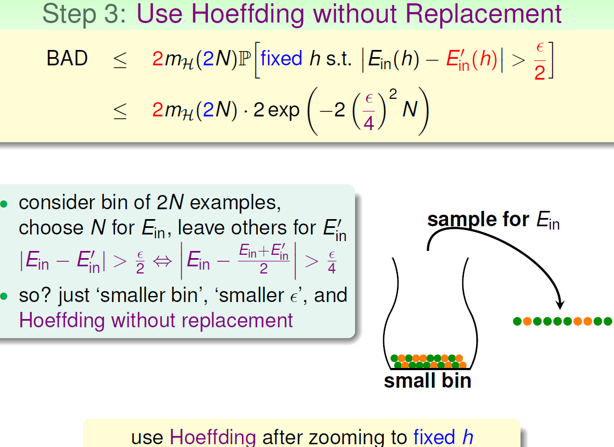

证明后得到了重要定理：

1. 用$E_{in}^{'}$来替代$E_{out}$
2. 根据类别来划分H
3. 使用非替换的霍夫丁不等式

现在，根据断点我们能得到$m_H(N)$的上界，也就能得到P[BAD]的上界，哪怕N是无限的

对于2D感知器而言

1. 断点是4
2. $m_H(N) = O(N^3)$
3. 因此学习是可行的

## The VC Dimension

### Definition of VC Dimension

增长函数总结：

VC Bound总结：

通过VC Bound可以了解到以下事实

1. 如果$m_H(N)$在k处break（好的H），并且N足够大（好的D），那么很可能能够实现泛化$E_{out} \approx E_{in}$
2. 如果能够实现泛化，并且能够找到$E_{in}$非常小的g（好的A），那么很可能能够实现学习

VC维$d_{vc}$的定义：最大的不是断点（$m_H(N) = 2^N$）的数据量N

VC维的性质：

若$N \leq d_{vc}$，则H能够打散一些数据点

若$k > d_{vc}$，则k是H的一个断点

若$N \leq 2, d_{vc} \geq 2$，则$m_H(N) \leq N^{d_{vc}}$

典型的四个VC维：

VC维同学习的关系：

1. VC维有限 => g能够实现泛化($E_{out}(g) \approx E_{in}(g)$)
2. 不论算法A，分布P和目标函数f如何，上述规则都成立

### VC Dimension of Perceptrons

2D PLA 复习：

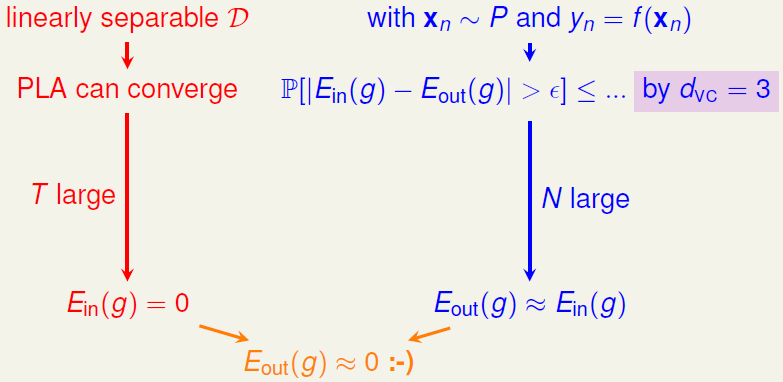

经过观察发现，d维感知器的VC维为d + 1

证明 $d_{vc} \geq d + 1$

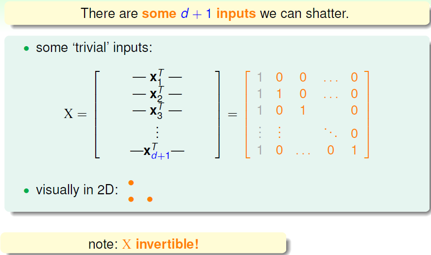

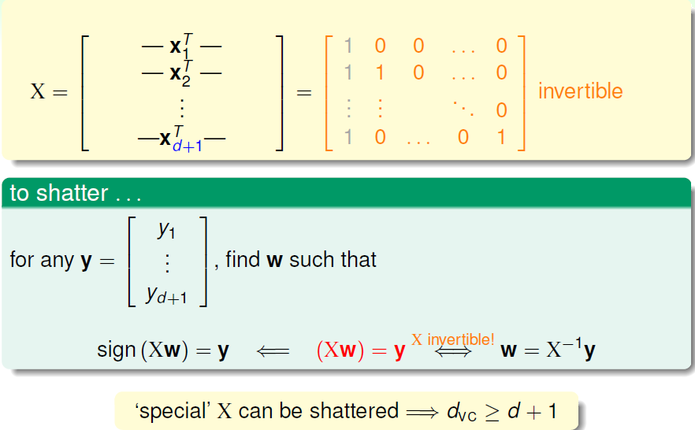

证明 $d_{vc} \leq d + 1$

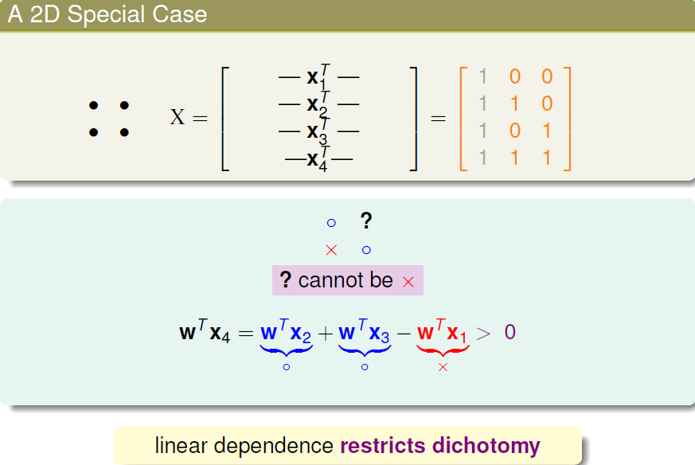

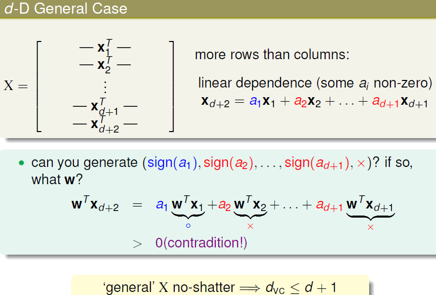

### Physical Intuition of VC Dimension

VC维的意义：自由度

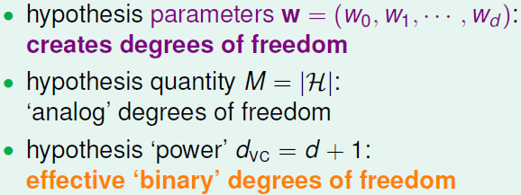

$d_{vc}(H)$的意义：H的性能

经验法则（不总是灵验）：$d_{vc} \approx$ # free parameters

使用正确的$d_{vc}$(H)是很重要的：

### Interpreting VC Dimension

定义 $\delta$ :

观察发生好事的情况。根据 $\delta$ 反推 $\epsilon$ ：

定义泛化误差和模型复杂度：

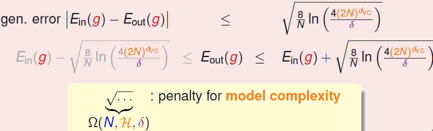

VC Bound携带的信息：

有很大的概率会出现

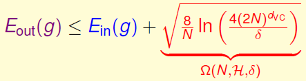

性能强的H不总是好的，需要找一个折中点：

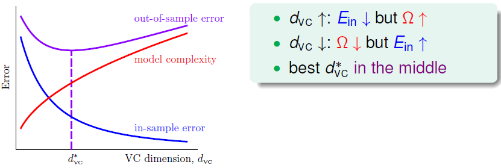

给定$\epsilon = 0.1, d_{vc} = 3$ ，想要$\delta \leq 0.1$，问N需要多大？

抽样复杂度的定义：用$d_{vc}$表示的满足$\epsilon, \delta$条件的N

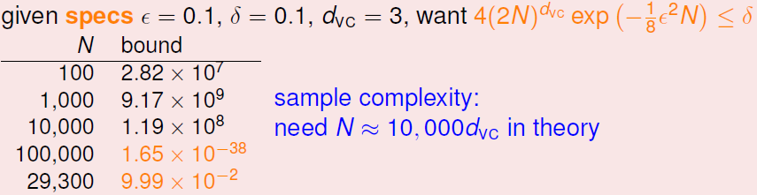

经验法则：$N \approx 10 d_{vc}$ 一般是足够的

VC Bound的松弛度：

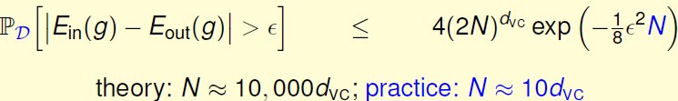

有较高松弛度的原因：

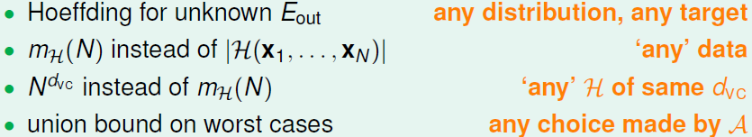

松弛度很难改进，并且所有的模型都类似的松弛度

总结：VC Bound的哲学意义对于提升ML性能而言是十分重要的

## Noise and Error

### Noise and Probabilistic Target

如何在Learning Flow中加入噪音的影响？

噪音：错误记录的x，错误标记的y

由VC bound想到球袋模型，在球袋模型中，将确定的颜色改为随机的颜色可以将噪音纳入模型中

形象记忆：同一种球可能同时处在两种状态，每种状态有一种概率

理解：记录数据的时候有一定的概率将数据记录错

只要将f(x)改成P(y|x)，就就可以变成随机颜色

若x独立同分布与P(x)，y独立同分布于P(y|x)，或者说(x, y)独立同分布于P(y|x)，则VC理论还能成立（还能计算坏事发生的概率）

P(y|x)刻画了mini-target（指的是某个数据点x专用的目标函数）

P(y|x)可以看成是ideal mini-target + 噪音：

- P(1|x) = 0.7, P(0|x) = 0.3
- ideal mini-target f(x) = 1
- 噪音等级 = 0.3

学习目标的新表达：根据常见的输入（P(x)）来预测ideal mini-target（P(y|x)）

新的Learning Flow：

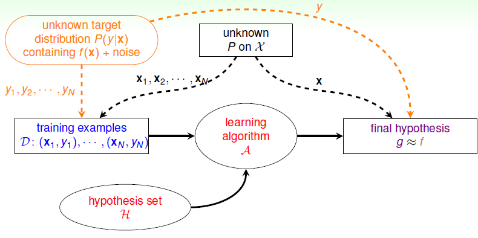

### Error Measure

学习目标：$g \approx f$

如何衡量有多好？先前考虑out-of-sample measure

$E_{out}(g) = \epsilon_{X \sim P}[g(x) \ne f(x)]$

现在考虑更一般的E(g, f)

可以先只考虑符合如下情况的误差衡量：

- out-of-sample：averaged over unknown x
- pointwise：对单一的点进行衡量
- classification：[prediction $\ne$ target]  (0/1 error)

可以这样表示：E(g, f) = averaged err(g(x), f(x))，其中err是对单点的误差衡量

两种重要的单点错误衡量：

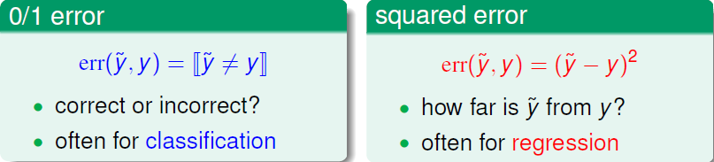

err对学习过程有什么影响？

P(y|x)和err能够决定ideal mini-target f(x)

例子：

新的Learning Flow：

### Algorithmic Error Measure

false accept和false reject（0/1 error对两者的乘法是均等的）

超市使用的指纹识别会更在意false reject

CIA使用的指纹识别会更在意false accept

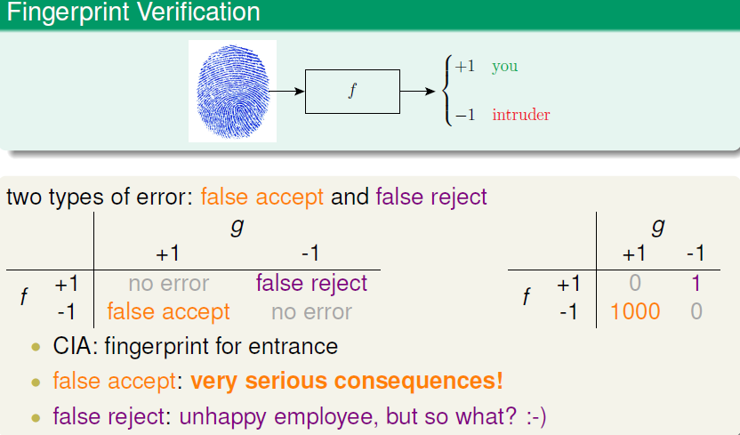

结论：err跟具体应用或具体用户有关

$\hat{err}$ ：在算法中应用的错误衡量方式，可能跟真实错误不是很匹配，但是一般会很好优化

- 具有封闭形式的解
- 是一个凸目标函数

常用的$\hat{err}$ ：

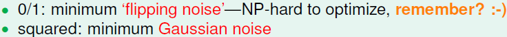

新的Learning Flow：

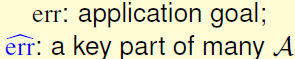

### Weighted Classification

Weighted Classification：通过给不同种类的样本以不同权重，来解决CIA的问题（下面的权值调整相当于将负例复制了1000份）

# How Can Machines Learn？

## Linear Regression

### Linear Regression Problem

信贷额度问题

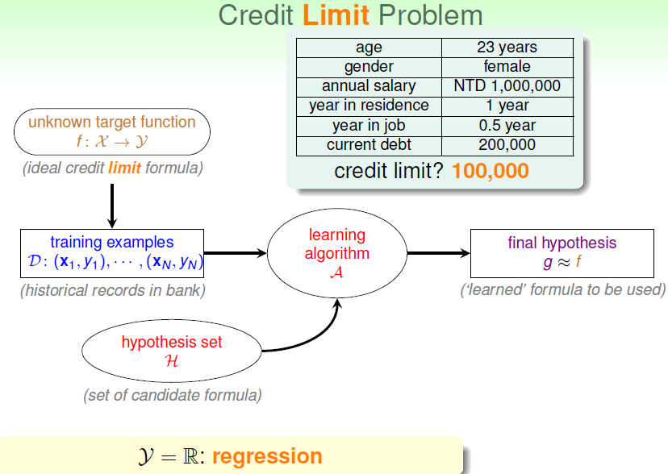

信贷额度为客户账户特征的加权和 $h(x) = w^Tx$ 

解释：找一个超平面，使得残差最小

最流行的误差衡量方式：平方误差

接下来如何最小化$E_{in}$(w)？

### Linear Regression ALgorithm

将$E_{in}(w)$写成矩阵形式

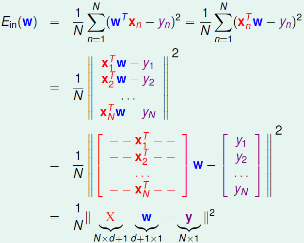

$E_{in}(w)$是连续可微的凸函数，所以最小的$E_{in}(w)$满足$E_{in}$在w处梯度为0

也就是说找一个$w_{LIN}$使得 $\nabla E_{in}(w_{LIN}) = 0$

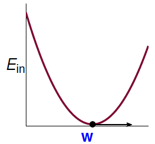

进一步变换，将平方展开

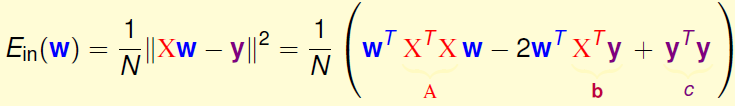

参照w不是向量的情况

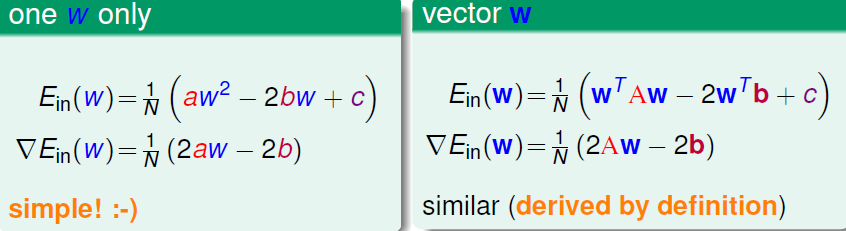

可以得到：

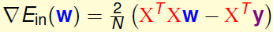

当$X^TX$ 可逆时可以直接解得结果，否则可以用其它方法计算伪逆

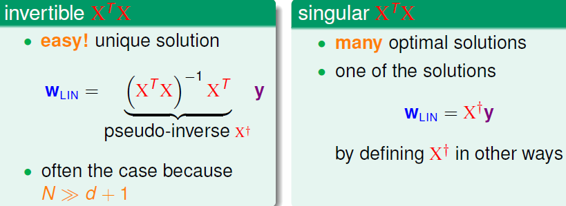

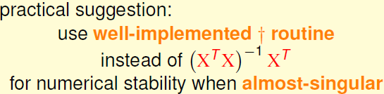

综上，可得到解线性回归的算法（在有好的伪逆解法的情况下，该算法可以做到简单而高效）：

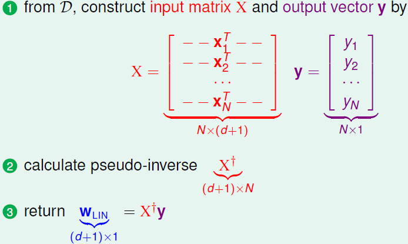

### Generalization Issue

关于线性回归是否是“学习算法的讨论”

反方观点：

- 封闭形式的解析解
- 没有尝试提高$E_{in}$
- 没有发生迭代

正方观点：

- 最好的$E_{in}$
- 不错的$E_{out}$（VC维是有限的，就像感知器）
- 在求伪逆的时候发生了迭代

总结：因为$E_{out}$ 是不错的，所以是学习行为

### Linear Regression for Binary Classification

## Logistic Regression

## Linear Models for Classification

# Embedding Numerous Features: Kernel Models

## Linear Support Vector Machine

### Course Introduction

### Large-Margin Separating Hyperplane

PLA从能将数据分开的超平面中随机选择一个，但哪个才是最好的呢？

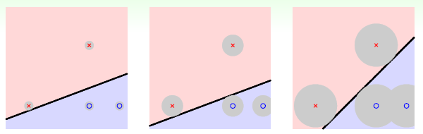

最右边的更加鲁棒，因为点距离直线最远（考虑点的噪音服从高斯分布）

鲁棒性(robustness)体现在超平面的胖瘦量(fatness)上

要找到最鲁棒的超平面，就是要找到最胖(fattest)的超平面

问题转化成以下优化问题：

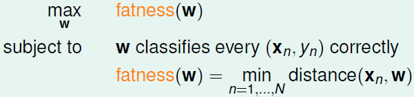

胖瘦量通常又叫做几何间隔(margin)，简称间隔

正确的分类会满足：$y_n = sign(w^Tx_n)$

问题转化成找最大间隔的分类超平面：

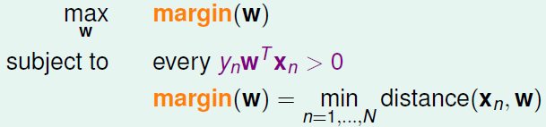

### Standard Large-Margin Problem

为了方便起见换一种表达方式：停用 $x_0$ 这种表达，并将$w_0$写成b。于是$h(x) = sign(w^Tx + b)$

用x, b, w表示点x到由w, b表示的平面的距离

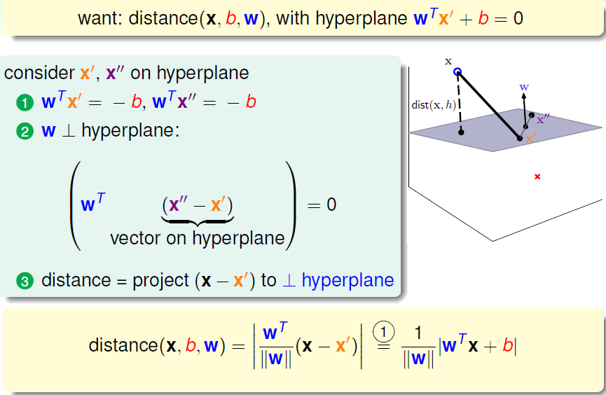

将距离公式引入优化问题，于是问题可以转化为：

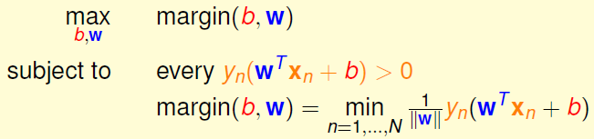

即使在几何上确定了一条直线，在代数上未必对应了唯一的参数。例如，y = 2x + 1和y = 4x + 2是同一条直线。那么该如何区分同一直线的不同代数形式呢？简单思考可以发现，它们虽然具有相同的几何距离$\frac{1}{|w|}y(w^Tx + b)$，但 $y(w^Tx + b)$却各不相同。

我们将$y(w^Tx + b)$定义为“代数距离”。代数距离的物理意义是包含了w的“尺寸”（scaling）的距离，将其除以|w|就可以消除尺寸对距离的影响，得到几何距离。现在，为了让几何直线有唯一的参数，我们可以对代数距离进行限制：$ \min \limits_{n=1, ..., N}y_n(w^Tx_n +b) = 1$。注意，这里我们只需用一个点的坐标就能限制w和b，之所以用代数距离最小的那个点是因为这样能够简化运算。另外，之所以等号右边的值为1也是因为这样能够简化运算。把这个限制条件加入优化问题，可得：

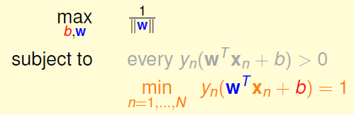

将限制条件中的min去掉，将优化目标的max改成min，并去掉根号，加上$\frac{1}{2}$，优化问题可以转化成：

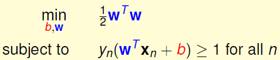

### Support Vector Machine

先解一个特殊的问题：

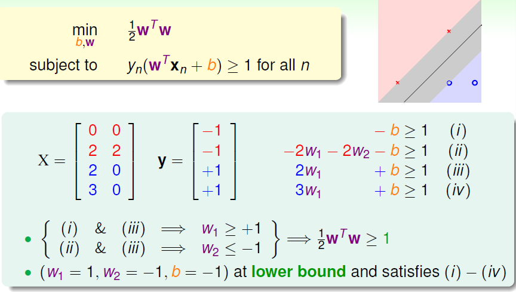

边界上的点（支持向量）可以定义超平面，其它点都无关紧要（上述第四条方程）。

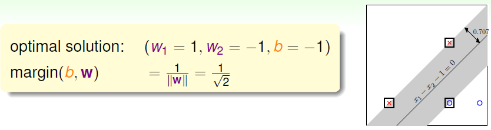

我们可以说SVM（通过支持向量）学到了最胖的超平面

然后尝试解一般的SVM问题

- 梯度下降解决不了带约束的优化问题
- 二次规划（QP）可以优化带线性约束的二次凸目标函数

于是最后可以将问题构造为QP问题：

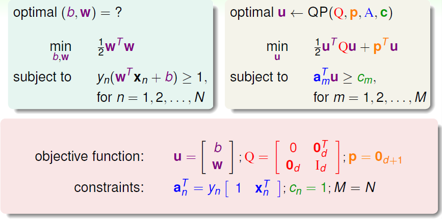

算法如下：

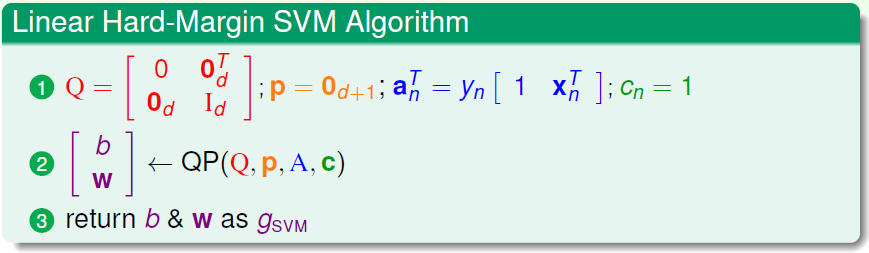

注意：

- hard-margin的意思是，不能有数据跨过边缘到不属于它的另一边去
- 线性的意思是，数据的次数都是一次的，如果想要非线性的特征就需要做特征变换$z_n = \Phi (x_n)$

### Reasons behind Large-Margin Hyperplane

large-margin SVM相当于$E_{in} = 0$ 的权值衰减正则化

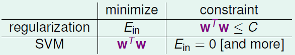

考虑最大间隔算法：

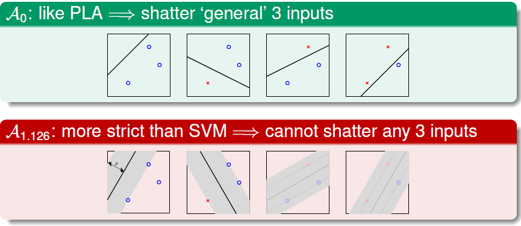

后者有更少的对分，也就有更少的VC维（算法的VC维，而不是之前讨论的假设集合的VC维），这意味着更好的泛化性能。其VC维以感知机的VC维为上界：

到目前为止，有以下三种超平面，从左到右VC维依次增加，但决策边界也依次增强

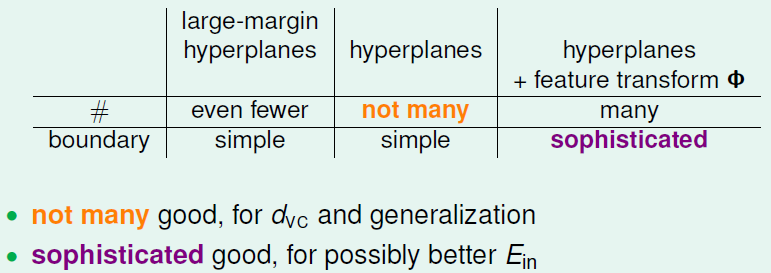

于是有了一种新的可能——同时使用大间隔超平面加上特征变换（VC维不至于太高，但决策边界也比较复杂）

## Dual Support Vector Machine

### Motivation of Dual SVM

如果要直接在QP前做特征变换将特征的维度增加到$\tilde{d}$ 的话，$\tilde{d}$ 通常会很大甚至无限，这将会是个挑战。所以接下来的目标是让SVM摆脱对 $\tilde{d}$ 的依赖

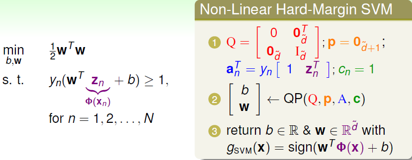

我们将要导出一个等价的QP问题，使得其仅有N个变量（原本是 $\tilde{d} + 1​$ 个变量）和N + 1个约束（原本是N个约束）。可以看出w的维度大大下降了。

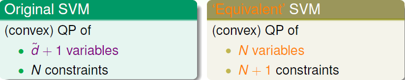

思路：通过拉格朗日乘子法求SVM的对偶问题。设拉格朗日函数和拉格朗日乘子，使得约束条件被并入优化目标中：

原问题：

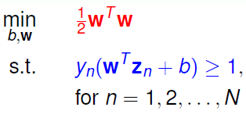

拉格朗日函数和拉格朗日乘子（在SVM中乘子常被写成$\alpha_n$）：

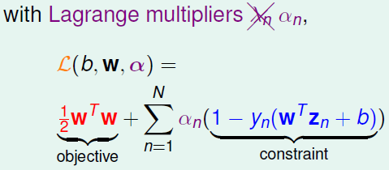

将不等式约束隐藏到最小化目标中的思路：若违反条件，则将最小化的目标函数设为正无穷。

具体的思路：令最小化的目标函数是一个最大化问题的解（最大值）。一旦违反条件，这个最大化问题可以将解优化到正无穷。也就是将不等式约束条件隐藏到max中：

$\min\limits_{b, w}(\max\limits_{all \ \alpha_n>0}L(b, w, \alpha))$

（先调整各个$\alpha_n​$ 来最大化L，再调整(b, w)来最大化目标函数）

转化的合理性：

- 当(b, w)违反原问题的限制条件时，$1 - y_n(w^Tz_n + b) > 0​$ 成立，那么：

  $\max\limits_{all \ a_n>0}L(b, w, \alpha) = \max\limits_{all \ a_n>0}\frac{1}{2}w^Tw + \sum\alpha_n(some \ positive)) \rightarrow  \infin$

  (只要将$\alpha_n$ 设置为$\infin$ 就可以将其最大化到正无穷)

- 否则：

  $\max\limits_{all \ a_n>0}L(b, w, \alpha) = \max\limits_{all \ a_n>0}\frac{1}{2}w^Tw \sum\alpha_n(all \ non-positive)) = \frac{1}{2}w^Tw$

- 所以为了最小化目标函数，(b, w)必须服从约数条件，否则目标函数会变为无限大

### Lagrange Dual SVM

下面继续推导SVM的拉格朗日对偶问题。下面我们的目标是：将问题转化成仅跟$\alpha​$ 有关的优化问题，其思路是将min和max的位置互换。

对于任意满足所有 $\alpha_n' \geq 0$ 的向量 $\alpha '$ 有（不取内层最大值了结果就有可能会减小）：

$\min\limits_{b, w}(\max\limits_{all \ \alpha_n \geq 0}L(b, w, \alpha)) \geq \min\limits_{b, w}L(b, w, \alpha')$

将“任意”这个条件用max表达，我们有（如果任意都小于某个值，那么最大值也会小于某个值）：

$\min\limits_{b, w}(\max\limits_{all \ \alpha_n \geq 0}L(b, w, \alpha)) \geq \max\limits_{all \ \alpha_n' \geq 0}\min\limits_{b, w}L(b, w, \alpha')$

不等号的右边就是原问题的拉格朗日对偶问题，它是原问题的一个下界。这样的不等式关系被称为“弱对偶性”(weak duality)。当原问题是QP问题且以下的条件满足时，等号恒成立，弱对偶性会变成“强对偶性”(strong duality)：

- 原问题的目标函数是凸的
- 原问题有解
- 原问题的限制条件都是线性的（QP本来就要求限制条件是线性的）

对于SVM来说，强对偶性是成立的。也就是说，存在一组$(b, w, \alpha)$ 使得等式两边的优化结果相等

接下来就尝试进一步化简等式右边的问题：

$\max\limits_{all \ \alpha_n \geq 0}(\min\limits_{b, w}\frac{1}{2}w^Tw + \sum\limits_{n=1}^N\alpha_n(1-y_n(w^Tz_n+b)))$

先化简内层问题，拉格朗日函数对b求偏导并令其等于0：

$\frac{\part L(b, w, \alpha)}{\partial b} = -\sum\limits_{n = 1}^N \alpha_ny_n = 0$

根据这个条件，上面的问题可以被化简为（加上限制条件，并去掉b）：

$\max\limits_{all \ \alpha_n \geq0, \sum y_n\alpha_n=0}(\min\limits_{b, w}\frac{1}{2}w^Tw + \sum\limits_{n=1}^N\alpha_n(1-y_n(w^Tz_n)))$

拉格朗日函数对$w_i$求偏导并令其等于0：

$\frac{\part L(b, w, \alpha)}{\partial w_i} = w_i -\sum\limits_{n = 1}^N \alpha_ny_nz_{n, i} = 0$

也就是说

$w = \sum\limits_{n=1}^N\alpha_ny_nz_n$

于是上面的问题可以被化简为：

$\max\limits_{all \ \alpha_n \geq 0, \sum y_n\alpha_n=0, w=\sum\alpha_ny_nz_n}(\min\limits_{b, w}\frac{1}{2}w^Tw + \sum\limits_{n=1}^N\alpha_n - w^Tw)$

<=> $\max\limits_{all \ \alpha_n \geq 0, \sum y_n\alpha_n=0, w=\sum\alpha_ny_nz_n}-\frac{1}{2}||\sum\limits_{n=1}^N\alpha_ny_nz_n||^2 + \sum\limits_{n=1}^N\alpha_n$

于是我们就得到了化简的拉格朗日对偶问题：

 $\max\limits_{all \ \alpha_n \geq 0, \sum y_n\alpha_n=0, w=\sum\alpha_ny_nz_n}-\frac{1}{2}||\sum\limits_{n=1}^N\alpha_ny_nz_n||^2 + \sum\limits_{n=1}^N\alpha_n$

我们可以说，当强对偶性成立时，$(b, w, \alpha)$ 之间会满足以下条件：

- 原问题条件(primal feasible)：$y_n(w^Tz_n + b) \geq 1$
- 对偶问题条件(dual feasible)：$\alpha_n \geq 0$
- 对偶问题内部最优化条件(dual-inner optimal)：$\sum y_n\alpha_n=0, w=\sum \alpha_ny_nz_n$
- 原问题内部最优化条件(primal-inner optimal, or complimentary slackness)：$\alpha_n(1-y_n(w^Tz_n+b))=0$

以上的条件被称为KTT条件，其中第三个条件被我们用来化简对偶问题。强对偶性不仅是KTT条件成立的充分条件，还是KTT条件成立的必要条件

### Solving Dual SVM

现在，通过导出对偶问题我们将变量个数减少到了N + 1，将其写成QP可解的形式（max变成min，“和的平方”写成“两两相乘的和”）：

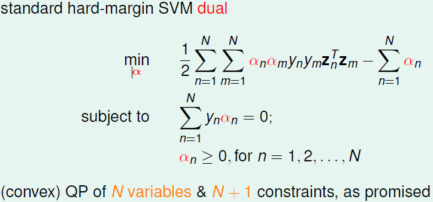

将其构造成QP问题：

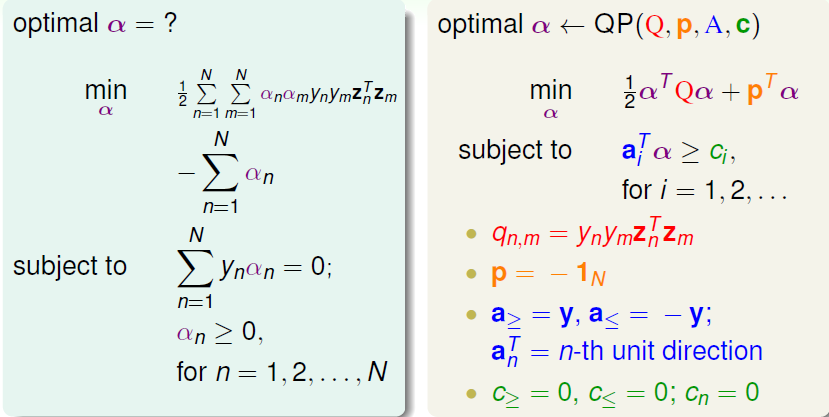

注意：许多二次规划求解程序会将每条等式限制条件写成两条不等式限制条件（a = b等价于a <= b && a >= b）

困难：Q矩阵是一个$N \times N$的稠密对称矩阵，当$N=3\times10^4$时要消耗3G的内存，因此通常会用一个特殊的不用将整个Q放进内存的QP算法

在用QP解出了$\alpha$ 后可以利用KTT条件解出(b, w)：

- 用第3条解出w：$w=\sum\alpha_ny_nz_n$
- 用第4条解出b：对任意一个$\alpha_n > 0​$ 有 $b = y_n - w^Tz_n​$

从第4条还能看出 $\alpha​$ 的意义：$\alpha_n > 0​$ 意味着 $1-y_n(w^Tz_n+b) = 0​$ ，也就是说，$\alpha_n > 0​$ 对应的数据点坐落在超平面的边界上，是一个支持向量

### Messages behind Dual SVM

对偶问题给出的信息：

- 超平面的边界由支持向量决定，跟其它点无关
- $\alpha_n > 0​$ 的数据点是支持向量，它坐落在超平面的边界上
- 并不是所有坐落在超平面的边界上的点都是支持向量 $(\alpha_n > 0)$ 
- 计算w只需要用到所有的支持向量：$w = \sum\limits_{SV}\alpha_ny_nz_n​$
- 计算b只需要用到任意一个支持向量：$b = y_n - w^Tz_n$ ，with any SV

在求解对偶问题的过程中，SVM依靠识别支持限量来学到最大间隔超平面

从SVM和PLA的对比可以看出：

- w是$y_nz_n$的线性组合（w由数据表出）
- 对于 $w_0 = 0$的基于GD/SGD的LogReg/LinReg，上句话也成立
- 对于PLA，w仅由犯错的数据表出
- 对于SVM，w仅由支持向量表出

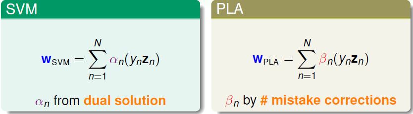

$y_nz_n$ 的物理意义：第n条数据提供的修正量，$\alpha_n​$ 的物理意义：第n条数据的“修正率”

总结：两种硬间隔SVM的形式：

下一步：让SVM完全脱离$\tilde{d}​$ 的控制，并且简化Q矩阵的计算（$R^{\tilde{d}}​$ 空间的内积计算）

## Kernel Support Vector Machine

### Kernel Trick

让SVM完全脱离$\tilde{d}$ 控制的思路：化简 $z_n^Tz_m$ 

以二项式转换为例（为了方便起见，既包含了$x_1x_2$又包含了$x_2x_1$）：

$\Phi_2(x) = (1, x_1, x_2, ..., x_d, x_1^2, x_1x_2, ..., x_1, x_2, x_2x_1, x_1^2, ...x_2x_d, ..., x_d^2)$

二项式转换的简化：

$\Phi_2(x)^T\Phi_2(x') $

$= 1 + \sum\limits_{i=1}^dx_ix_i' + \sum\limits_{i=1}^d\sum\limits_{j=1}^dx_ix_jx_i'x_j'$ 

$ = 1 + \sum\limits_{i=1}^dx_ix_i' + \sum\limits_{i=1}^dx_ix_i'\sum\limits_{j=1}^dx_jx_j'$

$ = 1 + x^Tx' + (x^Tx')(x^Tx')$

（第二个等式成立的原理：$a_1b_1 + a_1b_2 + a_2b_1 + a_2b_2 = (a_1 + a_2)(b_1+b_2)$）

对于$\Phi_2$ 而言，变换 + 内积可以从$O(d^2)$优化到$O(d)$ 

核函数就相当于变换 + 内积

两种变换的核函数K：

$\Phi: K_{\Phi}(x, x') \equiv \Phi(x)^T\Phi(x') $

$\Phi_2: K_{\Phi_2}(x, x') = 1 + (x^Tx') + (x^Tx')^2$

 之前的二项式系数就可以写成：

$q_{n, m} = y_ny_mz_n^Tz_m = y_ny_mK(x_n, x_m)$

最优的b可以写成（对于支持向量$(x_s, y_s)$）：

$b = y_s - w^Tz_s = y_s - (\sum\limits_{n = 1}^N\alpha_n y_nz_n)^Tz_s = y_s - \sum\limits_{n = 1}^N\alpha_ny_nK(x_n, x_s) $

最优假设函数$g_{svm}$（对于测试样例x）：

$g_{svm}(x) = sign(w^T\Phi(x) + b) = sign(\sum\limits_{n = 1}^N\alpha_ny_nK(x_n, x) + b)$

核技巧：引入高效的核函数，使得算法复杂度不依赖于$\tilde{d}$

用QP解核支持向量机：

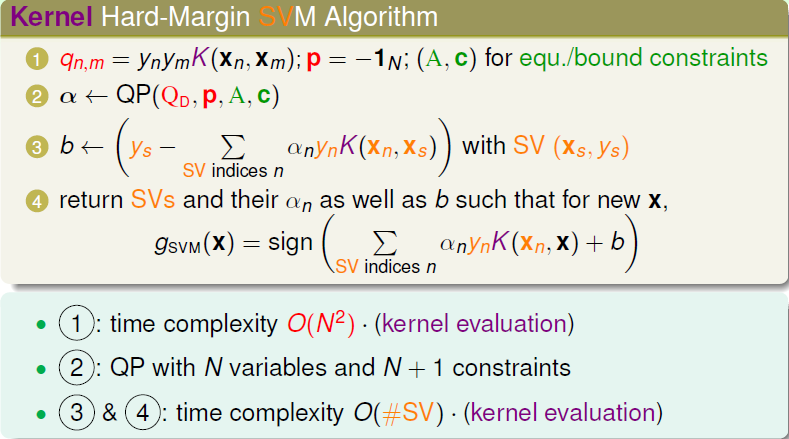

核支持向量机：使用高效计算技巧来规避$\tilde{d}​$ 并且只使用支持向量来做预测

### Polynomial Kernel

广义二次多项式核函数

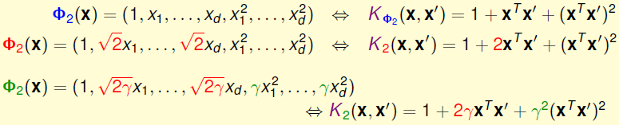

就可以得到更容易计算的$K_2$核函数

$K_2(x, x') = (1 + \gamma x^Tx')^2 \ with \ \gamma > 0$

$K_2$ 和 $K_{\Phi 2}$具有差不多的拟合能力，但是具有不同的内积（不同的几何意义）。通常$k_2$用得更多

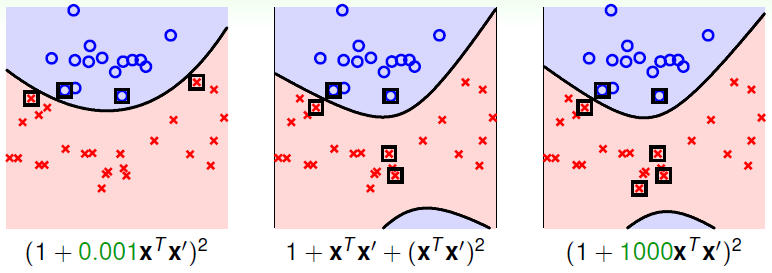

有两点需要注意

- 两者的$g_{svm}$和支持限量都是不同的，但很难说哪个更好
- 改变核函数就是改变边缘(margin)的定义，所以在实践中需要选择K，就像需要选择$\Phi$ 一样

广义多项式核函数

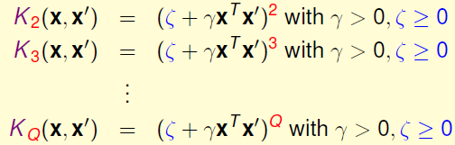

SVM + 多项式核：多项式SVM

有两点值得关注

- $\Phi_Q$ 被嵌入到$(\gamma, \zeta)$ 空间中了
- 能够在不依赖$\tilde{d}$ 的情况下做最大间隔多项式分类

多项式核的特例

$K_1(x, x') = (0 + 1 \dot x^Tx')^1$

线性核：线性核能够被很高效地计算出来（而且通常是在原问题下），再加上考虑到VC维，我们应当先考虑线性核

### Gaussian Kernel

如果计算足够高效的话，我们甚至能够将$\Phi(x)$ 提升至无限维

考虑当x = $(x_1)​$，也就是只有一维时，我们令（稍后要推出这个K是两个无限维转换的核函数）

$K(x, x') = e^{-(x - x')^2}$

$ = e^{-x^2}e^{-x'^2}e^{2xx'}$

$\overset{Taylor}{=} e^{-x^2}e^{-x'^2}\sum\limits_{i=0}^\infin\frac{(2xx')^i}{i!}$

(泰勒展开：$e^a = \sum\limits_{i=0}^\infin\frac{a^i}{i!}$)

$=\sum\limits_{i=0}^\infin(e^{-x^2}e^{-x'^2}\sqrt{\frac{2^i}{i!}}\sqrt{\frac{2^i}{i!}}x^ix'^i)$

= $\Phi(x)^T\Phi(x')$

于是构造出了无限维的$\Phi(x) = e^{-x^2}(1, \sqrt{\frac{2}{1!}}x, \sqrt{\frac{2^2}{2!}}x^2, ...)$

更一般地：高斯核$K(x, x') = e^{-\gamma ||x-x'||^2} \ with \ \gamma > 0$

对应的$g_{svm}(x)$：

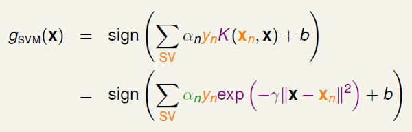

值得注意的是：

- $g_{svm}(x)$是以支持向量为中心的高斯函数的线性组合
- 因此高斯核也叫作RBF核(Radial Basis Function Kernel)

高斯SVM：找到$\alpha_n$ 来组合以支持向量为中心的高斯分布，使得目标超平面在无限维空间中能取得最大间隔

总结支持向量的机制：

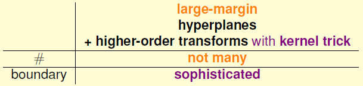

- 将变换用高效的核函数维护
- 将储存w转化成储存少量的支持向量和$\alpha_n$

高斯SVM带来的新可能：在最大间隔守护着泛化性能的同时，进行无限维线性分类

高斯SVM仍旧有过拟合的风险，需要谨慎地调整$\gamma$

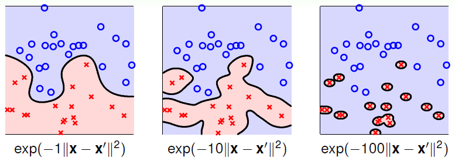

### Comparison of Kernels

线性核的优缺点：

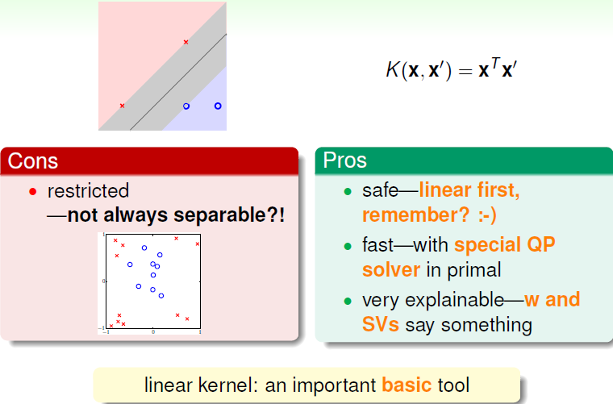

多项式核的优缺点：

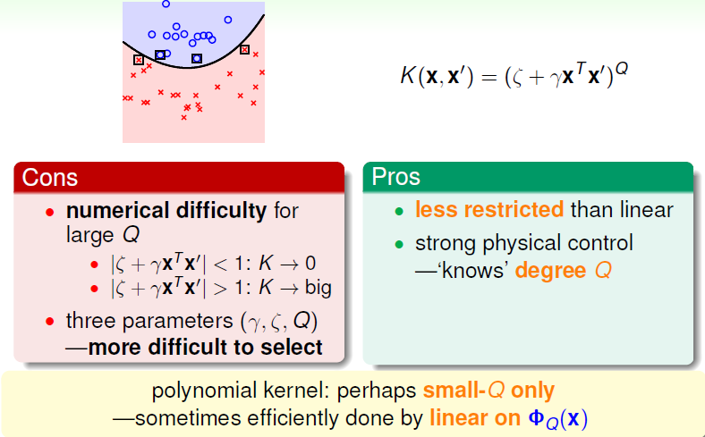

高斯核的优缺点：

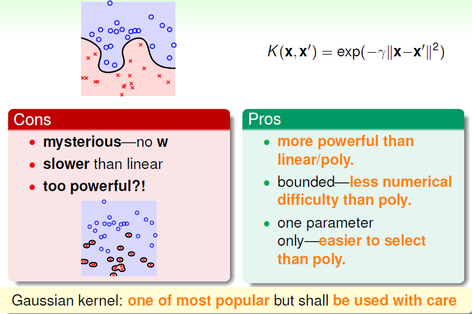

核函数实际上是两个点在某个空间中的相似度

合法的相似度就可以作为核函数

核函数合法的充分必要条件（mercer's condition）：

- 对称
- K矩阵半正定

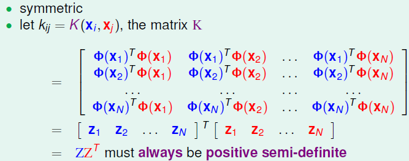

## Soft-Margin Support Vector Machine

## Kernel Logistic Regression

## Support Vector Regression

# Combining Predictive Features: Aggregation Models

## Blending and Bagging

### Motivation of Aggregation

T个朋友$g_1, g_2, ..., g_T$思考股票是否会上涨，并作出预测$g_t(x)$

可以做的事情有：

- 根据他们平常的表现，找一个最信得过的朋友来做预测：validation
- 将每个人的预测均匀地混合起来：投票
- 将每个人的预测不均匀的混合起来：投票但每个人的票数不同
- 根据不同情况组合预测结果（如果t的预测符合某些条件，就给他一些票）

集成模型（aggregation models）：混合（mix）或者组合（combine）假设函数（为了更好的表现）

上述四种方式的数学表达：

- $G(x) = g_{t_*}(x) \ with \ t_* = argmin_{t \in \{1, 2, ..., T\}}E_{val}(g_t^-)$ （$g_t^-$表示在比较小的训练集上得到的函数）
- $G(x) = sign(\sum\limits_{t = 1}^T1 \cdot g_t(x))$
- $G(x) = sign(\sum\limits_{t=1}^T\alpha_tg_t(x)) \ with \ \alpha_t \geq 0$ （包含了以上两种情况）
- $G(x) = sign(\sum\limits_{t=1}^Tq_t(x) \cdot g_t(x)) \ with \ q_t(x) \geq 0$ （包含了$q_t(x)= \alpha_t$ 的情况）

其中第一种是模型选择，其余是模型集成

模型选择的特点：

- 简单且流行
- 使用$E_{val}(g_t^-)$而不是$E_{in}(g_t)$ ：$d_{vc}$ 的存在
- 需要有一个很强的$g_t^-$来保证$E_{val}$很小（也就是$E_{out}$很小）

模型选择依赖于很强的假设函数，我们能不能使用很多弱假设函数来做得更好呢？

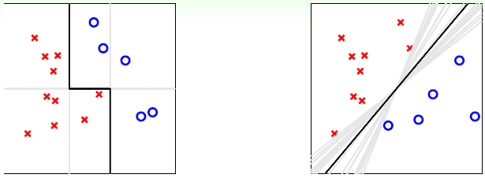

以上两幅图对应着：

- 将很多不同的弱假设函数均匀地混合，使得假设函数变强。这很像是特征变换(feature transform)
- 将很多不同的随机PLA函数均匀地混合，使得假设函数变得更“适中”。这很像是正则化(regularization)

因此，是当地集成会有更好的效果

### Uniform Blending

对于分类的情况

均匀混合（uniform blending）：给每个$g_t$一票：

$G(x) = sign(\sum\limits_{t=1}^T1 \cdot g_t(x))$

- 所有$g_t$ 都一样（专制）时，跟只有一个$g_t$效果相同
- 每个$g_t$都不一样（多样+民主），能够表达多数的意见
- 多分类也可以用这个思路

对于回归的情况

$G(x) = \frac{1}{T}\sum\limits_{t=1}^Tg_t(x)$

- 所有$g_t$ 都一样（专制）时，跟只有一个$g_t$效果相同
- 每个$g_t$都不一样（多样+民主），有些大于真实值，有些小于真实值，那么平均起来会更加准确

在假设集比较多样的情况下，即使是简单的平均混合也会比任何单一的假设函数要好

对回归情况做理论上的分析：将$g_t$的均方误差跟G的均方误差作比较（假设x相同，所以就略去不写）

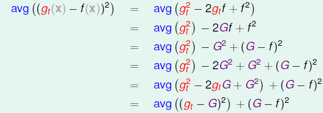

式子两边对所有x取期望，得

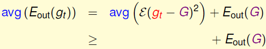

也就是说平均的$g_t$的表现比G要糟糕

还是回归的例子。现在独立同分布地取T次N组数据，以此来计算算法A的表现。当对T取极限时有

$\overline{g} = \lim\limits_{t \rightarrow \infin}G = \lim\limits_{t \rightarrow \infin}\frac{1}{T}\sum\limits_{t=1}^Tg_t=\epsilon_DA(D)$

将$\overline{g}$替换进上面的式子中可得

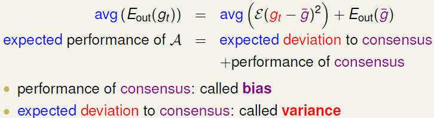

这个式子揭示了算法期望误差的“偏差-方差分解”

偏差表示算法表现的“共识”，而方差则表示算法与共识的期望距离

平均混合正是在通过减少方差来获得更稳定的表现

### Linear and Any Blending

线性混合

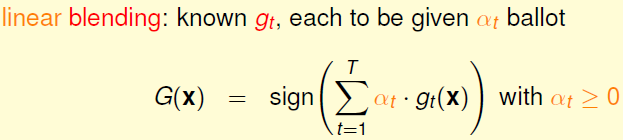

对比回归模型的先行混合和带特征变换的线性回归

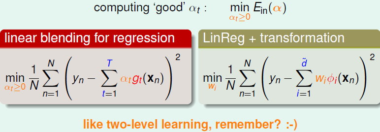

那么线性混合实际上就是

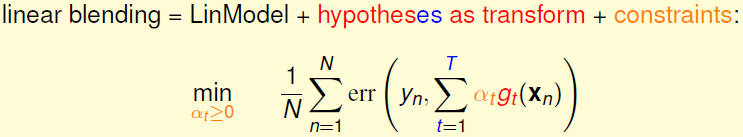

但在实际中，通常会忽略$\alpha_t$ 的限制

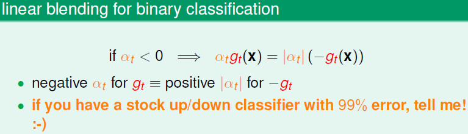

线性混合和模型选择的异同（线性混合的VC维大于模型选择）：

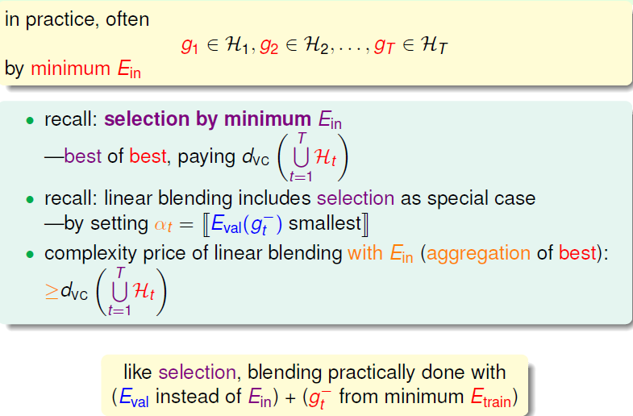

任意混合(any blending)，又称堆叠(stacking)，是指使用任意模型而不是线性模型来做混合的方法

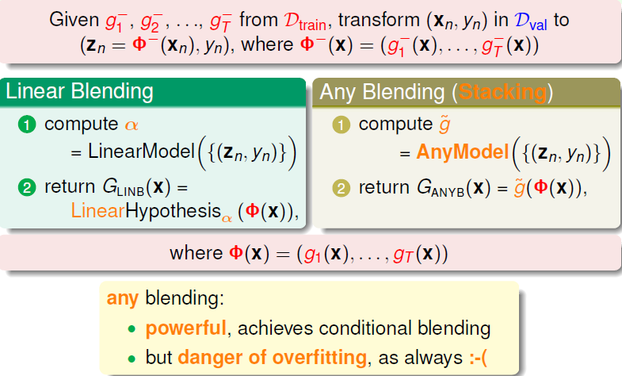

2011年KDDCup台大夺冠思路：

- 先用训练集训练出一堆单一模型
- 再用验证集训练出stacking模型将单一模型混合
- 最后用测试集训练出线性混合模型将单一模型和stacking模型混合

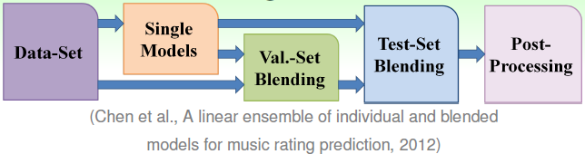

### Bagging(Bootstrap Aggregation)

之前做的事情是针对已经有的$g_t$做集成(也就是做blending)，那么现在可不可以边学习$g_t$边做集成？

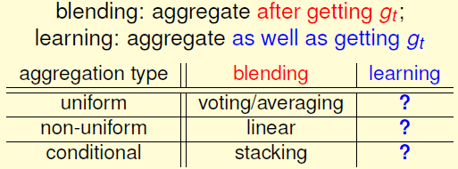

如果要边学$g_t$边做均匀的集成(aggregation)的话，模型的多样性，是很重要的，下面是达成多样性的方法：

- 使用不同种类的模型
- 同种模型使用不同的参数
- 利用算法的随机性
- 使用数据的随机性

接下来要做的就是利用数据的随机性，但不是用$g^-$ （刨除验证集的数据）

回顾偏差-方差分解：

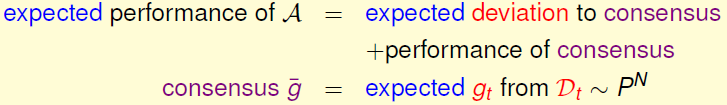

- 共识(consensus)比A(D)更稳定，但需要很多$D_t$
- 妥协以得到一个近似的$\overline{g}$ ，通过有限多的T，和利用仅从D处得到的$D^T \sim p^N$ 训练出的$g_t = A(D_t)$

自举法(bootstrapping)：一种统计工具，通过从D中重采样(re-samples)来模拟$D_t$ 

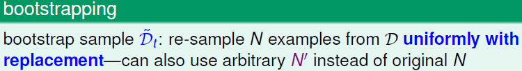

虚拟的集成和自举集成的区别

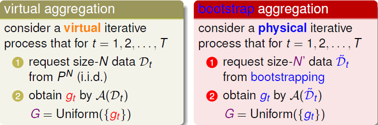

自举集成(bootstrap aggregation)又称为BAGging，是一种基于基本算法(base algorithm)A的元算法(meta algorithm)

Bagging Pocket

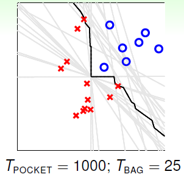

- 通过bagging获得非常多样的$g_t$
- 在将二分类模型集成后，得到了非常合适的非线性决策边界

经验：当基本算法对数据的随机性非常敏感时，bagging的效果会非常好（并且很合理）

## Adaptive Boosting

### Motivation of Boosting

老师教学生识别水果的例子

### Diversity by Re-weighting

在bagging中，通过bootstrapping可以得到多份数据

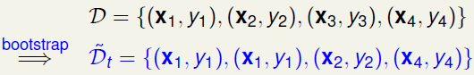

在这多份数据上，计算误差的方式是取平均值

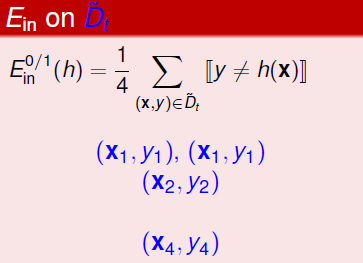

或者将其看成一个加权平均的过程

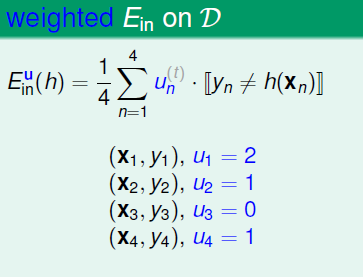

这样，可以说：bagging通过最小化加权自举误差（bootstrap-weighted error）来实现 $g_t$  的多样性

类别加权学习的扩展：样例加权学习

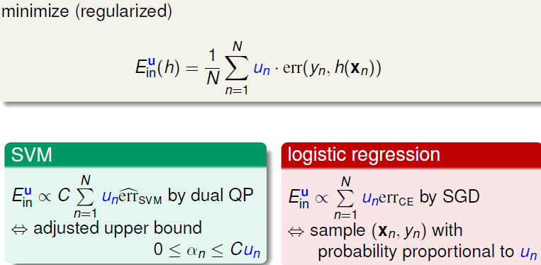

改进bagging二分类的新思路：可不可以利用样例的权值，通过不断改变权值来得到更多样的假设函数

通过两种不同的u得到的$g_t$：

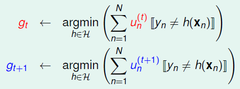

思路：构造一种$u_n^{(t + 1)}$使得$g_t$在这上面表现很差，则用$u_n^{(t + 1)}$训练得到的$g_{t + 1}$会和$g_t$很不相同

“很差”的数学表示（跟抛硬币没什么两样）：

$\frac{\sum_{n = 1}^Nu_n^{(t + 1)}[y_n \ne g_t(x_n)]}{\sum_{n=1}^Nu_n^{(t+1)}} = \frac{1}{2}$

也就是说，“很差”意味着在 $g_t$上得到的错误样例用$u_n^{(t + 1)}$ 算出的权值之和与正确样例的权值之和相同：

$\sum\limits_{n=1}^Nu_n^{(t+1)}[y_n\ne g_t(x_n)]=\sum\limits_{n=1}^Nu_n^{(t+1)}[y_n=g_t(x_n)]$

一个可行的方案是：正确样例的权值乘上错误样例的权值和，同时错误样例的权值乘上正确样例的权值和，这样正确样例和错误样例的权值和就会相等

使用加权正确率和加权错误率会更好。设加权错误率为$\epsilon_t$ ，那么在下一轮，本轮正确的样例的权值应该乘上$\epsilon_t$ ，而本轮错误的样例的权值应该乘上$1-\epsilon_t$

### Adaptive Boosting Algorithm

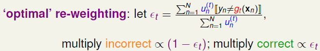

事实上，加权正确率和加权错误率的物理意义不是很好，因为乘上它们以后都会放大权值。为了使权值具有放大和缩小的物理意义。使用下面的放缩因子：

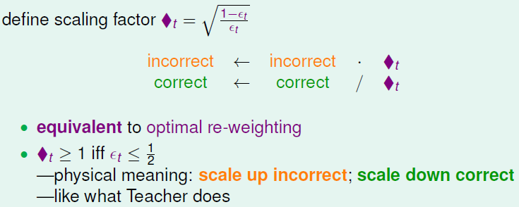

于是可以得到初步的算法（得到各个 $g_t$）

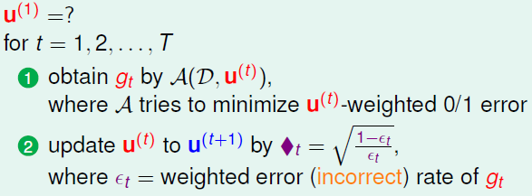

但是如何将$g_t$集成成G(x)呢？肯定不能平均地集成，因为我们会希望$g_1$表现得很好，但是如果将$g_2$平均地与$g_1$集成的话会得到不太好的结果。因此想到使用线性集成（需要速度快且有理论保证）

思路：越好的$g_t$给它越大的权值

“好”的数学表示：放缩因子$\sqrt{\frac{1-\epsilon_t}{\epsilon_t}}$ 比较大

赋予不错的物理意义：套上一层ln函数，使得放缩因子为1时（错误率为0.5时）权值为0，放缩因子为无穷大时（错误率为0时）权值为无穷大。于是权值$\alpha_t = ln(\sqrt\frac{1-\epsilon_t}{\epsilon_t})$ 

集成算法：

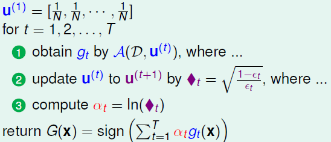

我们将完整的算法称作Adaptive Boosting（自适应提升），或者简称AdaBoost

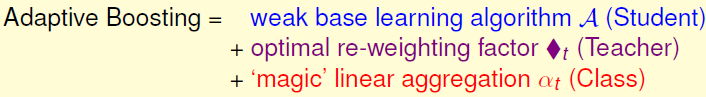

AdaBoost算法的完整版：

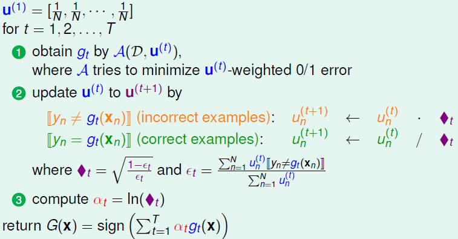

boosting性质的含义：将弱分类器的效果提升了

AdaBoost的VC Bound：

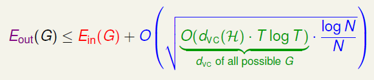

- 如果分类器比较弱($\epsilon_t \leq \epsilon \leq \frac{1}{2}$)的话，则当T = O(log N)时，$E_{in}(G) = 0$
- 这个时候公式的蓝色部分也会比较小（$O(d_{vc}(H) \cdot \frac{log^2(N)log(log(N))}{N})$）

从提升的角度看AdaBoost：当A较弱但比完全随机稍强，则AdaBoost会变得很强（$E_{in} = 0$ 且 $E_{out}$ 很小）

### Adaptive Boosting in Action

比较流行的 $g_t$的选择：决策树桩

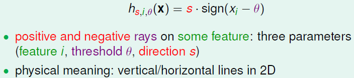

时间复杂度：$O(d\cdot NlogN)$ ，其中d为特征数量

简单的例子：

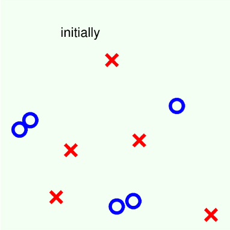

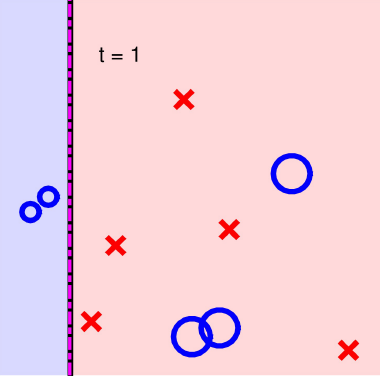

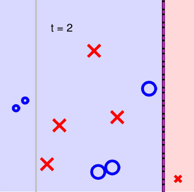

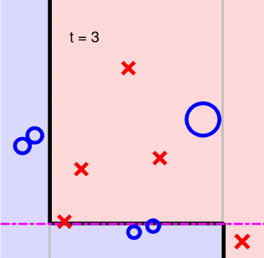

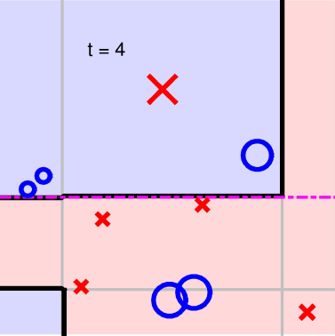

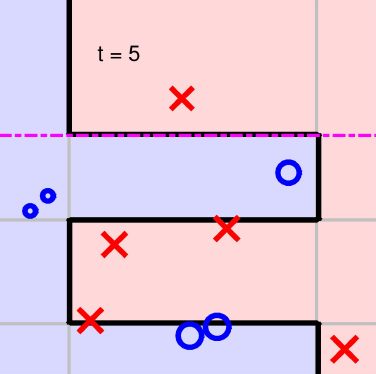

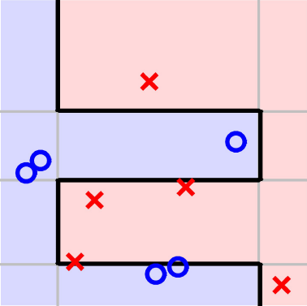

复杂的例子：

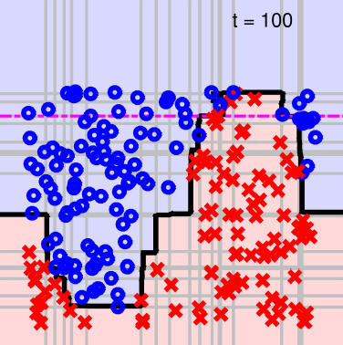

AdaBoost-Stump：非线性但是非常高效

AdaBoost在应用中的表现：

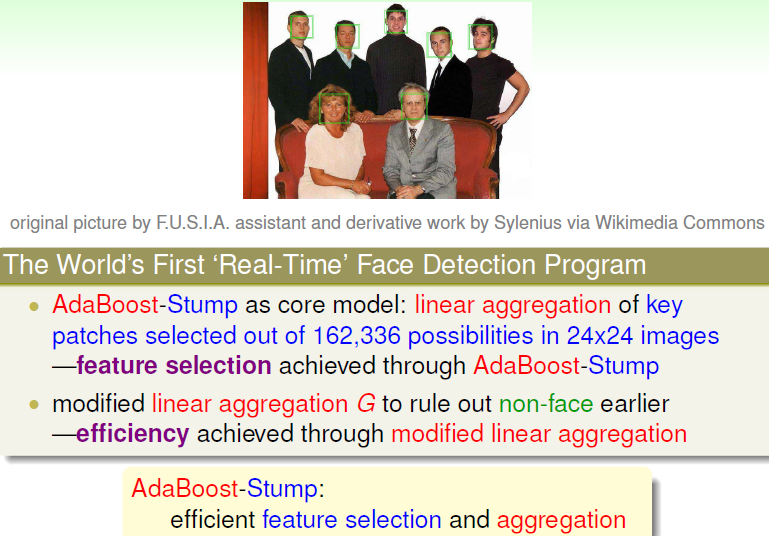

## Decision Tree

### Decision Tree Hypothesis

从方式和类型来看集成模型：

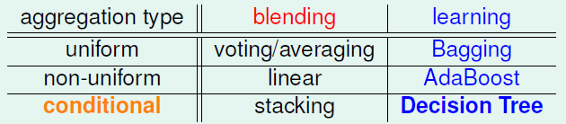

决策树是一个传统的实现条件集成的学习模型，同时也是一个最有说服力的仿人模型

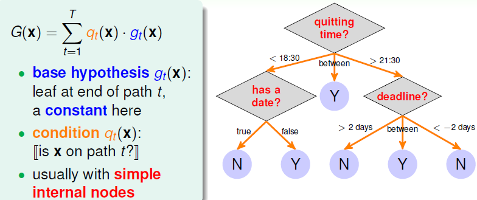

从路径角度和递归角度来审视决策树的假设函数：

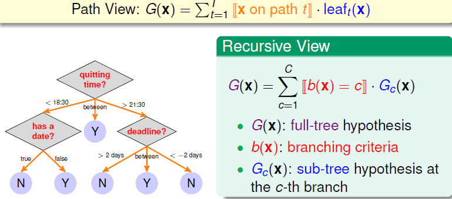

决策树的优缺点

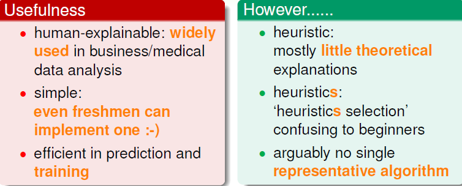

### Decision Tree Algorithm

基本的决策树算法：

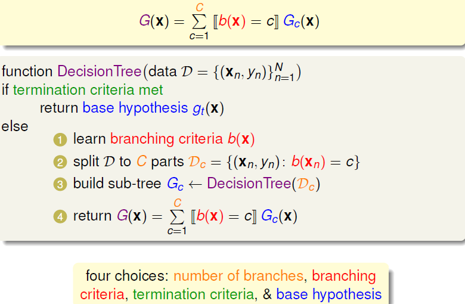

通过4中选择来决定具体算法：

- 分支数
- 分支标准b(x)（输入一个点输出一个分支编号）
- 终止标准
- 基本假设函数$g_t(x)$

CART(Classification and Regression Tree)算法：

CART框架：

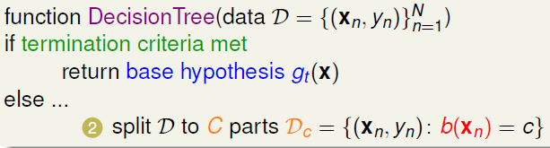

两个简单的选择：

- C = 2（二叉树）
- $g_t(x)$为一个能使$E_{in}$最小化的常数（例如在分类中，使用{$y_n$}的众数，在回归中，使用{$y_n$}的均值）

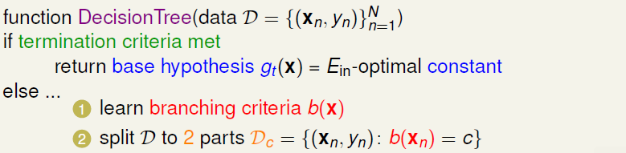

分支标准的选择：

- 简单地选用决策树桩作为决策树的内节点（每输入一条数据，输出一个整数1或2，表示这条数据进入的分支）

- 用不纯度(Impurifying)做分支标准（通过优化子树的加权不纯度之和来选择决策树桩）：

  $b(x) = \mathop{\arg\min} \limits_{\text{decision stumps }h(x)} \sum\limits_{c=1}^C|D_c\text{ with }h|\cdot impurity(D_c\text{ with }h)$

不纯度函数：

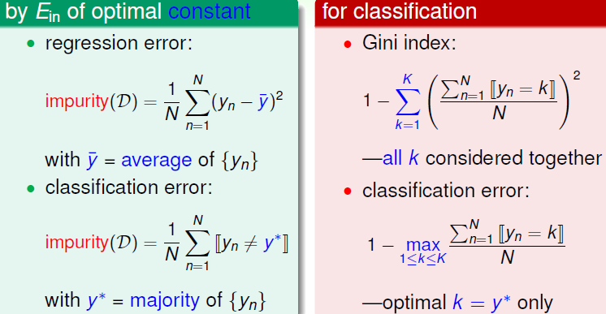

比较流行的选择：

- 分类问题：基尼(Gini)不纯度（1减去每类样例所占比例的平方之和）
- 回归问题：方差

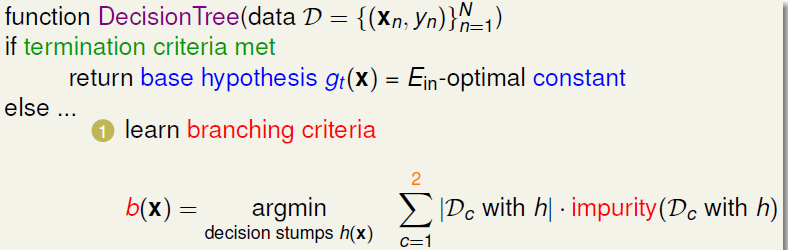

CART的终止条件

- 所有的$y_n$都相同：不纯度为0，$g_t(x) = y_n$
- 所有的$x_n$都相同：不存在决策树桩

根据以上的各种选择，现在可以给CART下一个定义了：

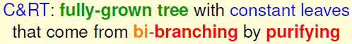

其完整的算法流程如下：

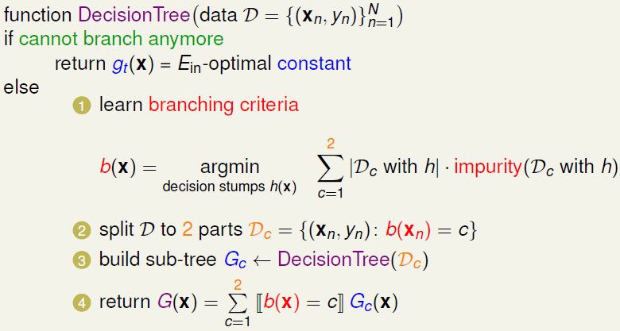

### Decision Tree Heuristics in CART

如果所有的$x_n$都不同的话，要保证$E_{in}(G) = 0$，就要保证决策树是一棵完全生长的树（fully-grown tree）。但这样会造成过拟合（$E_{out}$太大），因为靠近叶子节点的子树所包含的数据集都非常小。

解决思路：

- 需要一个正则化算子（regularizer）$\Omega$ (G) = NumberOfLeaves(G)

- 我们想要通过优化问题来正则化决策树（剪枝）：

  $\mathop{\arg\min}\limits_\text{all possible G} E_{in}(G)+\lambda\Omega(G)$

- 我们不可能枚举所有的G，所以一般从完全生长树$G^{(0)}$开始，不断从$G^{(i-1)}$中移除一个叶子节点来得到新的$G^{(i)}$ 

关键是如何系统地选择$\lambda$ 呢？答案是validation

数值特征（设置阈值）和类别特征（枚举子集）的分支方法：

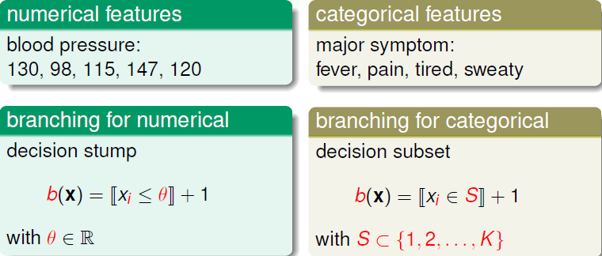

决策树能够很轻易地处理类别特征

处理缺失值的方法：

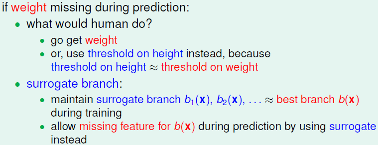

### Decision Tree in Action

在简单数据集上CART和Ada-Boost的对比（决策树桩的区别：后者的每个树桩都是直线，后者的每个树桩可能是线段、射线或直线）

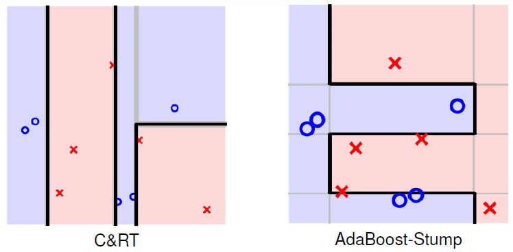

在复杂数据集上的对比：

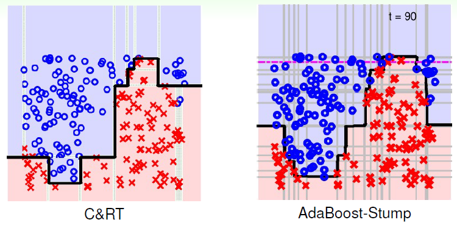

决策树的特点（只有决策树同时具备这些特点）：

- 可解释性强
- 容易处理多分类问题
- 容易处理类别特征
- 容易处理缺失特征
- 能够高效做非线性学习

其它算法：C4.5（使用信息增益率做划分）

## Random Forest

### Random Forest Algorithm

Bagging通过投票和平均可以减少方差，而决策树有很大的方差（尤其是完全生长的决策树），因此可以考虑将它们结合

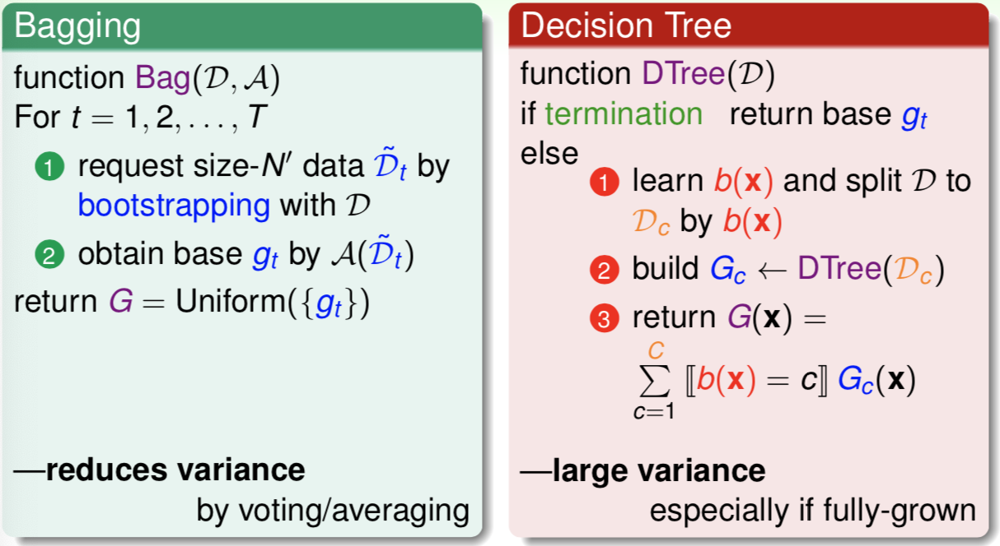

也就是说，我们构造随机森林=bagging+完全生长的CART

特点：

- 高度可并发（高效学习）
- 继承了CART的所有优点
- 减少过拟合

在bagging中通过数据随机性来实现多样性（从D中随机抽样N'条数据）

另一种实现多样性的方法：从x中随机抽样d'个特征

- 当抽样的index为$i_1, i_2, ..., i_{d'}$ 时，$\Phi(x)=(x_{i_1}, x_{i_2}, ..., x_{i_d'})$
- $Z\in R^{d'}$ 是$X \in R^d$ 的一个随机子空间
- 通常有$d'<<d$ ，这样对很大的特征维度d是高效的（可以推广到其它模型）
- 原作中的RF对CART中的每个b(x)都要做新的子空间重采样

RF = bagging+随机子空间CART

考虑使用组合投影：

从x中随机采样d'个特征相当于对x做矩阵变换：$\Phi(x)=P \cdot x$ （P的每行都是标准基（natural basis））

多样性更好的特征：矩阵的每行不局限于标准基

- 矩阵的每一行都是用随机的向量来做投影（组合）：$\phi_i(x)=p_i^Tx$
- 通常是在向低维空间做投影：$p_i$ 中的d''个非零成分在起作用
- 包含了之前的随机子空间：也就是d''=1，且$p_i$ 是标准基的情况
- 原作中的RF对CART中的每个b(x)都将数据重新投影到维度为d'的随机低维空间上去

RF = bagging+随机组合CART

### Out-Of-Bag Estimate

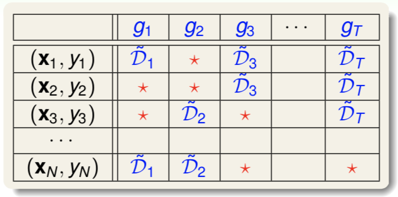

第n行第t列的元素指出了第t个决策树在哪个数据集中使用了第n条数据作为训练数据（$\tilde{D}_t$），或表示第t个决策树没有使用第n条数据（$*$）。对第t个决策树而言，打*号的数据（没被用来得到$g_t$）：被称为$g_t$ 的出袋数据（out-of-bag, OOB）

对$g_t$而言，某条数据在OOB中的概率为$(1-\frac{1}{N})^N$

当N很大时：

$(1-\frac{1}{N})^N=\frac{1}{(\frac{N}{N-1})^N}=\frac{1}{(1+\frac{1}{N-1})^N} \approx \frac{1}{e} \approx 0.37$

每个$g_t​$的OOB大小 $\approx \frac{1}{e}N​$

OOB VS Validation

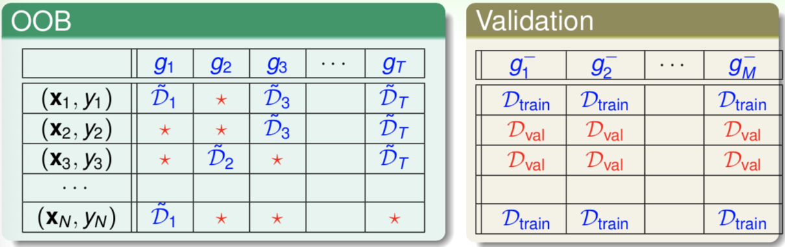

- *就像$D_{val}$ ：在训练时留下了足够的没用过的数据

- 使用*来验证$g_t$ ？不常使用

- 使用*来验证G？$E_{oob}(G)=\frac{1}{N}\sum\limits_{n=1}^Nerr(y_n, G_n^-(x_n))$ 

  （$G_n^-$ 包括了所有把$x_n$ 当成OOB的决策树，例如：$G_N^-(x) = average(g_2, g_3, g_T)$）

使用$E_{val}$进行模型选择：

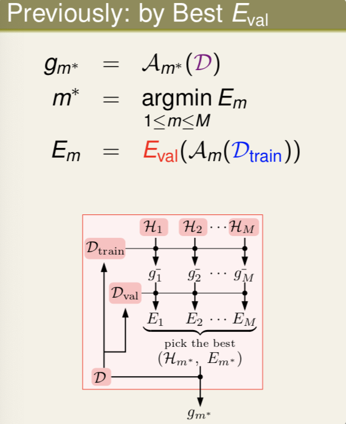

使用$E_{oob}$进行模型选择：

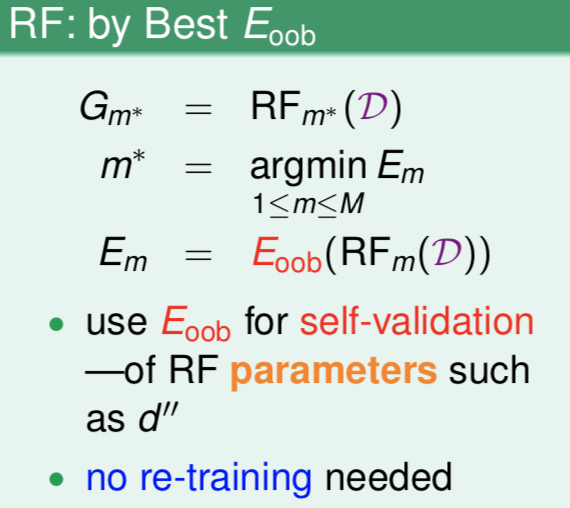

在实践中$E_{oob}$通常十分准确。

### Feature Selection

特征选择：对于$x = (x_1, x_2, ..., x_d)$，我们想要删除：

- 冗余特征：比如“年龄”和“生日”
- 无关特征：例如在癌症预测问题中患者的“医疗保险类型”

特征选择的优点：

- 效率：更简单的假设函数和更短的预测时间
- 泛化性能：去除了特征的噪音（feature noise）
- 解释性

特征选择的缺点：

- 计算：要在计算过程中做组合优化（选出合适的特征组合）
- 过拟合：在组合优化时选到了过拟合的特征（看似效果很好实则不然）
- 不可解释性

决策树：罕见的自带特征选择的模型

Idea：如果有可能计算特征的重要程度，就可以对特征进行排序，从而选择最好的d'个特征

线性模型的特征重要性：

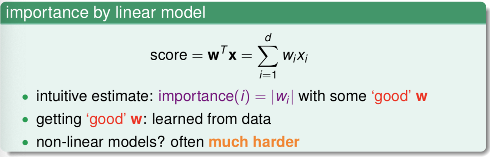

随机森林的特征重要性，Idea：随机测试（random test）——若特征i很重要，则随机的$x_{n, i}​$会令随机森林的表现显著下降

- 哪种随机值？

  - 均匀分布，高斯分布：会改变$x_i​$的概率分布
  - 自举（bootstrap），随机排序：能够近似地保持$x_i$ 的概率分布

- 随机测试：

  importance(i) = performance(D) - performance($D^{(p)}​$)

  （其中$D^{(p)}$ 是D第i列随机排序的结果 ）

随机测试：通用的统计工具，用于像随机森林一样的非线性模型

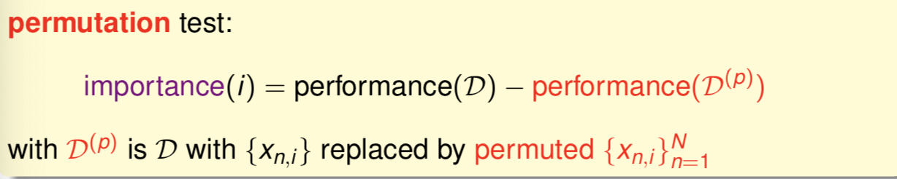

- performance($D^{(p)}$)：需要多次训练和验证

- 避免验证的方法：RF中的OOB

- 原论文中的解法：

  $important(i) = E_{oob}(G) - E_{oob}^{(p)}(G)​$

  $E_{oob}^{(p)}(G)​$ 表示：在算第n条数据在第t个决策树上的误差时将第n条数据的第i个特征值替换成从第t个决策树的所有OOB数据中随机抽样得到的特征值

通过排序+OOB实现的随机森林特征选择通常在实践中较为高效，且能得出不错的结果

### Random Forest in Action

随机森林在简单数据集中的表现（左图表示带随机特征组合的决策树，右图表示随机森林，中图表示随机森林中的$g_t$）：

随机森林中有1棵决策树时:

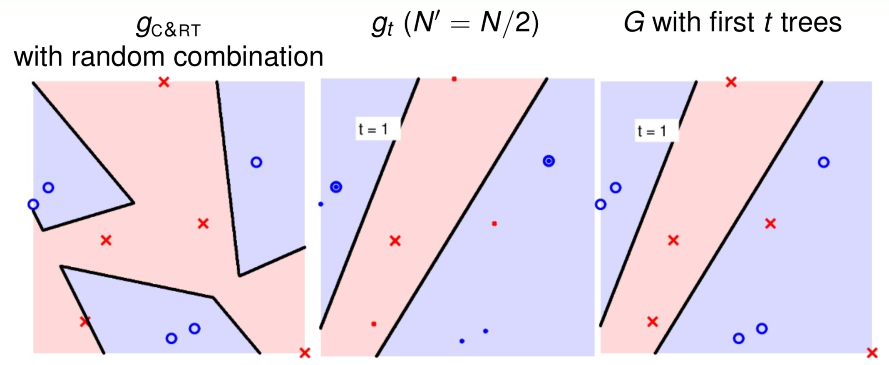

随机森林中有100棵决策树时：

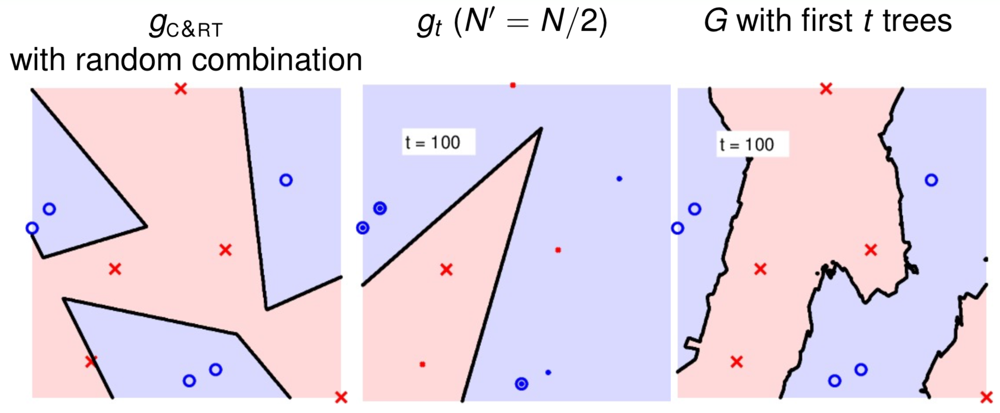

随机森林中有500棵决策树时：

随机森林中有1000棵决策树时：

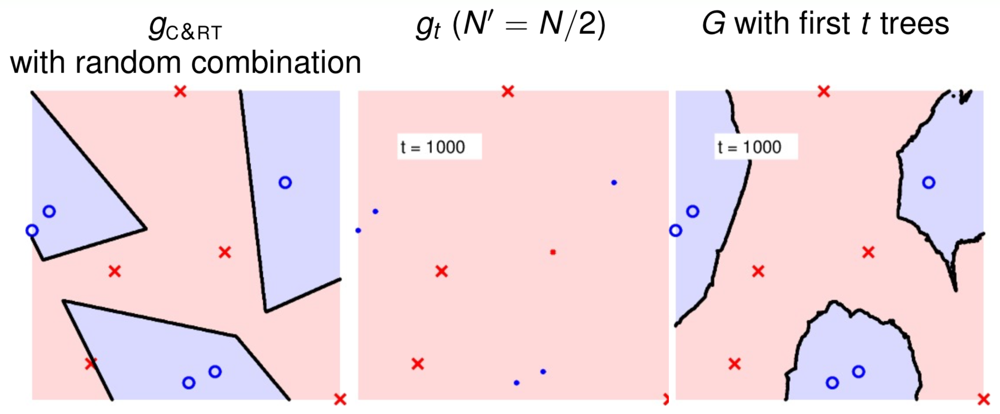

当随机森林中有许多决策树时，决策边界将变得平滑并且具有“大间隔（large-margin）”的性质。

随机森林在复杂数据集中的表现：

随机森林中有1棵决策树时：

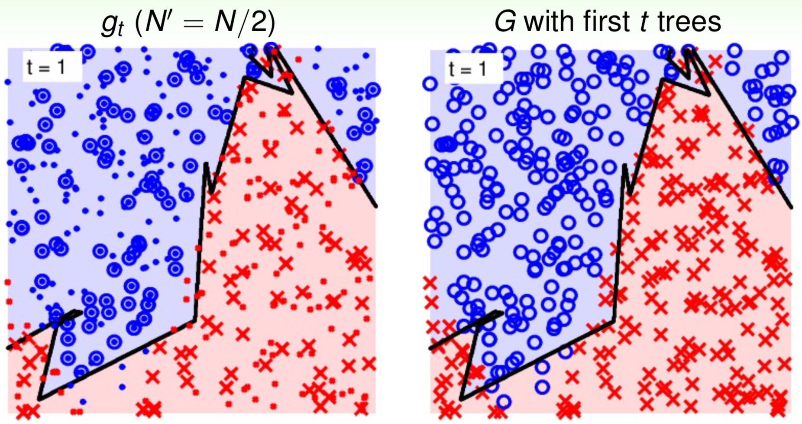

随机森林中有11棵决策树时：

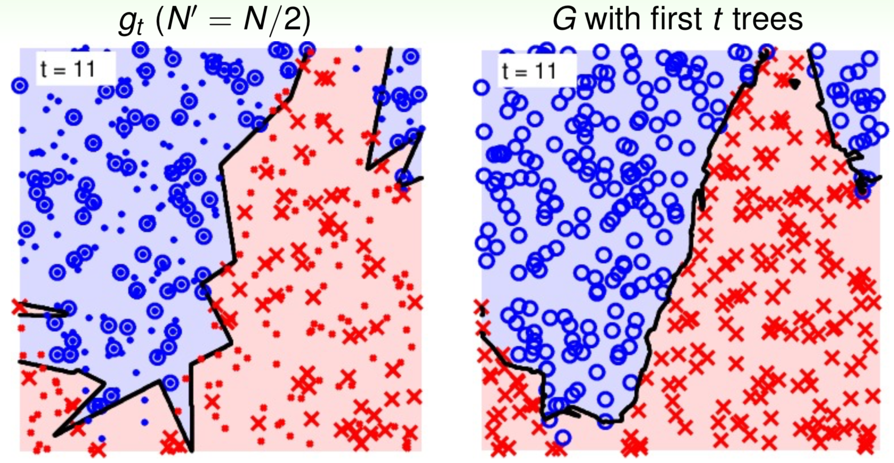

随机森林中有21棵决策树时：

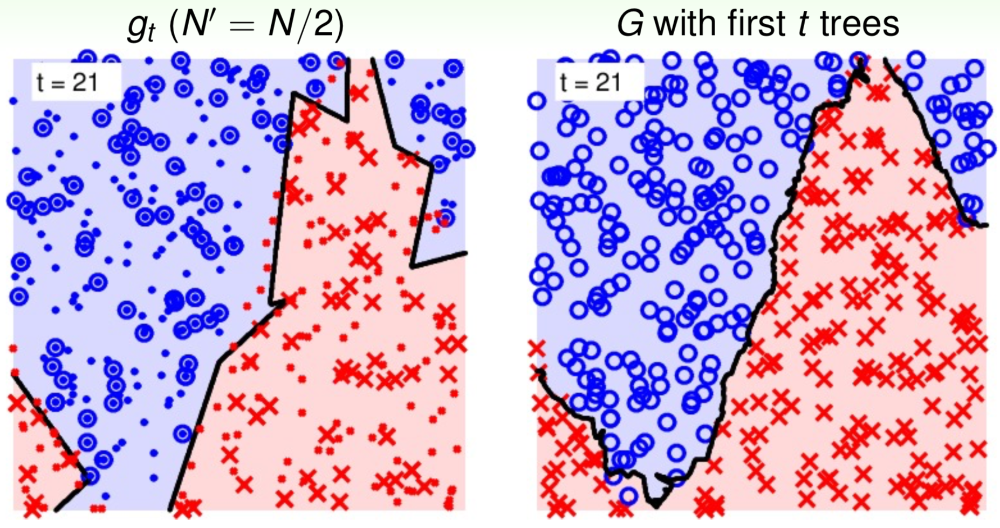

当含有许多决策树时，随机森林是一个简单但鲁棒性强的非线性模型

随机森林在包含噪音的数据集中的表现：

随机森林中有1棵决策树时：

随机森林中有11棵决策树时：

随机森林中有21棵决策树时：

当含有许多决策树时，随机森林能够通过投票来修正噪音

所以通常是树越多越好

建议：增加一棵树来看看是否对表现有很大的影响，如果有影响的话说明随机森林还不够稳定，需要再增加树的数量。

台大在KDD Cup中使用随机森林夺冠的经历：

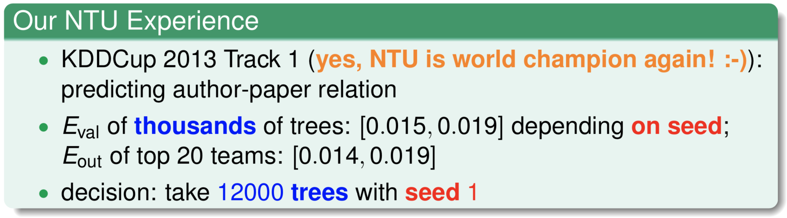

## Gradient Boosted Decision Tree

### Adaptive Boosted Decision Tree

从随机森林出发，来看看将决策树应用到AdaBoost中的可行性：

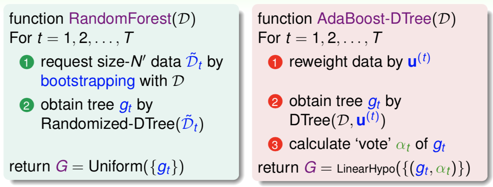

现在需要的是能对数据做加权的决策树DTree(D, $u^{(t)}$)

加权决策树算法，最小化：

$E_{in}^u(h) = \frac{1}{N}\sum\limits_{n=1}^Nu_n \cdot err(y_n, h(x_n))$

我们希望能够不加修改直接使用决策树算法（将决策树算法当成黑盒），为此，我们在随机森林中做的是：通过bootstrap抽样出的数据副本来表示加权动作

因此可以从中归纳出一般的基于随机化的加权算法：通过按$u_n​$的比例随机抽样来为数据做加权处理

AdaBoost-DTree：AdaBoost + 正比于$u^{(t)}$的抽样 + Dtree($\tilde{D}_t$)

回顾一下AdaBoost：为第t个模型分配$\alpha_t​$ 票（$\alpha_t = \ln \blacklozenge = \ln \sqrt{\frac{1-\epsilon_t}{\epsilon_t}}​$ ，$\epsilon_t​$ 是加权误差率(weighted error rate)）

但是对于在全体$x_n$上训练的完全生长的决策树而言，若所有$x_n$都是不同的，则$E_{in}(g_t) = 0$ 

也就是说必然有$E_{in}^u(g_t) = 0​$  

也就是说$\epsilon_t = 0, \alpha_t = \infin$ （独裁！）

综上所述，如果要在AdaBoost中应用决策树，就必须用部分 $x_n$来训练决策树，并且用剪枝来弱化决策树

- 剪枝：常规的剪枝方式，或限制树的高度
- 部分：按照$u^{(t)}​$ 成比例地抽样

AdaBoost-DTree：AdaBoost + 正比于$u^{(t)}$的抽样 + 剪枝后的Dtree($\tilde{D}_t$)

AdaBoost-Stump是AdaBoost-DTree的树高度小于或等于1的特例

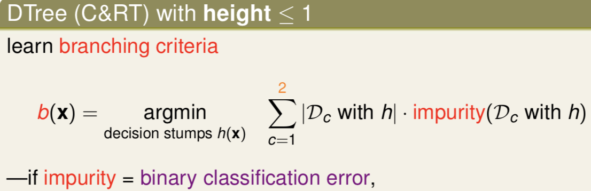

### Optimization View of AdaBoost

下面深入理解AdaBoost，然后导出Gradient Boost

回顾AdaBoost中的权重更新：

$u_n^{(t+1)}= \begin{cases} u_n^{(t)} \cdot \blacklozenge_t & \text{if incorrect} \\ u_n^{(t)} / \blacklozenge_t & \text{if correct}  \end{cases}$

可以将其简化成一个更简单的表达式：

$u_n^{(t+1)} = u_n^{(t)} \cdot \blacklozenge_t^{-y_ng_t(x_n)}​$

因为我们有$\alpha_t = \ln \blacklozenge​$ ，所以上式又可以变换成：

$u_n^{(t+1)}= u_n^{(t)} \cdot e^{-y_n\alpha_tg_t(x_n)}​$

所以，在AdaBoost完成后某个点的权重为：

$u_n^{(T+1)}= u_n^{(1)} \cdot \prod\limits_{t=1}^T e^{-y_n\alpha_tg_t(x_n)} = \frac{1}{N}e^{-y_n\sum\limits_{t=1}^T\alpha_tg_t(x_n)}​$

- 我们将$\sum\limits_{t=1}^T\alpha_tg_t(x)$ 定义为{$g_t$}在x上的投票分数$s(x_n)$
- 还记得吗，$G(x) = \sum\limits_{t=1}^T\alpha_tg_t(x)​$ 

因此对于AdaBoost，$u_n^{(T+1)}​$ 正比于$e^{-y_n \cdot s(x_n)}​$

由G(x)的表达式，可以想到，AdaBoost其实是linear blending的延伸：

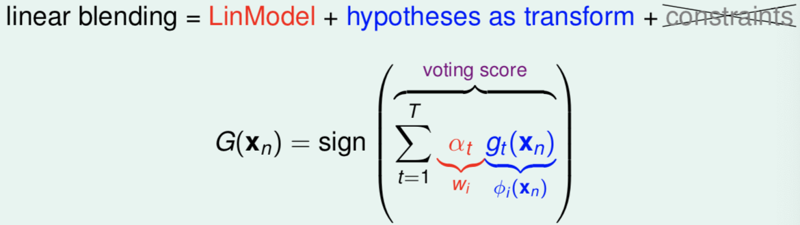

由SVM的间隔的定义（$\text{margin} = \frac{y_n \cdot (w^T\phi(x_n) + b)}{||w||}$）可以联想到， $y \cdot s(x_n)​$的几何意义是未正规化的间隔（margin）

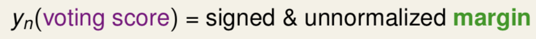

我们希望间隔越大越好，也就是希望$e^{-y_n \cdot s(x_n)}$ 越小越好，这相当于希望$u_n^{(T+1)}$ 越小越好

实际上，AdaBoost做的的事情正是在每次迭代中减少间隔，也就是减少$\sum\limits_{n=1}^Nu_n^{(t)}$ ，通过优化这个值（逐步减小$\sum\limits_{n=1}^Nu_n^{(t)}$ 的最终目的就是使 $\sum\limits_{n=1}^Nu_n^{(T+1)} ​$尽可能小）：

$\sum\limits_{n=1}^Nu_n^{(T+1)}=\frac{1}{N}\sum\limits_{n=1}^Ne^{-y_n\sum\limits_{t=1}^T\alpha_tg_t(x_n)}​$

我们可以将$e^{ys}​$ 看成AdaBoost的误差。这个误差是0/1误差的凸上界

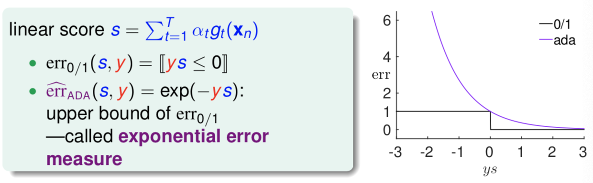

但如何证明AdaBoost真的可以让这个指数误差变小呢？我们的思路是：证明AdaBoost是在用一种类似梯度下降的方法优化指数误差

现在，快速回顾一下梯度下降

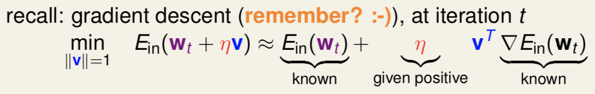

给定$\eta$ ，在第t步迭代中我们想要做的是最小化$E_{in}(w_t + \eta v)$ 。对其进行一阶泰勒展开（$f(x) = f(x_0)+dx \cdot f'(x_0)$），于是可以说该最小化实际上是在寻找合适的v的方向（v的长度已经被限制为1了）

实际上AdaBoost也是在每步迭代中，从现有的误差出发，找到一个最优“方向”，然后迈一小步。只不过这个“方向”的载体是函数而不是单位向量（是在函数空间上找方向而不是在向量空间上找方向）

在AdaBoost的前t - 1轮迭代结束后，现有的东西是t - 1个函数g，和t - 1个权值$\alpha$ ，在第t轮迭代中，我们想要在其中加入第t个函数h，和第t个权值$\eta$ 。我们希望加入新函数和新权值后$\hat{E}_{ADA}$ 会越小越好。用数学表达式可以做如下描述：

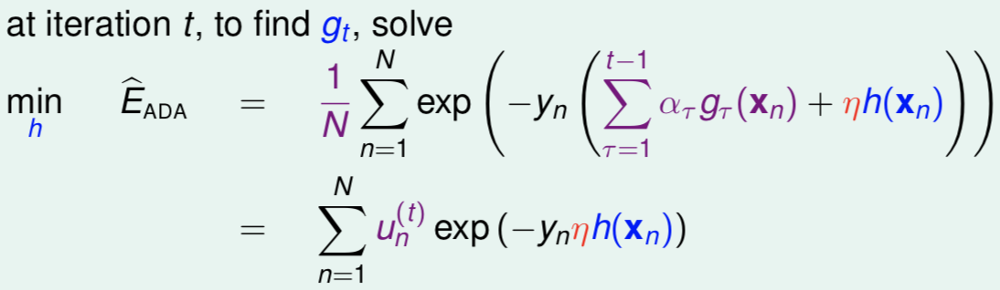

值得一提的是，第一行变换到第二行利用了表达式：

$\sum\limits_{n=1}^Nu_n^{(t)}=\frac{1}{N}\sum\limits_{n=1}^Ne^{-y_n\sum\limits_{t=1}^{t-1}\alpha_tg_t(x_n)}$

然后对上式中的指数函数做在原点附近的泰勒展开：

就将式子拆成了两个项

- $\sum\limits_{n=1}^Nu_n^{(t)}$：与梯度下降的第一个项类似，表示的是当前的$E_{in}$ ，是一个常数 
- $\eta \sum\limits_{n=1}^N u_n^{(t)}y_nh(x_n)​$ ：真正需要优化的项

我们对真正需要优化的项做变形：

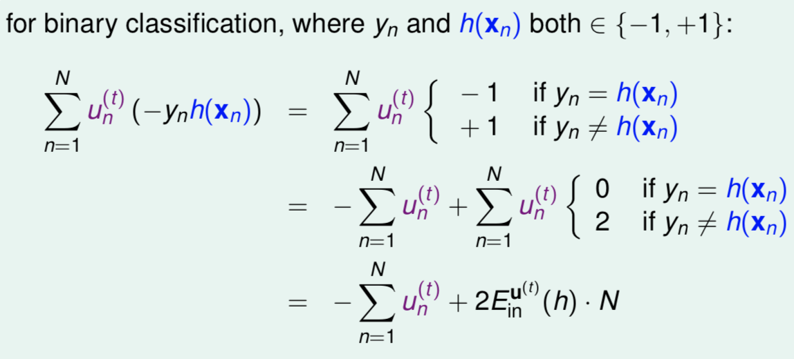

我们可以发现，在第t轮中优化指数误差 $\hat{E}_{ADA}​$ ，实际上就是在优化$E_{in}^{u^{(t)}}(h)​$ ，即第t轮中函数h在数据权值遵循$u^{(t)}​$ 时的误差。这正是AdaBoost中基本算法A在第t轮迭代中优化的东西

或者说基本算法A做的事情，是为“梯度下降”挑选一个合适的方向（对$u^({t})$这种抽样权重，在所有可能的h中找到一个最好的 $g_t$ ）

在找到$g_t$后，我们可以固定$g_t$，然后用$\eta$  来优化$\hat{E}_{ADA}$ 

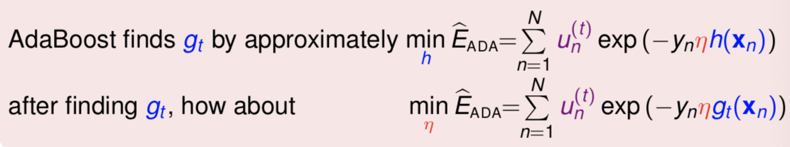

$g_t$固定了，就可以求出其$\epsilon_t$ ，我们将$\hat{E}_{ADA}$ 中的$g_t$部分代换成$\epsilon_t$ ，再解出最优解对应的$\eta_t$ ，就可以用$\epsilon_t$ 来表示$\eta_t$ 了。此时$\eta_t​$ 表示的是在某个固定的方向上能够跨出的最好的步伐

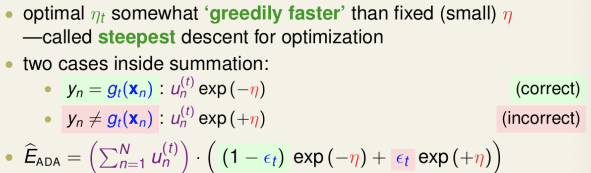

令$\frac{\partial\hat{E}_{ADA}}{\partial \eta} = (\sum\limits_{n=1}^Nu_n^{(t)})((1-\epsilon_t)e^{-\eta}+\epsilon_te^{\eta}) = 0$

解之得$\eta_t = \ln \sqrt{\frac{1-\epsilon_t}{\epsilon_t}}​$

可见这里的$\eta_t$ 就是我们前面在介绍AdaBoost时提到的$\alpha_t$，这也就解释了$\alpha_t$ 为何是 $\ln \sqrt{\frac{1-\epsilon_t}{\epsilon_t}}$ 这个奇怪的形式

至此，可以重新给AdaBoost下一个更接近本质的定义：使用了近似函数梯度(approximate functional)的最速下降算法(steepest descent)

### Gradient Boosting

AdaBoost能够被扩展到任意的Error函数上

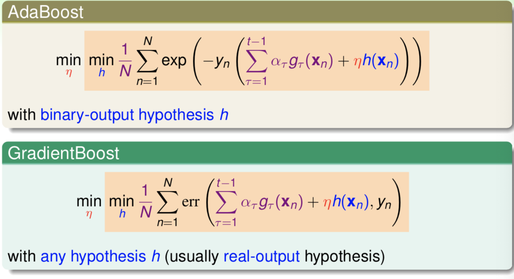

这就是GradientBoost

下面通过将误差函数换成平方误差函数，将GradientBoost引入回归领域，其目标函数为：

$\min\limits_\eta \min\limits_h\frac{1}{N}\sum\limits_{n=1}^N err(\sum\limits_{\tau=1}^{t-1}\alpha_\tau g_\tau (x_n)+\eta h(x_n), y_n)$

其中$err(s, y)=(s-y)^2$

先考虑内层的优化，对函数做泰勒展开，展开成当前误差加上一个增量的形式：

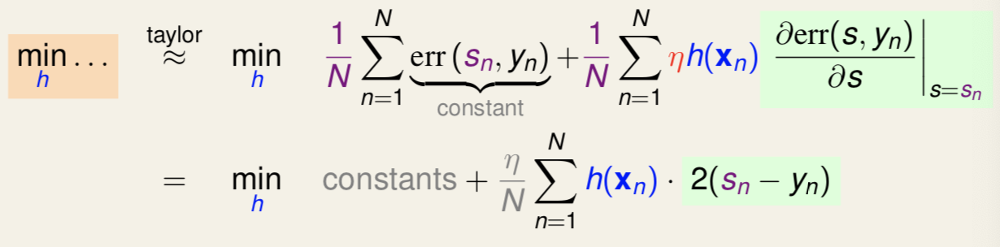

构造一个最优的“方向”h：

$h(x_n) = - \infin \cdot (s_n - y_n)$

这样无论$(s_n - y_n)$是正还是负，都可以让优化目标达到负无穷。但是以负无穷为最优方向是无意义的，所以我们仿照梯度下降将向量的大小限制为1的做法（向量的大小由$\eta ​$ 决定），我们可以限制h的大小。也就是说要给函数梯度h加一个惩罚项：

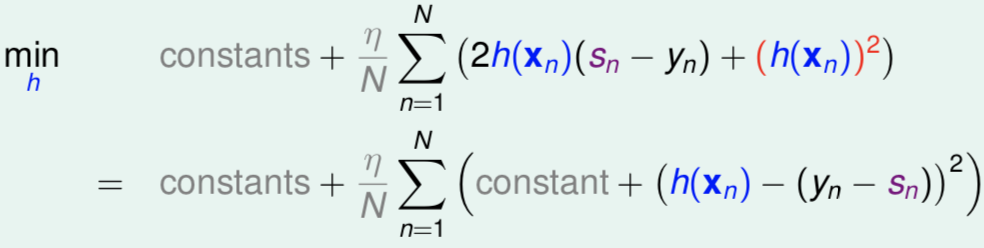

之所以使用平方惩罚项，是因为这样的可以把优化目标构造成平方误差的形式，使得优化问题被转化成在$\{x_n, y_n - s_n\}$上的平方误差回归问题。其中$y_n - s_n$ 是我们熟悉的需要改进的量——余数或残差（residuals）

接下来就是解出最优的$\eta​$ ，我们也可以将其构造成回归问题：

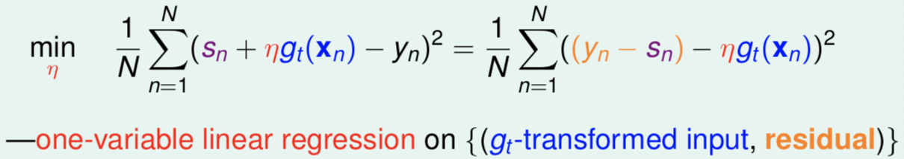

当然，这个回归问题是有解析解的：

$\eta = \frac{\sum\limits_{n=1}^Ng_t(x_n)(y_n-s_n)}{\sum\limits_{n=1}^Ng_t^2(x_n)}$

从这里我们可以看出：

总的算法流程就是：

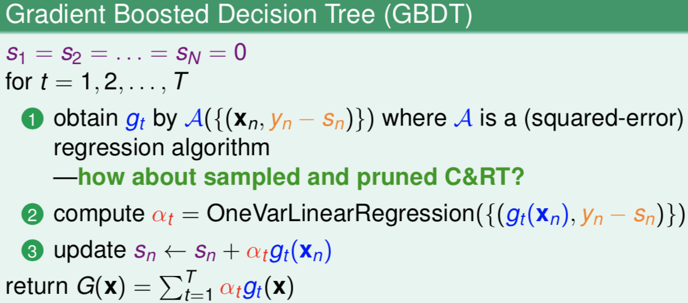

### Summary of Aggregation Models

混合模型（Blending Models）的大纲：

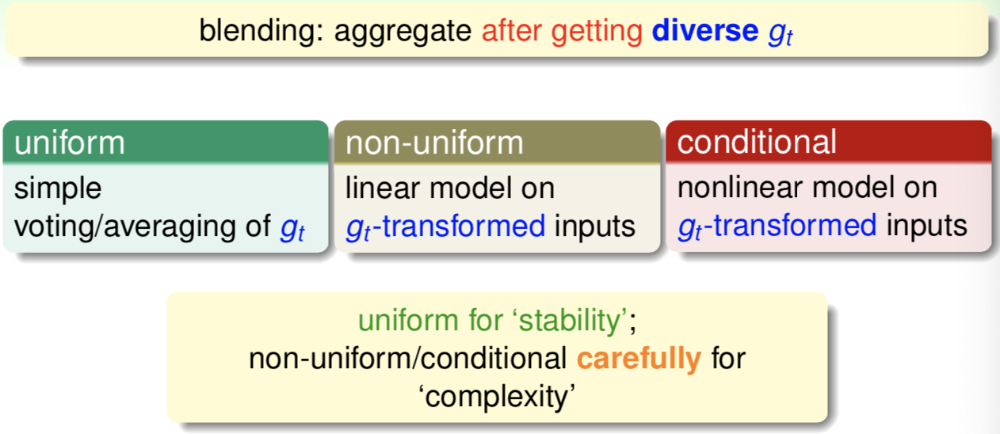

集成模型（Aggregation-Learning Models）的大纲

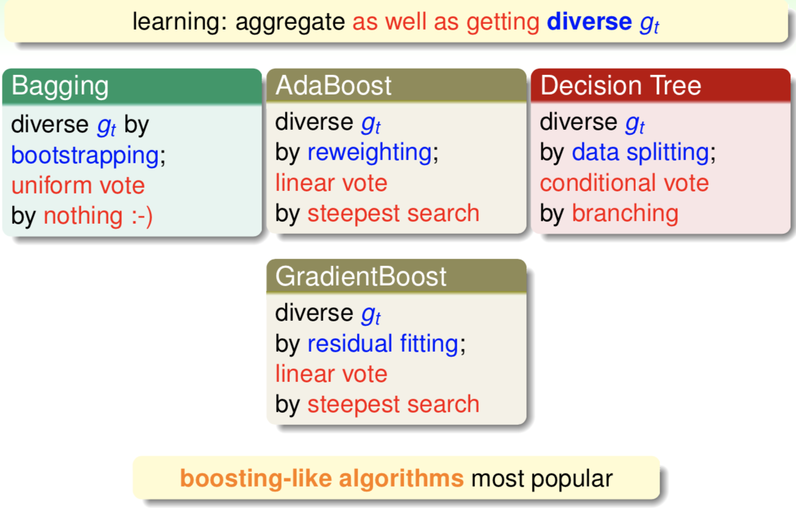

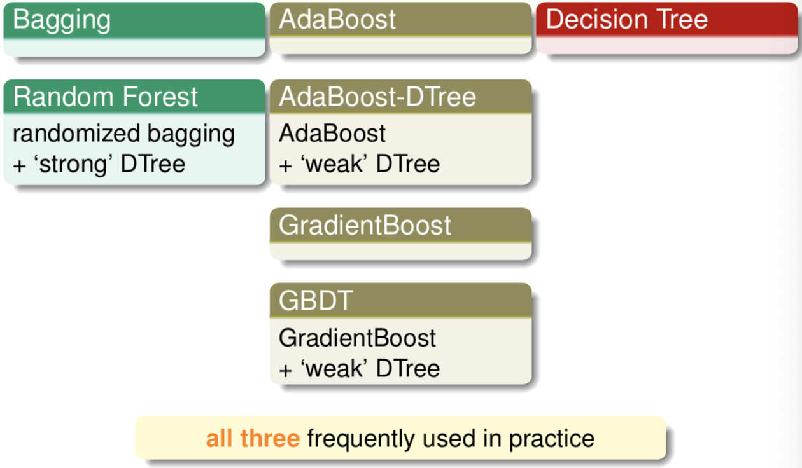

继承学习的优势：

- 解决欠拟合的问题：通过集成做了feature transform
- 解决过拟合的问题：通过继承做了regularization（增大间隔）

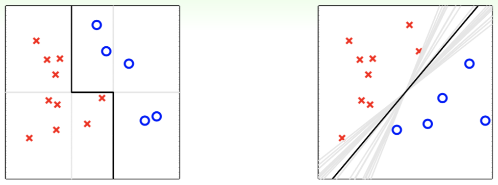

# Distilling Implicit Features: Extraction Models

## Neural Network

