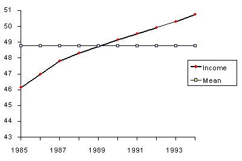
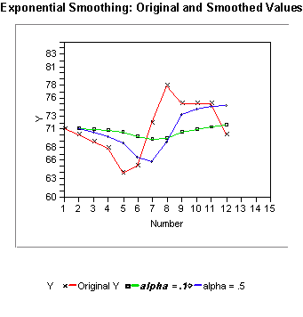
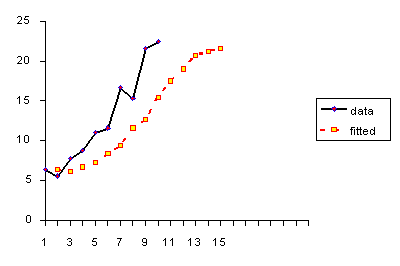
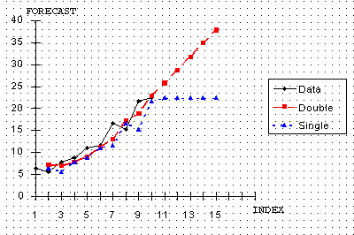
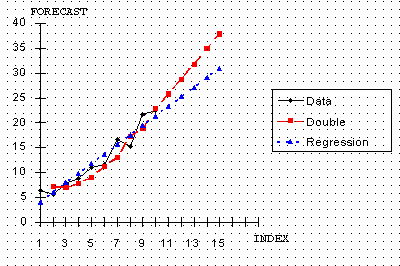

# Introduction to Time Series Analysis

[原文链接](https://www.itl.nist.gov/div898/handbook/)

当监视工业过程或跟踪公司业务指标时，通常会出现时间序列数据。 通过时间序列方法或使用本章前面讨论的过程监视方法对数据建模之间的本质区别如下：

时间序列分析说明了以下事实：随着时间的推移获取的数据点可能具有应考虑的内部结构（例如自相关，趋势或季节变化）。

```
时间序列方法考虑了数据中可能的内部结构。
```

本节将简要概述在时间序列建模和分析的丰富且快速增长的领域中一些更广泛使用的技术。

## Definitions, Applications and Techniques

**定义**：等距时间间隔的有序变量值序列。

```
在查看工业数据时，时间序列经常出现。
```

**应用**：时间序列模型的用法有两个：

- 了解产生观察数据的潜在forces和结构

- 拟合模型并进行预测，监视甚至进行反馈和前馈控制

时间序列分析可用于许多应用程序，例如：

- 经济预测

- 销售预测

- 预算分析

- 股票市场分析

- 产量预测

- 工艺与质量控制

- 库存研究

- 工作量预测

- 效用研究

- 人口普查分析

还有很多...

```
有许多用于建模和预测时间序列的方法。
```

**技术**：拟合时间序列模型可能是一项艰巨的任务。模型拟合的方法很多，包括以下几种：

- Box-Jenkins ARIMA模型

- Box-Jenkins多元模型

- Holt-Winters指数平滑（单，双，三重）

用户的应用程序和偏好将决定适当技术的选择。涵盖所有这些方法超出了本手册作者的范围和意图。此处介绍的概述将从一些基本的平滑技术开始：

- 平均方法

- 指数平滑技术。

在本节的稍后部分，我们将讨论Box-Jenkins建模方法和多元时间序列。

### What are Moving Average or Smoothing Techniques?

```
平滑数据可以消除随机变化，并显示趋势和周期成分。
```

随时间推移收集的数据中固有的某种形式是随机变化。存在减少由于随机变化而抵消效果的方法。工业上经常使用的技术是“平滑”。如果正确应用此技术，则可以更清楚地揭示潜在趋势，季节性和周期性成分。

有两组不同的平滑方法

- 平均方法

- 指数平滑法

```
取平均值是使数据平滑的最简单方法。
```

我们将首先研究一些取平均值的方法，例如所有过去数据的“简单”平均值。
仓库的经理想知道一个典型的供应商以1000美元为单位交付的产品的数量。他/她随机抽取了12个供应商的样本，获得以下结果：

| Supplier | Amount |
| -------- | ------ |
| 1        | 9      |
| 2        | 8      |
| 3        | 9      |
| 4        | 12     |
| 5        | 9      |
| 6        | 12     |
| 7        | 11     |
| 8        | 7      |
| 9        | 13     |
| 10       | 9      |
| 11       | 11     |
| 12       | 10     |

数据的计算平均值或平均值=10。经理决定将其用作典型供应商的支出估算。

这是不是一个好的估计呢？

```
均方误差是一种判断模型的良好程度的方法。
```

我们将计算“均方误差”：

- The "error" = 花费的真实金额减去估算金额

- The "error squared" 是上面计算的误差的平方

- "SSE" 是平方误差的总和

- "MSE" 是平方误差的平均值

以MSE结果为例，结果为：

**误差和平方误差**

估计= 10

| Supplier | $    | Error | Error Squared |
| -------- | ---- | ----- | ------------- |
| 1        | 9    | -1    | 1             |
| 2        | 8    | -2    | 4             |
| 3        | 9    | -1    | 1             |
| 4        | 12   | 2     | 4             |
| 5        | 9    | -1    | 1             |
| 6        | 12   | 2     | 4             |
| 7        | 11   | 1     | 1             |
| 8        | 7    | -3    | 9             |
| 9        | 13   | 3     | 9             |
| 10       | 9    | -1    | 1             |
| 11       | 11   | 1     | 1             |
| 12       | 10   | 0     | 0             |

SSE = 36，MSE = 36/12 = 3。

那么，每个供应商所花费金额的估计值有多好？让我们将估计值（10）与以下估计值进行比较：7、9和12。也就是说，我们估计每个供应商将花费7美元，或9美元或12美元。

执行相同的计算，我们得出：

| Estimator | 7    | 9    | 10   | 12   |
| --------- | ---- | ---- | ---- | ---- |
| SSE       | 144  | 48   | 36   | 84   |
| MSE       | 12   | 4    | 3    | 7    |

MSE最小的估算器是最好的。从数学上可以证明，使一组随机数据的MSE最小化的估算器是平均值。

接下来，我们将检查均值，以查看其对一段时间内净收入的预测情况。

下表列出了1985年至1994年之间PC制造商的税前收入。

| Year | $ (millions) | Mean   | Error  | Squared Error |
| ---- | ------------ | ------ | ------ | ------------- |
| 1985 | 46.163       | 48.676 | -2.513 | 6.313         |
| 1986 | 46.998       | 48.676 | -1.678 | 2.814         |
| 1987 | 47.816       | 48.676 | -0.860 | 0.739         |
| 1988 | 48.311       | 48.676 | -0.365 | 0.133         |
| 1989 | 48.758       | 48.676 | 0.082  | 0.007         |
| 1990 | 49.164       | 48.676 | 0.488  | 0.239         |
| 1991 | 49.548       | 48.676 | 0.872  | 0.761         |
| 1992 | 48.915       | 48.676 | 0.239  | 0.057         |
| 1993 | 50.315       | 48.676 | 1.639  | 2.688         |
| 1994 | 50.768       | 48.676 | 2.092  | 4.378         |

MSE = 1.8129。

问题出现了：如果我们假设存在趋势，可以使用均值来预测收入吗？看下面的图表可以清楚地看出我们不应该这样做。

```
当存在趋势时，均值不是一个好的估计器。
```



```
平均值将所有过去的观察结果等量齐观。
```

总之，我们指出

1. 所有过去观察值的“简单”平均值或平均值仅是在没有趋势时用于预测的有用估计。如果存在趋势，请使用将趋势考虑在内的不同估计值。

2. 平均值将所有过去的观察结果等量齐观。例如，值3、4、5的平均值为4。我们当然知道，平均值是通过将所有值相加并将总和除以值的数量来计算的。计算平均值的另一种方法是将每个值除以值的数量，或者
   3/3 + 4/3 + 5/3 = 1 + 1.3333 + 1.6667 = 4。
   乘数1/3称为权重。一般地：

   $\bar{x} = \frac{1}{n}\sum\limits_{i=1}^n x_i = (\frac{1}{n})x_1 + (\frac{1}{n})x_2 + ... + (\frac{1}{n})x_n$

   （$\frac{1}{n}$）是权重，它们的总和为1。

#### Single Moving Average

```
取移动平均值是一个平滑过程。
```

总结过去数据的另一种方法是如下计算过去数据的连续较小集合的平均值。

回忆数字9、8、9、12、9、12、11、7、13、9、11、10的集合，它们是随机选择的12个供应商的美元金额。 让我们设置“较小集合”的大小N为3。然后，前3个数字的平均值为：（9 + 8 + 9）/ 3 = 8.667。

这称为“平滑”（即某种形式的平均）。 通过不断移动滑动窗口可以继续此平滑过程。

移动平均示例下表总结了该过程，称为移动平均。 移动平均值的一般表达式为

$M_t = \frac{X_t + X_{t-1} + ... + X_{t-N+1}}{N}$

**滑动平均值的结果**

| Supplier | $    | MA     | Error  | Error squared |
| -------- | ---- | ------ | ------ | ------------- |
| 1        | 9    |        |        |               |
| 2        | 8    |        |        |               |
| 3        | 9    | 8.667  | 0.333  | 0.111         |
| 4        | 12   | 9.667  | 2.333  | 5.444         |
| 5        | 9    | 10.000 | -1.000 | 1.000         |
| 6        | 12   | 11.000 | 1.000  | 1.000         |
| 7        | 11   | 10.667 | 0.333  | 0.111         |
| 8        | 7    | 10.000 | -3.000 | 9.000         |
| 9        | 13   | 10.333 | 2.667  | 7.111         |
| 10       | 9    | 9.667  | -0.667 | 0.444         |
| 11       | 11   | 11.000 | 0      | 0             |
| 12       | 10   | 10.000 | 0      | 0             |

MSE = 2.42，前一种情况为3。

#### Centered Moving Average

```
在计算移动平均值时，将平均值放置在中间时间段是有意义的。
```

在前面的示例中，我们计算了前三个时间段的平均时间并将其放置在时间段3的旁边。我们可以将平均值放置在三个时间段的中间时间段的旁边，即将其放置在时间段3的旁边。这对于奇数时间段效果很好，但对偶数时间段效果不太好。 那么，当N = 4时，我们将第一个移动平均线放在哪里？

从技术上讲，移动平均线将落在t = 2.5、3.5，...

为避免此问题，我们使用N = 2来平滑MA的值。因此，我们平滑了平滑后的值！

如果我们平均数为偶数项，则需要对平滑值进行平滑处理下表显示了使用M = 4时的结果。

临时步骤

| Period | Value | MA   | Centered |
| ------ | ----- | ---- | -------- |
| 1      | 9     |      |          |
| 1.5    |       |      |          |
| 2      | 8     |      |          |
| 2.5    |       | 9.5  |          |
| 3      | 9     |      | 9.5      |
| 3.5    |       | 9.5  |          |
| 4      | 12    |      | 10.0     |
| 4.5    |       | 10.5 |          |
| 5      | 9     |      | 10.750   |
| 5.5    |       | 11.0 |          |
| 6      | 12    |      |          |
| 6.5    |       |      |          |
| 7      | 11    |      |          |

这是最终的表

| Period | Value | Centered MA |
| ------ | ----- | ----------- |
| 1      | 9     |             |
| 2      | 8     |             |
| 3      | 9     | 9.5         |
| 4      | 12    | 10.0        |
| 5      | 9     | 10.75       |
| 6      | 12    |             |
| 7      | 11    |             |

**Double Moving Averages for a Linear Trend Process**

```
预测时，移动平均线仍无法处理重大趋势。
```

不幸的是，当用作下一时期的预测时，所有数据的均值或最近的N个值的移动平均值都无法应对重大趋势。

MA程序存在变种，通常可以更好地处理趋势。 线性趋势过程称为双重移动平均线。 它使用相同的N值从原始移动平均值中计算出第二个移动平均值。一旦有单个和两个移动平均值，计算机例程就会使用这些平均值来计算斜率和截距，然后预测一个或多个 未来的时期。

###  What is Exponential Smoothing?

```
指数平滑方案使用指数递减权重对观察值进行加权。
```

这是产生平滑时间序列的非常流行的方案。 在单一移动平均线中，过去的观察值被平均加权，而指数平滑法则随着观察值的变老而分配指数递减的权重。

换句话说，与较旧的观测值相比，最近的观测值在预测中的权重更高。

在移动平均值的情况下，分配给观察值的权重相同，并且等于1 / N。 但是，在指数平滑中，有一个或多个要确定（或估计）的平滑参数，这些选择确定分配给观测值的权重。

单，双和三重指数平滑将在本节中介绍。

#### Single Exponential Smoothing

```
过去观测值的指数平滑权重以指数递减的权重来预测未来值。
```

此平滑方案从将$S_2$设置为$y_1$开始，其中$S_i$表示平滑观测或EWMA，y表示原始观测值。 下标指的是时间段1,2，…，n。 对于第三周期，$S_3 = \alpha y_2 + (1 - \alpha) S_2$； 等等。 没有 $S_1$； 平滑序列从第二个观测值的平滑版本开始。

对于任何时间段t，通过计算可找到平滑值$S_t$

$S_t = \alpha y_{t-1} + (1 - \alpha) S_{t-1} \ \ \ 0 < \alpha \leq 1 \ \ \ t\geq 3$

这是指数平滑的基本方程，常数或参数$\alpha$称为平滑常数。

注意：指数平滑还有另一种方法，用$y_t$代替基本方程式中的$y_{t-1}$（当前观测值）。 正是由于Roberts（1959）的描述，在EWMA控制图上的一节中对此进行了描述。 此处的描述遵循Hunter（1986）。

**Why is it called "Exponential"?**

让我们通过首先用基本方程式中的St-1代替来扩展基本方程式

$S_t$	$ = \alpha y_{t-1} + (1 - \alpha) \ [\alpha y_{t-2} + (1 - \alpha) S_{t-2}]$

​		$ = \alpha y_{t-1} + \alpha(1-\alpha)y_{t-2}+(1-\alpha)^2S_{t-2}$

通过替换为$S{t-2}$，然后替换为$S{t-3}$，依此类推，直到我们达到$S_2$（即$y_1$），可以证明扩展方程可写为：

$S_t$	$ = \alpha \sum\limits_{i=1}^{t-2}(1-\alpha)^{i-1}y_{t-i}+(1-\alpha)^{t-2}S_2, \ \ \ t  \geq 2$

例如，平滑值$S_5$的扩展方程为：
$S_5 =\alpha[(1-\alpha)^0y_{5-1} +(1-\alpha)^1y_{5-2} +(1-\alpha)^2y_{5-3}] +(1-\alpha)^3S_2$

这里说明了指数行为。 权重$\alpha(1-\alpha)^t$呈几何递减关系，其权重之和为1，如下所示，下面使用了几何级数的性质：

$\alpha\sum\limits_{i = 0}^{t-1}(1-\alpha)^i =\alpha[\frac{1-(1-\alpha)^t}{1-(1-\alpha)}] = 1-(1-\alpha)^t$

从最后一个公式中我们可以看到，总和项表明在每个连续的时间段内，对平滑值$S_t$的贡献变小。

令$\alpha = 0.3$。 观察到权重$\alpha(1-\alpha)^t$随时间呈指数（几何）形式下降。

|      | Value | weight |
| ---- | ----- | ------ |
| Last | y1    | 0.2100 |
|      | y2    | 0.1470 |
|      | y3    | 0.1029 |
|      | y4    | 0.0720 |

**What is the "best" value for α?**

较旧的响应被衰减（平滑）的速度是α值的函数。 当α接近1时，阻尼较快；当α接近0时，阻尼较慢。 下表对此进行了说明。

---------------> towards past observations

| $\alpha$ | $(1−\alpha)$ | $(1−\alpha)^2$ | $(1−\alpha)^3$ | $(1−\alpha)^4$ |
| -------- | ------------ | -------------- | -------------- | -------------- |
| 0.9      | 0.1          | 0.01           | 0.001          | 0.0001         |
| 0.5      | 0.5          | 0.25           | 0.125          | 0.0625         |
| 0.1      | 0.9          | 0.81           | 0.729          | 0.6561         |

我们为 $\alpha$ 选择最佳值，从而使MSE最小。

让我们用一个例子来说明这个原理。 考虑以下数据集，该数据集包含12个随时间变化的观察值：

| Time | y_t​  | S(α=0.1) | Error | Error squared |
| ---- | ---- | -------- | ----- | ------------- |
| 1    | 71   |          |       |               |
| 2    | 70   | 71       | -1.00 | 1.00          |
| 3    | 69   | 70.9     | -1.90 | 3.61          |
| 4    | 68   | 70.71    | -2.71 | 7.34          |
| 5    | 64   | 70.44    | -6.44 | 41.47         |
| 6    | 65   | 69.80    | -4.80 | 23.04         |
| 7    | 72   | 69.32    | 2.68  | 7.18          |
| 8    | 78   | 69.58    | 8.42  | 70.90         |
| 9    | 75   | 70.43    | 4.57  | 20.88         |
| 10   | 75   | 70.88    | 4.12  | 16.97         |
| 11   | 75   | 71.29    | 3.71  | 13.76         |
| 12   | 70   | 71.67    | -1.67 | 2.79          |

平方误差的总和（SSE）= 208.94。 平方误差（MSE）的平均值为SSE / 11 = 19.0。

再次针对α= 0.5计算MSE，结果为16.29，因此在这种情况下，我们希望α为0.5。 我们可以做得更好吗？ 我们可以应用经过验证的反复试验方法。 这是一个迭代过程，从0.1到0.9之间的α范围开始。 我们确定α的最佳初始选择，然后在α-Δ和α+Δ之间进行搜索。 我们可能会再重复一次，以找到最佳的α到3个小数位。

```
可以使用非线性优化器。
```

但是有更好的搜索方法，例如Marquardt过程。 这是一个非线性优化器，可最大程度地减少残差平方和。 通常，大多数设计良好的统计软件程序应能够找到使MSE最小化的α值。



#### Forecasting with Single Exponential Smoothing

**Forecasting Formula**

预测公式是基本方程式

$S_{t+1} = \alpha y_t+(1-\alpha)S_t, \ 0 < \alpha \leq 1, \ t > 0$

它还能被写作：

$S_{t+1}=S_t+\alpha\epsilon_t$ 

其中$\epsilon_t$ 是周期t的预测误差（实际-预测）。

换句话说，新的预测是旧的预测加上对上一次预测中发生的错误作出的修正。

```
新的预测是先前的预测加上错误调整。
```

**Bootstrapping of Forecasts**

如果您希望从某个原点（通常是最后一个数据点）进行预测，而没有可用的实际观测值，会发生什么情况？ 在这种情况下，我们必须将公式修改为：

$S_{t+1} = \alpha y_\text{origin}+(1-\alpha)S_t$

其中， $y_\text{origin}$ 保持不变。 这种技术称为自举。

示例上一示例中的最后一个数据点为70，其预测（平滑值S）为71.7。 由于我们确实有可用的数据点和预测，因此我们可以使用具有α= 0.1的常规公式计算下一个预测

$S_{t+1}$	$= \alpha y_\text{origin}+(1-\alpha)S_t$

​			$ = 0.1(70)+0.9(71.7)$

​			$ = 71.5$

但是对于下一个预测，我们没有数据点（观测）。 所以现在我们计算：

$S_{t+2}=0.1(70)+0.9(71.5)=71.35$

**Comparison between bootstrap and regular forecasting**

下表显示了两种方法之间的比较：

| Period | Bootstrap forecast | Data | Single Smoothing Forecast |
| ------ | ------------------ | ---- | ------------------------- |
| 13     | 71.50              | 75   | 71.5                      |
| 14     | 71.35              | 75   | 71.9                      |
| 15     | 71.21              | 74   | 72.2                      |
| 16     | 71.09              | 78   | 72.4                      |
| 17     | 70.98              | 86   | 73.0                      |

**Single Exponential Smoothing with Trend**

有趋势时，单平滑（单指数平滑的缩写）不是很好。 单系数$\alpha$是不够的。
让我们通过以下用0.3平滑的数据集来证明这一点：

| Data | Fit  |
| ---- | ---- |
| 6.4  |      |
| 5.6  | 6.4  |
| 7.8  | 6.2  |
| 8.8  | 6.7  |
| 11.0 | 7.3  |
| 11.6 | 8.4  |
| 16.7 | 9.4  |
| 15.3 | 11.6 |
| 21.6 | 12.7 |
| 22.4 | 15.4 |

结果的图像如下：



#### Double Exponential Smoothing

```
双指数平滑使用两个常数，在处理趋势方面更好。
```

正如之前所观察到的，当出现趋势时，“单一平滑”并不擅长跟踪数据。 这种情况可以通过引入带有第二常数$\gamma$的第二方程来改善，该方程必须与 $\alpha$ 一起选择。

这是与双指数平滑相关的两个方程式。

$S_t = \alpha y_t+(1-\alpha)(S_{t-1}+b_{t-1}) \ \ \ 0\leq \alpha \leq 1$

$b_t = \gamma (S_t - S_{t-1}) + (1-\gamma)b_{t-1} \ \ \ 0\leq \gamma \leq 1$

**Initial Values**

```
有很多种方法选择初始值。
```

与单次平滑的情况一样，有多种方案可以在双次平滑中设置St和bt的初始值。
S1通常设置为y1。 这是b1的三个建议。

- $b_1 = y_2 - y_1$  

- $b_1 = \frac{1}{3}[(y_2-y_1)+(y_3-y_2)+(y_4-y_3)]$

- $b_1=\frac{y_n-y_1}{n-1}$

**Comments**

```
平滑方程的含义
```

第一个平滑方程将前一个周期的趋势$b_t$添加到最后一个平滑值$S_{t-1}$中，从而直接针对$b_t$调整$S_t$。这有助于消除滞后并将$S_t$变为当前值的适当基准。

然后，第二个平滑方程更新趋势，该趋势表示为最后两个值之间的差。 该方程式类似于单次平滑的基本形式，但此处适用于趋势更新。

```
可以使用非线性优化器。
```

可以使用非线性优化技术。可以通过诸如Marquardt算法之类的非线性优化技术来获得α和γ的值。

#### Forecasting with Double Exponential Smoothing(LASP)

下一个时段的预测如下：

$F_{t+1} = S_t + b_t$

未来m个时段的预测公式为：

$F_{t+m} = S_t + mb_t$

**Example**

再次考虑数据集：

6.4, 5.6, 7.8, 8.8, 11, 11.6, 16.7, 15.3, 21.6, 22.4

现在我们将拟合一个具有α= 0.3623和γ= 1.0的双重平滑模型。 这些估算值会在将原始序列与某个时间的预测提前一个步骤进行比较时，导致最低的MSE（由于此版本的双指数平滑使用当前序列值来计算平滑值，因此该平滑序列不能用于 确定具有最小MSE的α）。 选择的起始值 $S_1 = y_1 = 6.4$ 且

$b_1 = ((y_2-y_1)+(y_3-y_2)+(y_4-y_3))/3 = 0.8$

为了进行比较，我们还拟合了一个α= 0.977的单平滑模型（这导致单指数平滑的最低MSE）。

双重平滑的MSE为3.7024。

单次平滑的MSE为8.8867。

该示例的平滑结果是：

| Data | Double                 | Single |
| ---- | ---------------------- | ------ |
| 6.4  | 6.4                    |        |
| 5.6  | 6.6 (Forecast = 7.2)   | 6.4    |
| 7.8  | 7.2 (Forecast = 6.8)   | 5.6    |
| 8.8  | 8.1 (Forecast = 7.8)   | 7.8    |
| 11.0 | 9.8 (Forecast = 9.1)   | 8.8    |
| 11.6 | 11.5 (Forecast = 11.4) | 10.9   |
| 16.7 | 14.5 (Forecast = 13.2) | 11.6   |
| 15.3 | 16.7 (Forecast = 17.4) | 16.6   |
| 21.6 | 19.9 (Forecast = 18.9) | 15.3   |
| 22.4 | 22.8 (Forecast = 23.1) | 21.5   |

**Comparison of Forecasts**

为了查看每种方法如何预测未来，我们从最后一次观察中计算出前五个预测，如下所示：

| Period | Single | Double |
| ------ | ------ | ------ |
| 11     | 22.4   | 25.8   |
| 12     | 22.4   | 28.7   |
| 13     | 22.4   | 31.7   |
| 14     | 22.4   | 34.6   |
| 15     | 22.4   | 37.6   |

这些结果（使用预测的双平滑值）的图表很有启发性。



该图表明，与数据平滑相比，数据平滑更接近两次平滑。 此外，对于预测单个平滑而言，不能比投影一条水平直线更好，这在现实中不太可能发生。 因此，在这种情况下，首选双重平滑。

最后，让我们将双重平滑与线性回归进行比较：



这是一张有趣的图片。 两种技术都以类似的方式跟踪数据，但是回归线较为保守。 也就是说，回归线的增长速度比双重平滑的增长速度慢。

```
技术的选择取决于预报员。
```

如果希望以一种更具侵略性的方式描绘生长过程，则可以选择双重平滑。 否则，回归可能更可取。 应该注意的是，在线性回归中，“时间”用作自变量。 第4章讨论线性回归的基础，以及回归估计的细节。

#### Triple Exponential Smoothing

```
要处理季节性，我们必须添加第三个参数。
```

如果数据显示趋势和季节性会怎样？

在这种情况下，双重平滑将不起作用。 现在，我们引入第三个方程来考虑季节性（有时称为周期性）。以发明者的名字命名，所得的方程组被称为"Holt-Winters" (HW) 方法。

他们的方法的基本公式由下式给出：

$\begin{eqnarray} S_t & = & \alpha \frac{y_t}{I_{t-L}} + (1-\alpha)(S_{t-1}+b_{t-1}) & \,\,\,\,\, &  \mbox{OVERALL SMOOTHING} \\    &   &   &   &  \\ b_t & = & \gamma (S_t - S_{t-1}) + (1 - \gamma)b_{t-1} & & \mbox{TREND SMOOTHING} \\    &   &   &   &  \\ I_t & = & \beta \frac{y_t}{S_t} + (1 - \beta) I_{t-L} & & \mbox{SEASONAL SMOOTHING} \\    &   &   &   &  \\ F_{t+m} & =  & (S_t + m b_t) I_{t-L+m} & & \mbox{FORECAST} \, , \end{eqnarray}$

其中

- y是观测值

- S是平滑的观测值

- b是趋势因子

- I是季节指数

- F是未来m个时段的预测值

- t是表示一个时段的指标

α,β,γ是常数,必须以这样一种方式估计的MSE误差最小化。这最好留给一个好的软件包。

我们需要至少一个完整的季节数据来确定季节指数的初始估计值。

一个完整的季节的数据由L个周期组成。我们需要估计从一个时期到下一个时期的趋势因素。为此，建议使用两个完整的季节;也就是2L个周期。


#### Example of Triple Exponential Smoothing

#### Exponential Smoothing Summary

### Univariate Time Series Models


