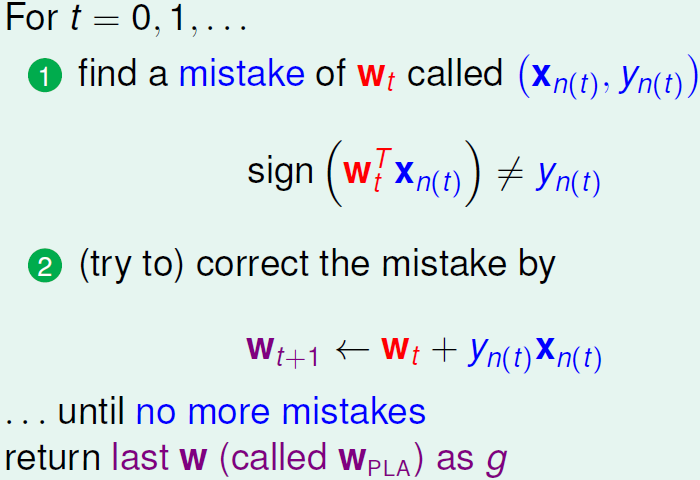
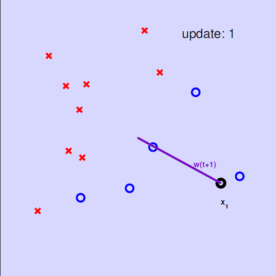
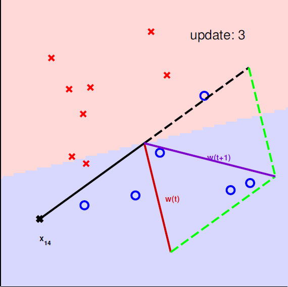
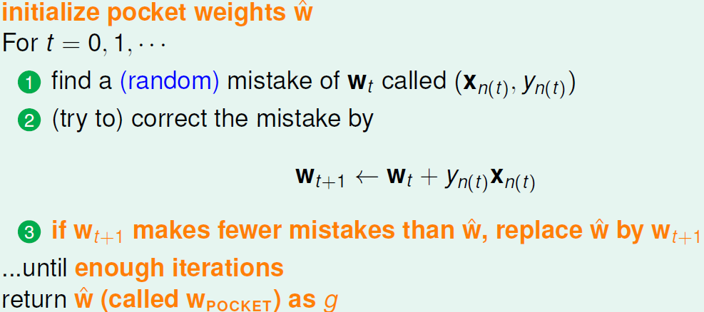
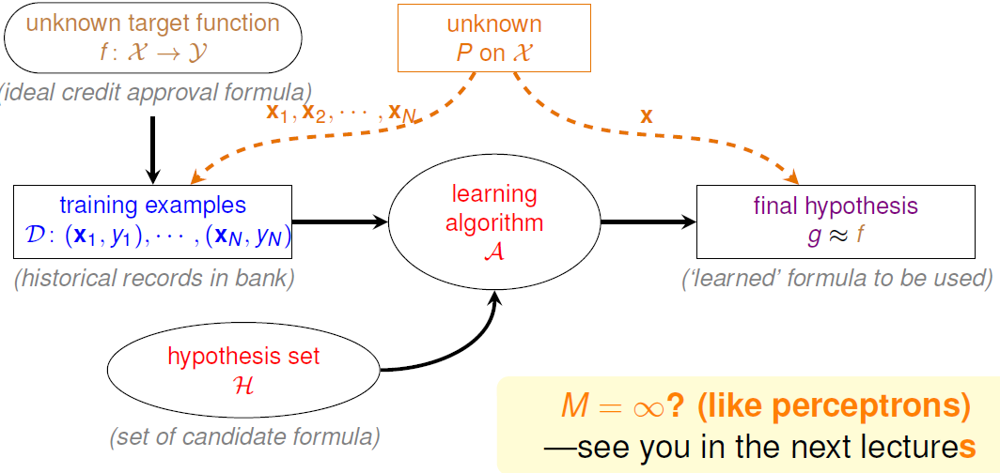

# When Can Machines Learn?

## The Learning Problem

### Introduction

### What is Machine Learning

在人类学习中，通过观察可以学到技能。同样在机器学习中，通过数据可以学到技能

机器学习的定义：利用数据计算改进性能指标

机器学习的例子：利用股票数据预测投资回报

机器学习的使用场景：

1. 当人没办法编写出程序（火星导航）
2. 当人无法轻易的定义解（语音识别）
3. 当需要以超乎常人的速度做出决策（高频交易）
4. 当需要大规模面向用户的时候（面向消费者的营销）

决定是否使用机器学习：

1. 存在隐藏的模式
2. 不存在能够轻易发现的可编程的定义
3. 存在揭示模式的数据

### Applications of Machine Learning

经典应用场景：衣食住行，教育，娱乐

### Components of Machine Learning

机器学习的形式化定义：用数据去计算能够逼近目标函数f的假设函数g

### Machine Learning and Other Fields

机器学习与数据挖掘（在数据中找到有趣的性质）的比较

1. 当“有趣的性质”指的是假设函数时，两者基本是一回事儿
2. 当“有趣的性质”指的是假设函数时，两者相辅相成
3. 传统数据挖掘还要注意大规模计算的效率

机器学习是人工智能（用智能的方式来计算）的一种实现途径

统计学是机器学习的重要工具

## Learning to Answer Yes No

### Perceptron Hypothesis Set

信贷审批问题：通过用户信息预测是否应该给其发放信用卡

使用简单的假设函数集：感知器

对用户的特征$x = (x_1, x_2, ..., x_d)$ 计算一个加权分数：

若$\sum_{i = 1}^dw_ix_i > threshold$，则发放信用卡

若$\sum_{i = 1}^dw_ix_i < threshold$，则不发放信用卡

Y:{+1(good), -1(bad)}（忽略0），该预测函数集中的函数可以表示为

$h(x) = sign((\sum\limits_{i = 1}^dw_ix_i) - threshold)$

更简洁的定义：

$h(x) = sign(w^Tx)$

二维感知器

1. 顾客特征：二维平面上的点
2. 标签y：蓝圈表示+1标签，红叉表示-1标签
3. 预测函数h：直线$h(x) = sign(w_0 + w_1x_1 + w_2x_2)$
4. 不同直线能够做出不同的分类

### Perceptron Learning Alforithm

从H中选择出g

1. 至少满足在D上 $g \approx f$
2. 理想情况下$g(x_n) = f(x_n) = y_n$
3. 难度：H有无限多的元素
4. idea：从$g_0$开始，不断修正误差

感知器学习算法：从$w_0$ 开始，不断在D上修正误差

修正的方法：让w向x的方向偏转

遍历所有的点（或随机访问所有点），以做修正

可视化的更新过程

### Guarantee of PLA

若PLA停止时，则D能够让某些w没有误差，这样的D被称为线性可分的（PLA总是可以停止的吗？）

D线性可分 <=> 存在完美的$w_f$使得$y_n = sign(w_f^Tx_n)$

<=> $y_{n(t)}w_f^Tx_{n(t)} \geq \min\limits_n y_nw_f^Tx_n > 0$ （所有的点都被分类正确）

 $w_f^Tw_{t + 1} = w_f^T(w_t + y_{n(t)}x_{n(t)}) \geq w_f^Tw_t + \min\limits_ny_nw_f^Tx_n > w_f^Tw_t + 0$ （讨论$w_f$和$w_t$的关系，看它们接不接近）

 因此不论使用什么数据点来更新，$w_f^Tw_t$ 都会增大（所以$w_f$ 和$w_t$ 就会越来越接近吗？有没有可能是向量长度增大的影响？）

$w_t$仅当有误差的时候才发生变化 <=> $sign(w_t^Tx_{n(t)}) \neq y_{n(t)}$ <=> $y_{n(t)}w_t^Tx_{n(t)} \leq 0$

$||w_{t + 1}||^2 = ||w_t + y_{n(t)}x_{n(t)}||^2 = ||w_t||^2 + 2y_{n(t)}w_t^Tx_{n(t)} + ||y_{n(t)}x_{n(t)}||^2$

$ \leq ||w_t||^2 + 0 + ||y_{n(t)} x_{n(t)}||^2$ （根据上面的不等式）

$\leq ||w_t||^2 + \max\limits_n||y_nx_n||^2$ （即使是用长度最长的$x_n$ 来更新，$||w_t||^2$ 的增长也要受到误差的限制）

从$w_0$开始，经过T次误差修正，

$\frac{w_f^Tw_T}{||w_f|| \ ||w_T||} \geq \sqrt{T} \cdot constant$

迭代次数T的上界是$\frac{R^2}{\rho^2}$，其中$R^2 = \max\limits_n||x_n||^2, \rho = \min\limits_ny_n\frac{w_f^T}{||w_f||}x_n$

### Non-Separable Data

总结：只要数据线性可分，且按照误差来修正w

1. $w_f$和$w_t$的内积增长迅速，而$w_t$的长度增长缓慢
2. PLA直线会越来越贴近$w_f$，直到收敛

优点：PLA很容易实现，而且对于任意的维数d有效

缺点：

1. 假设D线性可分（而这通常是不知道的），算法才能停止
2. 不知道算法何时能停止（虽然在实际中总是很快）

（怎样在D有噪音的情况下令$g \approx f$ ？）

具有容错性的直线：

1. 假设噪音很少
2. 那么在D上 $g \approx f$ <=> 通常有$y_n = g(x_n)$
3. $w_g = \min\limits_w \sum\limits_{n = 1}^N [y_n \neq sign(w^Tx_n)]$
4. 这个优化问题是NP-hard问题

（能够修改PLA来得到近似最好的g？）

Pocket Algorithm：维护最佳直线（贪心）

Pocket比PLA要慢（要检查w的好坏）

## Types of Learning

### Learning with Different Output Space

### Learning with Different Data Label

### Learning with Different Protocal

### Learning with Different Input Space

## Feasibility of Learning

### Learning is Impossible

天下没有免费的午餐：

1. 在D中 $g \approx f$ 是可能的
2. 不在D中 $g \approx f$ 看上去是不可能的（当f有未知部分的时候）

### Probability to the Rescue

（学习看似是不可能的，但在其它场景下我们能否推断出一些未知的信息？）

罐子模型：

1. 罐子中有许多橘球和绿球
2. 我们能否知道橘球的比例？

罐子中橘球的概率是$\mu$

抽出的样本中橘球的概率是$\nu$

（能否根据$\nu$推断出$\mu$？）

霍夫丁（Hoeffding's Inequality）不等式：

$P[|\nu - \mu| > \epsilon] \leq 2 e^{-2\epsilon^2N}$

1. $\nu = \mu$ 是PAC的（probably approximately correct）
2. 对于任意的N和$\epsilon$ 都是成立的
3. 不依赖于特定的 $\mu$
4. 很大的N或者很松的$\epsilon$ => 有很大的概率$\nu \approx \mu$

### Connection to Learning

罐子模型和学习的联系

若N非常大，且$x_n$ 是独立同分布的，那么很可能能通过[$h(x_n) \neq y_n$]推断出[$h(x) \neq f(x)$]

将分布加入到机器学习的形式化定义中。意思是，如果我们想知道g在世界上所有数据中的表现（那些数据预测对，哪些数据预测错）的话，可以通过抽样（训练集）来估计。这里的分布指的是，g能预测对的数据在世界上所有数据中的分布。

对于任何固定的h，我们能够通过已知的抽样误差 $E_{in}(h) = \frac{1}{N} \sum\limits_{n = 1}^N[h(x_n \neq y_n)]$的来推断未知的实际误差 $E_{out}(h) = \epsilon_{x \sim P}[h(x) \neq f(x)]$

形式化保证

同罐子模型中的霍夫丁不等式类似

1. 对于所有N和$\epsilon$ 都适用
2. 不依赖于或无需知道$E_{out}(h)$
3. f和P都可以是未知的
4. $E_{in}(h) = E_{out}(h)$ 是PAC的

若$E_{in}(h) \approx E_{out}(h)$ 且 $E_{in}(h)$ 很小 => $E_{out}(h)$ 很小 => $h \approx f$  关于P成立

（对于给定的h，当数据集很大的时候$E_{in}(h) \approx E_{out}(h)$ ，能代表这是好的学习吗？不能，这只是在做验证，在真正的学习中A要在H中做选择）

### Connection to Real Learning

$E_{in}$和$E_{out}$ 在h的选择很多时相距甚远的例子：150个人，每人投5枚硬币，总有人会投出5个正面

对于一个h而言，不好的数据是让$E_{in}$和$E_{out}$ 相距甚远的数据集（比如前者大而后者小）

$P_D[BAD \ D] = \sum\limits_{all \ possible \ D} P(D) \cdot [BAD \ D]$

对于很多h而言，坏数据是指存在h使得上述坏数据存在的数据集（于是A就不能安全地做选择）

对很多h而言遇到坏数据的上界是

上式说明了

1. 对于有限M的版本的霍夫丁不等式，任意的M，N和$\epsilon$ 都有效
2.  不依赖于或无需知道$E_{out}(h_m)$
3. f和P都可以是未知的
4. 无论A是什么，$E_{in}(h) = E_{out}(h)$ 都是PAC的

结论：最合理的A会选择使得$E_{in}(h_m)$最小的$h_m$作为g

统计学习流程

