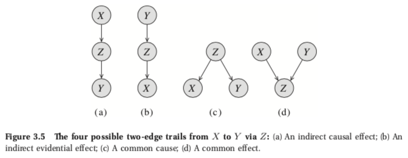

# 2 基础

## 2.1 概率论

### 2.1.1 概率分布

### 2.1.2 概率论的基本概念

### 2.1.3 随机变量与联合分布

#### 2.1.3.4 条件概率

条件概率的概念扩展到随机变量上的诱导分布。 例如，假设学生的成绩为A，我们使用符号$P(Intelligence\mid Grade = A)$来表示Intelligence所描述的事件的条件分布。请注意，在观察到该变量的情况下，随机变量的条件分布 另一个值与边际分布不同。 在我们的示例中，P（智力=高）= 0.3，而P（智力=高|等级= A）= 0.18 / 0.25 = 0.72。 因此，显然P（智能|等级= A）与边际分布P（智能）不同。 后者的分布表示我们在学习某个特定学生的其他知识之前对学生的先验知识，而条件分布则表示我们在学习了她的成绩后更加知情的分布。

我们将经常使用符号$P(X \mid Y)$表示一组条件概率分布。 直观地，对于每个Y值，此对象使用条件概率在X值上分配概率。 这种表示法使我们可以写出链式法则的简单形式：$P(X, Y) = P(X) P(Y \mid X)$，它可以扩展到多个变量的情况

$P(X_1, \cdots, X_k) = P(X_1)P(X_2\mid X_1)\cdots P(X_k\mid X_1, \cdots, X_{k-1}) \tag{2.5}$

同样，我们可以根据条件概率分布来陈述贝叶斯规则：

$P(X\mid Y) = \frac{P(X)P(Y\mid X)}{P(Y)} \tag{2.6}$

### 2.1.4 独立与条件独立

#### 2.1.4.1 独立

正如我们所提到的，我们常常希望$P(\alpha|\beta)$ 与$p(\alpha)$ 不相等。也就是说，观察到$\beta$ 事件发生改变了我们所知的$\alpha$ 的概率。但是，在某些情况下，相等的也是会发生的，即 $P(\alpha|\beta)=P(\alpha)$ 。也就是说，观察到$\beta$ 事件发生无法改变我们所知的$\alpha$ 的概率。

（**定义2.2**：独立事件）若$P(\alpha|\beta)=P(\alpha)$ 或$P(\beta)=0$ ，则我们说对于概率分布P，事件 $\alpha$ 与事件 $\beta$ 相互独立，记作$P \models (\alpha \perp \beta)$ 

我们还能为独立性提供另一个定义：

（**命题2.1**）一个分布P满足$\alpha \perp \beta$ 当且仅当 $P(\alpha \cap \beta) = P(\alpha) P(\beta)$

证明：略

这个定义告诉我们，独立是一个对称的记号，也就是说，$(\alpha \perp \beta)$ 暗示了 $(\alpha \perp \beta)$

（例2.3）例如，假设我们扔了两个硬币，并且让α为事件“第一次扔的结果是硬币向上”，而β为事件“第二次扔的结果是硬币向上。不难说服自己我们期望这两个事件是相互独立的。 知道β为真不会改变我们的α概率。 在这种情况下，我们看到导致事件发生的两个不同的物理过程（即抛硬币），这使我们很直观地看出两者的概率是独立的。 在某些情况下，相同的过程可能导致独立事件。 例如，考虑事件α表示“骰子结局是偶数”，而事件β表示“骰子结局是1或2”。很容易检查骰子是否公平（六个可能结果中的每一个都有概率 1），那么这两个事件是独立的。

#### 2.1.4.2 条件独立

尽管独立是有用的属性，但我们很少会遇到两个独立事件。 更为常见的情况是，在给定一个附加事件的情况下两个事件是独立的。 例如，假设我们要对学生被斯坦福大学或麻省理工学院录取的机会进行推理。 由Stanford表示事件是“斯坦福大学”（Stanford）入学，由MIT表示是“麻省理工学院（MIT）”入学。在大多数合理的发行中，这两个事件不是独立的。 如果我们得知某个学生被斯坦福大学录取，那么我们对她被麻省理工学院录取的可能性的估计现在更高，因为这表明她是一个很有前途的学生。

现在，假设两所大学的决策均仅基于学生的平均绩点（GPA），并且我们知道我们的学生的GPA为A。在这种情况下，我们可能会争辩说，得知该学生被斯坦福大学录取不会改变她被麻省理工学院录取的可能性：她的GPA已经告诉我们与她被麻省理工学院录取机会相关的信息，而了解她被斯坦福大学录取的情况也不会改变。 正式的陈述是

$P(MIT\mid Stanford,GradeA)=P(MIT\mid GradeA)$

在这种情况下，我们说在给定GradeA时MIT条件独立于Stanford。

**（定义2.3**：条件独立）若$P(\alpha\mid\beta\cap\gamma)=P(\alpha\mid\gamma)$ 或 $P(\beta \cap \gamma)=0$ ，则我们说对于概率分布P，在给定事件$\gamma$ 的结果后，事件 $\alpha$ 条件独立于事件 $\beta$ 

很容易扩展我们在（无条件）独立性情况下所看到的论据，以给出另一个定义。

（**命题2.2**）一个分布P满足$(\alpha \perp \beta \mid \gamma)$ 当且仅当 $P(\alpha \cap \beta) = P(\alpha\mid\gamma) P(\beta\mid\gamma)$

#### 2.1.4.3 随机变量的条件独立

到目前为止，我们一直专注于事件之间的独立性。 因此，我们可以说两个事件是独立的，例如一个投掷正面向上，第二个投掷也正面向上。 但是，我们想说抛硬币的任何结果都是独立的。 为了捕获此类陈述，我们可以检查独立性对随机变量集的概括。

**（定义2.4**：条件独立，边际独立）令X，Y，Z为随机变量集。若对于任意的$x \in Val(X)，y \in Val(Y), z \in Val(Z)$ ，分布P满足$(X = x \perp Y = y\mid Z = z)$，则我们说对于给定的服从分布P的Z，X条件独立于Y。 集合Z中的变量常被称作是可观察的。 若将Z设置为空集，则应书写成$(X \perp Y)$而不是$(X \perp Y\mid \empty)$，并称X和Y在边际上是独立的。

因此，对随机变量的独立性声明是对随机变量所有可能值的通用量化。

条件独立性的另一个定义随即出现：

（**命题2.3**）一个分布P满足$(X \perp Y \mid Z)$ 当且仅当 $P(X, Y) = P(X\mid Z) P(Y\mid Z)$

假如我们已经了解条件独立了，我们能否总结出分布中也必须成立的其它独立性？我们已经看过这个例子：

- 对称性：

  $(X \perp Y\mid Z) \Rightarrow (Y\perp X \mid Z) \tag{2.7}$

还有其他一些性质可以满足条件独立性，并且通常为证明分布的重要性质提供了一种非常干净的方法。 一些关键性质是：

- 分解性

  $(X\perp Y,W\mid Z)\Rightarrow(X\perp Y\mid Z) \tag{2.8}$

- Weak union:

  $(X\perp Y,W\mid Z)\Rightarrow(X\perp Y\mid Z,W) \tag{2.9}$

- Contraction:

  $(X\perp W\mid Z, Y)\&(X\perp Y \mid Z)\Rightarrow(X\perp Y, W\mid Z) \tag{2.10}$

附加的重要属性通常不成立，但确实存在于分布的重要子类中。

（**定义2.5** 正分布）若对所有满足$\alpha \ne \empty$ 的事件 $\alpha \in S$ 有 $P(\alpha)>0$ ，则我们说分布P是正的。 

对于正分布，我们有以下性质：

- Intersection: 对于正分布，以及对于互不相交的集合X，Y，Z，W：

  $(X\perp Y\mid Z,W)\&(X\perp W\mid Z,Y)\Rightarrow (X\perp Y,W\mid Z) \tag{2.11}$

这些性质的证明并不困难。 例如，为证明分解性，假定$(X\perp Y,W\mid Z)$成立。 然后，根据条件独立性的定义，我们得到$P(X,Y,W\mid Z)= P(X\mid Z)  P(Y,W\mid Z)$。 现在，使用概率和算术的基本规则，我们可以进行演算

$P(X,Y\mid Z)$  $=\sum\limits_wP(X,Y,w\mid Z)$

​						$=\sum\limits_wP(X\mid Z)P(Y,w\mid Z)$

​						$=P(X\mid Z)\sum\limits_wP(Y,w\mid Z)$

​						$=P(X\mid Z)P(Y\mid Z)$

我们在这里使用的唯一性质被称为"reasoning by cases"（请参阅练习2.6）。 我们得出结论$(X\perp Y\mid Z)$。

### 2.1.5 查询一个分布

### 2.1.6 连续空间

### 2.1.7 期望与方差

## 2.2 图论

### 2.2.1 点和边

图(graph)是由一组节点(node)和一组边(edge)组成的数据结构K。在本书的大部分内容中，我们都假定节点集为$X = \{X_1, \dots, X_n\}$。一对节点$X_i, X_j$可以通过有向边$Xi\rightarrow X_j$或无向边$X_i - X_j$连接。因此，边集 $E$ 是节点对的集合，其中每个节点对为$X_i\rightarrow X_j，X_j\rightarrow X_i$ ，或 $X_i-X_j$。在整本书中，我们假设，对于每对节点$X_i，X_j$，最多存在一种边类型；因此，我们既不能同时拥有$X_i\rightarrow X_j$和$Xj→Xi$，也不能同时拥有$X_i\rightarrow X_j$和$X_i - X_j$。记号$X_i\leftarrow X_j$ 等效于 $X_j\rightarrow X_i$，而记号$X_j - X_i$等效于$X_i - X_j$ 。我们使用$X_i\rightleftharpoons 􏰱X_j$表示$X_i$和$X_j$通过某个边（无论是有向（沿任何方向）还是无向）连接的情况。

在许多情况下，我们希望将注意力集中在仅包含一种或另一种边的图上。我们说如果图上的所有边都是$X_i\rightarrow X_j$ 或 $X_j\rightarrow X_i$则图是有向的(directed)。我们通常将有向图表示为G。我们说如果所有边均为$X_i - X_j$，则图是无向的(undirected)。我们将无向图表示为H。有时，我们通过忽略边的方向将普通图转换为无向图。

（**定义2.11** 图的无向表示）给定一个图$K = (X, E)$ ，它的无向表示(undirected version)是一个图$H = (X, E')$ ，其中$E' = \{X-Y:X\rightleftharpoons Y \in E\}$ 。

当我们有$X_i\rightarrow X_j\in E$ 时 ，我们就说$X_j$ 是$X_i$ 在K中的的子节点(child)，当我们有$X_i- X_j\in E$ 时 ，我们就说$X_j$ 是$X_i$ 在K中的的邻居节点(neighbors)，反之亦然。当$X \rightleftharpoons Y\in E$ 时我们说X和Y时邻接(adjcent)的。我们用$Pa_X$ 来表示X的父节点，$Ch_X$ 表示它的子节点，$Nb_X$  表示它的邻居节点。我们将X的界(boundary)定义为$Pa_X \cup Nb_X$ ，用$Boundary_X$ 来表示；对于DAG而言，这个集合只是X的父节点，对无向图而言，这个集合是X的邻居节点。图2.3是图K的一个例子。其中，我们可以看出A是C唯一的父节点，F, I 是C的子节点。C唯一的邻居借点是D，但它的邻接节点是A, D, F, I。点X的度数(degree)是与点相连的边的个数。X的入度(indegree)是有向边$Y \rightarrow X$ 的个数。图的度数指的是图中点的度数的最大值。

### 2.2.2 子图

在许多情况下，我们只想考虑图中与节点的特定子集相关联的部分。

（**定义2.12** 导出子图）令$K = (\mathcal{X}, E)$，且$\mathbf{X} \sub \mathcal{X}$ ，我们将图($\mathbf{X}, E'$)定义为导出子图(induced subgraph) $K[\mathbf{X}]$ 。其中E'是所有满足$X, Y \in \mathbf{X}$ 的边$X \rightleftharpoons Y \in E$ 。

例如，图2.4a展示的就是导出子图K[C, D, I]。

我们常常会关注一种特定的将所有可能的边都包含的子图。

（**定义2.13** 完全子图）当在 $\mathbf{X}$ 上的子图中，任意两个节点都有边相连，则该子图是完全的(complete)。其中点集 $\mathbf{X}$ 常常被称作团(clique)；当不存在任何节点超集$\mathbf{Y} \supset \mathbf{X}$ ，使得Y不是一个团时，我们说团$\mathbf{X}$时最大的。

尽管节点$\mathbf{X}$ 的子集可以是任意的，但我们通常对保留图结构的某些方面的节点集感兴趣。

（**定义2.14** 上闭包）$\mathbf{X}$ 是图中节点集合的子集，若对于任意的$X \in \mathbf{X}$ 我们有$Boundary_X \sub \mathbf{X}$ ，我们就说$\mathbf{X}$ 在图K中是上闭合(upwardly closed)的。我们将包含$\mathbf{X}$的最小上闭合子点集$\mathbf{Y}$定义为$\mathbf{X}$ 的上闭包(upward closure)。我们将上述$\mathbf{Y}$上的导出子图$K[\mathbf{Y}]$定义为$\mathbf{X}$ 的上闭合子图(upwardly closed subgraph)，记为$K^+[\mathbf{X}]$ 。

例如，集合A，B，C，D，E是K中集合{C}的上闭包。{C}的上闭合子图如图2.4b所示。 {C，D，I}的上闭合子图如图2.4c所示。

### 2.2.3 路径与轨迹

使用边的基本概念，我们可以在图中定义不同类型的长连接(longer-range connections)。

（定义2.15 路径）若对任意$i = 1, \dots, k - 1$ 我们都有$X_i \rightarrow X_{i+1}$ 或$X_i - X_{i+1}$ ，则我们说$X_1, \dots X_k$ 构成图K = (X, E)中的路径。当至少有一个i使得$X_i \rightarrow X_{i+1}$ 存在时，这个路径是有向的。

（定义2.16 轨迹）若对任意$i = 1, \dots, k - 1$ 我们都有$X_i \rightleftharpoons X_{i+1}$ ，则我们说$X_1, \dots X_k$ 构成图K = (X, E)中的轨迹。

（定义2.17 连通图）若对图上任意$X_i, X_j$ 都存在一个介于它们之间的轨迹，则我们说这个图是联通的。

现在我们能够定义图中的长关系(longer-range relationships)了。

（定义2.18 祖先，后代）若图K = (X, E)中存在一个有向路径$X_1, \dots, X_k$ ，且$X_1 = X, X_k = Y$，我们就说X是Y的祖先，Y是X的后代。我们使用$Descendants_X$ 来表示X的后代，$Ancestors_X$ 来表示X的祖先，$NonDescendants_X$ 来表示集合$X - Decendants_X$中的点。

再我们的例图K中，我们有F, G, I是C的后代，C的祖先是A（通过路径A, C）和B（通过路径B, E, D, C）。

最后一个有用的概念是有向图中与其边的方向性一致的节点的排序。

（定义2.19 拓扑序）令G = (X, E)为一个图，若对$X_1, \dots, X_n$ 中的任意$X_i \rightarrow X_j \in E$ 都有i < j，则我们说$X_1, \dots, X_n$构成了相对于K的拓扑序。

Appendix A.3.1给出了一个求拓扑序的算法。

### 2.2.4 圈和环

# Part I - 表示

# 3 贝叶斯网络表示

我们的目标是要表示一组随机变量$X = \{X_1, ..., X_n\}$上的联合分布P。即使在最简单的情况下（这些变量的值都是二进制的），联合分布也需要指定$2^{n}-1$个值 —— $x_1, ..., x_n$的 $2^n$ 种不同赋值的概率。除非n非常小，否则 **从每个角度来看，联合分布的显式表示都是无法管理的。从计算角度讲，运算的开销非常大，而且通常在内存中无法存下这么大的分布。从认知的角度讲，不可能从人类专家那里获得这么多数字。此外，数字非常小，与人们可以合理考虑的事件不符。从统计学的角度讲，如果我们想从数据中学习分布，我们将需要大量数据以便可靠地估计许多参数。这些问题一直是专家系统采用概率方法的主要障碍，直到本书所述的方法论得到发展为止**。

在本章中，我们首先说明如何使用分布中的独立性以更紧凑地表示这种高维分布。然后，我们说明组合数据结构（有向无环图）如何为我们提供一种通用建模语言，以便在我们的联合分布表示中利用这种类型的结构。

## 3.1 **利用独立性** 

我们在本章中探讨的紧凑表示形式基于两个关键思想：分布独立性的表示法，和参数化的合理使用，使我们能够利用这些更细粒度的独立性。

### 3.1.1 **独立随机变量** 

为了激发我们的讨论，考虑一个简单的情形，在该情形中我们知道每个$X_i$代表第i个硬币的抛掷结果。 在这种情况下，我们通常假设任意两次硬币抛掷是边际独立(marginally independent)的（定义2.4），因此我们的分布P对于任何i，j都将满足($X_i \perp X_j$)。 更一般地讲（严格来说，更普遍地情况请看练习3.1），我们假设变量X和Y的任何不相交的子集都满足($X \perp Y$)。 因此，我们有：

$P(X_1,...,X_n) ＝ P(X_1)P(X_2) ... P(X_n)$

如果我们使用联合分布的标准参数化，则这种独立性结构会被忽视，并且分布的表示需要 $2^n$ 个参数。 但是，我们可以使用一组更自然的参数来指定这种分布：如果$\theta_i$是硬币i正面向上的概率，则可以使用n个参数$\theta_1, ..., \theta_n$来指定联合分布P。 这些参数隐式指定联合分布中的$2^n$个概率。 例如，所有硬币正面向上的概率就是$\theta_1\cdot\theta_2\cdot...\cdot\theta_n$。 更一般地，当$x_i = x^1_i$时令$\theta_{x_i}=\theta_i$，当$x_i = x^0_i$时令$\theta_{x_i}=1-\theta_i$，我们可以定义：

$P(x_1, ..., x_n) = 􏰞\prod\limits_i\theta_{x_i} \tag{3.1}$

这种表示是有局限性的，通过选择$\theta_1, \theta_2, ..., \theta_n$的值，还有很多分布都是我们无法捕获的。这个事实不仅从直觉上很明显，而且某种程度上从更正式的角度出发也很明显。由所有联合分布构成的空间是$R^{2^n}$的$2^n−1$维子空间 —— 集合$\{(p_1,...,p_{2^n}) \in R^{2^n}: p_1 + ... + p^{2^n} = 1\}$。或者这么说，所有如式子(3.1)所示的由乘积表示的联合分布构成的空间是$R^{2^n}$中的n维流形。

这里的一个关键概念是独立参数(independent parameters)的概念 —— 独立参数的值不是由其他参数确定的。例如，当在一个k维空间上指定任意多项分布时，我们有k-1个独立参数：最后一个概率完全由前k-1个决定。在n个二元随机变量上有任意联合分布的情况下，独立参数的数量为$2^n −1$。另一方面，表示n次独立重复抛硬币的二项分布的独立参数数量为n。因此，分布的两个空间不能相同（尽管在这种简单情况下，这种说法似乎微不足道，但事实证明，它是比较不同表示形式表达能力的重要工具）。

如这个简单的示例所示，某些分布族（在这种情况下，是由n个独立随机变量生成的分布）允许进行另一种参数化，该参数化比朴素的表示形式，也就是显式联合分布要紧凑得多。当然，在大多数实际应用中，随机变量并不是边际独立的。但是，这种方法的一般化将成为我们解决方案的基础。

### 3.1.2 条件参数化

让我们从一个说明基本直觉的简单示例开始。 考虑一下一家公司试图聘用应届大学毕业生所面临的问题。 该公司的目标是雇用聪明的员工，但无法直接测试智力。 但是，该公司可以查询学生的SAT分数，该分数仅供参考，不能完全说明问题。 因此，我们的概率空间是由两个随机变量Intelligence (I)和SAT (S)引起的。 为了简单起见，我们假设每个变量都采用两种值：$Val(I)= \{i_1，i_0\}$，分别代表智力高($i_1$)和智力低($i_0$)； 同样，$Val(S)= \{s_1，s_0\}$，它们分别也代表分数高和分数低。因此，在这种情况下，我们的联合分布有四个条目。 例如，一种可能的联合分布P为

| I     | S     | P(I, S) |
| ----- | ----- | ------- |
| $i^0$ | $s^0$ | 0.665   |
| $i^0$ | $s^1$ | 0.035   |
| $i^1$ | $s^0$ | 0.06    |
| $i^1$ | $s^1$ | 0.24    |

（表(3.2)）

但是，存在另一种更自然的方式来表示相同的联合分布。 使用条件概率的链式规则（请参阅公式(2.5)），我们可以得出

$P(I, S) = P(I)P(S\mid I)$

直观地，我们以更符合因果关系的方式表示这个过程。首先， 存在各种因素（遗传，成长……），（随机地）决定了学生的智力。 他在SAT上的表现（随机地）取决于他的智力。 我们注意到，我们构建的模型不需要遵循因果直觉，但通常会遵循因果直觉。 稍后我们将继续探讨这个问题。

从数学角度看，该方程式导致以下表示联合分布的替代方法。 我们将以$P(I)$和$P(S\mid I)$的形式指定联合分布，而不是指定各种联合项$P(I, S)$。 因此，比方说，我们可以使用以下两个表来表示方程式(3.2)的联合分布，一个表代表I上的先验分布，另一个代表给定I的S的条件概率分布(CPD):

| $i^0$ | $i^1$ |
| ----- | ----- |
| 0.7   | 0.3   |

| I     | $s^0$ | $s^1$ |
| ----- | ----- | ----- |
| $i^0$ | 0.95  | 0.05  |
| $i^1$ | 0.2   | 0.8   |

（表(3.3)） 

CPD $P(S \mid I)$表示学生在两种可能的情况下成功通过SAT的概率：学生的智力低和智力高。 CPD断言，智力低的学生极不可能获得高SAT分数($P(s^1 \mid i^0)= 0.05$)；另一方面，智力高的学生很可能（但不确定）会获得较高的SAT分数($P(s^1|i^1)= 0.8$)。

考虑如何对这种替代表示进行参数化具有指导意义。在这里，我们使用三个二项分布，一个用于$P(I)$，两个用于$P(S | i^0)$和$P(S \mid i^1)$。因此，我们可以使用三个独立的参数$\theta_{i^1}$，$\theta_{s^1|i^1}$和$\theta_{s^1|i^0}$来参数化此表示。因为我们将联合分布表示为四结果多项分布也需要三个参数。所以，尽管条件表示比联合分布的显式表示更自然，但条件并不更紧凑。但是，正如我们将很快看到的，条件参数化为我们更复杂的分布的紧凑表示提供了基础。

虽然我们仅在3.2.2节中正式定义贝叶斯网络，但了解如何将此示例中的情形用一个贝叶斯网络表示是很有启发性的。如图3.1a所示，贝叶斯网络分别用两个节点表示两个随机变量I和S，从I到S的边代表此模型中依赖关系的方向。

### 3.1.3 朴素贝叶斯模型

现在，我们描述最简单的示例，其中将条件参数化与条件独立性假设相结合，以产生非常紧凑的高维概率分布表示。 重要的是，与前面的完全独立随机变量示例不同，此分布中的任何变量都不会（边际）独立。

#### 3.1.3.1 学生例子

详细说明我们的示例，我们现在假设该公司在某些课程中还可以访问该学生的分数G。 在这种情况下，我们的概率空间是三个相关随机变量I，S和G的联合分布。假设I和S像以前一样，并且G取三个值$g^1，g^2，g^3$，代表等级A ，B和C，则联合分布有十二个项。

在此示例中，哪怕是还没开始考虑分布P的具体数值之前，我们可以看到独立性无济于事：对于任何合理的P，都没有独立性。 显然，学生的智力与他的SAT分数和成绩都相关。 SAT分数和成绩也不是独立的：如果我们以学生在SAT上获得高分这一事实为条件，那么他在班上获得高分的机会也有可能增加。 从而，我们可以假设，对于我们的特定分布P，$P(g^1\mid s^1)>P(g^1\mid s^0)$

但是，在这种情况下我们的分布P满足条件独立性却是很合理的。 如果我们知道学生具有很高的智力，那么SAT的高分将不再向我们提供有关该学生在课堂上的表现的信息。 更正式地：

$P(g\mid i^1, s^1)=P(g\mid i^1)$

更一般地，我们可以假设

$P \models (S \perp G \mid I) \tag{3.4}$

请注意，只有当我们假设学生的智力是与成绩和SAT分数唯一可能相关的原因时，此独立性声明才成立。 换句话说，它假设基于其他因素（例如学生参加定时考试的能力）没有相关性。 从任何形式的意义上讲，这些假设也不是“现实的”，它们通常只是我们真实信念的近似（有关更多讨论，请参见专栏3.C）。

与边际独立的情况一样，条件独立允许我们提供联合分布的紧凑表示。 同样，紧凑表示法是基于非常自然的替代参数设置。 通过简单的概率推理（如公式(2.5)所示），

$P(I, S, G)=P(S, G\mid I)P(I)$

但是现在，方程式(3.4)的条件独立性假设意味着

$P(S, G\mid I)=P(S\mid I)P(G\mid I)$

因此，我们有

$P(I, S, G)=P(S\mid I)P(G\mid I)P(I) \tag{3.5}$

因此，我们将联合分布$P(I，S，G)$分解为三个条件概率分布(CPD)的乘积。 这种分解使我们立即找到所需的替代参数。 为了完全确定满足方程(3.4)的联合分布，我们需要以下三个CPD：$P(I)，P(S \mid I)和P(G \mid I)$。 前两个可能与公式(3.3)中的相同。 后者可能是

| I     | $g^1$ | $g^2$ | $g^3$ |
| ----- | ----- | ----- | ----- |
| $i^0$ | 0.2   | 0.34  | 0.46  |
| $i^1$ | 0.74  | 0.17  | 0.09  |

这三个CPD一起完全指定了联合分布（假设方程式（3.4）的条件独立）。 例如，

$P(i^1, s^1, g^2)$	$=P(i^1)P(s^1\mid i^1)P(g^2)$

​						$ = 0.3 \cdot 0.8 \cdot 0.17 = 0.0408$

再次，我们注意到，该概率模型将使用图3.1b中所示的贝叶斯网络表示。

在这种情况下，参数化比联合分布的参数化更紧凑。现在，我们有三个二项分布 —— $P(I), P(S\mid i^1)和P(S\mid i^0)$，以及两个三值多项分布 —— $P(G\mid i^1)$和$P(G\mid i^0)$。每个二项分布都需要1个独立参数，每个三值多项分布都需要2个独立参数，总共是7个独立参数。相比之下，我们的联合分布有12个条目，因此需要11个独立参数来指定这三个变量的任意联合分布。

重要的是要注意这种表示联合分布的方式的另一个优点：模块化。当我们添加新变量G时，联合分布完全改变了。如果我们使用联合分布的显式表示形式，我们将不得不写下十二个新数字。在分解式表示中，我们可以为变量I和S重用我们的局部概率模型，并仅指定G的概率模型 —— CPD $P(G\mid I)$。事实证明，此性质在对现实系统进行建模时具有不可估量的价值。

#### 3.1.3.2 一般化模型

这个例子是一个更通用的模型的实例，通常称为朴素贝叶斯(naive Bayes)模型（也被称为Idiot Bayes model ）。

朴素的贝叶斯模型假设存在许多互斥的枚举类(class)，实例(instance)可被划分为其中一类。 因此，我们有一个类变量C，它采用某个集合$\{c_1, \cdots, ck\}$中的值。 在我们的示例中，类别变量是学生的智力I，并且有两类实例——智力高的学生和智力低的学生。

该模型还包括一些特征$X_1, \cdots, X_n$，这些特征的值通常已经被观察到了。 朴素的贝叶斯假设是，给定实例的类，这些特征在条件上是独立的。 换句话说，在每一类实例中，可以独立地确定不同的属性。 更正式地说，我们有

$P(C, X_1, \cdots, X_n)=P(C)\prod\limits_{i=1}^nP(X_i\mid C) \tag{3.7}$

（请参阅练习3.2）。因此，在此模型中，我们可以使用一个规模不大的因子集合来表示联合分布：先验分布P(C)，指定一个实例属于先验的不同类别的可能性，以及一组 CPD $P(X_j\mid C)$，对应了n个已知变量。 可以使用少数的参数对这些因子进行编码。 例如，如果所有变量都是二进制变量，则指定分布所需的独立参数的数量为2n +1（请参阅练习3.6）。 因此，参数的数量对变量的数量而言是线性变化的，与联合分布的显式表示的指数变化形式不同。

**专栏3.A — 概念：朴素贝叶斯模型。** 尽管具有朴素的贝叶斯模型，但因为朴素的贝叶斯模型简单且所需参数数量少，所以在实践中经常被使用。 该模型通常用于分类 —— 根据给定实例的证据变量的值确定该实例最可能属于的类。 我们可能还想计算我们对该决策的信心，即我们的模型在多大程度上偏爱一个类别$c^1$而不是另一个类别$c^2$。 可以通过以下比率来解决这两个查询：

$\frac{P(C=c^1\mid x_1, \cdots, x_n)}{P(C=c^2\mid x_1, \cdots, x_n)} = \frac{P(C=c^1)}{P(C=c^1)}\prod\limits_{i=1}^n\frac{P(x_i\mid C=c^1)}{P(x_i\mid C=c^2)} \tag{3.8}$

（见练习3.2）。 该公式非常自然，因为它将$c^1$与$c^2$的后验概率计算成它们的先验概率比（式子中的第一项），乘以一组在观察到 $x_i$ 时能够度量两个类别相对支持度的项$\frac{P(x_i\mid C=c^1)}{P(x_i\mid C=c^2)}$。

此模型用于医学诊断的早期，其中类别变量的不同值代表患者可能患有的不同疾病。 证据变量表示不同的症状，检查结果等。 请注意，该模型做出了一些通常不成立的强假设，特别是：患者最多只能患有一种疾病，并且在给定患者所患疾病的前提下，是否存在不同的症状或检查结果都是独立的。 该模型可用于医学诊断，因为参数可解释并且数量少，因此很容易从专家那里得出。 例如，很自然的，问专家医生肺炎患者发高烧的可能性是多少。 的确，有几种早期的医学诊断系统都基于该技术，并且已经证明某些系统提供的诊断要比专家医生提供的诊断更好。

但是，后来的经验表明，该模型的强假设降低了其诊断准确性。尤其是，该模型倾向于通过“过量计数(*overcounting* )”来高估某些证据的影响。例如，高血压和肥胖症都是心脏病的有力指标。但是，因为这两种症状本身是高度相关的，所以方程式(3.8)对每个症状都包含一个相乘项，这就重复计算了它们提供的有关疾病的证据。确实，一些研究表明，朴素贝叶斯模型的诊断性能会随着特征数量的增加而降低。这种降低通常可以追溯到违反强条件独立性假设的行为。这种现象导致在此应用中使用更复杂的贝叶斯网络（具有更现实的独立性假设，请参见专栏3.D）。

尽管如此，朴素的贝叶斯模型仍然可以在各种应用中使用，特别是在从具有大量特征和相对较少实例的领域数据中学习的模型的背景下，例如以文档中的单词为特征（见专栏17.E）。

## 3.2 贝叶斯网络

贝叶斯网络通过利用分布的条件独立性来建立与朴素贝叶斯模型相同的直觉，从而实现紧凑自然的表示。 但是，它们不限于表示那些满足朴素贝叶斯模型中隐含的强独立性假设的分布。 它们使我们可以灵活地将分布的表示方式调整为在当前情形下合理的独立性。

贝叶斯网络表示法的核心是有向无环图(DAG) G，它的节点是我们的域中的随机变量，它的边直观地对应于一个节点对另一节点的影响。 可以通过两种截然不同的方式审视图G：

- 作为一种数据结构，提供了一种以分解的方式来紧凑地表示联合分布的骨架
- 作为关于分布的一组条件独立性假设的紧凑表示

正如我们将看到的，毫无疑问，这两种观点是等效的。

### 3.2.1 学生例子回顾

我们从一个简单的玩具示例开始我们的讨论，该示例将在本书的大部分内容中以各种版本伴随我们。

#### 3.2.1.1 模型

考虑我们之前的学生，但现在考虑一个稍微复杂的场景。在这种情况下，学生的成绩不仅取决于他的智力，还取决于课程的难度，课程难度由一个随机变量D表示，其域为$Val(D) = \{easy，hard\}$。到了期末的时候，我们的学生向他的教授索要推荐信。这位教授心不在焉，并且从不记得她学生的名字。她只能看他的成绩，仅根据这些信息就可以为他写信。她的信的质量是一个随机变量L，其域为$Val(L) = \{strong，weak\}$。信件的实际质量随机取决于成绩（也可能取决于教授的压力和当天早上喝咖啡的质量）。

因此，我们在整个域中有五个随机变量：学生的智力(I)，课程难度(D)，成绩(G)，学生的SAT分数(S)和推荐信的质量(L) 。除G以外的所有变量均为二进制值，而G为三进制值。因此，联合分布有48个项。

正如我们在图3.1的简单图示中看到的那样，贝叶斯网络是用有向图表示的，该图的节点表示随机变量，其边表示一个变量对另一个变量的直接影响。我们可以将图视为自然执行的生成采样过程的编码，在这个过程中每个变量的值都是用一个分布自动选择出来的。换句话说，每个变量都是其父节点的随机函数。

基于这种直觉，想必本例中能最自然地表示概率分布的网络结构就是图3.3中的那个。 图的边反映了我们对世界运作方式的直觉。 课程难度和学生的智力是在模型中的任何变量之前独立确定的。 学生的成绩取决于这两个因素。 学生的SAT分数仅取决于他的智力。 教授推荐信的质量（假设）仅取决于班级学生的成绩。 直观地讲，模型中的每个变量仅直接取决于网络中的父变量。 我们稍后将这种直觉形式化。

贝叶斯网络表示法的第二个组成部分是一组局部概率模型，这些模型表示了每个变量对其父亲的依赖的自然特性。其中模型P(I)代表了聪明学生与不聪明学生的人口分布，P(D)表示难易课程的分布。学生成绩的分布是条件分布$P(G \mid I,D)$。它指定了学生成绩的分布情况，这取决于学生的智力和课程难度。具体来说，对于值i, d的每种赋值，我们将具有不同的分布。例如，我们可能认为，简单课程上的聪明学生获得A的可能性为90％，B上学生的可能性为8％，而C上为2％。相反，困难课程上的聪明学生获得A的可能性仅为50％。推广来说，模型中的每个变量X都与条件概率分布（CPD）相关，在给定模型中该变量所有父亲的联合赋值时，条件概率分布指定了X值的分布。对于没有父节点的节点，CPD取决于空变量集。故CPD表现为边际分布，例如P(D)或P(I)。图3.4显示了在本问题的域上的一种可能的CPD。网络结构与其CPD共同构成了贝叶斯网络B；我们使用 $B^{student}$ 作为学生示例中贝叶斯网络的引用。

我们如何使用此数据结构指定联合分布？ 考虑该空间中的某个特定状态，例如$i^1, d^0, g^2, s^1, l^0$。 从直觉上讲，可以从构成该事件的基本事件的概率中计算出该事件的概率：学生是聪明的概率； 课程容易的概率； 聪明的学生在简单课程上获得B的概率； 聪明的学生在SAT上获得高分的概率； 以及在课程中获得B的学生得到弱推荐信的可能性。 此状态的总概率为：

$P(i^1, d^0, g^2, s^1, L^0)$	$ = P(i^1)P(d^0)P(g^2\mid i^1, d^0)p(s^1\mid i^1)P(l^0\mid g^2)$

​									$ = 0.3 \cdot 0.6 \cdot 0.08 \cdot 0.8 \cdot 0.4 = 0.004608$

显然，我们可以对联合概率空间中的任何状态使用相同的过程。 一般地，我们有

$P(I, D, G, S, L) = P(I)P(D)P(G\mid I, D)P(S\mid I)P(L\mid G) \tag{3.9}$

该方程式是我们贝叶斯网络链式法则的第一个示例，我们将会在第3.2.3.2节中在一般情形下定义该法则。

#### 3.2.1.2 推理模式

联合分布$P_B$指定（尽管是隐式的）给定任意观测值e时任意事件y发生的概率$P_B(Y = y \mid E = e)$，如第2.1.3.3节所述：我们将联合分布以事件E = e为条件消除与我们的观测值e不一致的联合分布中的项，并重新归一化结果项的总和，使之为1；我们通过将后验分布中与y一致的所有项的概率相加来计算事件y的概率。为了说明这一过程，让我们考虑一下我们的$B^{student}$网络，看看随着证据的获得，各种事件的概率如何变化。

考虑一个特定的学生，乔治，我们想使用我们的模型对这个学生进行推理。我们可能会问乔治在Econ101中得到他的教授写强推荐信的可能性($l^1$)。若对乔治或Econ101一无所知，则这个概率约为50.2％。更准确地说，令$P_{B^{student}}$为先前的BN定义的联合分布；那么我们$P_{B^{student}}(l^1)\approx 0.502$。现在我们发现乔治不是那么聪明($i^0$)；他从Econ101教授那里收到一封强推荐信的可能性下降到38.9％左右；也就是说，$P_{B^{student}}(l^1\mid i^0)\approx 0.389$。现在，我们进一步发现Econ101是一个简单的课($d^0$)。乔治从教授那里收到一封强推荐信的概率现在为$P_{B^{student}}(l^1\mid i^0, d^0)\approx 0.513$。诸如此类的查询是我们预测各种因素（例如乔治的智力）对“下游”的影响的因果推理(causal reasoning)或预测(prediction)的例子。

现在，考虑Acme Consulting的招聘人员，尝试根据我们的模型来决定是否雇用乔治。先验地，招聘人员认为，乔治有30％的概率是聪明的。他获得了乔治在特定课程Econ101中的成绩记录，并且看到乔治在该课程中中获得了C($g^3$)。他认为乔治具有高智商的可能性大大降低，下降到7.9％左右。也就是说，$P_{B^{student}}(i^1\mid g^3)\approx 0.079$。我们注意到，该课程是困难课程的可能性也从40％上升到62.9％。

现在，假设招聘者（对乔治来说十分幸运）丢失了乔治的成绩单，并且只收到了乔治的教授在Econ101中的弱推荐信（不足为奇）。 乔治具有高智能的可能性仍然下降，但仅下降到14％：$P_{B^{student}}(i^1 \mid l^0)\approx 0.14$。 请注意，如果招聘人员同时具有分数和推荐信，则我们拥有与只有分数的概率相同：$P_{B^{student}}(i^1\mid g^3, i^0)\approx 0.079$;；我们将在以后再次讨论这个问题。 诸如此类的查询是我们从结果(effects)到原因(causes)的推理，是证据推理(evidential reasoning)或解释(explanation)的例子。

最后，乔治将他的SAT分数提交给了招聘者，令人惊讶的是，他的SAT分数很高。 乔治具有高智商的概率从7.9％急剧上升至57.8％：$P_{B^{student}}(i^1\mid g^3, s^1)\approx 0.578$。 直观上，高SAT成绩胜过较差成绩的原因是，智力低的学生极不可能在SAT上获得高分，而智力高的学生仍能获得C。 但是，聪明的学生更有可能在难度高的课程上获得C。 确实，我们看到Econ101是高难度课程的可能性从我们之前看到的62.9％上升到大约76％。

最后一种推理模式特别有趣。 有关SAT的信息为我们提供了有关学生智力的信息，再结合该学生的学业成绩，可以告诉我们有关该课程难度的信息。 实际上，我们有一个关于成绩变量的起因(causal factor)——学生智力——为我们提供了另一个起因——课程难度——的信息。

让我们单纯从形式上检查此模式。就像我们说过的，$P_{B^{student}}(i^1\mid g^3)\approx 0.079$。另一方面，如果现在我们发现Econ101是一个高难度课程，则我们的$P_{B^{student}}(i^1\mid g^3, d^1)\approx 0.11$。实际上，我们至少对Econ101中乔治的分数做了部分解释。举一个更加惊人的例子，如果乔治在Econ 101中获得B，则我们的$P_{B^{student}}(i^1\mid g^2)\approx 0.175$。另一方面，如果Econ101是一个高难度课程，我们得到$P_{B^{student}}(i^1\mid g^2, d^1)\approx 0.34$。实际上，我们已经通过课程的困难辩解(explaining away)了成绩差的原因。**辩解(explaining away)是称为因果间推理(intercausal reasoning)的一般推理模式的一个实例，其中相同结果的不同原因可以相互作用。这种推理是人类推理中非常普遍的模式。**例如，当我们发烧，嗓子疼，担心单核细胞增多症时，得知自己患有流感，我们就大为放心。显然，患有流感并不能阻止我们患有单核细胞增多症。但是，得了流感后，我们可以对症状进行另一种解释，从而大大降低了单核细胞增多症的可能性。

提供给定证据的另一种解释的直觉可以非常精确。如练习3.3所示，如果流感确是引起症状的原因，则单核细胞增多症的可能性将降至其先前的可能性（观察到任何症状之前的可能性）。另一方面，如果流感可能在没有引起这些症状的情况下发生，则单核细胞增多症的可能性会下降，但仍比其基本水平高一些。但是，解释并不是因果间推理的唯一形式。影响可以向任何方向发展。例如，考虑一种情况，即有人在死亡后被发现了而且可能是被谋杀的。犯罪嫌疑人具有动机和机会的概率都在上升。如果我们现在发现嫌疑人有动机，那么他有机会的可能性就会上升（请参阅练习3.4）。

需要强调的是，尽管我们的解释使用了诸如原因和证据之类的直观概念，但是我们进行的概率计算并没有什么神秘之处。可以简单地通过生成联合分布（如公式(3.9)中定义）并直接从中计算各种事件的概率来复现它们。

### 3.2.2 贝叶斯网络中的基本独立性

#### 3.2.2.1 学生例子中的独立性

在学生示例中，我们使用边即直接依赖的直觉。 例如，我们做出了诸如“教授的推荐信仅取决于班级中学生的成绩”直观陈述；该语句是基于以下事实而被编码进图中的：除G外没有其它指向L节点的边。这种直觉是“一个节点仅由其父节点直接决定”，这是贝叶斯网络语义的核心。

我们使用条件独立性语句为该断言提供形式语义。 例如，上述断言可以正式地陈述为假设L在给定其父节点G的情况下条件独立于网络中的所有其他节点：

$(L\perp I, D, S\mid G) \tag{3.10}$

换句话说，一旦我们知道了学生的成绩，我们对他的推荐信质量的信念就不会受到任何其他变量信息的影响。 类似地，为了使我们的直觉——学生的SAT分数仅取决于他的智力——正式化，我们可以说S在有父节点I的情况下条件独立于网络中的所有其他节点：

$(S\perp D, G, L\mid I) \tag{3.11}$

现在，让我们考虑G节点。 若盲目地遵循上述模式，我们可能会试图断言G给定所有父节点的情况下条件独立于网络中的所有其他变量。 但是，这种假设在直觉上和我们之前使用的特定分布的例子中都是错误的。 例如，假定我们以$i^1，d^1$为条件； 也就是说，我们有一个聪明的学生上难上课。 在这种情况下，G是否独立于L？ 显然，答案是否定的：如果我们观察到$l^1$（学生收到一封强推荐信），那么我们的 $g^1$（学生在课程中获得A）的概率应该上升； 也就是说，我们期望

$P(g^1\mid i^1, d^1, l^1) > P(g^1\mid i^1, d^1)$

的确，如果我们检查分布，则后者的概率为0.5（在CPD中指定），而前者的概率高得多，为0.712。
因此，我们看到，在给定父节点的情况下，我们不希望节点条件独立于所有其他节点。 特别是，即使给定父节点，它仍然可以依赖于其后代节点。 可以依赖其他节点吗？ 例如，在给定I和D的情况下，我们是否期望G取决于S？ 凭直觉，答案是否定的。 一旦我们知道该学生的智力高，他的SAT分数就不会给我们提供与预测其成绩相关的其他信息。 因此，我们希望该属性具有：

$(G\perp S\mid I, D) \tag{3.12}$

现在只剩下变量I和D需要我们考虑，它们在图中没有父节点。所以上述给定父节点查找节点独立性的过程，对I和D而言，对应的是查找边际独立性。 如前面的讨论所示，在我们的分布$P_{B^{student}}$中，I并不独立于其后代G，L或S。I的唯一非后代节点是D。实际上，我们隐式地假设Intelligence和Difficulty是独立的。 因此，我们期望：

$(I\perp D) \tag{3.13}$

鉴于我们之前的例子，这种分析似乎有些令人感到惊讶，在之前的例子中，得知的课程难易程度将极大地改变我们对学生智力的看法。 但是其实，在那种情况下，我们是在根据有关学生成绩的信息进行推理。 换句话说，我们在给定G的情况下证明了I和D的依赖性。这一现象非常重要，我们之后将继续讨论。

对于变量D而言，I和S均为非后代。 回想一下，如果$(I\perp D)$ ，则$(D\perp I)$。 变量S增加了我们对学生智力的信念，但是知道学生聪明（或不聪明）并不会影响我们对课程难度的信念。 因此，我们有

$(D\perp I, S) \tag{3.14}$

我们可以看到一种模式正在浮出水面。 直觉告诉我们，变量的父节点将变量受到的由因果关系激发的概率作用给“屏蔽”掉了。 换句话说，对一个节点而言，一旦我观察到其父节点的值，任何与其祖先节点（无论是父亲还是其它祖先）相关（无论是直接还是间接）的信息都已无法影响我对这个节点的信念。 即便如此，有关该节点后代的信息仍然可以通过证据推理过程来改变我对该节点的信念。

#### 3.2.2.2 贝叶斯网络的语义

现在，我们准备提供贝叶斯网络结构语义的正式定义。 我们希望正式定义与我们的示例中开发的直觉相匹配。

（**定义3.1** 贝叶斯网络结构，局部独立性）贝叶斯网络结构G是有向无环图，其节点表示随机变量$X_1, \cdots X_n$。 令$Pa^G{X_i}$表示G中$X_i$的所有父亲，$NonDescendants_{X_i}$表示图中不是$X_i$的后代的变量。 于是，G就编码了以下被称作局部独立性的记为$I_l(G)$的条件独立假设集合：

对每个变量$X_i: (X_i \perp NonDescendants_{X_i} \mid Pa^G_{X_i})$

换句话说，局部独立性指出，对每个节点$X_i$ ，在给定其父节点后，它条件独立于它的非后代节点。

回到学生网络$G_{student}$，局部的马尔可夫独立性正是由我们的直觉所决定的，并在公式(3.10) - 公式(3.14)中指定。

**专栏 3.B —— 案例研究：遗传学实例。**  贝叶斯网络模型最早的用途之一（早于定义一般框架）就在遗传谱系领域。 在这种情况下，局部独立性特别直观。 在此应用中，我们希望对从父母到孩子的某种属性（例如血型）的传播进行建模。 一个人的血型是一个可观察到的量，取决于他的基因组成。 这种特性称为表现型(phenotypes)。 一个人的基因组成被称为基因型(genotype )。

为了正确地模拟这种情况，我们需要介绍一些遗传学背景。 人类遗传物质包括22对常染色体(autosomal chromosomes)和一对性染色体(sex chromosomes)。 每个染色体都包含一组遗传物质，这些遗传物质（除其他事项外）由决定一个人特性的基因组成。 一个我们关注的染色体区域被称为基因座(locus)。 而基因座上的DNA序列可能有许多不同的变化，各种变化形式称为等位基因(allele)。

为了具体起见，我们关注常染色体染色体对。 在每个常染色体对中，一个染色体是从父亲遗传的父染色体，另一个是从母亲遗传的母染色体。 对于常染色体对中的基因，一个人有该基因的两个副本，每个染色体各一个副本。 因此，该基因的一个等位基因是从这个人的母亲继承的，而另一个是从这个人的父亲继承的。 例如，包含编码人血型的基因区域就是一个基因座。 这个基因有3个变体或等位基因：A，B和O。因此，一个人的基因型由有序对表示，例如⟨A，B⟩。 对于该对中的每个条目有3个选择，则有9种可能的基因型。 血型表现型是基因的两个拷贝的函数。 例如，如果此人有一个A等位基因和一个O等位基因，则她观察到的血型为“ A”。如果她有两个O等位基因，则观察到的血型为“ O”。

为了表示这个域，我们每个人都有两个变量：一个代表这个人的基因型，另一个代表她的表现型。 我们用名字G(p)代表人p的基因型，用名字B(p)代表她的血型。

在此示例中，独立性假设直接来自生物学。 由于血型是基因型的函数，所以一旦我们知道一个人的基因型，有关家庭其他成员的其他证据就不会提供有关血型的新信息。 同样，遗传继承的过程也意味着独立性假设。 一旦我们知道了父母双方的基因型，我们就会知道他们每个人将什么基因型传给了后代。 因此，学习有关祖先（或后裔）的新信息不会提供有关后代基因型的新信息。 这些恰好是得到的网络结构中的局部独立性，如图3.B.1中的简单族谱所示。 这里的直觉很清楚； 例如，巴特（Bart）的血型与他的姨妈塞尔玛（Selma）的血型相关，但是一旦我们知道荷马（Homer）和玛格（Marge）的基因型，两者就成为独立的。

要完全定义概率模型，我们需要指定CPD。 此模型中共有三种CPD：

- 外显率模型$P(B(c)\mid G(c))$描述了给定人基因型的特定表型（如不同血型）不同变体的概率。 对于血型，此CPD是确定的函数，但在其他情况下，依赖性可能更复杂。
- 传递模型$P(G(c)\mid  G(p), G(m))$，其中c是一个人，p和m是她的父亲和母亲。 每个父母都有可能将其两个等位基因中的一个传播给孩子。
- 基因型先验$P(G(c))$，当人c在谱系中没有父母时使用。 这些是种群中一般的基因型频率。

由于多种原因，我们对血型的讨论得以简化。首先，某些表现型（例如迟发性疾病）不是该基因型的确定性功能。但具有特定基因型的个体比具有其他基因型的个体更可能患有该疾病。其次，一个人的遗传构成由许多基因定义。一些表现型可能依赖于多个基因。在其他情况下，我们可能会对多种表现型感兴趣，这（自然地）意味着依赖于几个基因。最后，正如我们现在所讨论的，不同基因的遗传模式并非彼此独立。

回想一下，每个人的常染色体都是从她的父亲或母亲处继承的。但是，每个亲本的每个常染色体也都有两个副本。在每个父母中，这两个副本重组产生染色体，并传递给孩子。因此，巴特（Bart）所继承的母亲染色体是他的母亲玛格从母亲杰基（Jackie）和父亲克兰西（Clancy）继承的染色体的组合。重组过程是随机的，但是在一代人中只有少数重组事件发生在染色体内。因此，如果巴特从其母亲从其母亲杰基继承的染色体中继承了某个基因座的等位基因，则他也很有可能从附近基因座继承杰基的拷贝。因此，要为多基因座遗传构建合适的模型，我们必须考虑在相邻基因座对之间发生重组的可能性。

我们可以通过引入选择器变量来促进这种建模，这些选择器变量捕获沿染色体的继承模式。特别是，对于每个基因座l和每个孩子c，我们都有一个变量$S(l, c, m)$，如果c的母亲染色体中的基因座l是从c的祖母那里继承的，则取值为1；如果该基因座是c，则取值为2。继承自c的外祖父。对于c的父系染色体，我们有一个类似的选择器变量$S(l, c, p)$。现在，我们可以通过关联相邻基因座l，l'的变量$S(l, c, m)$和$S(l', c, m)$来建模由低重组频率引起的相关。

这种类型的模型已广泛用于许多应用程序。在遗传咨询和预测中，一个人采取具有已知基因座的表型，并为家谱中的某些个体获取一组观察到的表型和基因型数据，以推断谱系中另一个人（例如，计划中的孩子）的基因型和表型。遗传数据可以包括对相关疾病位点（对于某些个体）的直接测量或与疾病位点相关的附近基因座的测量。

在连锁分析中，这项任务比较艰巨：使用一定数量的谱系从谱系数据中识别疾病基因的位置，其中大部分个体表现出疾病表型。在这里，可用数据包括谱系中许多个体的表型信息，以及染色体中已知位置的基因座的基因型信息。使用遗传模型，研究人员可以根据疾病基因相对于已知基因座的位置的不同假设，评估这些观察结果的可能性。通过反复计算网络中不同假设的概率，研究人员可以查明与疾病“相关”的区域。然后，可以将该较小的区域用作对该区域中的基因进行更详细检查的起点。这个过程至关重要，因为它可以使研究人员专注于较小的区域（例如，基因组的1 / 10,000）。

正如我们将在后面的章节中看到的那样，使用稀疏贝叶斯网络描述遗传过程的能力为我们提供了使用复杂推理算法的能力，这些推理算法使我们能够推断出大的谱系和多个基因座。它还允许我们使用算法进行模型学习，以更深入地了解遗传遗传过程，例如不同区域的重组率或不同疾病的渗透率。

### 3.2.3 图与分布

贝叶斯网络图的形式语义是一组独立性断言。 另一方面，我们的学生BN是带有CPD注释的图，该图通过贝叶斯网络的链式法则定义了联合分布。 在本节中，我们显示这两个定义实际上是等效的。 分布P满足图G上的局部独立性，当且仅当P可用图G上的那组CPD表示。我们从形式化基本概念开始。

### 3.2.3.1 I-Maps

我们首先定义与分布P上的独立性集合。

（**定义3.2** P中的独立性）令P为X的分布。我们将I(P)定义为在P中满足 $(X\perp Y\mid Z)$ 形式的独立性断言的集合。

现在，我们可以将“ P满足G上的局部独立性”的陈述改写为$I_l(G) \subseteq I(P)$。 在这种情况下，我们说G是P的I-map(independency map)。此外，推广此概念是很有用的，因为在本书中将使用其不同的变体。

（**定义3.3** I-map）令$K$为满足独立性$I(K)$的任意图对象。 我们说，如果$I(K) \subseteq I$，则$K$是独立性集合$I$的I-map。

现在我们可以说，若G对I(P)而言是一个I-map，则G对P而言也是一个I-map。

从包含的方向可以看出，要使G成为P的I-map，就要使G不会在P的独立性上误导我们：G断言的任何独立性也必须存在于P中。相反，P可能具有其他独立性，这些独立性并没有体现在G中。

让我们通过一个非常简单的示例来说明I-map的概念。

（例子3.1）考虑两个独立随机变量X和Y的联合概率空间。 在这两个节点上有三个可能的图形：$G_\empty$，它是一个不联通的的点对X  Y； $G_{X\rightarrow Y}$，其包含边$X\rightarrow Y$； 和$G_{Y\rightarrow X}$，其包含边$Y\rightarrow X$。 图$G_\empty$对假设$(X\perp Y)$进行编码。 后两个没有编码独立性假设。

考虑以下两个分布：

| X     | Y     | P(X, Y) |
| ----- | ----- | ------- |
| $x^0$ | $y^0$ | 0.08    |
| $x^0$ | $y^1$ | 0.32    |
| $x^1$ | $y^0$ | 0.12    |
| $x^1$ | $y^1$ | 0.48    |

| X     | Y     | P(X, Y) |
| ----- | ----- | ------- |
| $x^0$ | $y^0$ | 0.4     |
| $x^0$ | $y^1$ | 0.3     |
| $x^1$ | $y^0$ | 0.2     |
| $x^1$ | $y^1$ | 0.1     |

在第一个分布中，X和Y在P中独立； 例如，$P(x^1)= 0.48 + 0.12 = 0.6, P(y^1)= 0.8, P(x^1, y^1)= 0.48 = 0.6 \cdot 0.8$。 因此，$(X \perp Y) \in I(P)$，我们有$G_{\empty}$是P的I-map。实际上，所有三个图都是P的I-map：$I_l(G_{X\rightarrow Y})$是空的，所以平凡的P满足了其中的所有独立性（$G_{Y\rightarrow X}$ 也是类似的）。 在第二个分布中，$(X \perp Y) \notin I(P)$，因此$G_{\empty}$不是P的I-map。另外两个图也不是P的I-map。

#### 3.2.3.2 从I-Map到分解

BN结构G编码一组条件独立性假设；使得G是I-map的任意分布都必须满足这些假设。 该属性是允许使用在第3.2.1节的“学生”示例中看到的紧凑分解式表示的关键。 基本原理与我们在3.1.3节中朴素贝叶斯分解中使用的原理相同。

考虑使得我们的学生BN $G_{student}$ 是I-map的任意分布P。 我们将分解联合分布，并证明它可以被分解为局部概率模型，如3.2.1节所述。 考虑联合分布$P(I，D，G，L，S)$  ；从概率的链式法则（公式(2.5)），我们可以通过以下方式分解此联合分布：

$P(I, D, G, L, S)=P(I)P(D\mid I)P(G\mid I, D)P(L\mid I, D, G)P(S\mid I, D, G, L) \tag{3.15}$

此转换不依赖任何假设。它适用于任何联合分布P。但是，它也不是很有用，因为右侧分解的条件概率既非自然也不紧凑。例如，最后一个因子要求，对于变量 $i, d, g, l$ 的每种赋值，需要指定24个条件概率：$P(s^1\mid i, d, g, l)$。

但是，这种形式允许我们应用由BN产生的条件独立性假设。让我们假设$G_{student}$是我们分布P的I-map。特别是，根据式子(3.13)，我们有$(D \perp I) \in I(P)$。由此，我们可以得出结论：$P(D\mid I) = P(D)$，这使我们可以简化右侧的第二个因子。同样，我们由式子(3.10)可知$(L \perp I, D\mid G) \in I(P)$。因此，$P(L \mid I, D, G) = P(L\mid G)$，允许我们简化第三项。以类似的方式使用式子(3.11)，我们得到

$P(I, D, G, L, S)=P(I)P(D)P(G\mid I, D)P(L\mid G)P(S\mid I) \tag{3.16}$

这种分解正是我们在3.2.1节中使用的分解。

这个结果告诉我们，联合分布中的任何项都可以用因子的乘积来计算。 每个因子代表变量在网络中给定其父节点的条件概率。 此因式分解适用于可以以 $G_{student}$ 为I-map的任意分布P。

现在，我们更正式地陈述和证明这一基本结果。

（**定义3.4** factorization）令G为变量$X_1, \cdots, X_n$ 上的BN图。 我们说，如果相同空间上的分布P可以表示为乘积

$P(X_1, \cdots, X_n) = \prod\limits_{i=1}^nP(X_i\mid Pa_{X_i}^G) \tag{3.17}$

则分布P能在相同空间上根据G进行分解。该方程称为贝叶斯网络的链式法则。 个体因子$P(X_i\mid Pa^G_{X_i})$被称为条件概率分布(CPD)或局部概率模型。

（**定义3.5** 贝叶斯网络）贝叶斯网络是一个二元组B = (G，P)，其中P按照G进行了分解，并且被指定成为一组对应于G的节点的CPD。 分布P通常标记为$P_B$。

现在，我们可以证明在 $G_{student}$ 上观察到的现象在更一般的情况下也是能成立的。

（**定理3.1**）令G为一组随机变量X的BN结构，令P为同一空间上的联合分布。 如果G是P的I-map，则P能根据G分解。

证明：在不失一般性的前提下，假设$X_1, \dots, Xn$是X中变量相对于G的拓扑序（请参阅定义2.19）。 在我们的示例中，我们首先对概率使用链式法则：

$P(X_1,\dots, X_n) = \prod\limits_{i=1}^nP(X_i\mid X_1, \dots, X_{i-1})$

现在，考虑其中一个因子$P(X_i\mid X_1, \dots, X_{i-1}）$。 因为G是P的I-map，所以我们有$(X_i\perp NonDescendants_{X_i}\mid Pa^G_{X_i}) \in I(P)$。 根据假设， $X_i$的所有父节点都在集合 $X_1, \dots, X_{i-1}$ 中。 此外，$X_i$的任何后代都不可能在这个集合中。 因此，

$\{X_1, \dots, X_{i-1}\} = Pa_{X_i}\cup Z$

其中$Z \sube NonDescendants_{X_i}$。根据$X_i$ 的局部独立性和decomposition property(公式2.8) ，就能得到$(X_i\perp Z\mid Pa_{X_i})$ 。因此我们有

$P(X_i\mid X_1, \dots, X_{i-1})=P(X_i|Pa_{X_i})$

将这种变换应用于链式规则分解中的所有因素，结果如下。

因此，BN结构G隐含的条件独立性假设使我们能够将G为I-map的分布P分解为小的CPD。 注意，证明是有建设性的，在给定分布P和图G的情况下，提供了一种精确的算法来构造因式分解。

所得的因式分解表示可以实质上更紧凑，尤其是对于稀疏结构。

（例3.2）在我们的学生示例中，独立参数的数量为15：我们有两个二项式分布P(I)和P(D)，每个都有一个独立参数； 我们在G上有四个多项式分布——I和D的每种赋值对应一个多项式分布——每个多项式分布都有两个独立的参数； 我们在L上有三个二项式分布，每个分布都有一个独立的参数； 同样，S上的两个二项式分布，每个都有一个独立的参数。 而确定完整的联合分布将需要48 − 1 = 47个独立参数。

更一般而言，在n个二进制随机变量的分布中，联合分布的规范要求$2^n − 1$个独立参数。 如果分布根据图G分解，其中每个节点最多具有k个父节点，则所需的独立参数总数将小于$n \cdot 2^k$（请参阅练习3.6）。 在许多应用程序中，我们可以假设变量之间的影响存在一定的局限性：尽管每个变量通常与许多其他变量相关，但它通常仅直接依赖于少数其他变量。 因此，在许多情况下，即使n大，k也会非常小。 结果，贝叶斯网络表示中的参数数量通常以指数形式小于联合分布的参数数量。 此属性是贝叶斯网络表示的主要优点之一。

#### 3.2.3.3 从分解到I-Map

定理3.1显示了BN结构编码的条件独立性与将分布分解为局部概率模型之间的基本联系的一个方向：条件独立性意味着分解。 反之亦成立：根据G进行因式分解意味着相关的条件独立性。

（**定理3.2**）令G为一组随机变量X上的BN结构，令P为同一空间上的联合分布。 如果P能根据G分解，则G是P的I-Map。

我们通过举例说明该定理，将证明留作练习（练习3.9）。 令P为根据$G_{student}$分解的某种分布。 我们需要证明$I_l(G_{student})$在P中成立。考虑随机变量S — $(S \perp D，G，L \mid I)$的独立性假设。 为了证明它对P成立，我们需要证明

$P(S\mid I, D, G, L)=P(S\mid I)$

通过定义

$P(S\mid I, D, G, L)=\frac{P(S, I, D, G, L)}{P(I, D, G, L)}$

根据BNs方程(3.16)的链规则，分子等于$P(I)P(D)P(G \mid I，D)P(L \mid G)P(S \mid I)$。 通过边缘化联合分布的过程，我们得出分母为：

$P(I, D, G, L)$	$ = \sum\limits_SP(I, D, G, L, S)$

​							$ = \sum\limits_S P(I)P(D)P(G\mid I, D)P(L\mid G)P(S\mid I)$

​							$ = P(I)P(D)P(G\mid I, D)P(L\mid G)\sum\limits_SP(S\mid I)$

​							$ = P(I)P(D)P(G\mid I, D)P(L\mid G)$

其中最后一步是P（S | I）是S值分布的事实的结果，因此总和为1。因此我们有

$P(S\mid I, D, G, L)$	$ = \frac{P(S, I, D, G, L)}{P(I, D, G, L)}$

​								$ = \frac{P(I)P(D)P(G\mid I, D)P(L\mid G)P(S\mid I)}{P(I)P(D)P(G\mid I, D)P(L\mid G)}$

​								$ = P(S\mid I)$

**Box 3.C — 技能: 知识工程.** 我们对贝叶斯网络构建的讨论集中于从给定分布到贝叶斯网络的过程。 现实生活不是那样。 我们有一个模糊的世界模型，我们需要将其具体化为网络结构和参数。 该任务分为几个部分，每个部分都可能非常微妙。 不幸的是，建模错误可能对从网络获得的答案的质量或实践中使用网络的成本产生重大影响。

**选择变量** 当我们对一个领域建模时，有很多可能的方法来描述相关的实体及其属性。 选择在模型中使用哪些随机变量通常是最艰巨的任务之一，而这一决定对整个模型都有影响。 一个常见的问题是使用定义不明确的变量。 例如，选择包含变量Fever来描述医学领域的患者似乎是无害的。 但是，这个随机变量是否与患者的体内温度有关？ 是否与温度计读数有关（当温度计读数由医务人员观察得到时）？ 它是指患者在特定时刻的温度（例如，入院时间）还是指持续很久的发烧期间的温度？ 显然，这些可能是模型的合理属性，但是Fever与其他变量的相互作用取决于我们使用的特定解释。

如本例所示，我们必须精确定义模型中的变量。清晰度测试是评估它们是否定义充分的好方法。假设领域中描述的事件距今已有一百万年了；某位拥有上帝视角的人可以确定变量的值吗？例如，考虑一个值为Sunny的Weather变量。确切地说，我们必须定义在哪里，在何时检查天气，多大比例的天空必须清澈才能声明它是晴朗的。对于诸如“心脏病发作”这样的变量，我们必须指定心脏病发作的程度，发作的时间，等等。相比之下，诸如“心脏病发作风险”之类的变量毫无意义，因为即使是拥有上帝视角的人也无法仅凭心脏病发作与否来评估一个人是高危还是低危。引入诸如此类的变量会混淆实际事件及其概率。但是请注意，我们可以使用“风险组”的概念，只要它是根据明确指定的属性（例如年龄或生活方式）进行定义的。

如果我们在选择变量时不谨慎，将很难确保观察到的证据和得出的结论是连贯的。

一般而言，我们希望我们的模型包含我们可能观察到或想要查询的变量。 但是，有时我们想放置一个既不被观察也不被直接关注的隐变量。 我们为什么要这样做？ 让我们考虑一个有关胆固醇测试的例子。 假设，为了使答案准确，受试者必须在前一天晚上10:00 PM后什么都没吃。 如果这个人在那之后吃了饭（因为没有足够的意志力），则结果总是不正确的。 我们并不真正关心意志力变量，也无法观察到它。 但是，没有它，所有不同的胆固醇测试都将变得相关。 为了避免所有测试都相关的图，最好加入这个额外的隐变量，在给出真实胆固醇水平和人的意志力的情况下，使其有条件地独立。

另一方面，没有必要添加每个可能相关的变量。在我们的学生示例中，学生的SAT成绩可能会受到他在考试前一天晚上出门喝酒的影响。这个变量代表重要吗？尽管他很聪明，但概率可能已经说明了他可能会获得较差的分数。如果无法观察到该变量，可能不值得。

为变量指定合理的值域也很重要。特别是，如果我们的分区不够精细，则条件独立性假设可能是错误的。例如，我们可能想要构建一个模型，在该模型中我们拥有一个人的胆固醇水平，并且根据该人的真实胆固醇水平，两个胆固醇测试在条件上独立。我们可能会选择定义正常的值，以对应最高200的水平，最高对应200的水平。但是，如果该人的胆固醇水平较低（200–240），则两种检测均可能失败。在这种情况下，给定胆固醇测试值（高/正常）的条件独立性假设是错误的。只有添加边际值才是正确的。

**选择结构** 如我们所见，有许多结构与同一组独立性一致。一种成功的方法是选择一种反映因果顺序和依存关系的结构，以使原因成为影响的根源。这样的结构往往运作良好。要么是由于世界上某些实际的影响力，要么是由于人们对世界的感知方式，因果图趋于稀疏。必须强调因果关系在世界范围内，而不是在我们的推理过程中。例如，在汽车保险网络中，很容易将上一次事故作为好司机的父母，因为这就是保险公司对问题的看法。这不是世界上的因果关系，因为成为不良驾驶员会导致以前（和将来）发生事故。原则上，没有什么可以阻止我们以这种方式定向边缘。但是，非因果排序通常要求我们引入许多其他边来考虑诱发的依赖关系（请参阅第3.4.1节）。

构造结构的一种常见方法是向后构造过程。 Lung-Cancer说，我们从感兴趣的变量开始。 然后，我们尝试得出该变量的先验概率。 如果我们的专家认为此概率是不可确定的，因为它取决于其他因素，则可以很好地表明应将这些其他因素作为该变量的父项（以及作为网络变量）添加。 例如，我们可以得出结论，使用此过程可以得出结论：肺癌确实应该以吸烟为父母，并且（也许不太明显）吸烟应该以性别和年龄为父母。 这种称为扩展对话的方法避免了因异类总体上的平均值而导致的概率估计，因此可以得出更精确的概率估计。

但是，在确定结构时，我们还必须记住，近似是不可避免的。对于许多变量对，我们可以构建一个场景，其中一个依赖另一个。例如，难度可能取决于智力，因为如果注册了聪明的学生，教授更有可能使课堂变得困难。通常，**我们可能会选择建模许多弱影响，但是如果将它们全部考虑在内，网络可能会变得非常复杂**。从代表性的角度来看，这样的网络是有问题的：它们难以理解且难以调试，并且引出（或学习）参数会变得非常困难。而且，由于贝叶斯网络中的推理在很大程度上取决于它们的连通性（请参见第9.4节），因此添加此类边可能会使网络使用起来过于昂贵。

实际上，最后的考虑可能会使我们做出我们知道是错误的近似值。例如，在用于故障或医学诊断的网络中，正确的方法通常是将每个可能的故障建模为单独的随机变量，从而允许出现多个故障。但是，这样的网络可能太复杂而无法在某些设置下执行有效的推理，因此有时我们可能会求助于单个故障近似值，其中我们拥有一个编码主要故障或疾病的随机变量。

**选择概率** 手动构建网络中最具挑战性的任务之一是从人们那里发现概率。在因果模型的上下文中，此任务有些容易，因为参数趋于自然且易于解释。然而，人们通常不喜欢承诺对概率进行精确估计。

一种方法是使用抽象术语（例如“通用”，“稀有”和“令人惊讶”）定性地得出估算值，然后使用预定义的比例将其分配给数字。这种方法相当粗糙，常常会导致误解。已经开发了几种方法来帮助从人们那里引出概率。例如，人们可以将事件的概率可视化为一个区域（一块馅饼），或者问人们如何将所讨论的概率与某些预定义的彩票进行比较。但是，概率启发是一个漫长而困难的过程，其结果并不总是可靠的：启发方法通常会影响结果，并且使用不同的措词询问相同的问题通常会导致答案的显着差异。例如，研究表明，人们将诸如“疾病致死”之类的事件的估计值大大低于他们对该事件的估计，因为该事件被分解为诸如“癌症致死”，“心脏病致死”等不同可能性。等等。

完全正确地估计概率有多重要？在某些情况下，小的错误影响很小。例如，将条件概率从0.7更改为0.75通常不会产生重大影响。但是，其他错误也会产生重大影响：

- **零概率** ：一个常见的错误是将一个极不可能发生但并非不可能发生的事件的概率设置为零。 问题是，**无论我们得到多少证据，都永远不可能排除零概率。 当一个事件不太可能但并非不可能时，确保给它零概率将导致不可恢复的错误**。 例如，在探路者系统的早期版本之一（框3.D）中，10％的错误诊断是由于专家对不太可能但并非不可能发生的事件的概率估计为零。 通常，几乎没有东西（定义除外）具有零概率，我们在分配零时必须小心。
- **数量级**：极低概率事件中的小差异可以对网络结论产生很大的差异。 因此，$10^{-4}$的（有条件的）概率与$10^{-5}$完全不同。
- **相对值**：网络得出的结论的定性行为（概率最高的值）对于$Pa_X$的不同y值对$P(x \mid y)$的相对大小相当敏感。 例如，重要的是，网络必须正确编码，以使患者患肺炎时发高烧的可能性大于感冒时发高烧的可能性。

估计网络参数的一个非常有用的工具是敏感性分析(sensitivity analysis)，它使我们能够确定给定的概率参数影响结果的程度。 该过程使我们可以评估获得特定CPD录入权是否重要。 它还可以帮助我们找出哪些CPD条目负责回答与我们的直觉不符的某些查询。

**Box 3.D — 案例研究：医疗诊断系统.** 贝叶斯网络最早应用于医学诊断。在1980年代，一个非常活跃的研究领域是建立专家系统- -以计算机为基础的系统，取代或协助专家执行复杂的任务。医学诊断就是这样的一项工作。由于检查结果和疾病之间复杂的、非决定性的关系，这项任务比其他许多任务更需要处理不确定性。因此，它为不确定推理的各种形式主义实验奠定了基础。

探路者专家系统是由Heckerman和他的同事（Heckerman和Nath- wani 1992a; Heckerman等人 1992; Heckerman和Nathwani 1992b）设计的帮助病理学家诊断淋巴结疾病的系统。最终，这个模型包含了60多种不同的疾病和大约100种不同的特征。它经历了几个版本的发展，包括一些基于非概率形式主义的版本，以及一些使用贝叶斯网络变体的版本。其诊断能力通过真实的病理病例进行评估，并与病理专家的诊断结果进行比较。

其中一个最早使用的模型是简单的朴素贝叶斯模型，该模型与基于替代不确定性形式主义的模型进行了比较，并被认为在诊断能力方面具有优势。因此，它为后来的系统发展奠定了基础。

同一项评估指出了从专家那里获得参数的方式中存在的重要问题。首先，研究表明，10%的病例被误诊，因为正确的疾病因一项不太可能（但并非绝无可能）出现在该疾病中的检查结果而被排除了。其次，在原始结构中，专家通过固定单个疾病并评估其所有检查结果的概率来估计概率P(检查结果|疾病)。结果发现，专家更愿意考虑单个检查结果，并评估它在所有疾病中的概率。这种方法允许专家比较同一检查结果在多种疾病中的相对值，如框3.C所述。

考虑到这两个教训，构建了探路者的另一个版本–探路者III ——仍使用朴素的贝叶斯模型。最后，探路者IV使用了完整的贝叶斯网络，具有单一疾病假说，但各特征之间存在依赖性。探路者IV是使用相似性网络构建的（请参见框5.B），大大减少了必须引出的参数数量。探路者IV被视为贝叶斯网络，总共有大约75,000个参数，但是使用相似性网络可以使用少于14,000个不同的参数来构建模型。总体而言，Pathfinder IV的结构需要大约35个小时来定义，而参数需要40个小时。

对两个模型的性能进行了全面评估，发现了一些重要的见解。首先，贝叶斯网络在大多数情况下的性能都比朴素的贝叶斯模型好或更好。在贝叶斯网络表现更好的大多数情况下，使用更丰富的依赖关系模型是一个重要因素。正如预期的那样，这些模型很有用，因为它们满足了朴素贝叶斯模型的强条件独立性假设，如专栏3.A所述。更令人惊讶的是，他们还利用框3.C中所述的对话过程，使专家根据疾病以外的相关因素来确定概率，从而得出更准确的概率。最后，相似网络的使用导致更精确的模型，因为较少的引出参数数量减少了参数值的不相关波动（由于专家的不一致），该波动可能导致虚假依赖。

总体而言，贝叶斯网络模型与50/53例专家病理学家的预测相符，而朴素的贝叶斯模型为47/53例，具有重要的治疗意义。后来的评估表明，Pathfinder IV的诊断准确性至少与设计系统的专家一样好。与较少的专业病理学家一起使用时，该系统显着提高了仅医师的诊断准确性。此外，该系统还具有识别重要发现并将这些发现整合到正确诊断中的更大能力。

不幸的是，有多种原因阻止了贝叶斯网络被广泛用于医疗诊断，包括误诊和与医生工作流程不兼容的法律责任问题。但是，已经部署了几种这样的系统，并取得了巨大的成功。此外，类似的技术已成功用于各种其他诊断应用程序中（见框23.C）。

## 3.3 图的独立性

依赖性和独立性是分布的关键属性，对于理解其行为至关重要。 正如我们将看到的，独立性对于回答查询也很重要：可以利用它们来大大降低推理的计算成本。 因此，重要的是我们的表示法应使用户和操纵BN数据结构的算法都能清楚地看见这些属性。

正如我们所讨论的，图结构G编码一组条件独立性假设$I_l(G)$。 仅知道分布能在G上分解，我们可以得出结论，P满足$I_l(G)$。 一个直接的问题是，我们是否可以直接从G中“读出”其他独立性。也就是说，对于能在G上分解的每个分布P是否存在其他独立性？

### 3.3.1 D-separation

本节的目的是了解何时可以确保与BN结构G关联的分布一定具有独立性$(X \perp Y \mid Z)$。要了解何时可以确保一定具有某属性，就要考虑其相反的情况： “我们能想象出一种不具有这种独立性的情况吗？”因此，我们将讨论聚焦于分析“给定Z，X何时能影响Y”。若我们能构造出一个例子使得这种影响存在，则相反的属性$(X\perp Y \mid Z)$ 对于所有能在G上分解的分布而言都是不成立的，因此独立性$(X\perp Y \mid Z)$不能从$I_l(G)$ 种得到。

所以，我们从直观的案例分析开始：在这里，我们尝试了解在关于变量Z的证据存在的情况下，什么时候一个对变量X的观察能够改变我们对Y的信念。虽然这种分析将是完全直观的，但稍后我们将证明它是对的。

**直接相连** 我们从简单的情况开始，当X和Y通过边直接相连时，例如$X\rightarrow Y$。 对于任意包含边$X\rightarrow Y$的网络结构G，都可以构造一个分布，不论网络中的其它变量是否有被观测到，X和Y都是相关的。 换句话说，如果X和Y直接相连，我们总能断定，它们相互影响，并且这种影响与Z无关。

特别地，假设Val(X) ＝ Val(Y)； 我们可以简单地设置X = Y。 然而，仅凭这一点还不够； 如果（给定证据Z）X恒采用某个特定值（例如0），则X和Y都会确定地采用该值，此时它们并不相关。 因此，我们可以构造网络，使X服从均匀分布（不论其父亲取值如何）。 不管证据如何，这种构造足以引起X和Y之间的相关性。

**间接相连** 现在考虑更复杂的情况，即X和Y并不直接相连。但在图中，它们之间存在一条迹。 我们首先考虑一个最简单的情况：一个三节点网络，其中X和Y不直接相连，但是它们通过Z相连。结果证明，这种简单情况是理解贝叶斯网络中间接相互作用这个概念的全部内容的关键。

X和Y通过Z相连的情况有四种，如图3.5所示。 前两个对应于方向不同的因果链(causal chains)，第三个对应于共同原因(common cause)，第四个对应于共同结果(common effect)。 我们依次对它们进行分析。

**间接因果(Indirect causal effect) (figure 3.5a).** 为了获得直觉，让我们回到学生示例中，考虑因果关系$I\rightarrow G \rightarrow L$。让我们从没有观察到G的情况开始。 凭直觉，如果我们观察到学生很聪明，那么我们更倾向于相信他获得了A，因此他的推荐信会很强。 换句话说，后面这些事件发生的概率取决于学生的智力。事实上，我们在图3.4的分布中准确地看到了这种行为。 因此，在这种情况下，我们认为X可以通过Z影响Y。

现在假设观察到了Z，即$Z\in \mathbf{Z}$。正如我们在学生示例的分析中看到的那样，如果我们观察到学生的成绩，那么（如我们所假设的）他的智力不再影响他的推荐信质量。 实际上，该网络的局部独立性告诉我们$(L\perp I\mid G)$。 因此，我们得出结论，如果观察到Z，则X不能通过Z影响Y。

**间接证据(Indirect evidential effect) (figure 3.5b).** 回到学生示例，我们有一个链$I\rightarrow G \rightarrow L$。我们已经看到，观察到一个强的推荐信会改变我们对于他的智力高低所抱有的信念。 相反，一旦观察到成绩，推荐信就不会提供有关学生智力的其他信息。因此，我们对于$Y\rightarrow Z \rightarrow X$ 例子的分析结果与上述因果的例子是相同的：X可以通过Z影响Y，但也只有在Z未被观察到的情况下才行。因为依赖性是对称的概念，所以存在这种相似性就不足为奇了。 具体来说，如果$(X\perp Y)$不成立，则$(Y\perp X)$也不成立。

**共同原因(Common cause) (figure 3.5c).** 在第3.1.3节的简单朴素贝叶斯模型和学生示例中，我们都对此案例进行了广泛分析。 我们的示例以学生的智力I作为其成绩G和SAT分数S的父节点。正如我们所讨论的，S和G在此模型中是相关的，因为被观察到的高的SAT分数为我们提供了关于学生智力方面的信息，从而帮助我们预测他的成绩。 但是，一旦我们观察到I，这种相关性就会消失，同时S也不会为我们提供有关G的任何信息。同样，对于该网络，该结论来自于节点G（或S）的局部独立性假设。 总之我们的结论与前两种情况相同：当且仅当未观察到Z时，X才能通过Z影响Y。

**共同结果(Common effect) (figure 3.5d).** 在前面的三种情况下，我们都看到了一个共同的模式：只有当未观察到Z时，X才能通过Z影响Y。 因此，我们可能会希望这种模式是通用的，并且在最后一种情况下该模式还将继续。 但令人惊讶的是，事实并非如此。 让我们回到学生示例，考虑I和D，它们是G的父节点。当未观察到G时，我们认为I和D是独立的。 实际上，这个结论又是基于网络局部独立性的。 因此，在这种情况下，如果未观察到中间节点Z，则影响不会沿着路径$X\rightarrow Z \rightarrow Y$ “流动(flow)”。

另一方面，请考虑观察到Z时的情况。 在讨论学生示例时，我们精确地分析了这种情况，我们将其称为因果间推理。 例如，我们表明，当学生观察到他的成绩为C$(G = g^3)$时，其具有较高智力的概率急剧下降，但是当我们观察到该班级的难度为$D = d^1$时，则该概率上升了 。 因此，在存在证据$G = g^3$的情况下，我们具有I和D相关的关系。

让我们考虑最后一种情况的变体。 假设我们没有观察到学生的成绩，但是我们观察到他收到了一封很差的推荐信$(L = l^0)$。 直观地，同样的现象也会发生。 差推荐信暗示他的成绩很差，因此足以将I和D关联起来。

当影响可以通过Z从X流动到Y时，我们说迹$X\rightleftharpoons Z\rightleftharpoons 􏰁Y$是有效的(active)。 因此，我们对包含两条边的有效迹的分析结果总结如下：

- **Causal trail** $X\rightarrow Z \rightarrow Y$ ：当且仅当Z没被观察到时有效
- **Evidential trail** $X\leftarrow Z \leftarrow Y$ ：当且仅当Z没被观察到时有效
- **Common cause** $X\leftarrow Z \rightarrow Y$ ：当且仅当Z没被观察到时有效
- **Common effect** $X\rightarrow Z \leftarrow Y$ ：当且仅当Z或Z的某个后代被观察到时有效

$X\rightarrow Z \leftarrow Y$的结构（如图3.5d所示）也被称为v-结构。

将概率影响视为图中的流很有用。 我们的分析结果告诉我们X的影响何时可以通过“流”过Z来影响我们对Y的信念。

**一般情况** 现在考虑一条更长的迹 $X_1\rightleftharpoons 􏰁\cdots􏰁 \rightleftharpoons X_n$。 直观地，为了从$X_1$ “流”到$X_n$ ，影响需流经迹上的每个节点。 换句话说，如果在这条迹上，每个包含两条边的迹$X_{i-1} \rightleftharpoons X_i􏰁 \rightleftharpoons X_{i + 1}$ 都允许影响流过，则$X_1$可以影响$X_n$。

（**定义3.6** 有效迹(active trail)）令G为一个BN结构，且 $X_1\rightleftharpoons 􏰁\cdots􏰁 \rightleftharpoons X_n$ 是G中的一条迹。令$\mathbf{Z}$ 为被观察到的变量子集。给定$\mathbf{Z}$，当以下条件成立时，迹 $X_1\rightleftharpoons 􏰁\cdots􏰁 \rightleftharpoons X_n$ 是有效的：

- 只要遇到v-结构$X_{i-1} \rightleftharpoons X_i􏰁 \rightleftharpoons X_{i + 1}$，$X_i$或它的某个子孙就必须在$\mathbf{Z}$ 中
- 轨迹中没有其它节点在$\mathbf{Z}$ 中

值得注意的是，若$X_1$或$X_n$在Z中，则迹不是有效的。

在我们的学生BN中，我们有： $D\rightarrow G\leftarrow I\rightarrow S$不是Z =∅ 时的有效迹，因为v-结构$D\rightarrow G\leftarrow I$未被激活。 当Z = {L}时，该迹有效，因为观察到G的后代会激活v-结构。 另一方面，当Z = {L，I}时，该路径无效，因为观察到I会阻塞路径$G\leftarrow I\rightarrow S$。

在两个节点之间有多个路径的图又如何呢？ 我们将关于流的直觉贯彻到底：如果存在任何迹使得影响可以沿着它流动，那么一个节点可以影响另一节点。 将这些直觉放在一起，我们得到d-separation的概念，这为我们提供了有向图中节点之间的分离的概念（因此，术语d-separation用于有向分离）：

（**定义3.7** d-separated）令$\mathbf{X}, \mathbf{Y}, \mathbf{Z}$为G中的三个点集。当给定$\mathbf{Z}$时不存在$X \in \mathbf{X}$和$Y \in \mathbf{Y}$之间的迹时，我们说$\mathbf{X}$和$\mathbf{Y}$在给定$\mathbf{Z}$时是d-separated的，记为$d-sep_G(\mathbf{X};\mathbf{Y}\mid \mathbf{Z})$。

我们用I(G)来表示d-separation对应的独立性集合：

$I(G) = \{(\mathbf{X}\perp \mathbf{Y}\mid \mathbf{Z}):d-sep_G(\mathbf{X};\mathbf{Y}\mid \mathbf{Z})\}$

该集合也称为全局马尔可夫独立性集合(the set of global Markov independencies)。 记号I(G)与记号I(P)之间的相似之处并非巧合：正如我们稍后讨论的那样，I(G)中的独立性恰恰是可以保证对G上的每个分布都成立的独立性。

### 3.3.2 正确性和完备性

到目前为止，我们对d-separation的定义基于我们对影响流动的直觉和举出的例子。到目前为止，我们还不能保证这种分析是“正确的”。也许在BN上存在一个分布，其中X可以影响Y，尽管它们之间的所有路径都被阻塞了。

因此，作为确定独立性的方法，我们要确保d-separation的第一个特性是正确性(soundess)：如果我们发现两个节点X和Y在给定Z的情况下是d-separated的，那么我们就可以保证它们在给定Z的情况下是有条件独立的。

（**定理3.7** d-separation的正确性）若一个分布P能根据G进行分解，那么$I(G) \sube I(P)$ 。

换句话说，底层的分布满足d-separation报告的任何独立性。这个定理的证明需要我们在第4章中介绍的一些额外的机制，所以我们把证明推迟到那一章(见4.5.1.1节)。

第二个可取的特性是一个互补的特性——完备性(completeness)：d-separation检测到所有可能的独立性。更准确地说，如果我们有两个变量X和Y在给定Z后是独立的，那么它们是d-separated的。仔细检查完备性，你会发现它的定义是错误的，因为它没有指定X和Y相互独立的分布。

为了形式化这个属性，我们首先定义以下概念:

（**定义3.8** 忠实的(faithful)）对于分布P和图G，若只要有$(X \perp Y \mid \mathbf{Z}) \in I(P)$  就有 $d-sep_G(X;Y\mid \mathbf{Z})$ ，那么就说对于G而言P是忠实的。换句话说，任何P中的独立性都被反映在图的d-separation性质中了。

我们现在可以提供一个描述完备性的候选的形式化，如下:

- 对任意能在G上分解的分布P，我们有P忠实于G，也就是说，若G上的X和Y在给定Z的情况下不是d-separated的，那么X和Y在所有能在G上分解的分布P中是相互依赖的。

此属性与我们的完备性概念明显相反：如果为真，则这两者共同意味着对于因数分解为G的任何P，我们的I(P) = I(G)。 不幸的是，这个非常需要的属性很容易被证明是错误的：即使分布在G上分解，它仍然可以包含未在结构中反映的其他独立性。

考虑两个变量A和B的分布P，其中A和B是独立的。 P的一种可能的I-map是网络$A\rightarrow B$。例如，我们可以将B的CPD设置为

|       | $b^0$ | $b^1$ |
| ----- | ----- | ----- |
| $a^0$ | 0.4   | 0.6   |
| $a^1$ | 0.4   | 0.6   |

该示例显然违反了完整性的第一个候选定义，因为图G是分布P的I-map，然而该分布上有一些独立性，这些独立性并不依赖于d-separation。 实际上，我们希望通过检查网络结构来发现的独立性是不存在的。

因此，完备性对此候选定义不成立。 因此，我们采用了一个较弱但仍然有用的定义：

- 若在所有能在G上分解的分布P中，$(X \perp Y \mid Z)$，则$d-sep_G(X; Y \mid Z)$。并且相反地：若在G中给定Z，X和Y不是d-separated的，则X和Y在能在G上分解的分布P中是相互依赖的。

使用这个定义，我们可以证明：

（**定理 3.4**）令G为一个BN结构。若在G中给定Z，X和Y不是d-separated的，则给定Z，X和Y在能根据G分解的分布P中是相互依赖的。

证明：略

我们可以将完整性结果视为告诉我们，我们对I(G)的定义是最大的。 对于不是由G中的d-separation引起的任何独立性断言，我们总能找到根据G进行分解的反例分布P。实际上，此结果可以得到显着增强：

（**定理 3.5**）对于在G上分解的几乎所有分布P，也就是说，对于除CPD参数化空间中的一组零度量(a set of measure zero)以外的所有分布，我们的I(P) = I(G)（如果集合相对于整个空间无限小，则其度量为零。 例如，所有有理数的集合在区间[0,1]内测得零。 一条直线在平面上的尺寸为零。 这种直觉是在量度理论领域中正式定义的）。

该结果以两种截然不同的方式增强了定理3.4：首先，定理3.4显示了图中的任何依赖关系都可以在某些分布中找到，而这一新结果表明，存在一个与图忠实的单一分布，即图中的所有依赖项同时保存。其次，此属性不仅适用于单个分布，而且适用于几乎所有分解为G的分布。

证明在高层次上，证明基于以下论点：每个条件独立断言都是CPD参数空间上的一组多项式等式（请参阅练习3.13）。多项式的基本特性是，几乎在任何地方，多项式都等于零或非零（它的根集合的度量为零）。定理3.4暗示与I（G）外部的断言相对应的多项式不能相等地为零，因为它们具有至少一个反例。因此，展示这些“虚假”独立性主张中任何一个的分布集合P的值为零。不满足I（P）= I（G）的分布集合是这些单独集合的并集，每个虚假独立性断言都代表一个集合。有限数量的度量零集的并集是度量零集，证明了结果。

这些结果表明，对于图G的几乎所有参数化P（即，对于变量的CPD几乎所有可能的选择），d分离测试都可以精确地描述P的独立性。换句话说，即使我们具有比I（G）满足更多独立性的分布P，对P的CPD稍加扰动几乎总会消除这些“额外”独立性。这种保证似乎表明，这种独立性总是偶然的，我们在实践中永远不会遇到它们。但是，如示例3.7所示，在某些情况下，我们的CPD具有某些偶然的局部结构，这意味着这些其他独立性无法通过d分离检测到。

### 3.3.3 **An Algorithm for d-Separation**

### 3.3.4 **I-Equivalence**

I(G)的概念指定了一组与图相关联的条件独立性断言。 这个概念使我们可以抽象出图结构的细节，仅将其视为独立属性的规范。 特别是，此观点的一个重要含义是观察到非常不同的BN结构实际上可以等效，因为它们精确地编码了一组相同的条件独立性断言。 例如，考虑图3.5a, (b), (c)中的三个网络。 他们三个都完全编码相同的独立性假设：$X \perp Y \mid Z$。

## 3.4 从分布到图

在前面的部分中，我们表明，如果P对G进行分解，则可以通过简单地检查G来得出对于P成立的丰富的独立性断言。这一结果立即导致了我们可以使用图作为一种方法来揭示分布中的结构的想法。特别是，我们可以通过构造一个表示P的图形G并测试G中的d-separation来测试P中的独立性。正如我们将看到的，拥有一个可以揭示P中的结构的图形还有其他重要的影响，如减少指定或学习分布所需的参数数量，以及在网络上执行推理的复杂性。

在本节中，我们研究以下问题：给定分布P，可以在多大程度上构造图G，使其独立性是P中独立性的合理替代？需要强调的是，我们永远不会真正采用完全指定的分布P并为其构造图G：正如我们所讨论的，完全联合分布太大而无法明确表示。但是，回答此问题是一项重要的概念练习，它将在以后尝试尝试构建代表我们的世界模型的贝叶斯网络的过程时为我们提供帮助，无论是手动还是通过学习数据。

### 3.4.1 最小 I-Maps

### **3.4.2 Perfect Maps**

### 3.4.3 Finding Perfect Maps *

## 3.5 总结

在本章中，我们讨论了通过利用其独立性来紧凑地指定高维联合分布的问题。我们提供了贝叶斯网络的两个互补定义。第一个是有向图G，带有一组条件概率分布$P(X_i\mid Pa_{X_i})$。该网络与CPD一起通过链式法则定义贝叶斯网络的分布。在这种情况下，我们说P分解为G。以及根据d-separation标准得出的更大的一组全局独立性。我们展示了这三个基本概念的等价性：当且仅当P满足G的局部独立性时，P才对G进行分解，而当且仅当P满足源自d-separation的全局独立性时，P才对G进行分解。这个结果表明了我们对贝叶斯网络的两种观点的等效性：作为用于分解概率分布P的脚手架，以及作为对P成立的一组独立性假设的表示。我们还表明，从d-separation得出的一组独立性是对独立属性的完整表征，该独立属性仅由图结构暗示，而不是由G上特定分布的属性所隐含。

我们定义了一组基本概念，这些概念将图的表征用作一组独立性。我们定义了最小I-map的概念，并表明几乎每个分布都具有多个最小I-map，但是P的最小I映射不一定捕获P中的所有独立性。然后，我们定义了更严格的理想地图的概念，并表明并非每个分布都具有perfect map。我们定义了I-equivalence，它捕获了两个图之间的独立等价关系，其中两个图指定了完全相同的一组独立性。

最后，我们定义了类PDAG的概念，即部分有向图，它为整个I-equivalence类提供了紧凑的表示形式，并提供了构造该图的算法。

这些定义和结果是贝叶斯网络表示及其语义的基本属性。我们讨论的某些算法从未按原样使用；例如，在没有明确表示分布的情况下，我们从不直接使用该过程来查找最小的I-map。但是，这些结果对于理解我们可以构建反映我们对给定域的理解以及所产生的网络意味着什么的贝叶斯网络的情况至关重要。

# 4 无向图模型

到目前为止，我们仅处理了有向图模型或贝叶斯网络。 这些模型非常有用，因为结构和参数都可以为许多类型的现实领域提供自然的表示。 在本章中，我们将注意力转向基于无向图定义的另一类重要的图模型。

就像我们将看到的那样，这些模型在建模各种无法自然地将变量之间的相互作用归因于方向性的现象时非常有用。 此外，就独立性结构和推理任务而言，无向模型也对有向模型提供了不同且通常更简单的视角。 我们还介绍了允许有向和无向边的组合框架。 我们注意到，与上一章的结果不同，本章的某些结果要求我们将注意力集中在离散状态空间上的分布上。

## 4.1

为了激发我们对可选的图表示的讨论，让我们重新检查第3.4.2节（示例3.8）的误解示例。 在此示例中，我们有四个学生，他们成对在一起，完成课堂上布置的功课。 在图3.10a的无向图中，通过边表示相遇的对。

