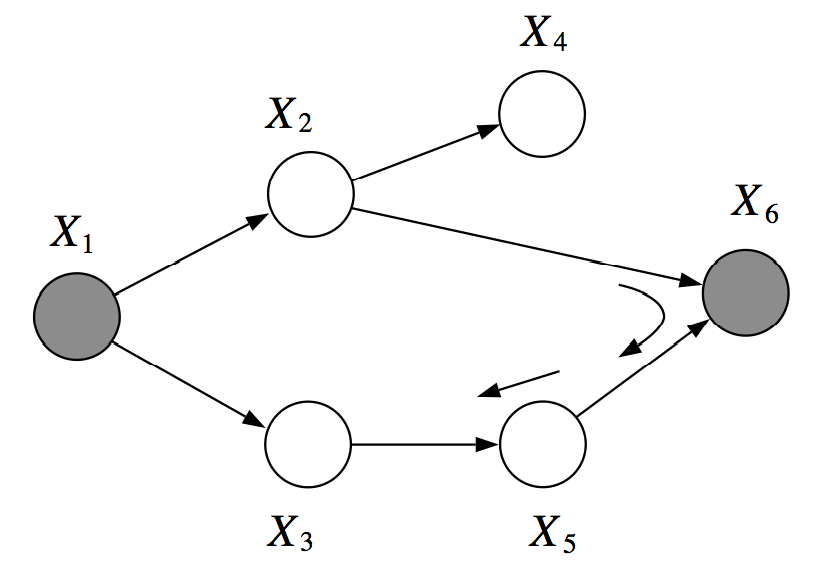
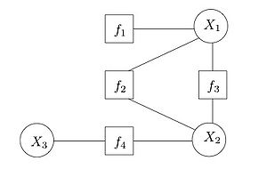
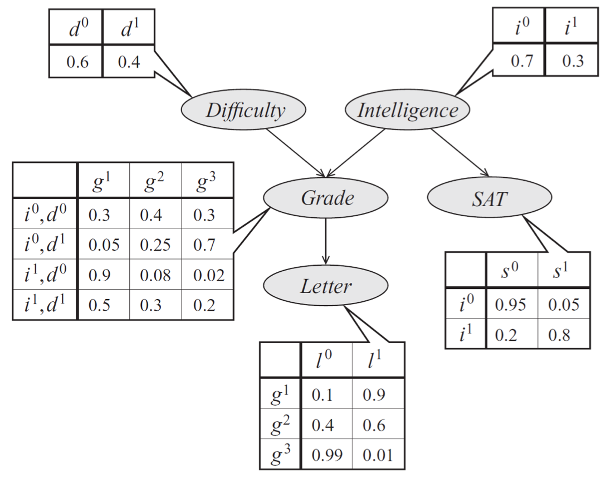
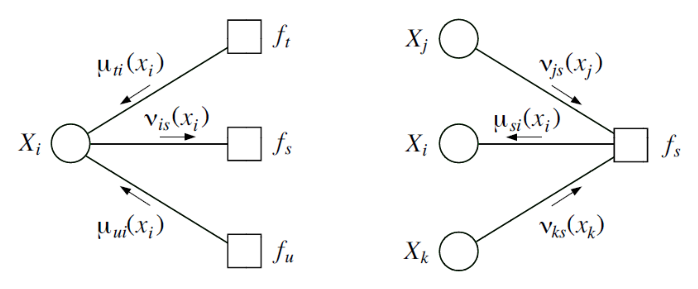

# 引言

概率图形建模是机器学习的一个分支，研究如何使用概率分布来描述世界并对其做出有用的预测。

我们有许多动机去学习概率建模。 一方面，这是一个引人入胜的科学领域，它拥有一个美丽的理论，它以令人惊讶的方式桥接了两个截然不同的数学分支：概率论和图论。 概率建模还与哲学特别是因果关系问题有着令人着迷的联系。

同时，概率建模已在整个机器学习领域和许多实际应用中广泛使用。 这些技术可用于解决医学，语言处理，视觉等许多领域的问题。

优雅的理论和强大的应用的结合使图模型成为现代人工智能和计算机科学中最引人入胜的主题之一。

（最近，Judea Pearl因建立概率图模型领域而荣获2011年Turing奖（被认为是“诺贝尔计算机科学奖”））

## 概率建模

但是，概率建模到底是什么？ 在尝试使用数学方法解决现实问题时，以方程形式定义世界的数学模型是很常见的。 也许最简单的模型将是下列形式的线性方程

$y = \beta^Tx$

其中y是我们要预测的结果变量，而x是影响结果的已知变量。 例如，y可能是房屋的价格，而
x是影响此价格的一系列因素，例如位置，卧室数量，房屋使用年限等。我们假设y是此输入的线性函数（参数为
β）。

通常，我们试图建模的现实世界非常复杂； 特别是，它通常涉及大量的不确定性（例如，如果新的地铁站在房屋的近距离内开放，那么房屋的价格就有一定的上涨机会）。 因此，很自然地，我们通过概率分布的形式对世界进行建模，以处理这种不确定性：

$p(x, y)$

有了这样的模型，我们可以问一些问题，例如“未来五年房价上涨的可能性是多少？”，或者“假设房屋价格为100,000美元，那么拥有三间卧室的可能性是多少？”从概率角度建模非常重要，因为：

- 通常，我们无法完美地预测未来。我们对世界没有足够的了解，并且世界本身常常是随机的
- 我们需要评估预测的可信度；通常，仅预测单个值是不够的，我们需要让系统输出对世界正在发生的事情的看法(beliefs)

在本课程中，我们将研究有关不确定性的原理性推理方法，并使用概率论和图论的思想来得出有效的机器学习算法。我们会找到许多有趣问题的答案，例如：

- 在计算复杂度和概率模型的丰富度之间有何取舍？
- 给定固定的数据集和计算预算，什么是推断未来事实的最佳模型？
- 如何以一种有原则的方式将先验知识与观察到的证据结合起来进行预测？
- 我们如何严格分析A是否是B的原因，或反之亦然？

此外，我们还将看到许多示例，说明如何将概率技术应用于各种问题，例如疾病预测，图像理解，语言分析等。

## 概率建模的困难

要初步了解摆在我们面前的挑战，请考虑概率模型的简单应用：垃圾邮件分类。

假设我们有一个关于垃圾邮件和非垃圾邮件中单词出现情况的模型 $p_\theta(y, x_1, ..., x_n)$ 。每个二进制变量$x_i$编码的是第i个英文单词是否在电子邮件中出现；二进制变量y表示电子邮件是否为垃圾邮件。为了对新电子邮件进行分类，我们可能会查看概率 $P(y=1 \mid x_1, \dotsc, x_n)$ 。

我们刚刚定义的 $p_\theta$ 函数的“大小”是多少？我们的模型对$y, x_1, \dotsc, x_n$的每种输入组合在[0, 1]上定义了一个概率。指定所有这些概率将需要我们写下一个惊人的 $2^{n+1}$ 个不同的值，每个值分配给一种二进制变量组合。因为n是英语词汇量的大小，从计算的角度（如何存储这个大列表？）和统计的角度（如何从有限的数据有效地估计参数？）的角度来看，这显然是不切实际的。更概括地说，我们的示例说明了本课程将要解决的主要挑战之一：**概率是具有指数复杂度的对象；我们操纵它们的唯一方法是简化它们的结构假设**。

**我们在本课程中将做出的主要简化假设是变量之间的条件独立性**。例如，假设给定y后英文单词都是条件独立的。换句话说，假设邮件是垃圾邮件，那么看到两个单词的概率是独立的。显然，这是一种过分简化，因为“药丸”和“购买”两个词的概率明显相关；但是，对于大多数单词（例如“企鹅”和“松饼”），概率确实是独立的，并且我们的假设不会显着降低模型的准确性。

**我们将这种特殊的独立性选择称为朴素贝叶斯假设。**给定这个假设，我们可以将模型概率写为因子的乘积

$P(y, x_1, \dotsc, x_n) = p(y) \prod\limits_{i=1}^n p(x_i \mid y)$
每个因子$p(x_i \mid y)$可以用少量参数（例如2个自由度的4个参数）完全描述。整个分布被O(n)个参数参数化了
，我们可以根据数据轻松估算并做出预测。

## 用图描述概率

**我们的独立性假设可以方便地以图形的形式表示。**这种表示法具有易于理解的直接优势。 可以图形其解释为告诉我们一个故事：一封电子邮件是通过首先随机选择电子邮件是否为垃圾邮件，然后每次从字典中采样一个字而生成的。 相反，如果我们有一个有关如何生成数据集的故事，则可以自然地将其表示为具有相关概率分布的图形。

更重要的是，我们要向模型提交各种查询（例如，假设我看到“药丸”一词，垃圾邮件的概率是多少？）； 要回答这些问题，将需要能被图论概念自然地定义的专用算法。 我们还将使用图论来分析学习算法的速度并量化不同学习任务的计算复杂度（例如NP-hardness）。

我们要讲的要点是，概率分布与图之间存在紧密的联系，在整个课程中将利用这些联系来定义，学习和使用概率模型。

## 鸟瞰课程概览

我们对图形模型的讨论将分为三个主要部分：表示（如何指定模型），推理（如何询问模型问题）和学习（如何使模型适合实际数据）。 这三个主题也将紧密联系在一起：为了获得有效的推理和学习算法，将需要适当地表示模型。 此外，学习模型将需要推理作为子例程。 因此，最好始终牢记这三个任务，而不是孤立地关注它们。

### Representation

我们如何表达模拟现实世界现象的概率分布？ 这不是一个小问题：我们已经看到了一个简单的用于分类垃圾信息的词典大小为n的模型，通常要求我们指定$O(2^n)$个参数。 我们将通过通用的技术来解决这一难题，以构建易于驾驭的模型。 这些方法将大量使用图论；其中概率也将由图来描述，图的属性（例如，连通性，树宽）将揭示模型的概率和算法特征（例如，独立性，学习复杂性）。

### Inference

给定一个概率模型，我们如何获得真实世界问题的答案？ 这样的问题通常简化为查询某些感兴趣事件的边际或条件概率。 更具体地说，我们通常会对向系统提出两种类型的问题感兴趣：

- 边际推断：将所有其他因素相加后，模型中给定变量的概率是多少？ 例如确定某个房屋具有三个以上卧室的概率。

  $p(x_1) = \sum\limits_{x_2} \sum\limits_{x_3} \cdots \sum\limits_{x_n} p(x_1, x_2, \dotsc, x_n)$

- 最大后验推断（MAP）：求最可能的变量分配。 例如，我们可以尝试确定最可能的垃圾邮件，从而解决问题

  $\max\limits_{x_1, \dots, x_n} p(x_1,\dotsc,x_n, y=1)$

通常，我们的查询将涉及证据（例如在上面的MAP示例中），在这种情况下，我们将修正变量子集的分配。

事实证明，推理是一项非常具有挑战性的任务。 对于许多感兴趣的概率，回答这些问题中的任何一个将是NP-hard的。 至关重要的是，推理是否容易处理将取决于描述该概率的图结构！ 如果问题难以解决，我们仍然可以通过近似推理方法获得有用的答案。 有趣的是，本部分课程中介绍的算法将很大程度上基于20世纪中叶统计物理界所做的工作。

### Learning

我们的最后一项关键任务是将模型拟合到数据集，例如，数据集可能是带有标签的大量垃圾邮件实例。 通过查看数据，我们可以推断出有用的模式（例如，垃圾邮件中经常发现哪些词），然后可以用来对未来进行预测。 但是，我们将看到学习和推理也以更微妙的方式固有地联系在一起，因为推理将成为我们在学习算法中反复调用的关键子程序。 此外，学习这一主题将与计算学习理论领域建立重要联系，该领域涉及诸如有限数据的泛化和过度拟合之类的问题；以及贝叶斯统计问题，它告诉我们如何有组织地组合先验知识和观察到的证据。

# 概率复习

# 实际应用

# 贝叶斯网络

我们从表示的主题开始：**我们如何选择概率分布来模拟真实世界的某些有趣的方面？**提出一个好的模型并不总是那么容易：在引言中我们已经看到，一个简单的垃圾邮件分类模型将要求我们指定许多参数，这些参数具有英文单词数的指数规模！

在本章中，我们将学习避免此类复杂性的一种方法。我们准备去：

- 了解仅使用几个参数来对概率分布进行参数化的有效且通用的技术
- 了解如何通过有向无环图（DAG）优雅地描述生成的模型
- 研究DAG的结构与结构描述的分布做出的建模假设之间的联系；这不仅将令这些建模假设更加明确，还将帮助我们设计更有效的推理算法
- 我们将在这里看到的各种模型称为贝叶斯网络。在下一章中，我们还将看到第二种方法，其中涉及无向图，也称为马尔可夫随机场

## 贝叶斯网络的概率建模

有向图模型（又称贝叶斯网络(Bayesian networks)）是一族概率分布，它们允许使用有向图自然地描述紧凑的参数化。

该参数化背后的总体思路非常简单。

回想一下，根据链式规则，我们可以写出任何概率p如：

$p(x_1, x_2, \dotsc, x_n) = p(x_1) p(x_2 \mid x_1) \cdots p(x_n \mid x_{n-1}, \dotsc, x_2, x_1)$

紧凑的贝叶斯网络是一种分布，其中右侧的每个因子仅取决于少量的祖先变量$x_{A_i}$：

$p(x_i \mid x_{i-1}, \dotsc, x_1) = p(x_i \mid x_{A_i})$

例如，在一个含有5个变量的模型中，我们可以选择用$p(x_5 \mid x_4, x_3)$来近似$p(x_5 \mid x_4, x_3, x_2, x_1)$。在这个例子中，$x_{A_5} = {x_4, x_3}$。

当变量是离散的（在我们将要考虑的问题中通常是这种情况），我们可能会想到因子$p(x_i\mid x_{A_i})$作为概率表，其中各行对应于$x_{A_i}$ 而列对应于值$x_i$; 条目包含实际概率$p(x_i\mid x_{A_i})$ 。如果每个变量都采用d种值并且有最多k个祖先，那么整个表格最多将包含$O(d^{k+1})$个条目。 由于每个变量只有一张表，因此整个概率分布可以仅用$O(nd^{k+1})$ 个参数紧凑地描述（可以与朴素的$O(d^n)$ 的实现比较一下）。

### 图论表示

这种形式的分布可以自然地表示为有向无环图，其中顶点对应于变量$x_i$，边缘表示依赖关系。 特别是我们令每个节点$x_i$的父节点为它的祖先点集 $x_{A_i}$。

例如，考虑一个学生在考试中取得的成绩g的模型。 这个成绩取决于考试的难度d和学生的智力i; 这也会影响教授该课程的教授的推荐信的质量l。 学生的智力i也会影响SAT分数s。 每个变量都是二进制的，除了g，它取3个可能的值。这5个变量的联合概率分布自然地分解为：

$p(l, g, i, d, s) = p(l \mid g)\, p(g \mid i, d)\, p(i)\, p(d)\, p(s \mid i)$

该分布的图形表示是DAG，它直观地指定了随机变量如何相互依赖。 该图清楚地表明信的质量取决于分数，而分数又取决于学生的智力和考试难度。

解释有向图的另一种方法是根据故事来说明如何生成数据。 在上面的示例中，为了确定推荐信的质量，我们可以首先对智力水平和考试难度进行抽样； 然后，根据这些参数对学生的成绩进行抽样； 最后，根据该等级生成推荐信。

在前面的垃圾邮件分类示例中，我们隐式地假定电子邮件是按照两步过程生成的：首先，我们选择垃圾邮件/非垃圾邮件标签y; 然后我们以该标签为条件，独立地采样，以决定每个单词是否存在。

### 正式定义

正式地，一个贝叶斯网络（Bayesian network）是一个有向图G=(V, E)，其满足

- 每个点$i\in V$对应一个随机变量$x_i$
- 每个节点指定一个条件概率分布（CPD），描述x的概率如何取决于其父节点的值。

**因此，贝叶斯网络定义了一个概率分布p。相反地，如果概率p能够按照有向无环图G的指示被分解成因子的乘积，那么我们就说概率p按照G进行了分解（probability p factorizes over a graph G）。**

不难发现，由贝叶斯网络表示的概率将是合法的：显然，它是非负的，并且可以使用归纳论证（并使用CPD为合法概率这一事实）来证明所有变量分配到的概率的总和将为1。 相反，我们还可以通过反例说明，当G包含环（cycles）时，其关联的概率可能不等于1。

## 贝叶斯网络的依赖关系

总而言之，贝叶斯网络可以通过较小的局部条件概率分布（每个变量一个）的乘积形成概率分布。 通过以这种形式表示概率，我们将变量的独立性引入到模型假设当中。

这就提出了一个问题：**通过使用由G描述结构的贝叶斯网络模型，我们确切地做出了哪些独立性假设？** 这个问题之所以重要，有两个原因：我们应该确切地知道我们在做哪些模型假设（以及它们是否正确）； 同样，此信息将有助于我们稍后设计更有效的推理算法。

让我们使用符号I(p)表示在联合概率p上成立的所有独立性的集合。例如，若p(x, y) = p(x) p(y)，则$x \perp y \in I(p)$。

### 由有向图描述的独立性

事实证明，贝叶斯网络p非常优雅地描述了I(p)中的许多独立性; 通过查看三种类型的结构，可以从图中恢复这些独立性。

为简单起见，我们先来看一下只有三个节点A, B, C的贝叶斯网络G。 在这种情况下，G本质上只有三种可能的结构，每种结构导致不同的独立性假设。 有兴趣的读者可以使用一些代数轻松证明这些结果。

- 共同父亲（Common parent）： 若G具有$A \leftarrow B \rightarrow C$ 的结构，且B有观测值，则$A \perp C \mid B$ 。反之，若B没有观测值，则$A \not\perp C$ 。直观地讲，这是因为B包含了决定A和C结果的所有信息。 一旦观察到，没有其他因素会影响这些变量的结果。
- 级联（Cascade）：若G具有$A \rightarrow B \rightarrow C$ 的结构，且B有观测值，则$A \perp C \mid B$ 。反之，若B没有观测值，则$A \not\perp C$ 。直觉是，B拥有所有决定C结果的信息； 因此，A取什么值并不重要。
- V-结构（V-structure）：若G具有$A \rightarrow C \leftarrow B$ 的结构，如果是这样，那么知道C联结着A和B。换句话说，若C没有观测值，则$A \perp B$ 。反之，若C有观测值，则$A \not\perp B | C$ 。

最后一种情况需要进一步说明。假设C是一个布尔变量，它指示我们的草坪是否在一个早晨潮湿。A和B是潮湿的两种解释：要么下雨了（由A表示），要么是洒水喷头打开了（由B表示）。如果我们知道草是湿的（C为真）并且洒水喷头没有继续运转（B为假），则A为真的概率必须为1，因为这是唯一可能的解释。因此，给定C，A和B不是独立的。

这些结构清楚地描述了由三变量贝叶斯网络编码的独立性。通过将它们递归地应用于任何较大的图，我们可以将它们扩展到一般的图。这导致了一个称为有向分离（d-separation）的概念（其中d表示有向）。

令Q，W和O为贝叶斯网络G中的三组节点。**我们说如果Q和W未通过有效(active)路径连接，则给定O（即观察到变量O），Q和W是有向分离的。**如果给定观测变量O，则对于路径中的每个连续变量三元组X，Y，Z，以下条件中有某个条件成立，则G中的无向路径被称为有效路径：

- $X \leftarrow Y \leftarrow Z$ 的结构，Y ($Y\not\in O$) 没有观测值
- $X \rightarrow Y \rightarrow Z$ 的结构，Y ($Y\not\in O$) 没有观测值
- $X \leftarrow Y \rightarrow Z$ 的结构，Y ($Y\not\in O$) 没有观测值
- $X \rightarrow Y \leftarrow Z$ 的结构，Y 和它的任何后代都有观测值

比方说，上图中，给定$X_2$与$X_3$后$X_1$与$X_6$是有向分离的，但给定$X_1$与$X_6$后$X_2$与$X_3$不是有向分离的。因为我们能够找到一条有效路径$(X_2, X_6, X_5, X_3)$。

一位CS228的前学生创建了一个用于测试的[交互式web应用](http://pgmlearning.herokuapp.com/dSepApp)模拟有向分离。 随时尝试使用它，如果愿意，请通过Web应用程序上的“反馈”按钮提交任何反馈或错误。

有向分离的符号是很有用的，因为它可以让我们描述模型中大部分的依赖关系。令$I(G) = \{(X \perp Y \mid Z) : \text{$X,Y$ are $d$-sep given $Z$}\}$ 为G中有向分离的的变量组合的集合。

**事实：若p可以按照G分解，那么$I(G) \subseteq I(p)$ 。在这里，我们说G是p的一个独立性图(I-map, independence map)**

或者可以这么说：用G编码的所有独立性都是合理的，因为G中有向分离的变量确实在p中是独立的。 但是，反过来却不一定对：也许一个分布能够按照G分解，但同时也具有G中未捕获到的独立性。

在某种程度上，这几乎是一个显然的声明。若p(x, y) = p(x) p(y) ，则这个分布能够按照图$y \rightarrow x$进行分解，因为我们总能够用一个CPD p(x|y)写出p(x, y) = p(x|y) p(y)，其中x的概率实际上不随y变化。 另一方面，我们可以简单地通过删除不必要的边来构造与p的结构匹配的图。

### 有向图的表示能力

这提出了我们最后一个，也许是最重要的问题：**有向图能否表达任何分布p的所有独立性？** 更正式地说，给定一个分布p，我们可以构造一个图G，使得I(G) = I(p)吗？

首先，请注意，构造一个使$I(G) \subseteq I(p)$ 成立的图G是很容易的。一个具有全连接结构的有向图无环图G对任意一个分布都是一个I-map，因为$I(G) = \empty$。

一个更有趣的问题是我们是否可以为p找到一个最小的独立性图G：即使从G中删除一个边也将导致它不再是独立性图。 这很容易：我们可以从完全连接的G开始，然后移除边，直到G不再是独立性图。 一种方法是遵循图的自然拓扑顺序，删除节点祖先，直到不再可行为止。 在进行结构学习时，我们将在课程结束时重新审视此修剪方法。

但是，我们真正感兴趣的是确定概率分布p是否接受一个完美图（perfect map），使得I(p)=I(G)。不幸的是，答案是否定的。例如，考虑在三个变量X，Y，Z上的以下分布p：我们从伯努利分布中抽样$X,Y \sim \text{Ber}(0.5)$，然后设置Z=X xor Y（我们将其称为“噪声-异或”示例）。可以使用一些代数对分布p进行检查，并不难得出： $\{X \perp Y, Z \perp Y, X \perp Z\} \in I(p),  Z \perp \{Y,X\} \not\in I(p)$。因此，虽然$X \rightarrow Z \leftarrow Y$是p的I-map，但是我们讨论的任意3节点图结构都无法完美描述I(p)，因此该分布没有完美图。

一个相关的问题是，完美图在其存在时是否唯一。同样，情况并非如此，因为$X \rightarrow Y$ 和 $X \leftarrow Y$编码相同的独立性，但形成不同的图。**更一般地说，如果两个贝叶斯网络G1，G2编码相同的依赖关系$I(G_1)=I(G_2)$，则它们是独立等效（I-equivalent）的**。什么时候两个贝叶斯网络独立等效？为了回答这个问题，让我们回到一个包含三个变量的简单示例。下面的每个图形都有相同的骨架（skeleton），这意味着，如果我们放下箭头的方向性，则在每种情况下我们都将获得相同的无向图。

级联结构（a，b）显然是对称的，箭头的方向无关紧要。 实际上，（a，b，c）编码完全相同的依赖项。 只要不将箭头变成V型结构（d），我们就可以更改箭头的方向。 但是，当我们具有V型结构时，就不能更改任何箭头：结构（d）是唯一描述依赖性$X \not\perp Y \mid Z$的箭头。 这些示例为以下关于独立等价性的一般结果提供了直觉。

事实：如果G，G‘具有相同的骨架和相同的v-结构，则I(G) = I(G')

同样，很容易直观地理解为什么是这样。 如果变量之间的有向分离相同，则两个图是独立等效的。 我们可以翻转任何边的方向，除非它形成v-结构，并且图的d-连接性将保持不变。 我们请读者阅读Koller和Friedman的教科书，以获取完整的证明。

# 马尔可夫随机场

贝叶斯网络是一类模型，可以紧凑地表示许多有趣的概率分布。但是，我们在上一章中已经看到，某些分布可能具有独立性假设，而贝叶斯网络的结构不能完全表示这些独立性假设。

在这种情况下，除非我们想在模型的变量之间引入虚假的独立性，否则我们必须倒退到不太紧凑的表示形式（可以将其视为带有其他多余的不必要边的图）。这导致了模型中额外的，不必要的参数，并使学习这些参数和进行预测变得更加困难。

但是，存在另一种技术，该技术基于无向图的语言来紧凑地表示和可视化概率分布。此类模型（称为马尔可夫随机场或MRFs）可以紧凑地表示有向模型无法表示的独立性假设。在本章中，我们将探讨这些方法的优缺点。

## 马尔可夫随机场

作为一个启发性的例子，假设我们正在模拟人A, B, C, D之间的投票偏好。不妨说(A, B), (B, C), (C, D), (D, A)之间是朋友，朋友倾向于有相同的投票偏好。这些影响可以自然地由无向图表示。

**一种定义A，B，C，D的联合投票决定的概率的方法是将分数分配给这些变量的每种组合，然后将概率定义为归一化分数。** 分数可以是任何函数，但是在我们的例子中，我们将其定义为以下形式

$\tilde p(A,B,C,D) = \phi(A,B)\phi(B,C)\phi(C,D)\phi(D,A)$

其中$\phi(A,B)$ 是为朋友x，y的一致投票分配更多权重的因子(factor)。例如：

$% <![CDATA[
\begin{align*}
\phi(X,Y) =
\begin{cases}
10 & \text{if } X = Y = 1 \\
5  & \text{if } X = Y = 0 \\
1  & \text{otherwise}.
\end{cases}
\end{align*} %]]>$

非规范分布中的因子通常称为factor。 然后将最终概率定义为

$p(A,B,C,D) = \frac{1}{Z} \tilde p(A,B,C,D),$

其中$Z = \sum_{A,B,C,D} \tilde p(A,B,C,D)$是一个归一化常数，可确保分布之和为1。

归一化后，我们可以将$\phi(A,B)$ 视为使B的投票更接近于A的相互作用。 $\phi(B, C)$ 使B的投票更接近C，并且最有可能的投票需要调和这些冲突的影响。

注意，与有向图情况不同，我们没有说任何关于如何从另一组变量中生成一个变量的信息（就像条件概率分布那样）。 **我们仅在图中指示因变量之间的耦合程度。** 从某种意义上讲，这需要较少的先验知识，因为我们不再需要详细说明如何根据A的投票构造B的投票（如果我们有$P(B\mid A)$因子，则需要这样做） 。 **相反，我们只需要识别因变量并定义其相互作用的强度即可。 将其视作在可能的分配空间上定义了能量分布，然后我们通过归一化常数将该能量转换为概率。**

### 正式定义

马尔可夫随机场（MRF）是由无向图G定义的含有变量$x_1, x_2, ..., x_n$的概率分布p，其中无向图G的节点对应于变量$x_i$ 。 概率p具有以下形式

$p(x_1, \dotsc, x_n) = \frac{1}{Z} \prod\limits_{c \in C} \phi_c(x_c)$

其中C表示G中由团（cliques，即完全连接的子图）构成的集合，每个因子$\phi_c$是团中变量的非负函数。 配分函数（partition function）

$Z = \sum\limits_{x_1, \dotsc, x_n} \prod\limits_{c \in C} \phi_c(x_c)$

是确保分配总和为1的归一化常数。

因此，给定图G，我们的概率分布可能包含那些定义在G的任何团上的因子，可以是一个节点，一个边，一个三角形等。请注意，我们不需要为每个团都指定一个因子。 在上面的示例中，我们在每个边上定义了一个因子（这是两个节点构成的团）。 但是，我们选择不指定任何一元因子，即单个节点上的团。

### 与贝叶斯网络的比较

在我们前面的投票示例中，我们在A, B, C, D上进行了分配，该分布满足$A \perp C \mid \{B,D\}$和$B \perp D \mid \{A,C\}$（因为只有朋友直接影响某人的投票）。 我们可以通过反例轻松地检查这些独立性不能由贝叶斯网络完美地表示。 但是，MRF证明是此分布的理想选择。

上图是我们的四变量投票示例的有向图模型示例。 它们都不能准确地表达我们关于变量之间的依存关系结构的先验知识。

更一般而言，MRF与有向模型相比具有多个优点：

- 它们可以应用于范围更广的问题，在这些问题中没有与变量依赖性相关的自然方向性
- 无向图可以简洁地表达贝叶斯网络无法轻易描述的某些依赖关系（尽管反之亦然）

它们还具有几个重要的缺点：

- 计算归一化常数Z需要对具有潜在指数规模的变量分配进行求和。 我们将看到，在一般情况下，这将是NP-HARD的； 因此，许多无向模型将很棘手，并且需要近似技术

- 无向模型可能难以解释

- 从贝叶斯网络生成数据要容易得多，这在某些应用程序中很重要

不难看出，贝叶斯网络是MRF的特例，其具有类型非常特殊的团因子（对应于条件概率分布并暗示图中有向无环结构），并且归一化常数为1。 特别是，如果我们取一个有向图G并将边添加到给定节点的所有父节点（并删除其方向性），则CPDs（被视为变量及其祖先的因子）将按照得到的无向图进行分解。 由此产生的过程称为道德化（moralization）。

因此，MRF比贝叶斯网络具有更多的功能，但是在计算上却更加困难。 一般的经验法则是，尽可能使用贝叶斯网络，并且只有在没有自然方法用有向图对问题进行建模的情况下才切换到MRFs（例如在我们的投票示例中）。

## 马尔可夫随机场中的独立性

回想一下，在贝叶斯网络的情况下，我们定义了一组有向图G描述的独立性I(G)，并展示了它们如何描述必须存在于（按照有向图G分解的）分布p中的真实独立性，即$I(G) \subseteq I(p)$。

无向的MRF可以描述什么独立性？ 答案非常简单直观：**如果变量x, y通过由未观察到的变量构成的路径发生连接，则它们是存在依赖的。 但是，如果观察到x的所有邻居，则x与所有其他变量无关，因为它们仅通过x的邻居影响x。**

特别是，如果一组观察到的变量在图形的两半之间形成割集，则一半的变量与另一半的变量无关。

**形式上，我们将变量集X的马尔可夫毯U（Markov blanket）定义为观察到U时，使得X与图的其余所有部分独立的最小的节点集U**，即满足$X \perp (\mathcal{X} - \{X\} - U) \mid U$ 的U。 这个概念适用于有向模型和无向模型，但是在无向情况下，马尔可夫毯只是等于节点的邻居。

在有向情况下，我们发现 $I(G) \subseteq I(p)$，但是存在分布p，其分布不能由G来描述。在无向情况下，同样成立。 例如，考虑由有向v-结构描述的概率（即辩解现象）。 无向模型无法描述独立性假设$X \perp Y$。

## 条件随机场

当将马尔可夫随机场应用于条件概率分布$p(y\mid x)$时，一个重要的特殊情况出现了： $x \in \mathcal{X}$和$y \in \mathcal{Y}$是向量值变量。 这些分布在监督学习环境中很常见，在这种情况下，我们给定x并希望预测y。 此设置也称为结构化预测。

### 例子

作为一个启发性的示例，请考虑从以像素矩阵形式提供给我们的一系列黑白字符图像$x_i \in [0, 1]^{d\times d}$中识别单词的问题。 我们的预测变量的输出是字母$y_i \in \{'a','b',\dotsc,'z'\}$的序列。

原则上，我们可以训练一个分类器来从$x_i$分别预测每个$y_i$。 但是，由于字母共同构成一个词，因此对不同字母的预测应该相互告知。 在上面的示例中，第二个字母本身可以是'U'或'V'； 但是，由于我们可以高度肯定地说出它的邻居是“ Q”和“ E”，因此我们可以推断出“ U”是最有可能的真实标签。 CRF使我们能够联合地执行预测。

### 正式定义

形式上，CRF是变量$\mathcal X \cup \mathcal Y$上的Markov网络，它指定条件分布

$P(y\mid x) = \frac{1}{Z(x)} \prod\limits_{c \in C} \phi_c(x_c,y_c)$

其中配分函数（partition function）：

$Z(x) = \sum\limits_{y \in \mathcal{Y}} \prod\limits_{c \in C} \phi_c(x_c,y_c)$

请注意，在这种情况下，配分常数现在取决于x（因此，我们说它是一个函数），这并不奇怪：p(y|x)是y上由x参数化的概率，即它对每个x编码不同的概率函数。 从这个意义上讲，**条件随机场会为每个输入x实例化一个新的马尔可夫随机场。**

### Example (continued)

更正式地，假设p(y|x)是具有两种因子的链式CRF：图像因子 $\phi(x_i, y_i)$,  for i = 1, ..., n  —— 为与输入$x_i$一致的 $y_i$ 分配更大的值 —— 以及成对因子$\phi(y_i, y_{i+1})$ for  $i = 1, \dotsc, n-1$。 我们也可以将$\phi(x_i,y_i)$视为概率$p(y_i\mid x_i)$，例如标准（非结构化）softmax回归给出的概率。 $\phi(y_i, y_{i+1})$可以看作是从大量英文文本（例如Wikipedia）中获得的字母共现的经验频率。

给定这种形式的模型，我们可以使用MAP推断联合地推断结构化标签y：

$\arg\max\limits_y \phi_1(y_1, x_1) \prod\limits_{i=2}^n \phi(y_{i-1}, y_i) \phi(y_i, x_i)$

### CRF的特征

在大多数实际应用中，我们进一步假设因子$\phi_c(x_c,y_c)$的形式为

$\phi_c(x_c,y_c) = \exp(w_c^T f_c(x_c, y_c))$

其中$f_c(x_c, y_c)$可以是描述$x_c$和$y_c$之间兼容性的任意特征集。

在我们的OCR示例中，我们可能会引入$f(x_i, y_i)$特征，这些特征编码字母$y_i$与像素$x_i$的兼容性。 例如，$f(x_i, y_i)$可以是在像素$x_i$上评估的逻辑回归（或深度神经网络）产生的字母$y_i$的概率。 另外，我们在相邻字母之间引入特征$f(y_i, y_{i+1})$。 这些可以是$f(y_i, y_{i+1}) = \mathbb I (y_i = \ell_1, y_{i+1} = \ell_2)$形式的指示符，其中$l_1, l_2$是字母表的两个字母。 然后，CRF将学习权重w，该权重w将为概率意义上更常见的连续字母组合 $(l_1, l_2)$ 分配更多的权重，同时确保预测的$y_i$与输入$x_i$一致； 这个过程可以让我们在$x_i$ 有歧义的情况下确定$y_i$，就像上面的例子一样。

有关CRF功能的最重要的认识是它们可以任意复杂。 实际上，我们可以使用因子 $ \phi_i(x,y_i) = \exp(w_i^T f(x, y_i))$定义一个OCR模型，该系数取决于整个输入x。 这一点根本不影响计算性能，因为在推理时，始终会观察到x，并且我们的解码问题涉及最大化

$\phi_1(x, y_1) \prod\limits_{i=2}^n \phi(y_{i-1}, y_i) \phi(x, y_i) = \phi_1'(y_1) \prod\limits_{i=2}^n \phi(y_{i-1}, y_i) \phi'(y_i)$

其中$\phi'_i(y_i) = \phi_i(x,y_i)$。 使用全局特征仅会更改因子的值，而不会更改具有相同类型链结构的因子的范围。 在下一节中，我们将看到仅此结构即可确保我们能够轻松解决此优化问题。

此观察结果可能会以更一般的形式解释。 如果我们要使用MRF对p(x,y)进行建模（在x，y上使用归一化常数$Z = \sum_{x,y} \tilde p(x,y)$ 来查看单个模型，那么我们需要对数据进行两个分布拟合：p(y|x)和p(x)。但是，如果我们感兴趣的只是在给定x的情况下预测y，因此没有必要对p(x)进行建模。实际上，这样做可能不利于统计（例如，我们可能没有足够的数据同时适合p(y|x)和p(x)；因为这些模型具有共享的参数，拟合一个模型可能不会为另一个模型提供最佳参数），并且在计算上可能不是一个好主意（我们需要简化分布中的假设，以便可以轻松处理p(x)）。 放弃这个假设，通常在预测任务上表现更好。

## 因子图

以因子和变量在表示中明确且分开的方式查看MRF通常很有用。 因子图就是这样做的一种方式。 因子图是二部图，其中一组是要建模的分布中的变量，另一组是在这些变量上定义的因子。 因子和那些因子所依赖的变量之间存在边际。

此视图使我们可以更轻松地查看变量之间的因子相关性，稍后，我们将看到它使我们可以更轻松地计算一些概率分布。

# 变量消除

接下来，我们将注意力转向图模型中的推理问题。 给定概率模型（例如贝叶斯网络或MRF），我们有兴趣使用它来回答有用的问题，例如确定给定电子邮件是垃圾邮件的可能性。 更正式地说，我们关注两种类型的问题：

- 边际推理：将所有其他因素相加后，模型中给定变量的概率是多少（例如，垃圾邮件与非垃圾邮件的概率）？

  $p(y=1) = \sum\limits_{x_1} \sum\limits_{x_2} \cdots \sum\limits_{x_n} p(y=1, x_1, x_2, \dotsc, x_n)$

- 最大后验（MAP）推理：对模型中变量的最可能赋值是什么（可能取决于证据）？

  $\max\limits_{x_1, \dotsc, x_n} p(y=1, x_1, \dotsc, x_n)$

事实证明，推理是一项艰巨的任务。 对于许多感兴趣的概率，要精确地回答这些问题中的任何一个都是NP-hard的。 至关重要的是，推理是否容易处理取决于描述该概率的图的结构。 如果问题难以解决，我们仍然可以通过近似推理方法获得有用的答案。

本章介绍第一个精确的推理算法，即变量消除。 我们将在后面的章节中讨论近似推理。

在本章的其余部分，我们将假设$x_i$是离散变量，每个变量均具有k个可能的值（变量消除背后的原理也扩展到许多连续分布（例如高斯分布），但是我们在这里不讨论这些扩展）。

## An illustrative example

首先考虑边际推理的问题。 为简单起见，假设给我们一个链式贝叶斯网络，即形式为

$p(x_1, \dotsc, x_n) = p(x_1) \prod\limits_{i=2}^n p(x_i \mid x_{i-1})$

我们对计算边际概率$p(x_n)$感兴趣。 朴素的计算方法是将$x_1, ..., x_{n-1}$的全部$k^{n-1}$种组合对应的的概率求和

$p(x_n) = \sum\limits_{x_1} \cdots \sum\limits_{x_{n-1}} p(x_1, \dotsc, x_n)$

但是，通过利用概率分布的因式分解，我们可以做的更好。 我们可以用将“某些变量”推入乘积深处的方式来重写和式

$\begin{align*}
p(x_n)
& = \sum_{x_1} \cdots \sum_{x_{n-1}} p(x_1) \prod_{i=2}^n p(x_i \mid x_{i-1}) \\
& = \sum_{x_{n-1}} p(x_n \mid x_{n-1}) \sum_{x_{n-2}} p(x_{n-1} \mid x_{n-2}) \cdots \sum_{x_1} p(x_2 \mid x_1) p(x_1)
\end{align*}$

我们首先对内部项求和，从$x_1$到$x_{n-1}$。 具体而言，我们首先通过求和$x_1$来计算中间因子$\tau(x_2) = \sum_{x_1} p(x_2 \mid x_1) p(x_1)$。 这需要$O(k^2)$的时间，因为对于$x_2$的每种值，我们必须对$x_1$求概率和。 可以将生成的因子$\tau(x_2)$视为一张有k个值的表（尽管不一定是概率），$x_2$的每种值都对应了其中的一项（就像因子$p(x_1)$可以表示成一张表一样）。 然后，我们可以使用$\tau$重写边际概率为

$p(x_n) = \sum\limits_{x_{n-1}} p(x_n \mid x_{n-1}) \sum\limits_{x_{n-2}} p(x_{n-1} \mid x_{n-2}) \cdots \sum\limits_{x_2} p(x_3 \mid x_2) \tau(x_2)$

请注意，这与初始表达式具有相同的形式，只是我们对较少的变量求和（这种技术是动态规划的一种特殊情况，动态规划是一种通用的算法设计方法，在这种方法中，我们将较大的问题分解为一系列较小的问题）。因此，我们可以计算下一个因子$\tau(x_3) = \sum_{x_2} p(x_3 \mid x_2) \tau(x_2)$，然后重复该过程，直到只剩下$x_n$。 由于每个步骤花费$O(k^2)$ 时间，并且我们要执行O(n)个步骤，所以现在推理花费$O(nk^2)$ 的时间，这比我们的朴素的$O(k^n)$ 解决方案要好得多。

另外，每次都消除一个变量，这就是该算法的名字的由来。

## 变量消除

在建立了一些直觉之后，以特殊情况为例，我们现在以一般形式介绍变量消除算法。

### 因子

我们假设给定一个图模型，表示为因子的乘积

$p(x_1, \dotsc, x_n) = \prod\limits_{c \in C} \phi_c(x_c).$

回想一下，我们可以将因子视为多维表，该多维表为变量$x_c$ 的每种分配设置一个值。 在贝叶斯网络中，这些因子对应于条件概率分布。 在马尔可夫随机场中，这些因子编码未归一化的分布。 为了计算边际，我们首先计算配分函数（也使用变量消除），然后使用非规范化分布计算边际，最后将结果除以配分常数，以构造有效的边际概率。

### 因子运算

变量消除算法重复执行两个因子运算：乘积和边缘化。 在链示例中，我们一直在隐式执行这些操作。

因子乘积操作简单地将两个因子 $\phi_1, \phi_2$的乘积$\phi_3 := \phi_1 \times \phi_2$定义为

$\phi_3(x_c) = \phi_1(x_c^{(1)}) \times \phi_2(x_c^{(2)})$

$\phi_3$的范围定义为$\phi_1, \phi_2$范围中变量的并集； 同样，$x_c^{(i)}$表示对$\phi_i$范围内变量的赋值，该变量是由$x_c$ 对该范围的限制所定义的。 例如，我们定义$\phi_3(a,b,c) := \phi_1(a,b) \times \phi_2(b,c)$。

接下来，边缘化操作从一个因子中局部地消除了一组变量。 如果我们在两组变量X，Y上有一个因子$\phi(X,Y)$，则将Y边缘化会产生一个新因子

$\tau(x) = \sum_y \phi(x, y)$

其中的加和操作是对变量集合Y上所有可能的变量赋值进行的。

我们用$\tau$ 来指代边缘化因子。 重要的是要理解，即使$\phi$是CPD，该因子也不一定与概率分布相对应。

### 排序

最后，变量消除算法要求按照变量“消除”的顺序对变量进行排序。在我们的链示例中，我们采用了DAG隐含的排序。 重要说明：

- 不同的顺序可能会极大地改变变量消除算法的运行时间
- 找到最好的顺序，这是NP-hard的问题

稍后我们将重新讨论这些复杂性，但现在让我们将顺序固定。

### 变量消除算法

现在，我们准备正式定义变量消除（VE）算法。 本质上，我们按照O的顺序循环遍历变量，并按该顺序消除它们。 从直觉上讲，这相当于选择一个加和操作并将其“推入”到因子乘积内，就像我们在链示例中做的那样。

更正式地说，对于每个变量 $X_i$（根据O进行排序），

1. 将所有包含$X_i$的因子 $\Phi_i$相乘
2. 边缘化$X_i$以获得新因子$\tau$
3. 用$\tau$替换因子$\Phi_i$

一位前CS228的学生创建了一个[交互式的web模拟程序](http://pgmlearning.herokuapp.com/vElimApp)，以可视化变量消除算法。 随时尝试使用它，如果愿意，请通过Web应用程序上的“反馈”按钮提交任何反馈或错误。

### 例子

让我们尝试了解如何将这些步骤与我们的链示例相对应。 在这种情况下，选择的顺序为$x_1, x_2, \dotsc, x_{n-1}$。 从$x_1$开始，我们收集了涉及$x_1$的所有因子，分别是$p(x_1)$和$p(x_2|x_1)$。 然后，我们使用它们来构造一个新因子$\tau(x_2) = \sum_{x_1} p(x_2 \mid x_1) p(x_1)$。 这可以看作是VE算法第2步和第3步的结果：首先，我们形成一个大因子$\sigma(x_2, x_1) = p(x_2 \mid x_1) p(x_1)$； 然后我们从该因子中消除$x_1$以产生$\tau$ 。 然后，我们对$x_2$重复相同的过程，只不过现在的因子为$p(x_3|x_2), \tau(x_2)$。

举一个稍微复杂的例子，回想一下我们先前介绍的学生成绩的图模型。模型指定的概率的形式为

$p(l, g, i, d, s) = p(l \mid g) p(s \mid i) p(i) p(g \mid i, d) p(d)$

假设我们正在计算$p(l)$，并在图中按其拓扑顺序消除了变量。 首先，我们消除d，它对应于创建一个新因子$\tau_1(g,i) = \sum_d p(g \mid i, d) p(d)$。 接下来，我们消除i以得到因子$\tau_2(g,s) = \sum_i \tau_1(g,i) p(i) p(s \mid i)$； 然后我们消除s以得到$\tau_3(g) = \sum_s \tau_2(g,s)$，依此类推。 请注意，这些操作等效于对因式分解后的概率分布求和，如下所示：

$p(l) = \sum_g p(l \mid g) \sum_s \sum_i p(s\mid i) p(i) \sum_d p(g \mid i, d) p(d)$

请注意，此示例需要每步最多计算$k^3$次运算，因为每个因子最多可以达到2个变量，并且每个步骤都累加一个变量（此示例中的维数k为2或3）。

## 引入证据

一个密切相关且同等重要的问题是计算具有以下形式的条件概率

$P(Y \mid E = e) = \frac{P(Y, E=e)}{P(E=e)}$

其中$P(X,Y,E)$是一个概率分布，其中有查询变量Y，观察到的证据变量E和未观察到的变量X的集合。

我们可以通过在$P(Y, E=e)$上执行一次变量消除，然后在$P(E=e)$上再次执行变量消除来计算该概率。

要计算$P(Y, E=e)$，我们只需考虑每个因子$\phi(X', Y', E')$，它们的作用域也位于E中也可以找到的变量$E' \subseteq E$上，我们将其值设置为e所指定的值。 然后，我们对X执行标准变量消除，以获得仅有Y的因子。

## 变量消除的运行时间

了解变量消除的运行时间在很大程度上取决于图的结构，这一点非常重要。

在前面的示例中，假设我们首先消除了g。 然后，我们不得不将因子$p(g \mid i, d), p(l \mid g)$转换为3个变量上的大因子$\tau(d, i, l)$，这将需要$O(k^4)$ 时间来计算：枚举三个条件变量的组合需要$k^3$次计算，枚举g值需要k次计算。如果我们有一个因子$S\rightarrow G$，那么我们也必须消除$p(g \mid s)$，在$O(k^5)$ 的时间里中产生一个单一的巨型因子$\tau(d, i, l, s)$ 。 然后，从这个因子中消除任何变量的开销，都几乎与从头开始消除一样多，因为所有变量都已耦合。

显然，某些排序比其他排序更有效率。 实际上，变量消除的运行时间为$O(n k^{M+1})$，其中M是消除过程中形成的任何因子τ的最大大小，n是变量的数量。

### 选择变量消除顺序

不幸的是，选择最佳VE顺序是一个NP-hard的问题。好在在实践中，我们可以根据以下启发式策略来进行排序：

- *Min-neighbors*: 选择具有最少依赖的变量
- *Min-weight*: 选择变量以最小化其因变量的基数的乘积。
- *Min-fill*: 选择节点以最小化将要添加到图中的因子的大小。

这些方法通常会在许多有趣的环境中产生相当好的性能。

# 置信传播

## 联结树算法

我们已经见识到变量消除算法（VE）是如何回答针对有向和无向网络的具有 $P(Y \mid E = e)$ 形式的边际查询。

但是，这个算法有一个至关重要的缺陷：若我们向模型提交另一种查询，例如，我们就需要从头再运行一遍算法。这在计算上是非常浪费的。

幸运的是，事实证明这个问题能够被轻易地避免。在计算边际时，VE会产生许多中间因子τ作为主要计算的副产品；实际上这些因子也是我们回答其它边际查询时产生的因子。通过在首次VE的运行过程中将它们缓存下来，我们能够轻易地回答新的边际查询，并且本质上不产生新的计算开销。

在本章结束的时候我们将得到一个新的技术——联结树算法（Junction Tree (JT) algorithm）；这个算法首先会执行两遍VE算法以初始化特定的数据结构来维护一个预处理因子集合。一旦数据结构初始化好，它就能在O(1)的时间内回答边际查询。

（如果你熟悉动态规划（DP），那么你可以将VE和JT算法想成同一技术的两种版本：自顶向下的DP和自底向上的DP。就像计算第n个斐波那契数F_n那样，自顶向下DP（对应于VE）只计算那个数值，但自顶向下DP（对应于JT）会生成一张填充好所有$F_i(i \le n)$ 的表。不仅如此，JT的two-pass特性是在双向(junction)树上DP的结果，而斐波那契数之间的关系构成单向的树。）

我们将引入该算法的两个变种：置信传播（BP），和全联结树方法（full junction tree method）。BP适用于树形图，而联结树方法适用于一般网络。

## 置信传播

### 将变量消除视为消息传递

首先，思考若我们在树上运行VE算法以计算边缘化的$p(x_i)$ 的话会发生什么。我们可以轻易地通过令 $x_i$为树根并后序遍历节点，为这个问题找到一个最优顺序。

（有根树的后序遍历是一种从叶子开始，遵循节点总是在其子节点之后被访问的方式向上游走，最后走到根节点的遍历方式）

之所以这个顺序是最优的，是因为在运行VE的过程中形成的最大团的大小为2。在每一步中，我们将消除$x_j$；这将要求计算因子$\tau_{jk}(x_k) = \sum_{x_j} \phi(x_k, x_j) \tau_j(x_j)$ ，其中$x_k$是$x_j$在树上的父节点。在下一步中，$x_k$将被消除，并且$\tau_{jk}(x_k)$ 会被向上传递给$x_k$的父节点$x_l$，以便在其被边缘化之前，将其交给 $\phi(x_l, x_k)$因子操作。因子$\tau_j(x_j)$ 可以被看作$x_j$传递给$x_k$的总结了以$x_j$为根的子树上的全部信息的消息。我们可以用树上的箭头来可视化这次信息传递。

（Message passing order when using VE to compute $p(x_3)$ on a small tree.）

在VE结束之前，$x_i$收到所有相邻子节点的信息，将它们边缘化，于是我们就得到了最后的边缘分布。

现在假设在$p(x_i)$的计算完成后，我们也想计算$p(x_k)$。我们将以$x_k$为根重新运行VE，直到$x_k$收到其所有子节点的消息。关键点是：$x_k$从$x_j$那里收到的消息将和以$x_i$为根节点时同样的消息是完全相同的（其中一个原因是，树上的任意两个节点之间只能由一条边相连）。因此，若我们存储VE算法的中间消息，就能快速重新计算另一个边缘化了。

### 消息传递算法

现在关键的问题是，到底如何计算我们需要的所有消息？例如，需要重新计算从$x_i$的那条边传递到$x_k$的消息。

问题的答案十分简单：当一个节点$x_i$收到来自除$x_j$之外的所有节点的消息时，它就向邻居$x_j$发送一条消息。对于读者来说这是一个有趣的联系：证明在一棵树中，总是存在一个节点需要发送消息，除非所有消息都已经被发送出去了。这恰好会在2|E|个步骤后发生，因为每条边都只能收到两次消息：一次自$x_i \rightarrow x_j$，另一次自相反方向。

最后，这个算法是正确的，因为我们的消息被定义为VE算法的中间因子。

现在，我们已经准备好正式定义信念传播算法。该算法有两个变体，每个变体用于不同的任务:

- 和积消息传递（sum-product message passing）： 用于边际推理，例如计算$p(x_i)$
- 最大积消息传递（max-product message passing）： 用于MAP (maximum a posteriori) 推理， 例如计算$\max_{x_1, \dotsc, x_n} p(x_1, \dotsc, x_n)$

### 和积消息传递

和积消息传递算法的定义如下：当有一个节点$x_i$准备好向节点$x_j$传递时，就发送消息

$m_{i\to j}(x_j) = \sum\limits_{x_i} \phi(x_i) \phi(x_i,x_j) \prod\limits_{\ell \in N(i) \setminus j} m_{\ell \to i}(x_i)$

符号$N(i) \setminus j$ 表示除了j外i的邻居节点构成的集合。再次重申，不难观察到该消息恰好是$x_i$在进行一轮变量消除以计算$p(x_j)$的过程中传递给$x_j$的因子$\tau$ 。

根据这个观察，当计算完所有的消息后，我们就能在常数时间内回答$x_i$的所有边缘查询，通过这个公式

$p(x_i) \propto \phi(x_i) \prod\limits_{\ell \in N(i)} m_{\ell \to i}(x_i)$

### 因子树上的和积消息传递

和积消息传递在经过少量的修改后就也可以在因子树上运行。回顾一下，因子图是将变量和因子用边连接起来的二分图，每条边指明了变量和因子的联系。

在因子图上，我们有两种消息：变量到因子的消息$\nu$ ，和因子到变量的消息$\mu$ 。两种消息都需要做乘积，但只有因子到变量的消息$\mu$ 需要做加和。

$\nu_{var(i)\to fac(s)}(x_i) = \prod\limits_{t\in N(i)\setminus s}\mu_{fac(t)\to var(i)}(x_i)$

$\mu_{fac(s)\to var(i)}(x_i) = \sum\limits_{x_{N(s)\setminus i}}f_s(x_{N(s)})\prod\limits_{j\in N(s)\setminus i}\nu_{var(j)\to fac(s)}(x_j)$

在因子图上运行的算法跟在无向图上运行的算法是一样的：只要有一个因子（或变量）准备好发送（或因子），就发送合适前面定义的的因子到变量（或变量到因子）消息。

### 最大积消息传递

置信传播算法的第二种版本，叫做最大积消息传递，被用来做MAP推理

$\max\limits_{x_1, \dotsc, x_n} p(x_1, \dotsc, x_n)$

我们之前介绍的的做边缘推理的框架能让我们轻易地做MAP推理。关键点在于，加和与求最大值操作都能分配到乘积中去。因此，将边缘推理中的加和操作换成最大值操作，我们就能够解决MAP推理了。

例如，我们能按如下方式计算链式MRF的配分函数：

$% <![CDATA[
\begin{align*}
Z
&= \sum_{x_1} \cdots \sum_{x_n} \phi(x_1) \prod_{i=2}^n \phi(x_i, x_{i-1}) \\
&= \sum_{x_n} \sum_{x_{n-1}} \phi(x_n, x_{n-1}) \sum_{x_{n-2}} \phi(x_{n-1}, x_{n-2}) \cdots \sum_{x_1} \phi(x_2 , x_1) \phi(x_1)
\end{align*} %]]>$

因为两个问题的分解方式是相同过的，我们也许能够重用为边缘推断而开发的机制，然后直接将其应用到MAP推推理。注意，这个还能应用到因子树上。

这里还有一个小小提醒，我们通常不仅想要最大化一个分配的值，例如$max_x p(x)$ ，还想要最可能的赋值，例如$arg\max_xp(x)$ 。不过在优化的过程中维护回溯指针就可以轻易做到这点，给定$x_2$的每种赋值，我们要维护$x_1$的最优赋值，给定$x_3$的每种赋值，我们要维护$x_2$的每种赋值，等等。

## 联结树算法

目前为止，我们的讨论假定图是一棵树。但如果不是呢？在这种情况下推理就没那么好办了；好在我们或许可以尝试将图变形为非常像树的形式，然后在这个图上运行消息传递算法。

在较高的层面，联结树算法将图划分成若干变量簇；细看下，一个簇内的变量可能是高度耦合的；而簇与簇之间将会构成树形结构，例如每个簇仅会直接影响其在树上的邻居。若局部（簇级别）问题能够妥善解决，那么这将会让我们得到易于驾驭的全局解。

### An illustrative example

在定义完整的算法之前，让我们先从一个例子开始，就像我们在介绍变量消除算法时做的那样。

假设我们在如下形式的MRF上做边缘推理

$p(x_1, \dotsc, x_n) = \frac{1}{Z} \prod\limits_{c \in C} \phi_c(x_c)$

至关重要地，我们假设团c具有一些路径结构，意思是我们能够找到一个排序 $x_c^{(1)}, \dotsc, x_c^{(n)}$ 使得

### Junction trees

### The junction tree algorithm

### Variable elimination over a junction tree

### Finding a good junction tree

## Loopy belief propagation

### Definition for pairwise models

### Properties

