## 1 线形方程组

### 1.1 线性方程组

### 1.2 行化简与阶梯形矩阵

#### 行化简算法

#### 线性方程组的解

**例1.2.4**：求方程组的解，该方程组的增广矩阵已经化为

$\left(\begin{matrix}1&6&2&-5&-2&-4\\0&0&2&-8&-1&3\\0&0&0&0&1&7\end{matrix}\right)$

解：将其化为简化阶梯形：

$\left(\begin{matrix}1&6&0&3&0&0\\0&0&1&-4&0&5\\0&0&0&0&1&7\end{matrix}\right)$

主元列为1，3，5列，基本变量为$x_1, x_3, x_5$，自由变量为：$x_2, x_4$，其对应的方程组为：

$x_1+6x_2+3x_4=0\\x_3-4x_4=5\\x_5=7$

通解为

$x_1+6x_2+3x_4=0$

$x_2$ 为自由变量

$x_3-4x_4=5$

$x_4$ 为自由变量

$x_5=7$

#### 存在与唯一性问题

**例1.2.5**：确定方程组的解是否存在且唯一。方程组的增广矩阵化简为：

$\left(\begin{matrix}3&-9&12&-9&6&15\\0&2&-4&4&2&-6\\0&0&0&0&1&4\end{matrix}\right)$

解：因为没有不相容的方程组，所以方程组有解。因为存在自由变量，所以方程组的解不是唯一的。

### 1.3 向量方程

### 1.4 矩阵方程Ax=b

### 1.5 线性方程组的解集

**例1.5.1**：确定下列其次线性方程组是否有平凡解，并描述他的子集

$3x_1+5x_2-4x_3=0\\-3x_1-2x_2+4x_3=0\\6x_1+x_2-8x_3=0$

解：写出增广矩阵(A 0)

$\left(\begin{matrix}3&5&-4&0\\-3&-2&4&0\\6&1&-8&0\end{matrix}\right)$

施以行变换，化为阶梯形

$\left(\begin{matrix}3&5&-4&0\\0&3&0&0\\0&0&0&0\end{matrix}\right)$

$x_3$ 是自由变量，因此Ax = 0有平凡解。继续施以行变换，化为简化阶梯形：

$\left(\begin{matrix}1&0&-\frac{4}{3}&0\\0&1&0&0\\0&0&0&0\end{matrix}\right)$

用自由变量表示基本变量

$x = \left(\begin{matrix}\frac{4}{3}\\0\\1\end{matrix}\right)x_3$

**例1.5.3** ：描述Ax = b的解，其中

$A = \left(\begin{matrix}3&5&-4\\-3&-2&4\\6&1&-8\end{matrix}\right), b = \left(\begin{matrix}7\\-1\\-4\end{matrix}\right)$

解：写出增广矩阵(A b)

$\left(\begin{matrix}3&5&-4&7\\-3&-2&4&-1\\6&1&-8&4\end{matrix}\right)$

施以行变换，化为简化阶梯形

$\left(\begin{matrix}1&0&-\frac{4}{3}&-1\\0&1&0&2\\0&0&0&0\end{matrix}\right)$

$x_3$ 为自由变量，Ax = b的通解为

$x = \left(\begin{matrix}-1\\2\\0\end{matrix}\right) + \left(\begin{matrix}\frac{4}{3}\\0\\1\end{matrix}\right)x_3$

## 2 矩阵代数

### 2.2 矩阵的逆

**例2.2.2** ：求 $A = \left(\begin{matrix}3&4\\5&6\end{matrix}\right)$ 的逆。

解：$det A = -2 \ne 0$ ，故A可逆，且

$A^{-1} = -\frac{1}{2}\left(\begin{matrix}6&-4\\-5&3\end{matrix}\right) = \left(\begin{matrix}-3&2\\\frac{5}{2}&-\frac{3}{2}\end{matrix}\right)$ 

**例2.2.4** ：解方程：

$3x_1+4x_2=3\\5x_1+6x_2=7$

解：

方程可以写成矩阵的形式：

 $Ax = \left(\begin{matrix}3&4\\5&6\end{matrix}\right)\left(\begin{matrix}x_1\\x_2\end{matrix}\right)=\left(\begin{matrix}3\\7\end{matrix}\right) = b$ 

$x = A^{-1}b = \left(\begin{matrix}-3&2\\\frac{5}{2}&-\frac{3}{2}\end{matrix}\right)\left(\begin{matrix}3\\7\end{matrix}\right) = \left(\begin{matrix}5\\-3\end{matrix}\right)$ 

#### 初等矩阵

**例2.2.6**：求$E = \left(\begin{matrix}1&0&0\\0&1&0\\-4&0&1\end{matrix}\right)$ 的逆

解：为把E变成I，需要对E施加的初等行变换为：将第1行的4倍加到第3行中去，其对应的初等矩阵即E的逆：

$E^{-1} = \left(\begin{matrix}1&0&0\\0&1&0\\4&0&1\end{matrix}\right)$

#### 求$A^{-1}$ 的算法 

  **例2.2.7**：若矩阵 $ \left(\begin{matrix}0&1&2\\1&0&3\\4&-3&8\end{matrix}\right)$ 的逆存在的话，求其逆

解： $ \left(\begin{matrix}A&I\end{matrix}\right) = \left(\begin{matrix}0&1&2&1&0&0\\1&0&3&0&1&0\\4&-3&8&0&0&1\end{matrix}\right) \sim \left(\begin{matrix}1&0&0&-9/2&7&-3/2\\0&1&0&-2&4&-1\\0&0&1&3/2&-2&1/2\end{matrix}\right)$

根据定理7，因为$A \sim I$ 所以A可逆，且

$A^{-1} = \left(\begin{matrix}-9/2&7&-3/2\\-2&4&-1\\3/2&-2&1/2\end{matrix}\right)$

## 3 行列式

## 4 向量空间

### 4.1 向量空间与子空间

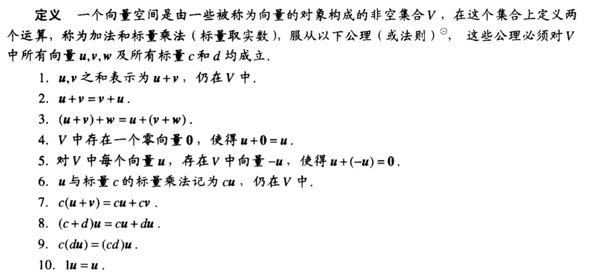

**例4.1.5**：设V是定义在集合D上的全实函数的集合（D的例子有实数集，实轴上的区间），加法的结果f+g仍为函数，在D中t点的值为f(t)+g(t)，同样，标量乘法的结果cf仍为函数，在t的值为cf(t)。例如，若$D=R,f(t)=1+\sin t,g(t)=2+0.5t$ ，则$(f+g)(t)=3+\sin 2t+0.5t, (2g)(t)=4+t$。证明V为一个向量空间。

证明：

1. f+g仍在V中（显然）
2. f+g=g+f（实数性质）
3. (f+g)+h=f+(g+h)（实数性质）
4. 零向量为f(t)=0
5. f的负向量为(-1)f
6. cf在V中（显然）
7. c(f+g)=cf+cg（实数性质）
8. (c+d)f=cf+df（实数性质）
9. c(df)=(cd)f（实数性质）
10. 1f=f（实数性质）

#### 子空间

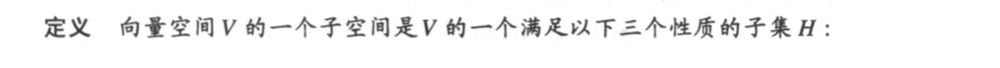

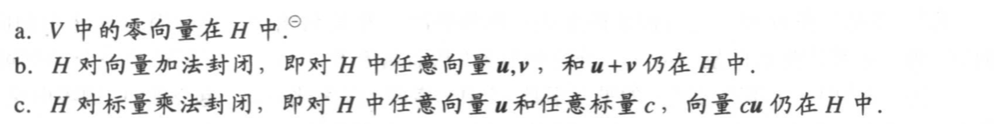

#### 由集合生成的子空间

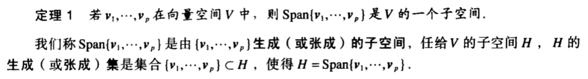

**例4.1.11**：令H是所有形如(a-3b, b-a, a, b)的向量的集合，这里a, b是任意数，即$H=\{(a-3b,b-a,a,b):a,b\in R\}$，证明H是$R^4$ 的一个子空间。

证明：$\left(\begin{matrix}a-3b\\b-a\\a\\b\end{matrix}\right)=a\left(\begin{matrix}1\\-1\\1\\0\end{matrix}\right)+b\left(\begin{matrix}-3\\1\\0\\1\end{matrix}\right) = av_1+bv_2$ ，因此$H=Span\{v_1, v_2\}$ ，根据定理1，H是$R^4$ 的子空间。

### 4.2 零空间、列空间和线性变换

#### 矩阵的零空间

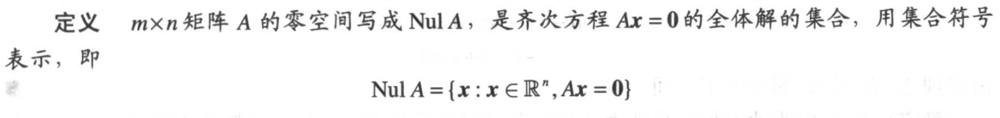

例4.2.1： $A = \left(\begin{matrix}1 & 2 & 3\\4 & 5 & 6\\7 & 8 & 9  \end{matrix}\right), u=\left(\begin{matrix}5\\3\\-2\end{matrix}\right)$ ，确认u是否属于A的零空间。

 解：Au = 0，故u属于A的零空间

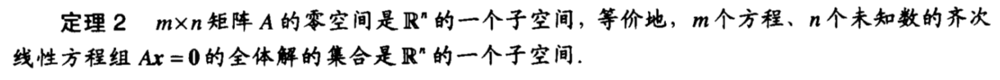

**例4.2.2**：令H是$R^4$ 中满足坐标a, b, c, d满足方程a-2b+5c=d且c-a=b的所有向量的集合，证明H是$R^4$ 的一个子空间。

解：上述方程等价于 $\left(\begin{matrix}1&-2&5&-1\\-1&-1&1&0\end{matrix}\right) \left(\begin{matrix}a\\b\\c\\d\end{matrix}\right) = 0$ ，因此H是$R^4$ 的一个子空间

**例4.2.3**：求矩阵$A = \left(\begin{matrix}-3&6&-1&1&-7\\1&-2&2&3&-1\\2&-4&5&8&-4\end{matrix}\right)$ 的零空间的生成集。

对增广矩阵施以行变换，得到简化阶梯形

$\left(\begin{matrix}1&-2&0&-1&3&0\\0&0&1&2&-2&0\\0&0&0&0&0&0\end{matrix}\right)$

自由变量为$x_2, x_3, x_4$ ，解集为

$x = \left(\begin{matrix}2\\1\\0\\0\\0\end{matrix}\right)x_2+\left(\begin{matrix}1\\0\\-2\\1\\0\end{matrix}\right)x_3+\left(\begin{matrix}-3\\0\\2\\0\\1\end{matrix}\right)x_4=ux_2+vx_3+wx_4$

因为u, v, w的任意线性组合都在Nul A中，所以Nul A的一个生成集为

{u, v, w}

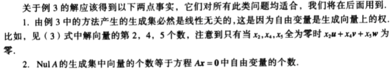

#### 矩阵的列空间

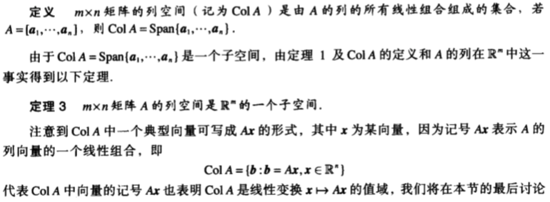

**例4.2.4**：求一个矩阵A使得W=Col A，其中

$W = \left\{\left(\begin{matrix}6a-b\\a+b\\-7a\end{matrix}\right):a,b\in R\right\}$

解：

$W = \left\{\left(\begin{matrix}6\\1\\-7\end{matrix}\right)a+\left(\begin{matrix}-1\\1\\0\end{matrix}\right)b:a,b\in R\right\} = Span\left\{\left(\begin{matrix}6\\1\\-7\end{matrix}\right), \left(\begin{matrix}-1\\1\\0\end{matrix}\right)\right\}$

可以看出，W为两个向量的线性组合，即

$W = Span\left\{\left(\begin{matrix}6\\1\\-7\end{matrix}\right), \left(\begin{matrix}-1\\1\\0\end{matrix}\right)\right\}$

用生成集中的向量作为A的列就有

$A = \left(\begin{matrix}6&-1\\1&1\\-7&0\end{matrix}\right)$

#### 线性变换的核与值域

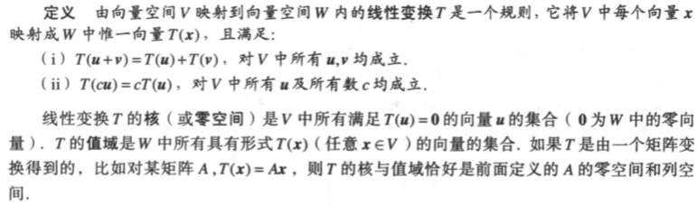

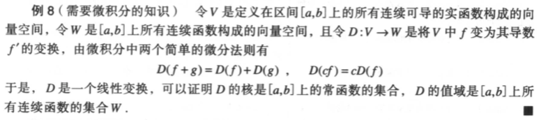

### 4.3 线性无关集和基

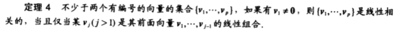

**例4.3.1**：$p_1(t)=1,p_2(t)=t,p_3(t)=4-t$ ，证明$\{p_1,p_2,p_3\}$ 线性相关。

证明：因为$p_3=4p_1-p_2$ ，故命题得证

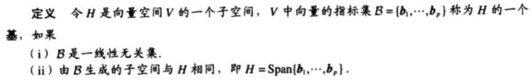

**例4.3.2**：令$v_1 = \left(\begin{matrix}3\\0\\-6\end{matrix}\right), v_2 = \left(\begin{matrix}-4\\1\\7\end{matrix}\right), v_3 = \left(\begin{matrix}-2\\1\\5\end{matrix}\right)$，判断$\{v_1, v_2, v_3\}$ 是$R^3$ 的一个基。

解：根据可逆矩阵定理，若 $A = (v_1\ v_2\ v_3)$ 可逆则能构成基。因为$Det A = 6 \ne 0$，所以 $\{v_1, v_2, v_3\}$ 是$R^3$ 的一个基

#### 生成集定理

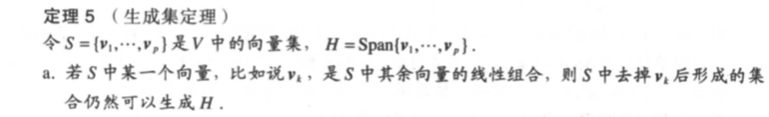

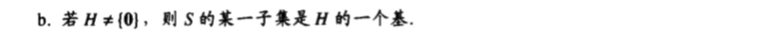

#### NulA和ColA的基

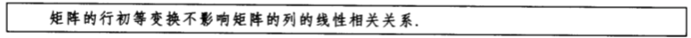

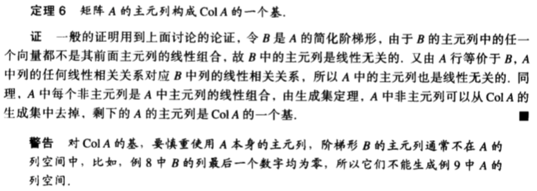

**例4.3.9**：已知$A = \left(\begin{matrix}a_1&a_2&a_3&a_4&a_5\end{matrix}\right) = \left(\begin{matrix}1&4&0&2&-1\\3&12&1&5&5\\2&8&1&3&2\\5&20&2&8&8\end{matrix}\right)$ ，求ColA的一个基

对A施以初等行变换，得到化简阶梯阵

$B= \left(\begin{matrix}b_1&b_2&b_3&b_4&b_5\end{matrix}\right) = \left(\begin{matrix}1&4&0&2&0\\0&0&1&-1&0\\0&0&0&0&1\\0&0&0&0&0\end{matrix}\right)$

故B的每个非主元列是主元列的线性组合，其中 $b_2=4b_1, b_4=2b_1-b_3$。

对应地，A的每个非主元列是主元列的线性组合，其中 $a_2=4a_1, a_4=2a_1-a_3$。

所以ColA的一个基为$\{a_1, a_3, a_5\}$

### 4.4 坐标系

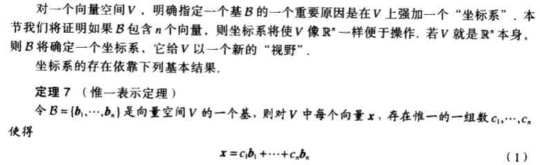

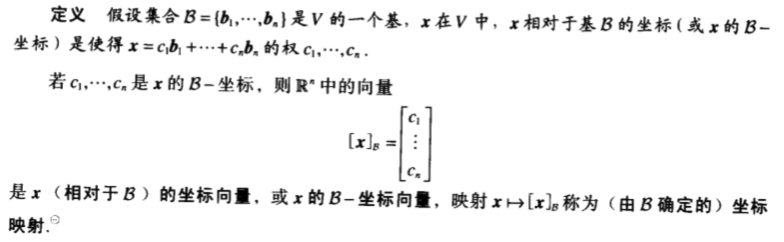

**例4.4.1**：考虑$R^2$ 上的基$B = \{b_1, b_2\} = \{\left(\begin{matrix}1 \\ 0\end{matrix}\right), \left(\begin{matrix}1 \\ 2\end{matrix}\right)\}$ ，假设$R^2$ 中一向量x具有坐标向量$[x]_B = \left(\begin{matrix}-2\\3\end{matrix}\right)$ ，求x。

解：将基按照坐标向量做线性组合即可得到原向量：

$x = -2 \cdot \left(\begin{matrix}1 \\ 0\end{matrix}\right)+ 3 \cdot \left(\begin{matrix}1 \\ 2\end{matrix}\right) = \left(\begin{matrix}1 \\ 6\end{matrix}\right)$ 

#### 坐标的几何意义

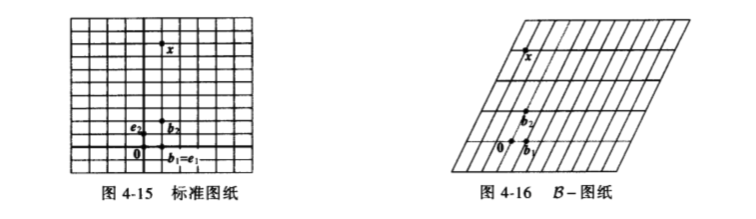

#### $R^n$中的坐标

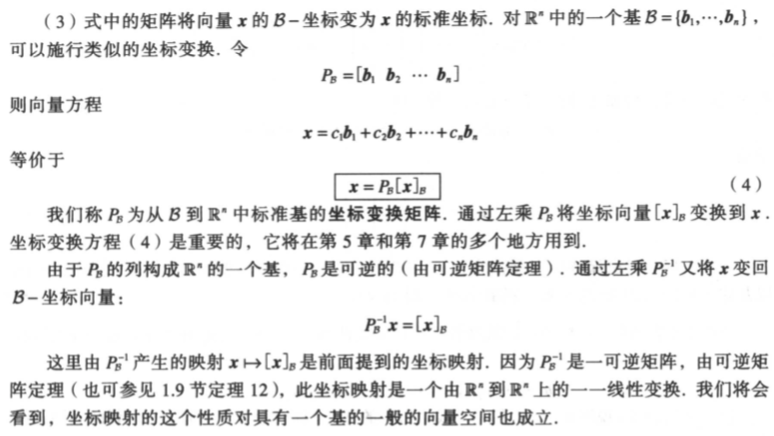

#### 坐标映射

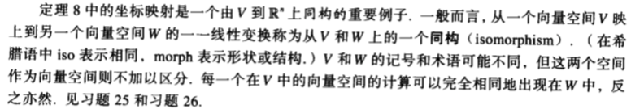

**例4.4.7**：令$v_1 = \left(\begin{matrix}3\\6\\2\end{matrix}\right), v_2 = \left(\begin{matrix}-1\\0\\1\end{matrix}\right), x = \left(\begin{matrix}3\\12\\7\end{matrix}\right), B = \{v_1, v_2\}$ ，则B是$H = Span\{v_1, v_2\}$ 的一个基，判定x是否在H中。若在，求x相对于B的坐标向量。

解：若x在H中，则下列方程是相容的，并且其解就是x的B-坐标：

$\left(\begin{matrix}3&-1\\6&0\\2&1\end{matrix}\right) \left(\begin{matrix}c_1\\c_2\end{matrix}\right) = \left(\begin{matrix}3\\12\\7\end{matrix}\right)$

写出增广矩阵，并施以行变换

$\left(\begin{matrix}3&-1&3\\6&0&12\\2&1&7\end{matrix}\right) \sim \left(\begin{matrix}1&0&2\\0&1&3\\0&0&0\end{matrix}\right)$

可以看出方程确实是相容的，并且

$[x]_B = \left(\begin{matrix}2\\3\end{matrix}\right)$

H是$R^3$中与$R^2$同构的平面，由B确定的H上的坐标系如下图所示：

### 4.5 向量空间的维数

### 4.6 秩

### 4.7 基的变换

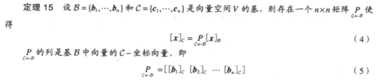

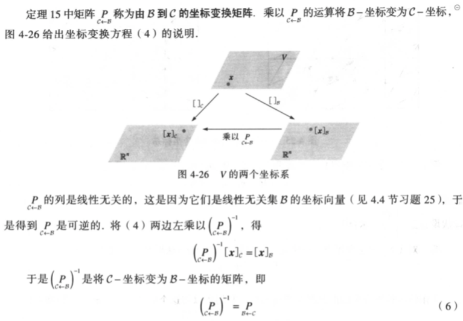

**例4.7.1**：对一个向量空间V，考虑两个基$B=\{b_1, b_2\}, C=\{c_1, c_2\}$ ，满足

$b_1 = 4c_1+c_2\\b_2=-6c_1+c_2$

假设$x=3b_1+b_2$ ，也就是说$[x]_B=\left(\begin{matrix}3\\1\end{matrix}\right)$，求$[x]_C$

解：$[x]_C = [3b_1+b_2]_C = 3[b_1]_C+[b_2]_C$

$b_1 = 4c_1+c_2$ 给出了$[b_1]_C = \left(\begin{matrix}4\\1\end{matrix}\right)$

$b_2=-6c_1+c_2$ 给出了$[b_2]_C = \left(\begin{matrix}-6\\1\end{matrix}\right)$

因此$[x]_C = \left(\begin{matrix}4&-6\\1&1\end{matrix}\right)\left(\begin{matrix}3\\1\end{matrix}\right) = \left(\begin{matrix}6\\4\end{matrix}\right)$

（其中 $\left(\begin{matrix}4&-6\\1&1\end{matrix}\right)$ 就是$P_{C\leftarrow B}$）

#### $R^n$ 中的基变换

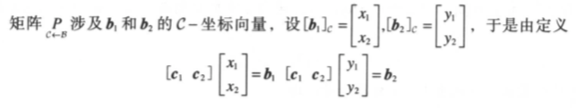

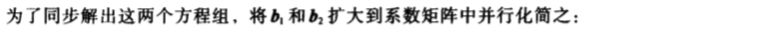

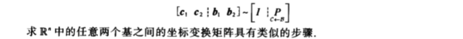

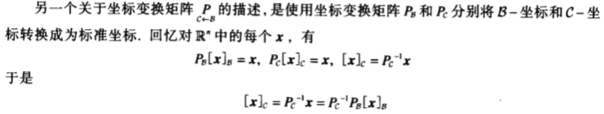

（对大矩阵而言，第一种方法会更快）

**例4.7.3**：设$b_1 = \left(\begin{matrix}1\\-3\end{matrix}\right), b_2 = \left(\begin{matrix}-2\\4\end{matrix}\right), c_1 = \left(\begin{matrix}-7\\9\end{matrix}\right), c_2 = \left(\begin{matrix}-5\\7\end{matrix}\right)$，考虑$R^2$ 中的基$B = \{b_1, b_2\}, C = \{c_1, c_2\}$ 

a. 求C到B的坐标变换矩阵

b. 求B到C的坐标变换矩阵

解：

a. $(b_1\ b_2 \mid c_1\ c_2)$

### 4.8 差分方程中的应用

### 4.9 马尔可夫链中的应用

## 5 特征值与特征向量

## 6 正交性和最小二乘法

## 7 对称矩阵和二次型

