[toc]

## 1 线形方程组

### 1.1 线性方程组

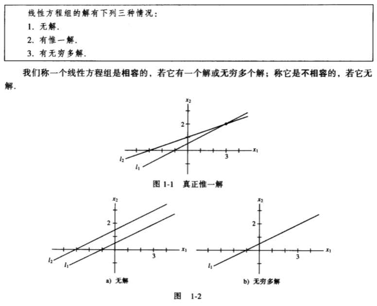

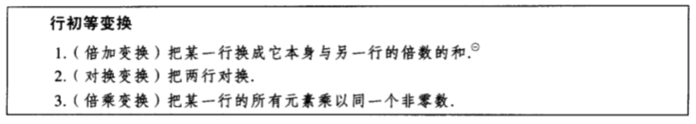

### 1.2 行化简与阶梯形矩阵

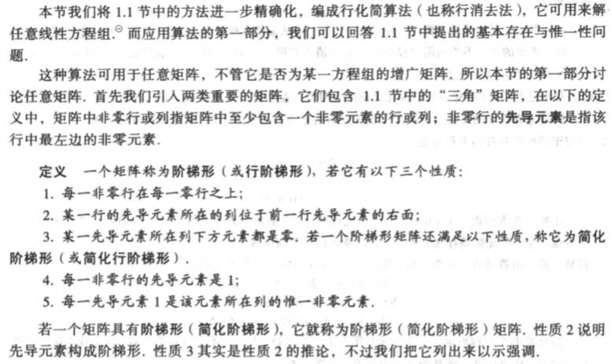

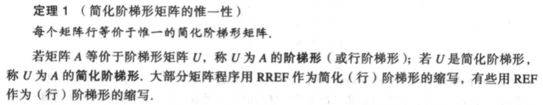

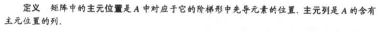

#### 行化简算法

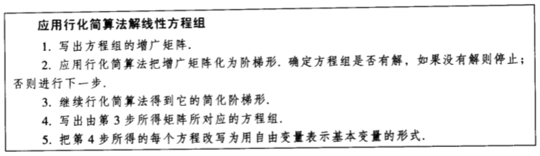

#### 线性方程组的解

**例1.2.4**：求方程组的解，该方程组的增广矩阵已经化为

$\left(\begin{matrix}1&6&2&-5&-2&-4\\0&0&2&-8&-1&3\\0&0&0&0&1&7\end{matrix}\right)$

解：将其化为简化阶梯形：

$\left(\begin{matrix}1&6&0&3&0&0\\0&0&1&-4&0&5\\0&0&0&0&1&7\end{matrix}\right)$

主元列为1，3，5列，基本变量为$x_1, x_3, x_5$，自由变量为：$x_2, x_4$，其对应的方程组为：

$x_1+6x_2+3x_4=0\\x_3-4x_4=5\\x_5=7$

通解为

$x_1+6x_2+3x_4=0$

$x_2$ 为自由变量

$x_3-4x_4=5$

$x_4$ 为自由变量

$x_5=7$

#### 存在与唯一性问题

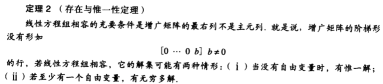

**例1.2.5**：确定方程组的解是否存在且唯一。方程组的增广矩阵化简为：

$\left(\begin{matrix}3&-9&12&-9&6&15\\0&2&-4&4&2&-6\\0&0&0&0&1&4\end{matrix}\right)$

解：因为没有不相容的方程组，所以方程组有解。因为存在自由变量，所以方程组的解不是唯一的。

### 1.3 向量方程

### 1.4 矩阵方程Ax=b

### 1.5 线性方程组的解集

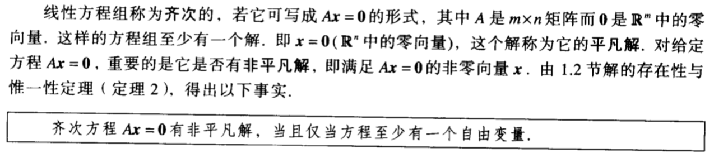

**例1.5.1**：确定下列其次线性方程组是否有平凡解，并描述他的子集

$3x_1+5x_2-4x_3=0\\-3x_1-2x_2+4x_3=0\\6x_1+x_2-8x_3=0$

解：写出增广矩阵(A 0)

$\left(\begin{matrix}3&5&-4&0\\-3&-2&4&0\\6&1&-8&0\end{matrix}\right)$

施以行变换，化为阶梯形

$\left(\begin{matrix}3&5&-4&0\\0&3&0&0\\0&0&0&0\end{matrix}\right)$

$x_3$ 是自由变量，因此Ax = 0有平凡解。继续施以行变换，化为简化阶梯形：

$\left(\begin{matrix}1&0&-\frac{4}{3}&0\\0&1&0&0\\0&0&0&0\end{matrix}\right)$

用自由变量表示基本变量

$x = \left(\begin{matrix}\frac{4}{3}\\0\\1\end{matrix}\right)x_3$

**例1.5.3** ：描述Ax = b的解，其中

$A = \left(\begin{matrix}3&5&-4\\-3&-2&4\\6&1&-8\end{matrix}\right), b = \left(\begin{matrix}7\\-1\\-4\end{matrix}\right)$

解：写出增广矩阵(A b)

$\left(\begin{matrix}3&5&-4&7\\-3&-2&4&-1\\6&1&-8&4\end{matrix}\right)$

施以行变换，化为简化阶梯形

$\left(\begin{matrix}1&0&-\frac{4}{3}&-1\\0&1&0&2\\0&0&0&0\end{matrix}\right)$

$x_3$ 为自由变量，Ax = b的通解为

$x = \left(\begin{matrix}-1\\2\\0\end{matrix}\right) + \left(\begin{matrix}\frac{4}{3}\\0\\1\end{matrix}\right)x_3$

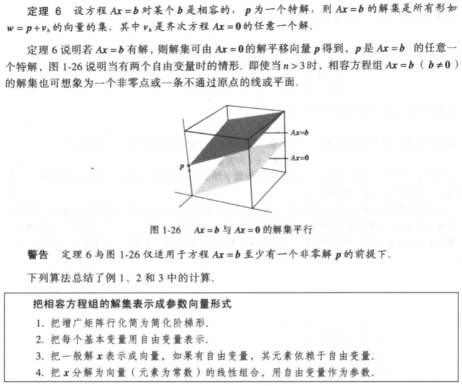

### 1.6 线性方程组的应用

### 1.7 线性无关

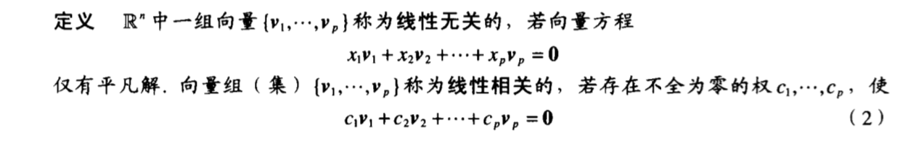

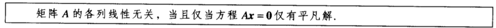

**例1.7.2** ：确定矩阵 $A = \left(\begin{matrix}0&1&4\\1&2&-1\\5&8&0\end{matrix}\right)$ 是否线性无关。

解：研究Ax=0，将其增广矩阵施以行变换：

 $\left(\begin{matrix}0&1&4&0\\1&2&-1&0\\5&8&0&0\end{matrix}\right) \sim \left(\begin{matrix}1&2&-1&0\\0&1&4&0\\0&0&13&0\end{matrix}\right)$ 

可见方程有3个基本变量，没有自由变量。因此方程仅有平凡解，A的各列是线性无关的。

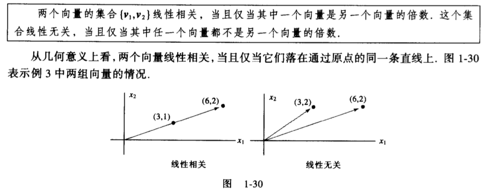

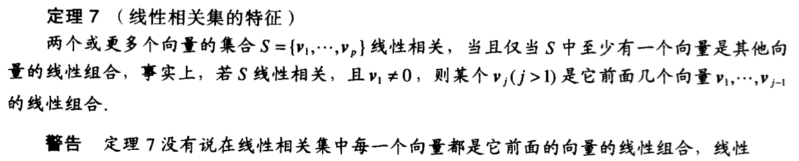

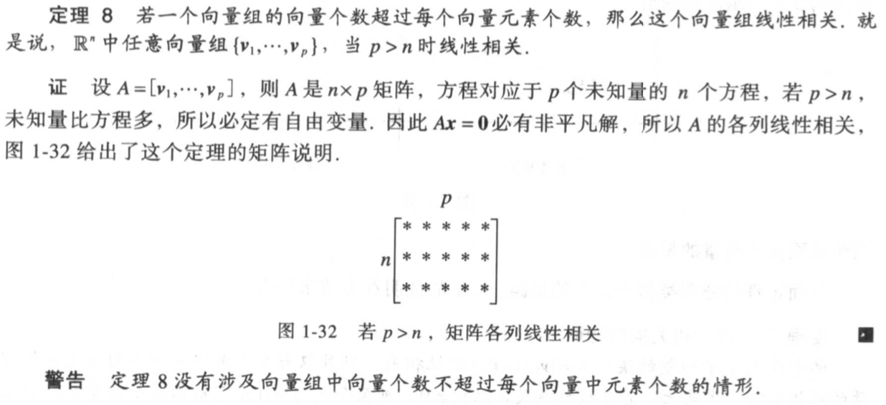

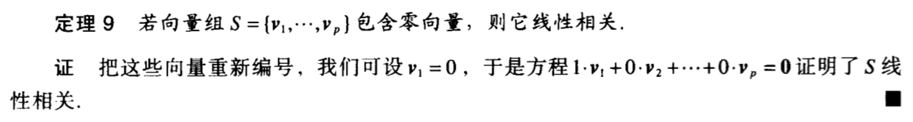

**例1.7.6** ：用观察法确定下列向量组是否线性相关

a. $\left(\begin{matrix}1\\7\\6\end{matrix}\right), \left(\begin{matrix}2\\0\\9\end{matrix}\right), \left(\begin{matrix}3\\1\\5\end{matrix}\right), \left(\begin{matrix}4\\1\\8\end{matrix}\right)$

b. $\left(\begin{matrix}2\\3\\5\end{matrix}\right), \left(\begin{matrix}0\\0\\0\end{matrix}\right), \left(\begin{matrix}1\\1\\8\end{matrix}\right)$

a. $\left(\begin{matrix}-2\\4\\6\\10\end{matrix}\right), \left(\begin{matrix}3\\-6\\-9\\15\end{matrix}\right)$

解：

根据定理8，a中向量数大于元素个数，故线性相关

根据定理9，b中出现零向量，故线性相关

根据定理7，c中第一个向量不是零向量，第二个向量不是前一个的倍数，故线性无关

### 1.8 线性变换介绍

### 1.9 线性变换的矩阵

### 1.10 经济学、科学和工程中的线性模型

## 2 矩阵代数

### 2.2 矩阵的逆

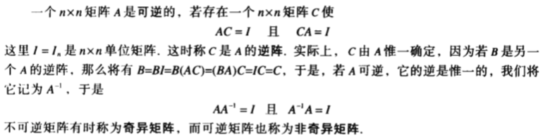

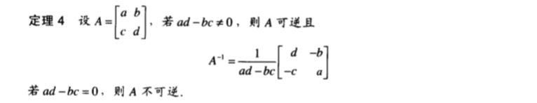

**例2.2.2** ：求 $A = \left(\begin{matrix}3&4\\5&6\end{matrix}\right)$ 的逆。

解：$det A = -2 \ne 0$ ，故A可逆，且

$A^{-1} = -\frac{1}{2}\left(\begin{matrix}6&-4\\-5&3\end{matrix}\right) = \left(\begin{matrix}-3&2\\\frac{5}{2}&-\frac{3}{2}\end{matrix}\right)$ 

**例2.2.4** ：解方程：

$3x_1+4x_2=3\\5x_1+6x_2=7$

解：

方程可以写成矩阵的形式：

 $Ax = \left(\begin{matrix}3&4\\5&6\end{matrix}\right)\left(\begin{matrix}x_1\\x_2\end{matrix}\right)=\left(\begin{matrix}3\\7\end{matrix}\right) = b$ 

$x = A^{-1}b = \left(\begin{matrix}-3&2\\\frac{5}{2}&-\frac{3}{2}\end{matrix}\right)\left(\begin{matrix}3\\7\end{matrix}\right) = \left(\begin{matrix}5\\-3\end{matrix}\right)$ 

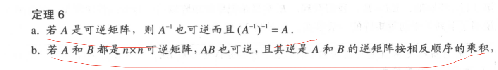

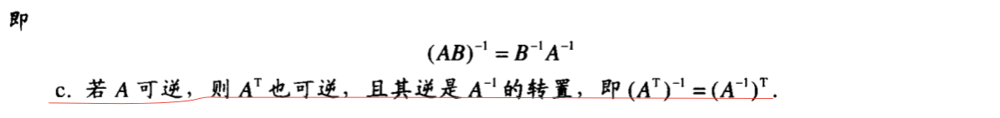

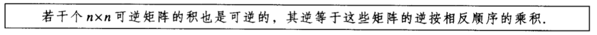

#### 初等矩阵

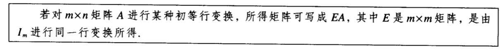

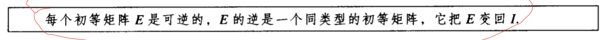

**例2.2.6**：求$E = \left(\begin{matrix}1&0&0\\0&1&0\\-4&0&1\end{matrix}\right)$ 的逆

解：为把E变成I，需要对E施加的初等行变换为：将第1行的4倍加到第3行中去，其对应的初等矩阵即E的逆：

$E^{-1} = \left(\begin{matrix}1&0&0\\0&1&0\\4&0&1\end{matrix}\right)$

#### 求$A^{-1}$ 的算法 

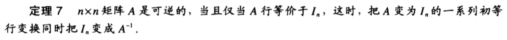

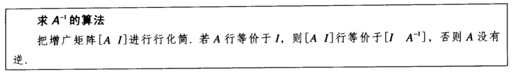

  **例2.2.7**：若矩阵 $ \left(\begin{matrix}0&1&2\\1&0&3\\4&-3&8\end{matrix}\right)$ 的逆存在的话，求其逆

解： $ \left(\begin{matrix}A&I\end{matrix}\right) = \left(\begin{matrix}0&1&2&1&0&0\\1&0&3&0&1&0\\4&-3&8&0&0&1\end{matrix}\right) \sim \left(\begin{matrix}1&0&0&-9/2&7&-3/2\\0&1&0&-2&4&-1\\0&0&1&3/2&-2&1/2\end{matrix}\right)$

根据定理7，因为$A \sim I$ 所以A可逆，且

$A^{-1} = \left(\begin{matrix}-9/2&7&-3/2\\-2&4&-1\\3/2&-2&1/2\end{matrix}\right)$

#### 逆矩阵的另一个观点

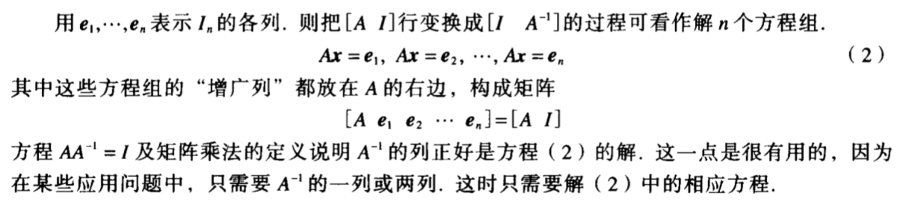

## 3 行列式

