[toc]

## 5 特征值与特征向量

### 5.1 特征向量与特征值

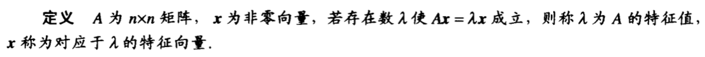

**例5.1.3**：证明7是矩阵$A = \left(\begin{matrix}1&6\\5&2\end{matrix}\right)$ 的特征值，并求特征值7对应的特征向量

解：7是A的特征值当且仅当Ax=7x有非平凡解，方程移项得

$(A-7I)x=0$

$(A-7I) = \left(\begin{matrix}-6&6\\5&-5\end{matrix}\right)$ 列线性相关，故方程有非平凡解

对增广矩阵施以行变换

$\left(\begin{matrix}-6&6&0\\5&-5&0\end{matrix}\right) \sim \left(\begin{matrix}1&-1&0\\0&0&0\end{matrix}\right)$

得到通解$x = x_2\left(\begin{matrix}1\\1\end{matrix}\right)$，凡是$x_2 \ne 0$ 的具有这种形式的向量都是特征值7对应的特征向量

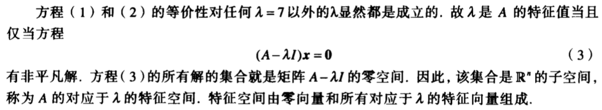

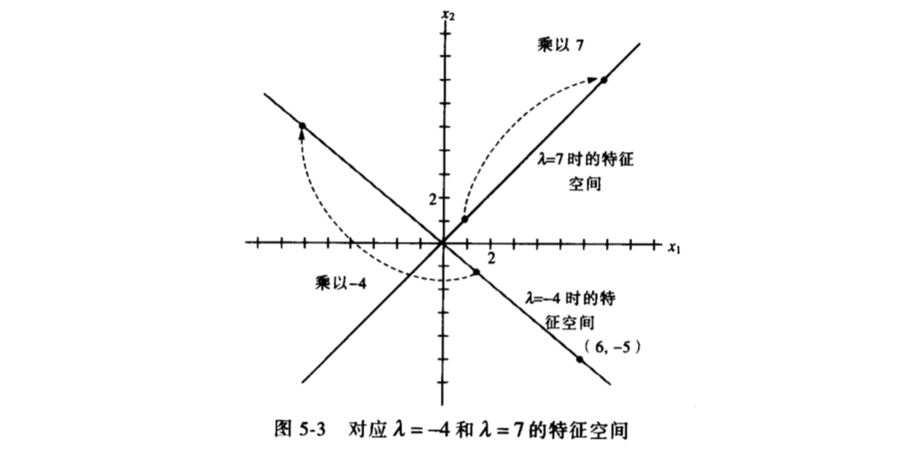

**例5.1.4**：设 $A = \left(\begin{matrix}4&-1&6\\2&1&6\\2&-1&8\end{matrix}\right)$ ，A的一个特征值是2，求对应的特征空间的一个基

解：A - 2I的零空间就是特征值2对应的特征空间，对A-2I做行变换得

$A-2I = \left(\begin{matrix}2&-1&6\\2&-1&6\\2&-1&6\end{matrix}\right)\sim\left(\begin{matrix}2&-1&6\\0&0&0\\0&0&0\end{matrix}\right)$

所以其通解为

$x = x_2\left(\begin{matrix}1/2\\1\\0\end{matrix}\right) + x_3\left(\begin{matrix}-3\\0\\1\end{matrix}\right)$， $x_2$和$x_3$ 为任意值

故特征值2对应的特征空间的基为

$\left\{\left(\begin{matrix}1/2\\1\\0\end{matrix}\right),\left(\begin{matrix}-3\\0\\1\end{matrix}\right)\right\}$

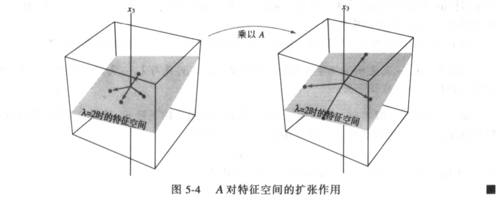

 

**例5.1.5**：证明定理1

证明：考虑$3\times3$ 的上三角矩阵A：

$A-\lambda I = \left(\begin{matrix}a_{11}-\lambda&a_{12}&a_{13}\\0&a_{22}-\lambda&a_{23}\\0&0&a_{33}-\lambda\end{matrix}\right)$

数$\lambda$ 是A的特征值当且仅当方程$(A-\lambda I)x=0$ 有非平凡解。根据上式，当$\lambda$ 为A的主对角线上的元素时，矩阵$A-\lambda I$主对角线上存在0，此时方程$(A-\lambda I)x=0$ 有自由变量，也就是有非平凡解。故此时$\lambda$ 为A的特征值。同理可证A为下三角矩阵或任意大小三角矩阵情形下的定理1。

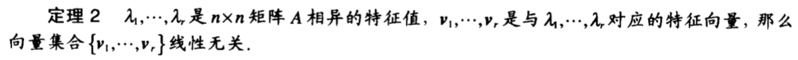

**例5.1.6**：证明定理2

证明：线性相关比较好表示，因此用反证法。假设$\{v_1, \dots, v_r\}$ 线性相关，根据1.7节定理7（线性相关集的特征），存在最小的下标p，使得$v_{p_1}$ 是之前向量的线性组合，即

$c_1v_1+\dots c_pv_p=v_{p+1} \tag{5}$

利用$v_i$ 是特征向量的条件，等式两边左乘矩阵A得

$c_1\lambda_1v_1+\dots +c_p\lambda_pv_p=\lambda_{p+1}v_{p+1} \tag{6}$

此处考虑将$v_{p+1}$ 消去，于是(5)式等号两侧同乘$\lambda_{p+1}$ ，并与(6)式相减，可得

$c_1(\lambda_1-\lambda_{p+1})v_1+\dots+c_p(\lambda_p-\lambda_{p+1})v_p = 0$

在假设中$\{v_1, \dots, v_p\}$ 线性无关，故(7)式中所有系数都为0才可能令式子成立。利用$\lambda_1, \dots, \lambda_r$ 各不相同的条件，可知

$\forall i \in [1, p],\ c_i = 0$

 将其代入(5)式可得

$v_{p+1} = 0$

根据定义，特征向量不可能为0，故矛盾。原定理得证。

### 5.2 特征方程

**例5.2.1**：求$A = \left(\begin{matrix}2&3\\3&-6\end{matrix}\right)$的特征值

解：求特征值就是要找出所有的$\lambda$ 使得下面的矩阵方程有非平凡解

$(A - \lambda I)x = 0$

根据逆矩阵定理，这个问题等价于找出所有的$\lambda$ ，使得$A - \lambda I$不可逆。通过引入行列式，我们只需要处理一个未知数

$det(A - \lambda I) = det\left(\begin{matrix}2- \lambda&3\\3&-6- \lambda\end{matrix}\right) = (2- \lambda)(-6- \lambda) - 9 = (\lambda - 3)(\lambda + 7) = 0$

故A的特征值为3和-7

#### 行列式

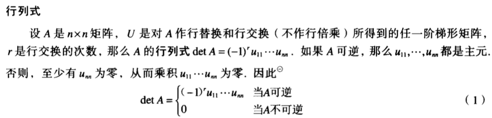

**例5.2.2**：计算 $A = \left(\begin{matrix}1&5&0\\2&4&-1\\0&-2&0\end{matrix}\right)$ 的行列式det A

解：对A施加行变换，使其变为阶梯阵：

$A \sim \left(\begin{matrix}1&5&0\\0&-2&0\\0&0&-1\end{matrix}\right)$

因此$det A = (-1)^1(1)(-2)(-1)=-2$

#### 特征方程

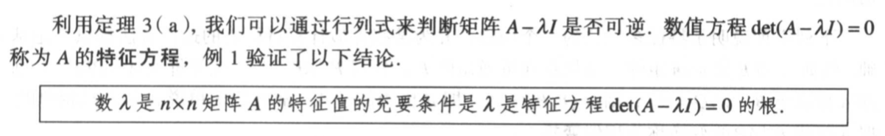

**例5.2.3**：求 $A = \left(\begin{matrix}5&-2&6&-1\\0&3&-8&0\\0&0&5&4\\0&0&0&1\end{matrix}\right)$ 的特征方程

解：用行列式表达特征方程：

$det(A-\lambda I) =det\left(\begin{matrix}5-\lambda&-2&6&-1\\0&3-\lambda&-8&0\\0&0&5-\lambda&4\\0&0&0&1-\lambda\end{matrix}\right) = (5-\lambda)(3-\lambda)(5-\lambda)(1-\lambda） = (5-\lambda)^2(3-\lambda)(1-\lambda) = 0$

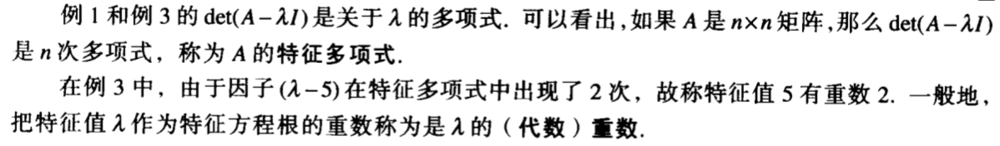

**例5.2.4**：某$6\times6$ 矩阵的特征多项式为$\lambda^6-4\lambda^5-12\lambda^4$，求特征值及重数

解：把多项式分解因式：

$\lambda^6-4\lambda^5-12\lambda^4 = \lambda^4(\lambda-6)(\lambda+2)$

可得特征值0（重数为4），6（重数为1）和-2（重数为1）

#### 相似性

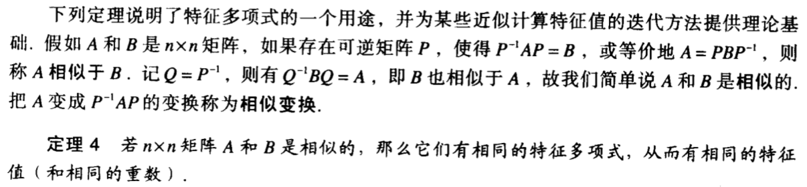

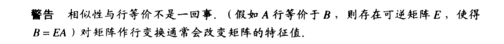

### 5.3 对角化

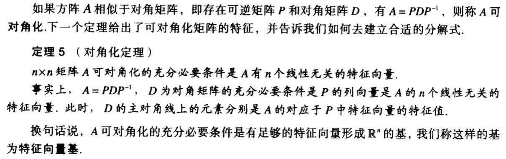

**例5.3.1** ：证明定理5

证明：

先证明若n维方阵A可对角化则A有n个线性无关的特征向量

假设A可对角化，也就是$P = \left(\begin{matrix}v_1& \dots &v_n\end{matrix}\right)$可逆，$D = \left(\begin{matrix}\lambda_1&\dots&0\\\vdots&&\vdots\\0&\dots&\lambda_n\end{matrix}\right)$为对角矩阵，并且$A=PDP^{-1}$。用P右乘等式两边有AP = PD。

下面应该用这个等式得A有n个线性无关的特征向量的结论。由P可逆知，$v_1, \dots, v_n$ 必然线性无关且都不为零向量（否则矩阵有0列，导致行列式为0），再分析矩阵的列

$AP = \left(\begin{matrix}Av_1& \dots &Av_n\end{matrix}\right)$

$PD = \left(\begin{matrix}\lambda_1v_1& \dots &\lambda_nv_n\end{matrix}\right)$

由列相等得

$Av_1 = \lambda_1v_1, \dots, Av_n = \lambda_nv_n$

故，$\lambda_1, \dots, \lambda_n$ 是A的特征值，$v_1, \dots, v_n$ 是A的特征向量

再证明若n维方阵有n个线性无关的特征向量，则A可对角化

若A有n个线性无关的特征向量，则将这些特征向量以列向量的方式构造矩阵P，并用相应的特征值来构造对角矩阵D，这时显然有AP = PD。因为P的列线性无关，所以P可逆，进而可以推出$A = PDP^{-1}$

#### 矩阵的对角化

**例5.3.3**：可能的话，将矩阵$A = \left(\begin{matrix}1&3&3\\-3&5&-3\\3&3&1\end{matrix}\right)$对角化。即求可逆矩阵P和对角矩阵D，使得$A = PDP^{-1}$

解：

1. 求A的特征值：$0 = det(A-\lambda I) = -(\lambda-1)(\lambda+2)^2$，得到特征值为1和-2
2. 求A的3个线性无关的特征向量：解$(A-I)x = 0$ 得特征值$\lambda_1=1$的基为$v_1=\left(\begin{matrix}1\\-1\\1\end{matrix}\right)$，解$(A+2I)x = 0$得特征值 $\lambda_2=-2$的基为$v_2=\left(\begin{matrix}-1\\1\\0\end{matrix}\right),v_3=\left(\begin{matrix}-1\\0\\1\end{matrix}\right)$，可以验证$\{v_1, v_2, v_3\}$ 是线性无关的
3. 构造矩阵P：$P = \left(\begin{matrix}v_1, v_2, v_3\end{matrix}\right) = \left(\begin{matrix}1&-1&-1\\-1&1&0\\1&0&1\end{matrix}\right)$
4. 用对应的特征值构造矩阵D：$D = \left(\begin{matrix}1&0&0\\0&-2&0\\0&0&-2\end{matrix}\right)$

**例5.3.5**：确定$A = \left(\begin{matrix}5&-8&1\\0&0&7\\0&0&-2\end{matrix}\right)$能否对角化

解：三角矩阵（阶梯矩阵）的特征值就在其对角线上，显然矩阵A有三个相异的特征值5, 0, -2

#### 特征值不是都相异的矩阵

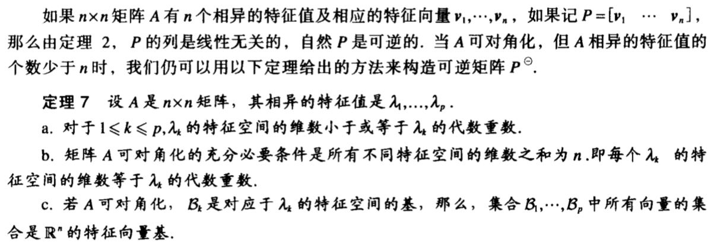

（特征值数小于n但仍能找到n个线性无关的特征向量的情况，见例5.3.3）

### 5.4 特征向量与线性变换

#### 线性变换的矩阵

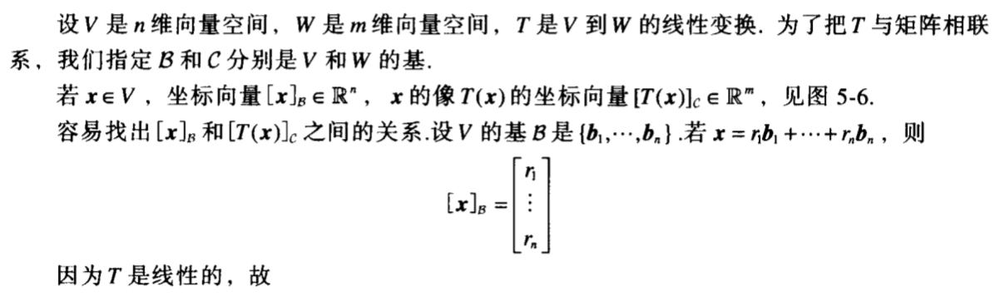

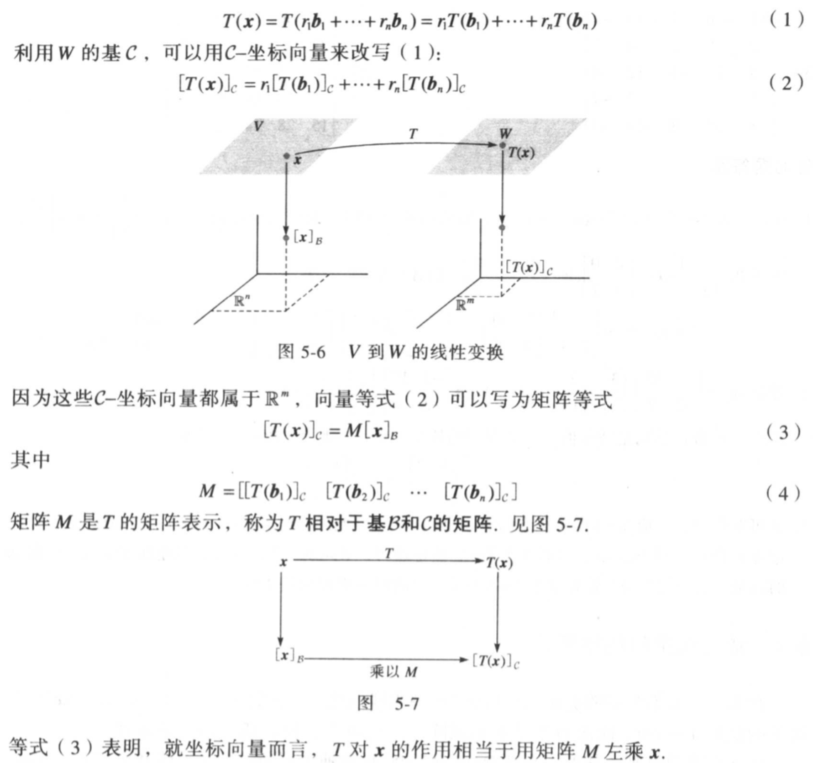

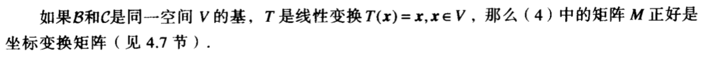

**例5.4.1**：设$B = \{b_1, b_2\}$ 是V的基，$C = \{c_1, c_2, c_3\}$ 是W的基。T是$V \rightarrow W$ 的线性变换，$T(b_1) = 3c_1-2c_2+5c_3, T(b_2)=4c_1+7c_2-c_3$。求T相对于基B和C的矩阵M。

解：$M = \left(\begin{matrix}[T(b_1)]_C & [T(b_2)]_C\end{matrix}\right) = \left(\begin{matrix}3&4\\-2&7\\5&-1\end{matrix}\right)$

#### V到V的线性变换

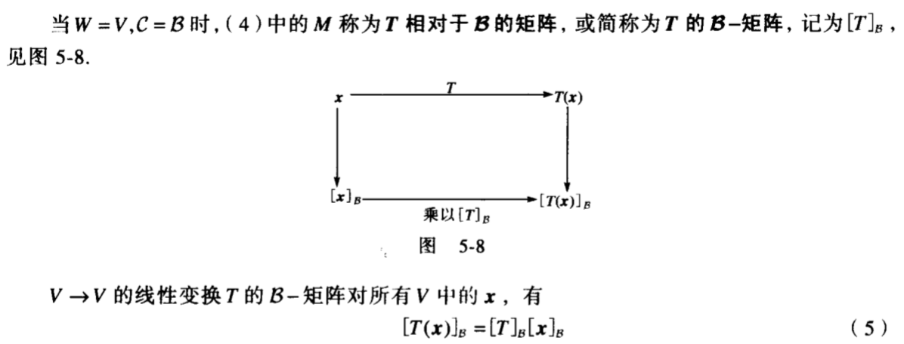

**例5.4.2**：$P_2\rightarrow P_2$ 的映射T：$T(a_0+a_1t+a_2t^2)=a_1+2a_2t$ 是线性变换（微分算子）

a. 当基$B = \{1, t, t^2\}$ 时，求T的B-矩阵

b. 对$P_2$ 中的每个p，验证$[T(p)]_B = [T]_B[P]_B$

解：

a. $[T]_B = \left(\begin{matrix}[T(b_1)]_B&[T(b_2)]_B&[T(b_3)_B]\end{matrix}\right) = \left(\begin{matrix}0&1&0\\0&0&2\\0&0&0\end{matrix}\right)$

b. 不妨设一般的多项式为$p(t)=a_0+a_1t+a_2t^2$，则$[T(p)]_B = [a_1+2a_2t] =  \left(\begin{matrix}a_1\\2a_2\\0\end{matrix}\right) = \left(\begin{matrix}0&1&0\\0&0&2\\0&0&0\end{matrix}\right)\left(\begin{matrix}a_0\\a_1\\a_2\end{matrix}\right) = [T]_B[p]_B$

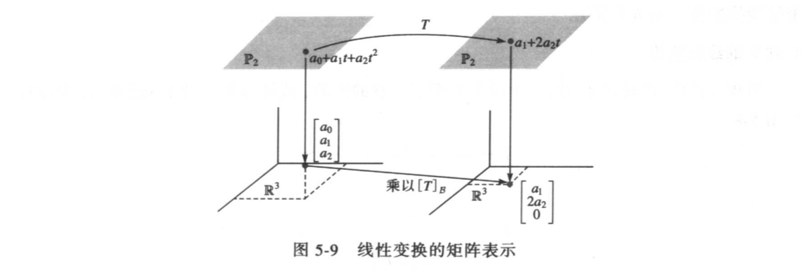

#### $R^n$ 上的线性变换

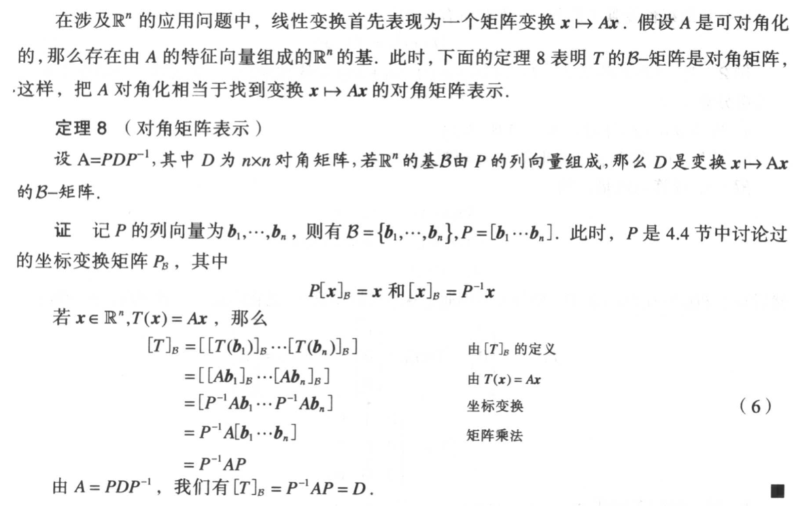

**例5.4.3**：设$A = \left(\begin{matrix}7&2\\-4&1\end{matrix}\right)$ ，$R^2\rightarrow R^2$ 的变换$T:T(x)=Ax$。求$R^2$ 的一个基B，使得T的B-矩阵是对角矩阵

解：将矩阵A对角化$A=PDP^{-1}$，可得$P = \left(\begin{matrix}1&1\\-1&2\end{matrix}\right), D =\left(\begin{matrix}5&0\\0&3\end{matrix}\right)$，根据定理8，P的列向量就是所求的基

#### 矩阵表示的相似性

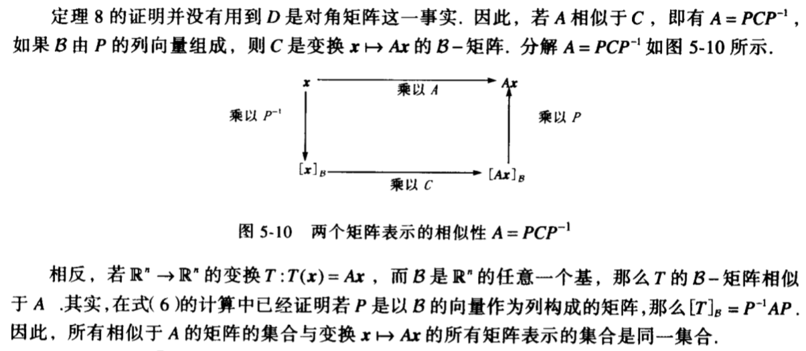

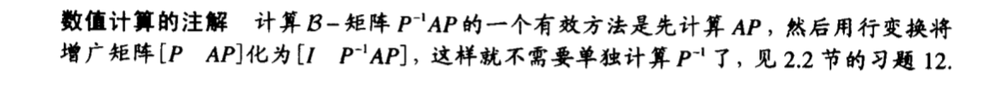

**例5.4.4**：设$A = \left(\begin{matrix}4&-9\\4&8\end{matrix}\right), b_1 = \left(\begin{matrix}3\\2\end{matrix}\right), b_2 = \left(\begin{matrix}2\\1\end{matrix}\right)$ ，A的特征多项式是$(\lambda + 2)^2$ ，但特征值-2的特征空间只是一维的，因此A是不可以对角化的。但是基$B = \{b_1, b_2\}$ 能够使得变换$x \mapsto Ax$ 的B-矩阵是三角矩阵，求A的B-矩阵。

解：直接利用定理8的推广求A的B-矩阵：

$P = \left(\begin{matrix}b_1&b_2\end{matrix}\right) = \left(\begin{matrix}3&2\\2&1\end{matrix}\right), P^{-1} = \frac{1}{-1}\left(\begin{matrix}1&-2\\-2&3\end{matrix}\right) = \left(\begin{matrix}-1&2\\2&-3\end{matrix}\right)$

$[T]_B = P^{-1}AP = \left(\begin{matrix}-2&1\\0&-2\end{matrix}\right)$

### 5.5 复特征值

### 5.6 离散动力系统

### 5.7 微分方程中的应用

### 5.8 特征值的迭代估计

## 7 对称矩阵和二次型

### 7.1 对称矩阵的对角化

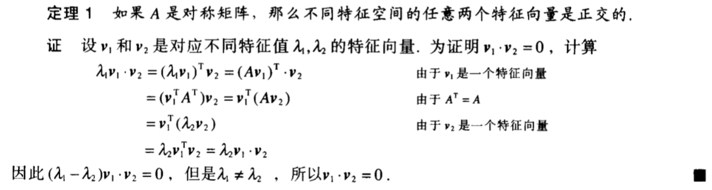

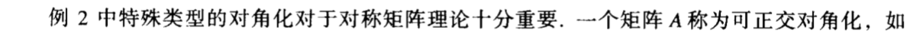

**例7.1.3**：$A = \left(\begin{matrix}3&-2&4\\-2&6&2\\4&2&3\end{matrix}\right)$ 的特征方程为$0=-(\lambda-7)^2(\lambda+2)$ ，将其正交对角化。

解：根据特征方程可得特征值：$\lambda_1=7, \lambda_2=-2$

解方程$(A - 7I)x=0$ 得$\lambda_1$ 对应的特征空间的基：$v_1=\left(\begin{matrix}1\\0\\1\end{matrix}\right), v_2=\left(\begin{matrix}-1/2\\1\\0\end{matrix}\right)$，进而得到特征空间的单位正交基：$u_1=\left(\begin{matrix}1/\sqrt 2\\0\\1/\sqrt 2\end{matrix}\right), u_2=\left(\begin{matrix}-1/\sqrt{18}\\4/\sqrt{18}\\1/\sqrt{18}\end{matrix}\right)$

解方程$(A + 2I)x=0$ 得$\lambda_2$ 对应的特征空间的基：$ v_3=\left(\begin{matrix}-1/4\\1\\1/4\end{matrix}\right)$，进而得到特征空间的单位正交基：$u_3=\left(\begin{matrix}-2/3\\-1/3\\2/3\end{matrix}\right)$

根据定理1，$u_3$ 与$u_1, u_2$ 正交，即$\{u_1, u_2, u_3\}$ 为单位正交基。令

$P = \left(\begin{matrix}u_1&u_2&u_3\end{matrix}\right) =\left(\begin{matrix}1/\sqrt 2&-1/\sqrt{18}&-2/3\\0&4/\sqrt{18}&-1/3\\1/\sqrt 2&1/\sqrt{18}&2/3\end{matrix}\right), D=\left(\begin{matrix}7&0&0\\0&7&0\\0&0&-2\end{matrix}\right)$

可得正交对角化结果：$A=PDP^{-1}$

#### 谱分解

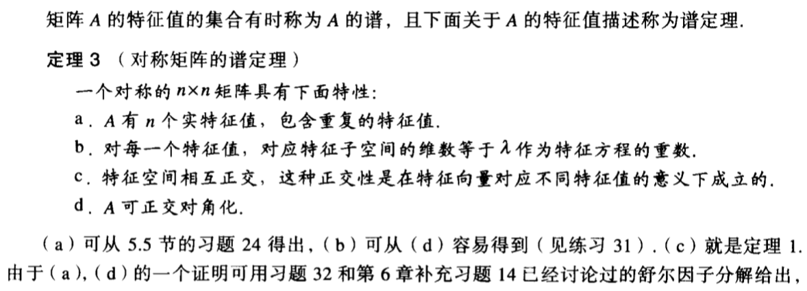

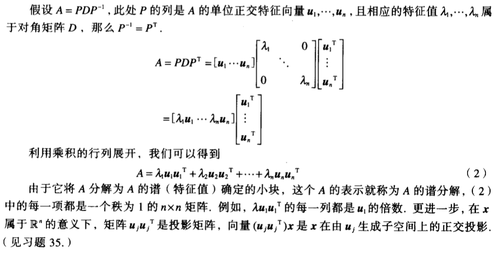

**例7.1.4**：构造矩阵A的一个谱分解，已知A有以下正交对角化分解

$A = \left(\begin{matrix}7&2\\2&4\end{matrix}\right) =\left(\begin{matrix}2/\sqrt{5}&-1/\sqrt{5}\\1/\sqrt{5} &2/\sqrt{5}\end{matrix}\right)\left(\begin{matrix}8&0\\0&3\end{matrix}\right)\left(\begin{matrix}2/\sqrt{5}&1/\sqrt{5}\\-1/\sqrt{5} &2/\sqrt{5}\end{matrix}\right)$

解：将P的列记为$u_1, u_2$，则有谱分解：

$A = 8u_1u_1^T+3u_2u_2^T = \left(\begin{matrix}32/5&16/5\\16/5&8/5\end{matrix}\right) + \left(\begin{matrix}3/5&-6/5\\-65&12/5\end{matrix}\right)$

### 7.2 二次型

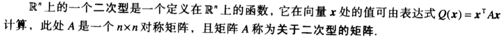

**例7.2.2**：对属于$R^3$ 的x，取$Q(x)=5x_1^2+3x_2^2+2x_3^2-x_1x_2+8x_2x_3$，写出其$x^TAx$ 形式的二次型。

解：显然，$x_1^2, x_2^2, x_3^2$ 的系数在A的主对角线上，$x_1x_2$ 的系数要平分到$A_{12}, A_{21}$ 中去，$x_2x_3$ 的系数要平分到$A_{23}, A_{32}$ 中去。因此

$Q(x) = x^TAx = \left(\begin{matrix}x_1&x_2&x_3\end{matrix}\right) \left(\begin{matrix}5&1/2&0\\-1/2&3&4\\0&4&2\end{matrix}\right) \left(\begin{matrix}x_1\\x_2\\x_3\end{matrix}\right)$

#### 二次型的变量代换

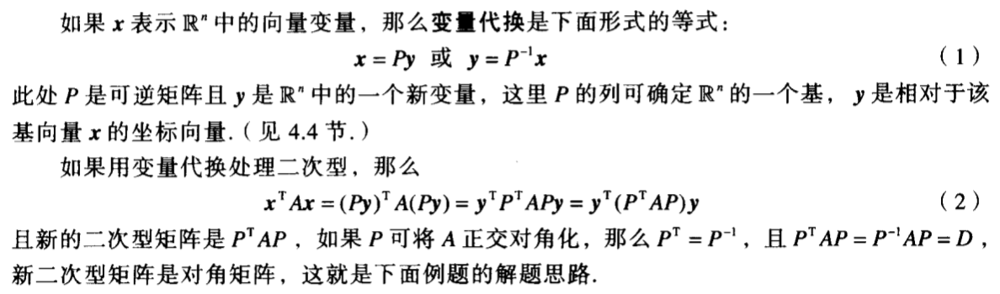

**例7.2.4**：对属于$R^3$ 的x，取$Q(x)=x_1^2-8x_1x_2-5x_2^2$，求一个变量代换将其变为一个没有交叉项的二次型。

解：先将二次型矩阵求出来：

$A = \left(\begin{matrix}1&-4\\-4&5\end{matrix}\right)$

再将矩阵A正交对角化：

$P = \left(\begin{matrix}2/\sqrt{5}&1/\sqrt{5}\\-1\sqrt{5}&2\sqrt{5}\end{matrix}\right), D = \left(\begin{matrix}3&0\\0&-7\end{matrix}\right)$

一个适当的变换是$y=P^{-1}x$使得$x^TAx=y^TDy$

当x取(2, -2)时，两个二次型都会得到16

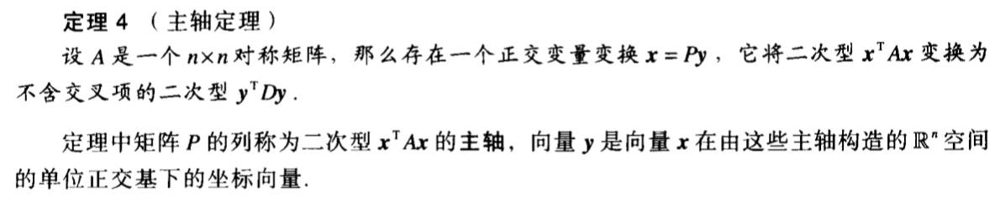

#### 主轴的几何意义

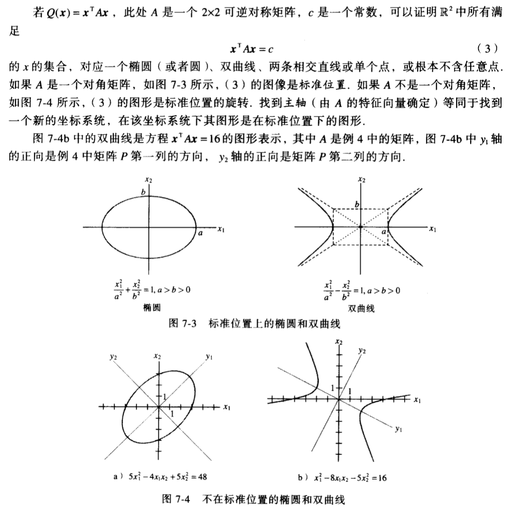

**例7.2.5**：有椭圆方程$5x_1^2-4x_1x_2+5x_2^2=48$ ，求该椭圆的主轴。

解：二次型对应的矩阵为$A = \left(\begin{matrix}5&-2\\-2&5\end{matrix}\right)$ ，可以得到其单位特征向量$u_1 = \left(\begin{matrix}1/\sqrt{2}\\1/\sqrt{2}\end{matrix}\right), u_2=\left(\begin{matrix}-1/\sqrt{2}\\1/\sqrt{2}\end{matrix}\right)$，这便是椭圆的主轴

#### 二次型的分类

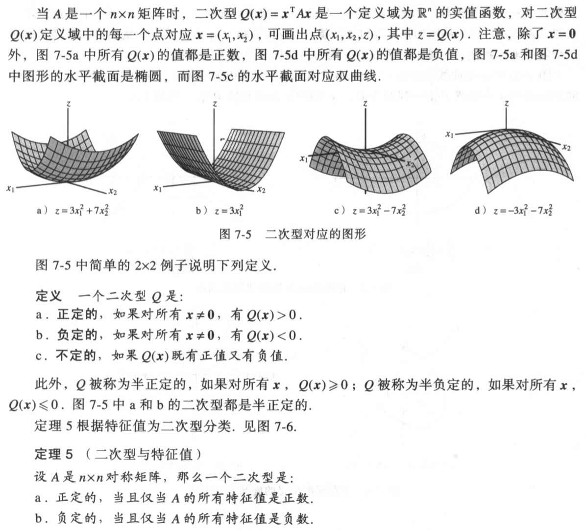

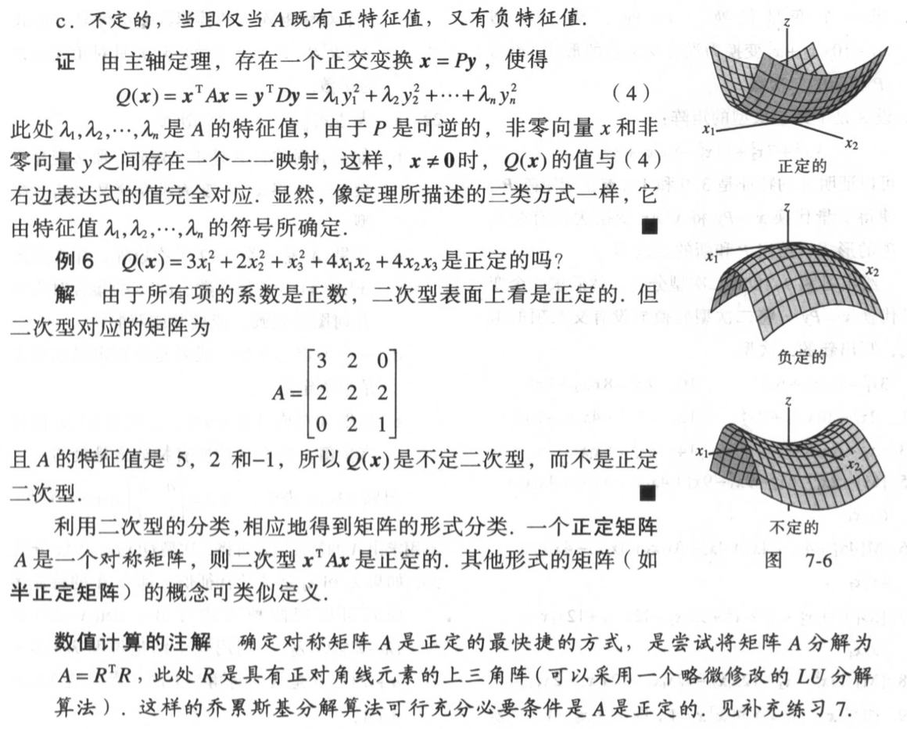

### 7.3 条件优化

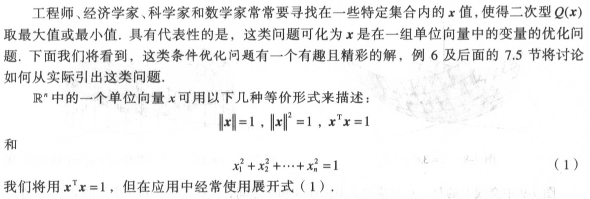

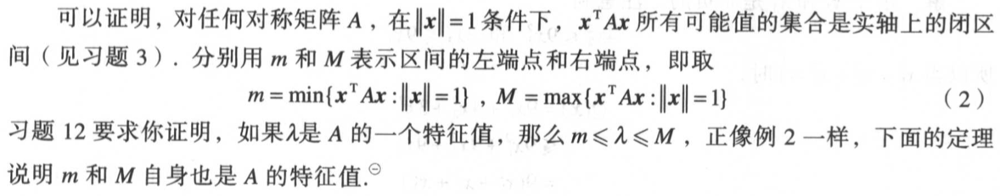

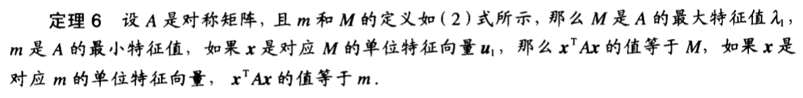

**例7.3.3**：令$A = \left(\begin{matrix}3&2&1\\2&3&1\\1&1&4\end{matrix}\right)$，求二次型$x^TAx$ 在限制条件$x^Tx=1$ 下的最大值，以及一个可以取到该最大值的单位向量

解：根据定理6，最大值为A的最大特征值，求出A的特征多项式：

$0=-(\lambda-6)(\lambda-3)(\lambda-1)$

因此最大的特征值为$\lambda_1=6$，解$(A-6I)x=0$ 可得单位特征向量$u_1=\left(\begin{matrix}1/\sqrt{3}\\1/\sqrt{3}\\1/\sqrt{3}\end{matrix}\right)$ 

故二次型在$u_1$ 处可以取得最大值$\lambda_1$

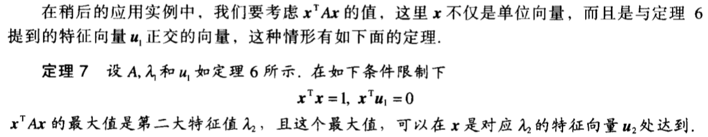

**例7.3.5**：令$A = \left(\begin{matrix}3&2&1\\2&3&1\\1&1&4\end{matrix}\right)$，已知$u_1$ 为A的最大特征值的特征向量，求二次型$x^TAx$ 在限制条件$x^Tx=1, x^Tu_1=0$ 下的最大值，以及一个可以取到该最大值

解：求出A的特征多项式：

$0=-(\lambda-6)(\lambda-3)(\lambda-1)$

根据定理7，所求最大值为第二大的特征值3

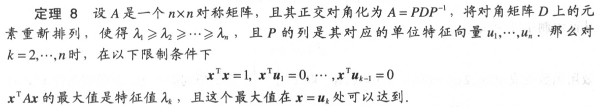

**例7.3.6**：县政府计划在下一年度修建x百公里的公路和桥梁，并且修正y百英亩的公园和娱乐产所。其中x, y必须满足的限制条件为$4x^2+9y^2\le36$ 。令效用函数q(x, y) = xy（xy=c曲线又被称为无差别曲线，每个c代表一种价值观），求一个公共工作计划(x, y) 使得效用函数最大。

解：先想办法将不等式限制条件话为等式限制条件。显然，对于效用函数而言，在限制条件的边界上取值能使资源利用达到最大可能。也就是：

$4x^2+9y^2=36$

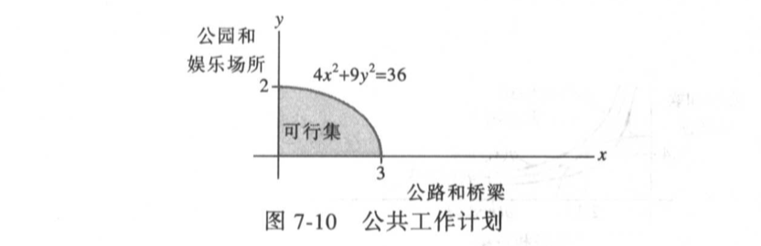

虽然现在得到了等式限制，但(x, y)没有单位向量的意思，于是考虑用变量代换。重写限制条件如下：

$(\frac{x}{3})^2+(\frac{y}{2})^2=1$

再做换元$x=3x_1, y=2x_2$，于是问题就被转化为在$x^Tx=1$ 的条件下求 $Q(x)=6x_1x_2$ 的最大值，若将二次型写成$Q(x)=x^TAx$ 的形式，不难得出：

$A = \left(\begin{matrix}0&3\\3&0\end{matrix}\right)$

同样不能得出A的最大特征值为3，对应的特征向量为$u_1 = \left(\begin{matrix}1/\sqrt{2}\\1/\sqrt{2}\end{matrix}\right)$，所以效用函数的最大值3可以在$x_1=1/\sqrt{2}, x_2=1/\sqrt{2}$ 处得到，也就是在$x=3/\sqrt{2}, y=2/\sqrt{2}$ 处得到。

### 7.4 奇异值分解

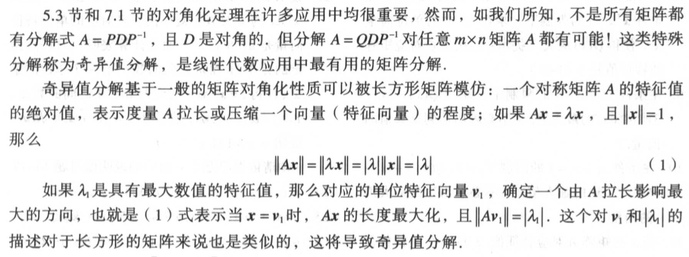

**例7.4.1**：若$A = \left(\begin{matrix}4&11&14\\8&7&-2\end{matrix}\right)$ ，那么线性变换$x\mapsto Ax$将$R^3$ 中的单位球$\{x:\|x\|=1\}$ 映射为$R^2$ 的椭圆，找出使得$\|Ax\|$最大的一个单位向量x，并且计算这个最大长度。

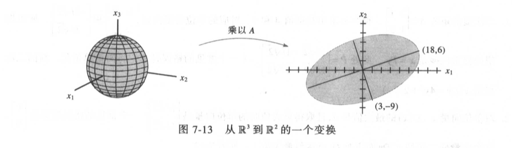

解：优化$\|Ax\|$同优化$\|Ax\|^2$ 是一样的，所以我们有话更容易优化的后者，先对其做变换：

$\|Ax\|^2 = (Ax)^TAx = x^TA^TAx$

显然，$A^TA$ 是个对称矩阵，因此问题转化为，在$x^Tx=1$ 的限制下，最大化二次型$x^TA^TAx$，首先计算

$A^TA = \left(\begin{matrix}80&100&40\\100&170&140\\40&140&200\end{matrix}\right)$

这个矩阵最大的特征值为$\lambda_1=360$，对应的单位特征向量为：$v_1 = \left(\begin{matrix}1/3&2/3&2/3\end{matrix}\right)^T$，因此使得$\|Ax\|^2$ 最大的单位向量为$v_1$，最大值为360。

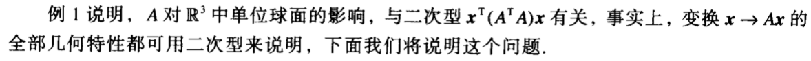

#### $m\times n$ 矩阵的奇异值

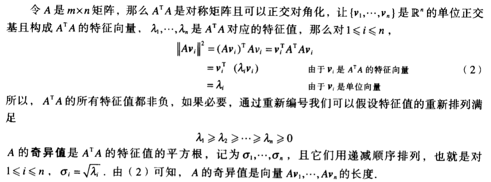

**例7.4.2**：若$A = \left(\begin{matrix}4&11&14\\8&7&-2\end{matrix}\right)$ ，求A的奇异值

解：由于$A^TA$ 的特征值为$\lambda_1=360, \lambda_2=90, \lambda_3=0$，所以A的奇异值为$\sigma_1=6\sqrt{10}, \sigma_2=3\sqrt{10}, \sigma_3=0$。

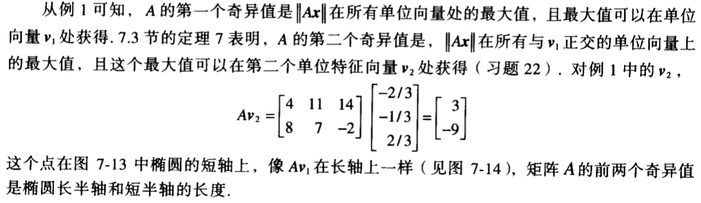

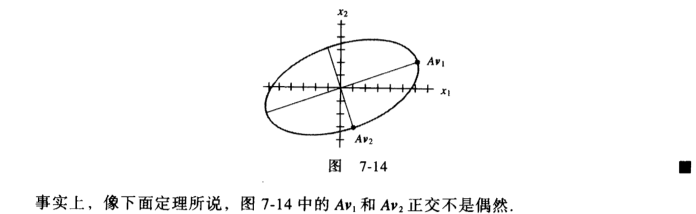

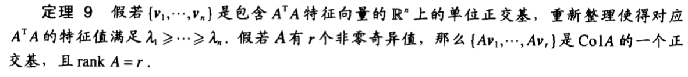

**例7.4.3**：证明定理9

证明：

首先，要证明$\{Av_1, \dots, Av_n\}$ 中的元素两两正交，就要证明当$i\ne j$ 时$(Av_i)^T(Av_j)=0$。

将其变形：

$(Av_i)^T(Av_j)=v_i^TA^TAv_j$

因为$v_j$对应$A^TA$的一个特征向量，所以

$(Av_i)^T(Av_j)=v_i^TA^TAv_j=v_i^T\lambda_jv_j$

因为$\{v_1, \dots, v_n\}$是$A^TA$ 的单位正交基，所以

$(Av_i)^T(Av_j)=v_i^T\lambda_jv_j = 0$

$\{Av_1, \dots, Av_n\}$ 中的元素两两正交得证。

其次，要证明$Col A = Span\{Av_1, \dots, Av_r\}$，就要证明$\{Av_1, \dots, Av_r\}$ 线性无关且在Col A中，并且任意Col A中的向量y都在$Span\{Av_1, \dots, Av_r\}$ 中：

1. 证明$\{Av_1, \dots, Av_r\}$ 是线性无关集：$\{Av_1, \dots, Av_n\}$ 中的元素两两正交，因此只要证明$\{Av_1, \dots, Av_r\}$ 中没有零向量即可。 $\{Av_1, \dots, Av_n\}$ 中元素的长度是A对应的奇异值，根据A的奇异值与$A^TA$ 的特征值的关系，A的前r各奇异值非零，即$\{Av_1, \dots, Av_r\}$ 的长度不为0
2. 证明$\{Av_1, \dots, Av_r\}$ 中所有元素都在Col A中：显然，对任意向量x，Ax的结果是A的列向量的线性组合，必然在Col A中
3. 证明任意Col A中的向量y都在$Span\{Av_1, \dots, Av_r\}$ 中：因为y在Col A中，所以$y = Ax = c_1Av_1+\dotsc_rAv_r+0\dots+0$，该式表示y都在$Span\{Av_1, \dots, Av_r\}$ 中

$Col A = Span\{Av_1, \dots, Av_r\}$得证。根据这个等式和秩的定义，rank A = dim(Col A) = r。

#### 奇异值分解

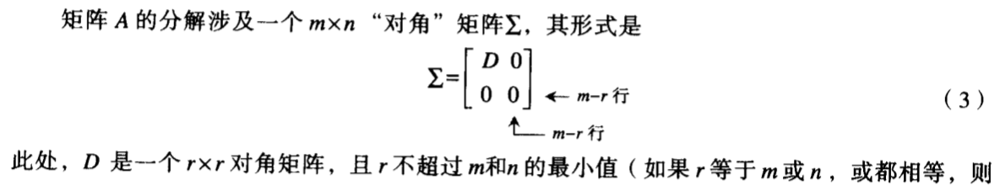

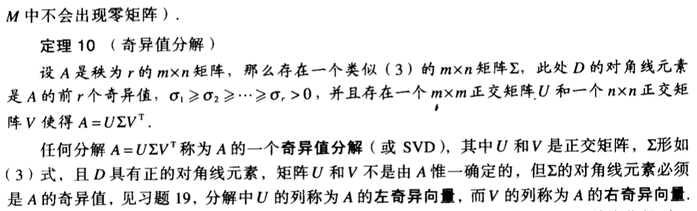

**例7.4.4**：证明定理10

证明：

设A为有r个非零奇异值的矩阵，$\{\lambda_1, \dots, \lambda_n\}$ 为$A^TA$ 的满足$\forall i\in[1, n),\ \lambda_i>\lambda_{i+1}$ 的特征值。 $\{v_1, \dots, v_n\}$ 为满足$\forall i \in [1, n]$，$v_i$ 在$\lambda_i$的特征空间中的单位正交基。根据定理9， $\{Av_1, \dots, Av_r\}$ 为Col A的正交基。将其按照

$u_i = \frac{1}{\|Av_i\|}Av_i = \frac{1}{\sigma_i}Av_i$

单位化可以得到Col A的标准正交基$\{u_1, \dots, v_r\}$，且满足

$Av_i=\sigma_iu_i, (1\le i\le r) \tag{4}$

现在将$\{u_1, \dots, u_r\}$ 扩充为$R^m$ 的单位正交基$\{u_1, \dots, u_m\}$ 而且构造正交矩阵

$U = \left(\begin{matrix}u_1& \dots u_m\end{matrix}\right), V = \left(\begin{matrix}v_1& \dots v_n\end{matrix}\right)$

按照$A^TA$特征值的顺序，前r个奇异值非零，后n-r个奇异值为0。因为$Av_i$的长度为$\sigma_i$ ，所以$Av_i = 0,\ \forall i > r$ 成立。根据(4)有：

$AV  = \left(\begin{matrix}Av_1& \dots Av_r&0&\dots&0\end{matrix}\right) = \left(\begin{matrix}\sigma_1u_1& \dots \sigma_ru_r&0&\dots&0\end{matrix}\right)$

$ = \left(\begin{matrix}u_1&\dots u_m\end{matrix}\right) \left(\begin{array}{c|c}\begin{matrix}\sigma_1&&0\\&\ddots&\\0&&\sigma_r\end{matrix}&0\\\hline0&0\end{array}\right) = U\Sigma$

因为V是一个正交矩阵，所以

$A=U\Sigma V^T$

**例7.4.5**：求$A = \left(\begin{matrix}4&11&14\\8&7&-2\end{matrix}\right)$ 的一个奇异值分解

解：

按照下列步骤构造奇异值分解所需的各个元素

1. 将$A^TA$ 正交对角化（求特征值和对应特征空间的标准正交基即可）：$A^TA = \left(\begin{matrix}80&100&40\\100&170&140\\40&140&200\end{matrix}\right)$，求出特征值及其对应的特征向量：
   - $\lambda_1=360$对应的单位特征向量：$v_1 = \left(\begin{matrix}1/3&2/3&2/3\end{matrix}\right)^T$ 
   - $\lambda_2=90$对应的单位特征向量：$v_2 = \left(\begin{matrix}-2/3&-1/3&2/3\end{matrix}\right)^T$
   -  $\lambda_3=0$对应的单位特征向量：$v_3 = \left(\begin{matrix}2/3&-2/3&1/3\end{matrix}\right)^T$ 
2. 构造V和$\Sigma$ ：
   - $V = \left(\begin{matrix}v_1&v_2&v_3 \end{matrix}\right) = \left(\begin{matrix}1/3&-2/3&2/3\\2/3&-1/3&-2/3\\2/3&2/3&1/3\end{matrix}\right)$
   - $D=\left(\begin{matrix}\sqrt{\lambda_1}&0\\0&\sqrt{\lambda_2}\end{matrix}\right)$
   - $\Sigma=\left(\begin{matrix}D&0\end{matrix}\right) = \left(\begin{matrix}6\sqrt{10}&0&0\\0&3\sqrt{10}&0\end{matrix}\right)$ 
3. 构造U（当rank A=2时，U的前r列是从$Av_1, \dots,  Av_r$计算得到的单位向量）：
   - $u_1 = \frac{1}{\|Av_1\|}Av_1=\frac{1}{\sigma_1}Av_1 = \left(\begin{matrix}3/\sqrt{10}&1/\sqrt{10}\end{matrix}\right)^T$
   - $u_2 = \frac{1}{\|Av_2\|}Av_2=\frac{1}{\sigma_2}Av_2 = \left(\begin{matrix}1/\sqrt{10}&-3/\sqrt{10}\end{matrix}\right)^T$
   - $U = \left(\begin{matrix}u_1&u_2 \end{matrix}\right) = \left(\begin{matrix}3/\sqrt{10}&1/\sqrt{10}\\1/\sqrt{10}&-3/\sqrt{10}\end{matrix}\right)$

从而我们得到一个奇异值分解：

$A = \left(\begin{matrix}3/\sqrt{10}&1/\sqrt{10}\\1/\sqrt{10}&-3/\sqrt{10}\end{matrix}\right) \left(\begin{matrix}6\sqrt{10}&0&0\\0&3\sqrt{10}&0\end{matrix}\right) \left(\begin{matrix}1/3&-2/3&2/3\\2/3&-1/3&-2/3\\2/3&2/3&1/3\end{matrix}\right)^T$

#### 奇异值分解的应用

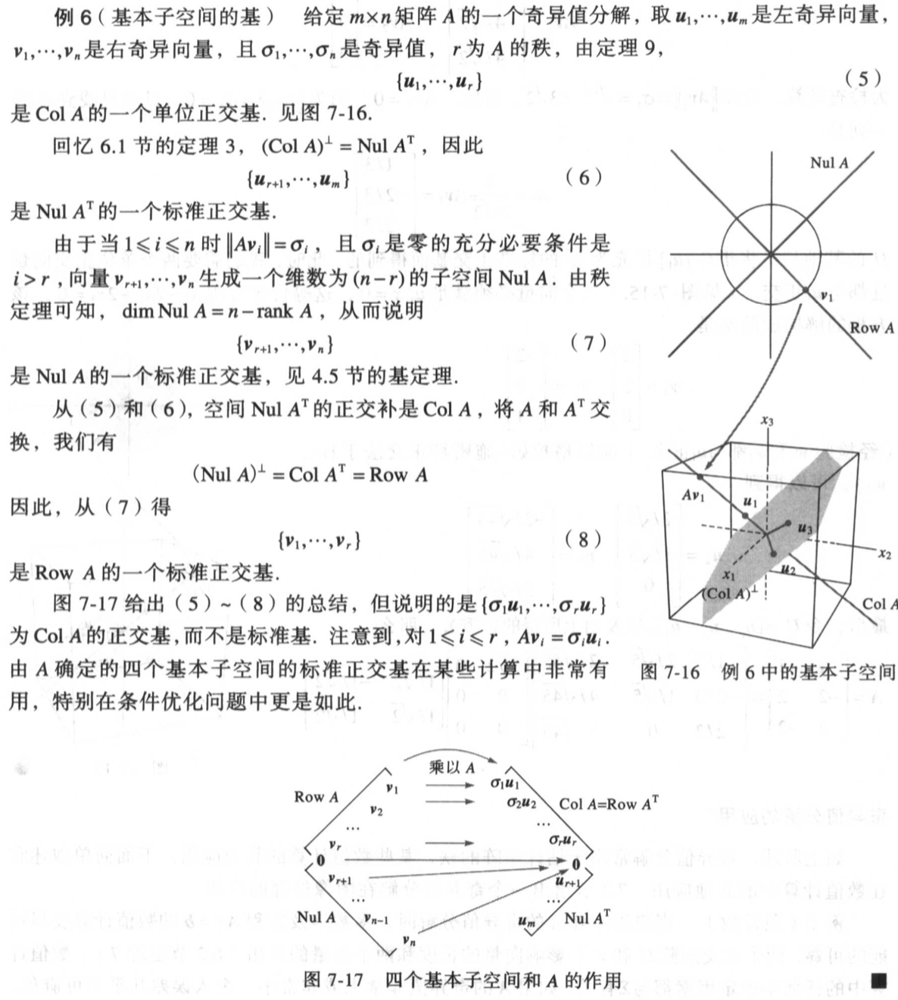

### 7.5 图像处理和统计学中的应用

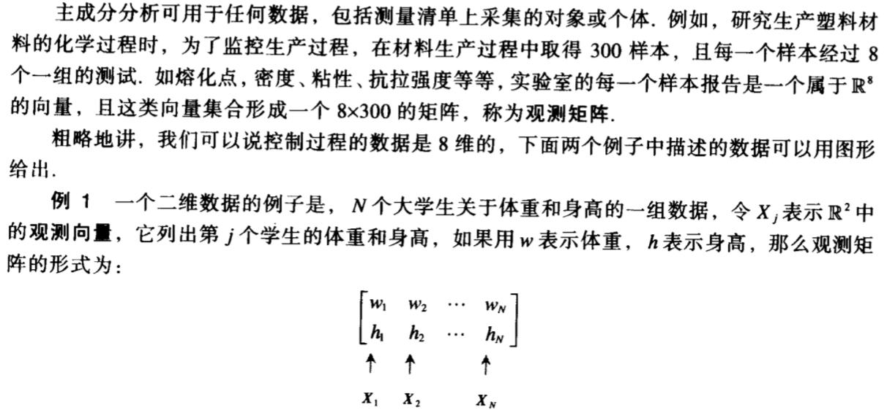

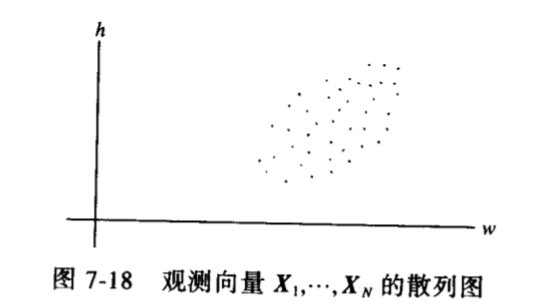

#### 均值和协方差

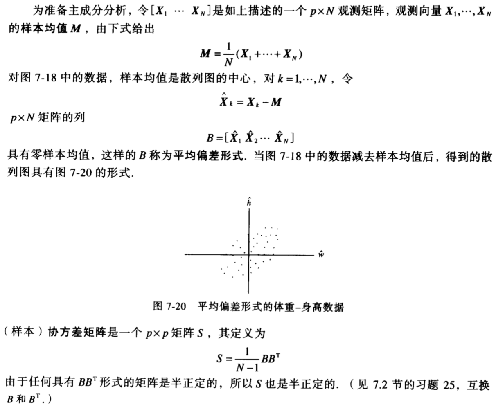

**例7.5.3**：从总体中随机取出4个样本做3次测量，每个样本的观测向量为：

$X_1 = \left(\begin{matrix}1\\2\\1\end{matrix}\right), X_2 = \left(\begin{matrix}4\\2\\13\end{matrix}\right), X_3=\left(\begin{matrix}7\\8\\1\end{matrix}\right), X_4=\left(\begin{matrix}8\\4\\5\end{matrix}\right)$

计算样本均值和协方差矩阵。

解：样本均值为

$M = \frac{1}{4}(\left(\begin{matrix}1\\2\\1\end{matrix}\right) + \left(\begin{matrix}4\\2\\13\end{matrix}\right) +\left(\begin{matrix}7\\8\\1\end{matrix}\right) +\left(\begin{matrix}8\\4\\5\end{matrix}\right)) = \left(\begin{matrix}5\\4\\5\end{matrix}\right)$

从$X_1, \dots, X_4$ 中减去样本均值，可得

$\hat{X_1}=\left(\begin{matrix}-4\\-2\\-4\end{matrix}\right), \hat{X_2}=\left(\begin{matrix}-1\\-2\\8\end{matrix}\right), \hat{X_3}=\left(\begin{matrix}2\\4\\-4\end{matrix}\right), \hat{X_4}=\left(\begin{matrix}3\\0\\0\end{matrix}\right)$

并且构造

$B=\left(\begin{matrix}-4&-1&2&3\\-2&-2&4&0\\-4&8&4&0\end{matrix}\right)$

样本协方差矩阵为

$S = \frac{1}{3}BB^T = \left(\begin{matrix}10&6&0\\6&8&-8\\0&-8&32\end{matrix}\right)$

#### 主成分分析

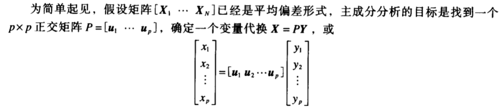

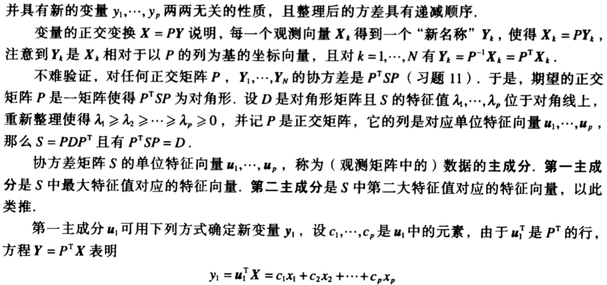

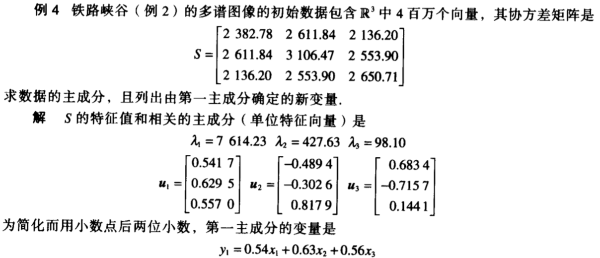

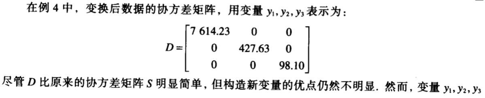

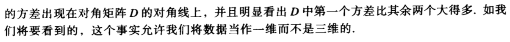

#### 多维数据的降噪

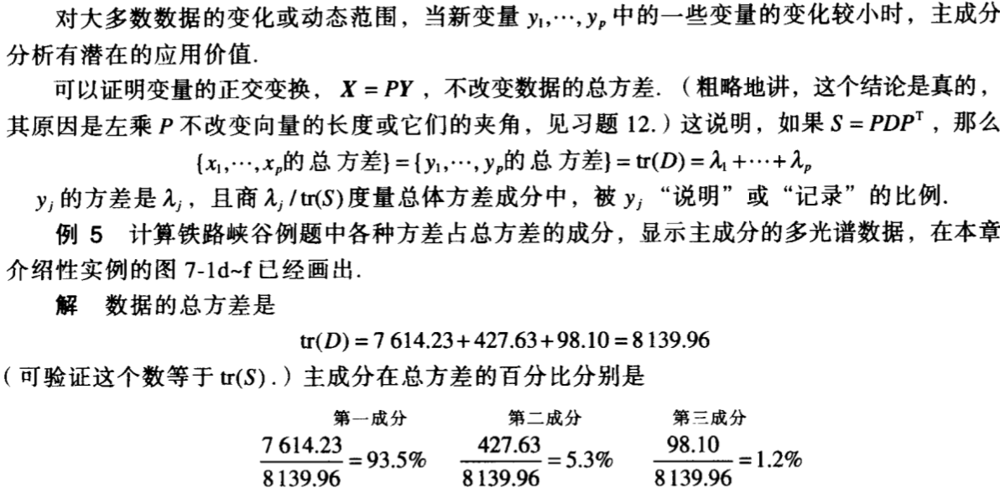

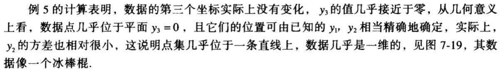

